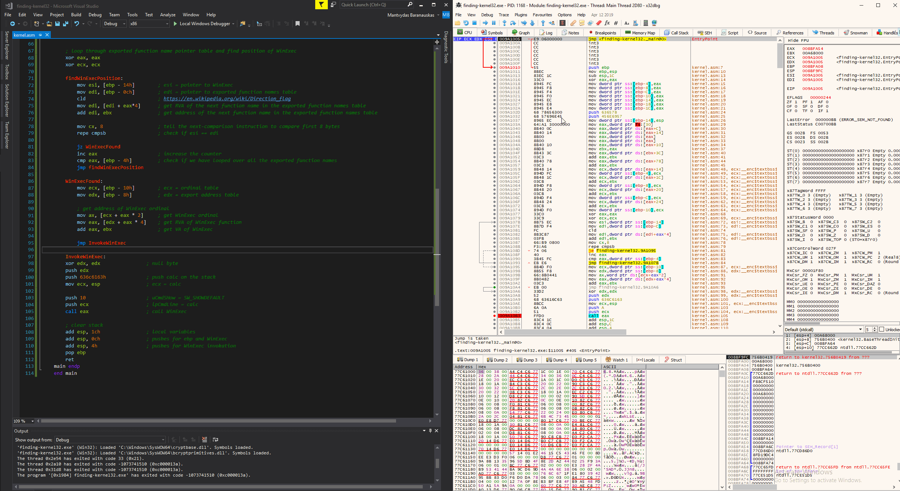

# Finding Kernel32 Base and Function Addresses in Shellcode

The purpose of this lab is to understand how shellcode finds kernel32 base address in memory of the process it's running in and then uses to find addresses of other functions that it requires in order to achieve its goal. 

In this lab I will write some assembly to find the kernel32 dll's base address, resolve `WinExec` function address in memory and call it to open `calc.exe`.

## Finding Kernel32 Base Address

It's well known that shellcode usually leverages the following chain of internal Windows OS memory structures in order to resolve the kernel32 base address which I am going to walk through in WinDBG:

```text
TEB->PEB->Ldr->InMemoryOrderLoadList->currentProgram->ntdll->kernel32.BaseDll
```

One important thing to keep in mind is that kernel32.dll is always loaded into the same address for all the processes - regardless if you open a calc.exe, notepad.exe, or any other Windows process. Below shows my program for this lab on the left and another random program on the right - in both cases, the kernel32.dll \(and ntdll...\) got loaded into the same memory address:


Let's get back to the:

```text
TEB->PEB->Ldr->InMemoryOrderLoadList->currentProgram->ntdll->kernel32.BaseDll
```

...and go into these with more detail.

### Structures

The first important OS structure of the chain is called a Thread Environment Block \(TEB\) which contains information about the process's thread, including one member that is a pointer to another very important structure called Process Environment Block \(PEB, offset 0x30\) where information about the process itself \(image path, commandline arguments, loaded modules and similar\) is stored:

```text
dt _teb
```


Inside the `PEB` structure, there is a member `Ldr` which points to a `PEB_LDR_DATA` structure \(offset 0x00c\):

```text
dt _peb
```


`PEB_LDR_DATA` contains a pointer to `InMemoryOrderModuleList` \(offset 0x14\) that contains information about the modules that were loaded in the process:

```text
dt _PEB_LDR_DATA
```


`InMemoryOrderModuleList` points to another structure we're interested in - `LDR_DATA_TABLE_ENTRY` even though WinDBG suggests the structure type is `LIST_ENTRY`. As confusing as it may seem at first, this is actually right, since `InMemoryOrderModuleList` is a doubly linked list where each list item points to an `LDR_DATA_TABLE_ENTRY` structure. 

Remember, since the shellcode is looking for the kernel32.dll base address, the `LDR_DATA_TABLE_ENTRY` is the last structure in the chain of structures it needs to locate. Once the structure is located, the member `DllBase` at offset 0x18 stores the base address of the module:

```text
dt _LDR_DATA_TABLE_ENTRY
```


### Initialized Structures

Let's now repeat the same exercise as above, but this time using real memory addresses so we can see how those memory structures look like in a real process with real data. Let's check the `PEB` and note the `Ldr` pointer \(77de0c40\):

```text
!peb
```


We can achieve the same result by overlaying the @$peb address over the PEB structure:

```text
dt _peb @$peb
```


From the above, we can see that the `PEB.Ldr` \(`Ldr` member is at offset 0x00c\) points to an `PEB_LDR_DATA` structure at 0x77de0c40. 

We can view the `PEB_LDR_DATA` structure at 0x77de0c40 by overlaying it with address pointed to by the PEB.Ldr \(0xc\) structure like so:

```text
dt _PEB_LDR_DATA poi(@$peb+0xc)
```


Remember that `PEB.Ldr` was pointing to 0x77de0c40. We can double check that what we're doing so far is correct by dereferrencing the pointer @$PEB+0xC which should be equal to 0x77de0c40, which we see it is:

```text
? poi(@$peb+0xc)
dt _PEB_LDR_DATA 77de0c40
```


Proceeding on with the `InMemoryOrderModuleList` pointing to `Peb.LDR.InMemoryOrderModuleList`, since we know it's at offset 0x14, we can get it like so:

```text
? poi(poi(@$peb+0xc)+0x14)
```


...which tells us that the first `LDR_DATA_TABLE_ENTRY` structure is located at 0x00d231d8. If we try looking inside it, we can see that the `BaseDllName` indicates an error while reading the memory:

```text
dt _LDR_DATA_TABLE_ENTRY 0xd231d8
```



The reason for the above error is because although `InMemoryOrderModuleList` points to an `LDR_DATA_TABLE_ENTRY`, we need to keep in mind that it's pointing 8 bytes into the structure itself since the structure is a doubly linked list. See the above screenshot for reference - `InMemoryOrderLinks` is at offset 0x8 of the `LDR_DATA_TABLE_ENTRY`.


We now know that in order to read the `LDR_DATA_TABLE_ENTRY` structure correctly, we need to subtract 8 bytes from the initial pointer 00d231d8:

```text
dt _LDR_DATA_TABLE_ENTRY 0xd231d8-8
```


Note how `InMemoryOrderLinks` now points to 0xd230d0 \(which is an ntdll module as seen later\) - which is the second module loaded by this process. This means that we can easily walk through **all** the loaded modules, since inspecting `LDR_DATA_TABLE_ENTRY` of one module will reveal the address of the structure for the next loaded module in `InMemoryOrderLinks` member. To confirm this - if we inspect the 0xd230d0, `InMemoryOrderLinks` now points to yet another structure for another module at 0xd235b8 \(which as we will later see is the `LDR_DATA_TABLE_ENTRY` for the kernel32 module\):

```text
dt _LDR_DATA_TABLE_ENTRY 0xd230d0-8
```


Let's check the 0xd235b8 and note that we finally found the kernel32 base address which is 0x76670000:

```text
dt _LDR_DATA_TABLE_ENTRY 0xd235b8-8
```


To summarize - if we wanted a one-liner to view the first `LDR_DATA_TABLE_ENTRY`, we could view it like so:

```text
dt _LDR_DATA_TABLE_ENTRY poi(poi(@$peb+0xc)+0x14)-8
```


Getting the pointer to `Ldr` and cross-checking it with !peb:

```text
? poi(poi(@$peb+0xc)+0x14)
!peb
```


Viewing the first and second `LIST_ENTRY` structures at 00d23d8 and 00d230d0:

```text
dt _list_entry 00d231d8
dt _list_entry 0x00d230d0
```


The second `LIST_ENTRY` at 00d230d0 points to 00d235b8 - which is the `LDR_DATA_TABLE_ENTRY` for kernel32 module \(again doing the same stuff we learned earlier in a different way\):

```text
dt _ldr_data_table_entry 0x00d235b8-8
```


Bases address of the kernel32.dll as seen above is at 76670000. Note that we can read the value by reading a double-word pointing at the start of `LDR_DATA_TABLE_ENTRY` minus the 8 bytes \(reminder - because we're 8 bytes into the structure\) and adding 18 bytes since this is where the DLLBase member is located in the `LDR_DATA_TABLE_ENTRY`:

```text
dd 0x00d235b8-8+18 L1
// or dd 0x00d235b8+10 L1
```

Note that by doing the above, we still get the same DllBase address - 76670000:


## Finding Kernel32 Address in Assembly

Let's try finding the kernel32 dll base address in the process memory using all the information learned above using assembly - exactly as the shellcode would. You will notice that this is where all the offsets of various structures and members come into play:

```c
.386 
.model flat, stdcall 
.stack 4096
assume fs:nothing

.code 
	main proc
			mov eax, [fs:30h]		    ; Pointer to PEB (https://en.wikipedia.org/wiki/Win32_Thread_Information_Block)
			mov eax, [eax + 0ch]		; Pointer to Ldr
			mov eax, [eax + 14h]		; Pointer to InMemoryOrderModuleList
			mov eax, [eax]				  ; this program's module
			mov eax, [eax]				  ; ntdll module
			mov eax, [eax -8h + 18h]; kernel32.DllBase
			
			mov ebx, 0				      ; just so we can put a breakpoint on this
	main endp
	end main
```

Below shows a compiled and executed assembly with a highlighted eax register that points to a  memory address 76670000, which indicates that we got the base address of the kernel32 using assembly successfully:


## Finding Function Address

Once we have the kernel32 base address, we can then loop through all the exported functions of the module to find the function we're interested in \(`WinExec`\) - or in other words - the function we want to call from the shellcode. This process requires a number of steps to be performed which are well known, so let's try and follow them alongside with some visuals and a bit of PE parsing action.

See my previous lab about parsing PE files and some terminology on what is Virtual Address \(VA\) and Relative Virtual Address \(RVA\) which is used extensively in this exercise:  



### Offsets in Tables

Before going into the visuals - the below table represents well known offsets of the kernel32 image and what data they contain or point to that we will reference a lot:

| Offset | Description |
| :--- | :--- |
| 0x3c into the file | RVA of PE signature |
| 0x78 bytes after PE signature | RVA of Export Table |
| 0x14 into the Export Table | Number of functions exported by a module |
| 0x1c into the Export Table | RVA of Address Table - addresses of exported functions |
| 0x20 into the Export Table | RVA of Name Pointer Table - addresses of exported function names |
| 0x24 into the Export Table | RVA of Ordinal Table - function order number as listed in the table |

### Offsets in Visuals

Let's look at the kernel32.dll file offsets mentioned in the above table through a PE parser so we have an idea of what we're dealing with.

### 0x3c into the File

0x3c into the file contains the RVA of the PE signature. In our case, the RVA for the PE signature is F8:


Sanity checking - F8 bytes into the file does indeed contain the PE signature 4550:


### 0x78 after PE Signature

F8 + 0x78 = 0x170 bytes into the file as mentioned earlier in the table, points to a RVA of Export Table. In our case the RVA of Export Table is 972c0:


Export Table starts at 972c0:


### 0x14 into the Export Table - Number of Exported Functions

0x972c0 + 0x14 = 0x972d4 RVA contains a value that signifies how many functions kernel32 module exports - 0x643 in my case:


### 0x1c into the Export Table - Address Of Exported Functions

0x972c0 + 0x1c = 0x‭972DC‬ RVA contains an RVA to Exported functions Address Table which in my case is 972e8:


Indeed at 972e8 we see an RVA for the first exported function:


### 0x20 into the Export Table - Name Pointer Table

0x972c0 + 0x20 = 0x972e0 RVA contains a pointer to an RVA to exported functions Name Pointer Table - 0x98bf4 in my case: 


If we check the Name Pointer Table at 0x98bf4, we can confirm we see RVAs of exported function names:


### 0x24 into the Export Table - Functions' Ordinal Table

0x972c0 + 0x24 = 0x972e4 RVA points to an RVA of functions' Ordinal Table, which in my case is 9a500:


Again, confirming that ordinals are present at RVA 9a500:


### Finding WinExec Position in the Name Pointer Table

Knowing all of the above, let's try to find a `WinExec` function address manually, so we know how to implement it in assembly.

Firs of, we would need to loop through the Name Pointer table, read the exported function's name and check if it is == `WinExec` and remembering how many iterations it took for us to find the function. 

It would have taken 0x5ff iterations for me to find the WinExec \(0x602 - 0x3 = 0x5ff\):


Note that:

* we start counting indexes from 0
* 0x3 was subtracted because the first function in the Name Pointer Table started from 4 as seen below:


### Finding WinExec Ordinal Number

In the Ordinal Table \(starting at 0x9a500\), we can find the WinExec Ordinal RVA with a simple formula. Note that the reason for multiplying the `WinExec` location \(0x5ff\) by two is because each ordinal is 2 bytes in size:

$$
OrdinalRVA = 0x9a500 + 0x5ff * 2 = 0x9B0FE
$$


Now from the `WinExec` Ordinal RVA location \(9B0FE\) we can read 2 bytes and get the actual `WinExec` Ordinal which is 0x0600:


### Finding WinExec RVA in the Export Address Table

To get the RVA of the WinExec function from the Export Address Table, we use a simple formula:

$$
WinExecRVA = ExportAddressTableRVA + (Ordinal * 4)
$$

which translates to:

$$
WinExecRVA = 0x972e8 + (0x600 * 4) = 0x98AE8‬
$$


From the above screenshot, we know that the RVA of WinExec is 0x5d220. Let's check this in WinDBG by first getting getting the kernel32 base address which is 75690000:


If we add the `WinExec` RVA 0x5d220 to the kernel32 base address 0x75690000, we should land on the WinExec function, so let's try to disassemble that address and also disassemble the kernel32!WinExec symbol to confirm that the assembly instructions match:

```text
//disassemble kernel32 base address + WinExec RVA
u 75690000+5d220

//disassemble kernel32!WinExec routine
u kernel32!WinExec
```

From the below, we can see that the disassembly matches confirming our calculations of `WinExec` RVA are correct:


## Rinse and Repeat In Assembly

We are now ready to start implementing this in assembly.

### 0x3c into the Image

As per the visuals earlier that showed that 0x3c into the file is a PE signature, which contains a value F8:


Lines 1-13 are the same as seen earlier -  they find the kernel32 dll base address. In line 15 we move kernel32 base address to ebx holding our kernel32 base address. Then we shift that address by 3c bytes, read its contents and move it to eax. After this operation, the eax should hold the value F8, which we see it does:


Now, we can find the address of PE signature by adding kernel32 base address and the PE signature RVA F8: 75690000 + F8 = 756900F8 and we find the PE signature there:


### 0x78 after PE Signature

In line 20, we get an RVA of the Export Table by moving the eax register that contains an address of the PE signature by 78 bytes where we find an RVA of the Export Table which is stored in eax = 972C0:


To find the address of the Export Table, we add kernel32 base address 75690000 and Export Table RVA 972C0 which results in the address 757272C0:


###  0x14 into the Export Table - Number of Exported Functions

To check if our calculations in assembly are correct at this point, we can add the Export Table address and 0x14 \(offset into the Export Table showing how many functions kernel32 module exports\) and if we cross-reference the value found there with the results we got via the visual PE parsing approach, we should have 0x643 exported functions:


Let's add Export Table address 757272C0 and the offset 0x14, which equals to 0x757272D4. If we check that memory address, we see that indeed we have 0x643 value in there:


### 0x1c into the Export Table - Address Of Exported Functions

At offset 1c into the Export Table 757272C0, we find an RVA of Exported Functions Address table, which in my case is 000972E8:


To verify the calculation is correct - we can inspect the memory at address kernel32 base 75690000 + 0x972e8 = 0x757272E8 where we should see an RVA of the first exported function address which is 20400h as seen in the above screenshot.

Upon memory inspection at 0x757272E8, we see that indeed the value at that memory location is 20400h:


### 0x20 into the Export Table - Name Pointer Table

Same way, we can double check if 757272C0 \(address of Export Table\) + 0x20 bytes contains an RVA of the exported function names table which is 00098BF4:


Let's get its address now by adding the Name Pointer Table RVA 00098BF4 and kernel32 base address 75690000, which results in 75728BF4 where we can see the name of an RVA of the first exported function:


If we follow that address 75690000 + 0x9b1f2, we find the first function name:


### 0x24 into the Export Table - Functions' Ordinal Table

757272C0 \(address of Export Table\) + 0x24 bytes contains an RVA of the exported function Ordinals Table which is 0009A500:


Getting the ordinal table address by adding kernel32 base 75690000 + the RVA of ordinal table at 0009A500 we arrive at 0x7572A500. Inspecting it, we indeed see that we're looking at the function Ordinal Table:


### Finding WinExec Position in the Name Pointer Table

#### Pushing WinExec onto the Stack

Now, in order to find the `WinExec` position, before we proceed with looping and comparing each function name in the Name Pointer table with the string `WinExec`, we actually need to push the string `WinExec` to memory first.

We need to store it as a sequence of reversed bytes \(indiannes\). `WinExec` in hex is `57696e45 786563`. Let's push it to the stack in two pushes. First let's push the bytes `45 6e 69 57` - which pushes the `WinE` onto the stack:


Let's now push the remaining bytes. Remember that we need a null byte at the end to terminate the string. Also, remember that data needs to be pushed onto the stack in reverse order:


#### Finding WinExec Location in Name Pointer Table

After looping through the exported function Names Table and comparing each function name in there with `WinExec`, once `WinExec` is found, the loop breaks and the eax contains the number of iterations it took to find the `WinExec`. In this case it's 0x5ff - exactly the same number as previously seen when [doing this exercise manually](finding-kernel32-base-and-function-addresses-in-shellcode.md#finding-winexec-position-in-the-name-pointer-table): 


### Finding WinExec Ordinal Number

Adding Ordinal Table Address 0x7572A500 and `WinExec` location 0x5FF multiplied by 2 \(an ordinal is 2 bytes in size\), results in `WinExec` ordinal 0x600:


### Finding WinExec RVA in the Export Address Table

Get the `WinExec` RVA from the Export Address Table by multiplying location of the `WinExec` 0x5ff by 4 \(address is of 4 bytes in size for 32 bit binaries\) and adding it to the Export Address Table at 0x757272E8, which results in 0x757272E8 + 5ff\*4 = 0x75728AE8 which contains `WinExec` RVA value - 5d220:


### Finding WinExec Virtual Address

We can now resolve the `WinExec` function address' location in the kernel32 dll module by adding the `WinExec` RVA 5d220 and kernel32 base address 75690000, which equals to 756ED220: 


## Calling WinExec

Since we now have the address of the `WinExec` function, we can invoke it. Firstly, we need to push the 2 arguments that will be consumed by the WinExec:

```cpp
UINT WinExec(
  LPCSTR lpCmdLine,
  UINT   uCmdShow
);
```

We push a null terminated `calc` string and the value `10` that corresponds to a constant `SW_SHOWDEFAULT` and then invoke the function by calling its address with the keyword `call`:


Below shows our assembly in a debugger. The calculator pops after `call eax` instruction is executed:




We used `WinExec` function in this lab, but shellcode can and usually does use this technique to resolve addresses for `GetProcAddress` and `LoadLibrary` functions to make resolving other required functions easier.


## Code

```c
.386 
.model flat, stdcall 
.stack 4096
assume fs:nothing

.code 
	main proc
		; form new stack frame
		push ebp
		mov ebp, esp

		; allocate local variables and initialize them to 0
		sub esp, 1ch
		xor eax, eax
		mov [ebp - 04h], eax			; will store number of exported functions
		mov [ebp - 08h], eax			; will store address of exported functions addresses table
		mov [ebp - 0ch], eax			; will store address of exported functions name table
		mov [ebp - 10h], eax			; will store address of exported functions ordinal table
		mov [ebp - 14h], eax			; will store a null terminated byte string WinExec
		mov [ebp - 18h], eax			; will store address to WinExec function
		mov [ebp - 1ch], eax			; reserved

		; push WinExec to stack and save it to a local variable
		push 00636578h				    ; pushing null,c,e,x
		push 456e6957h				    ; pushing E,n,i,W
		mov [ebp - 14h], esp			; store pointer to WinExec

		; get kernel32 base address
		mov eax, [fs:30h]		    	; Pointer to PEB (https://en.wikipedia.org/wiki/Win32_Thread_Information_Block)
		mov eax, [eax + 0ch]			; Pointer to Ldr
		mov eax, [eax + 14h]			; Pointer to InMemoryOrderModuleList
		mov eax, [eax]				  	; this program's module
		mov eax, [eax]  					; ntdll module
		mov eax, [eax -8h + 18h]	; kernel32.DllBase

		; kernel32 base address
		mov ebx, eax							; store kernel32.dll base address in ebx

		; get address of PE signature
		mov eax, [ebx + 3ch]			; 0x3c into the image - RVA of PE signature
		add eax, ebx				    	; address of PE signature: eax = eax + kernel32 base -> eax = 0xf8 + kernel32 base

		; get address of Export Table
		mov eax, [eax + 78h]			; 0x78 bytes after the PE signature is an RVA of Export Table
		add eax, ebx					    ; address of Export Table = Export Table RVA + kernel32 base
  
		; get number of exported functions
		mov ecx, [eax + 14h]		
		mov [ebp - 4h], ecx				; store number of exported functions

		; get address of exported functions table
		mov ecx, [eax + 1ch]			; get RVA of exported functions table
		add ecx, ebx				    	; get address of exported functions table
		mov [ebp - 8h], ecx				; store address of exported functions table

		; get address of name pointer table
		mov ecx, [eax + 20h]			; get RVA of Name Pointer Table
		add ecx, ebx					    ; get address of Name Pointer Table
		mov [ebp - 0ch], ecx			; store address of Name Pointer Table

		; get address of functions ordinal table
		mov ecx, [eax + 24h]			; get RVA of functions ordinal table
		add ecx, ebx					    ; get address of functions ordinal table
		mov [ebp - 10h], ecx			; store address of functions ordinal table

			
		; loop through exported function name pointer table and find position of WinExec
		xor eax, eax
		xor ecx, ecx
			
		findWinExecPosition:
			mov esi, [ebp - 14h]		; esi = pointer to WinExec
			mov edi, [ebp - 0ch]		; edi = pointer to exported function names table
			cld											; https://en.wikipedia.org/wiki/Direction_flag
			mov edi, [edi + eax*4]	; get RVA of the next function name in the exported function names table
			add edi, ebx				    ; get address of the next function name in the exported function names table

			mov cx, 8					      ; tell the next-comparison instruction to compare first 8 bytes
			repe cmpsb					    ; check if esi == edi
				
			jz WinExecFound
			inc eax						; increase the counter
			cmp eax, [ebp - 4h]			; check if we have looped over all the exported function names
			jmp findWinExecPosition	
				
		WinExecFound:		
			mov ecx, [ebp - 10h]		; ecx = ordinal table
			mov edx, [ebp - 8h]			; edx = export address table

			; get address of WinExec ordinal
			mov ax, [ecx + eax * 2]	; get WinExec ordinal
			mov eax, [edx + eax * 4]; get RVA of WinExec function
			add eax, ebx				    ; get VA of WinExec

			jmp InvokeWinExec

		InvokeWinExec:
		    xor edx, edx				  ; null byte
			push edx					
			push 636c6163h				  ; push calc on the stack
			mov ecx, esp			    	; ecx = calc
	
			push 10  					      ; uCmdSHow = SW_SHOWDEFAULT
			push ecx								; lpCmdLine = calc
			call eax 								; call WinExec
			
		; clear stack
		add esp, 1ch							; local variables				
		add esp, 0ch							; pushes for ebp and WinExec
		add esp, 4h								; pushes for WinExec invokation
		pop ebp
		ret
	main endp
	end main
```

## References













