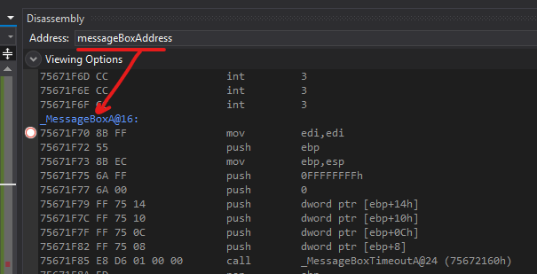
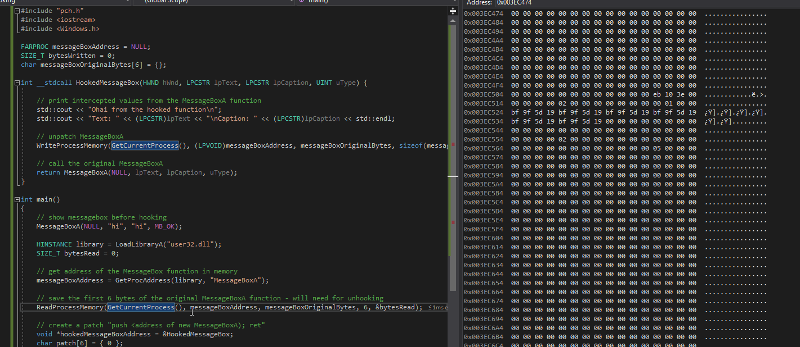
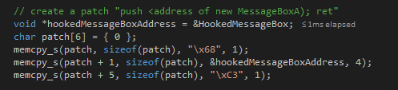
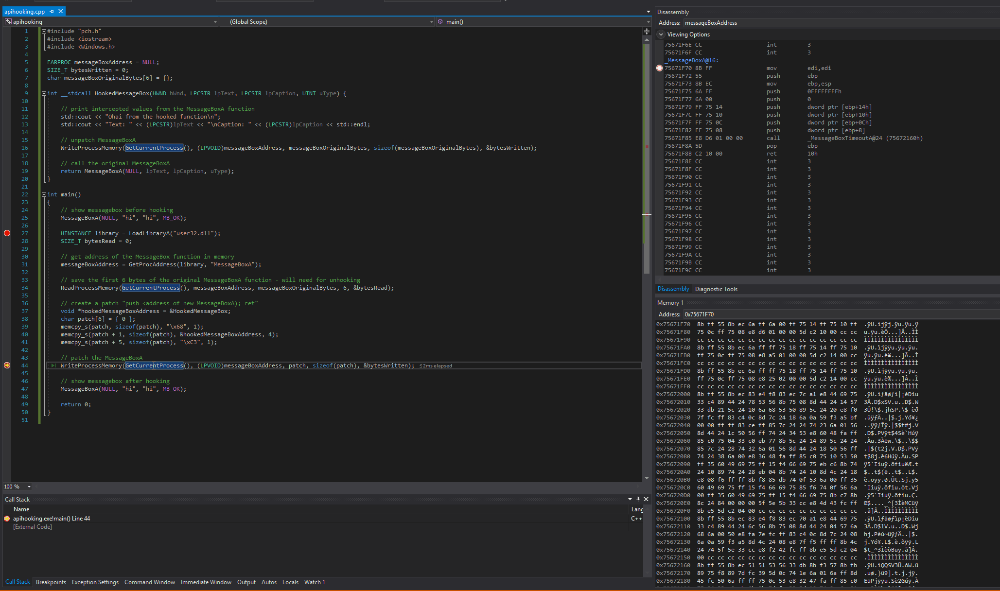

# Windows API Hooking

This lab is a quick look into how userland WinAPIs can be hooked. A `MessageBoxA` function will be hooked in this instance, but it could be any.

> **API hooking** is a technique by which we can instrument and modify the behavior and flow of **API**calls.  
> [https://resources.infosecinstitute.com/api-hooking/](https://resources.infosecinstitute.com/api-hooking/)

Windows API hooking is one of the techniques used by AV/EDR solutions to determine if code is malicious. You can read some of my notes on bypassing EDRs by leveraging unhooking - [Bypassing Cylance and other AVs/EDRs by Unhooking Windows APIs](../defense-evasion/bypassing-cylance-and-other-avs-edrs-by-unhooking-windows-apis.md)

For this lab, I will write a simple C++ program that will work follows:

1. Get memory address of the `MessageBoxA` function
2. Read the first 6 bytes of the `MessageBoxA` - will need these bytes for unhooking the function
3. Create a `HookedMessageBox` function that will be executed when the original `MessageBoxA` is called
4. Get memory address of the `HookedMessageBox`
5. Patch / redirect `MessageBoxA` to `HookedMessageBox`
6. Call `MessageBoxA`. Code gets redirected to `HookedMessageBox`
7. `HookedMessageBox` executes its code, prints the supplied arguments, unhooks the `MessageBoxA` and transfers the code control to the actual `MessageBoxA`

## Execution

Pop the message box before the function is hooked - just to make sure it works and to prove that no functions are hooked so far -  it's the first instruction of the program:


Get the memory address of the `MessageBoxA` function:


If we dissasemble the bytes at that address, we can definitely see that there is code for `MessageBoxA`:



Note the first 6 bytes `8b ff 55 8b ec 6a`\(mind the endian-ness\). We need to save these bytes for future when we want to unhook `MessageBoxA`:



Let's now build the patch \(hook\) bytes:  




...that will translate into the following assembly instructions:

```csharp
// push HookedMessageBox memory address onto the stack
push HookedMessageBox
// jump to HookedMessageBox
ret
```

We can now patch the `MessageBoxA` - memory pane in the bottom right shows the patch being written to the beginning of `MessageBoxA` function and the top right shows the beginning of the same function is re-written with a `push 3e1474h; ret` instructions:



If we disassemble the address `3e1474h`, we can see it contains a jmp to our `HookedMessageBox`:


The `HookedMessageBox` intercepts and prints out the arguments supplied to `MessageBoxA`, then unhooks ~~`MessageBoxA`~~ by swaping back the first 6 bytes to the original bytes of the `MessageBoxA` function and then calls the `MessageBoxA` with the supplied arguments:


## Demo

Once the function is hooked, we can call the `MessageBoxA(NULL, "hi", "hi", MB_OK);` which will invoke the `HookedMessageBox`, print the intercepted values and display the original message box:


## Code


```cpp
#include "pch.h"
#include <iostream>
#include <Windows.h>

FARPROC messageBoxAddress = NULL;
SIZE_T bytesWritten = 0;
char messageBoxOriginalBytes[6] = {};

int __stdcall HookedMessageBox(HWND hWnd, LPCSTR lpText, LPCSTR lpCaption, UINT uType) {
	
	// print intercepted values from the MessageBoxA function
	std::cout << "Ohai from the hooked function\n";
	std::cout << "Text: " << (LPCSTR)lpText << "\nCaption: " << (LPCSTR)lpCaption << std::endl;
	
	// unpatch MessageBoxA
	WriteProcessMemory(GetCurrentProcess(), (LPVOID)messageBoxAddress, messageBoxOriginalBytes, sizeof(messageBoxOriginalBytes), &bytesWritten);
	
	// call the original MessageBoxA
	return MessageBoxA(NULL, lpText, lpCaption, uType);
}

int main()
{
	// show messagebox before hooking
	MessageBoxA(NULL, "hi", "hi", MB_OK);

	HINSTANCE library = LoadLibraryA("user32.dll");
	SIZE_T bytesRead = 0;
	
	// get address of the MessageBox function in memory
	messageBoxAddress = GetProcAddress(library, "MessageBoxA");

	// save the first 6 bytes of the original MessageBoxA function - will need for unhooking
	ReadProcessMemory(GetCurrentProcess(), messageBoxAddress, messageBoxOriginalBytes, 6, &bytesRead);
	
	// create a patch "push <address of new MessageBoxA); ret"
	void *hookedMessageBoxAddress = &HookedMessageBox;
	char patch[6] = { 0 };
	memcpy_s(patch, 1, "\x68", 1);
	memcpy_s(patch + 1, 4, &hookedMessageBoxAddress, 4);
	memcpy_s(patch + 5, 1, "\xC3", 1);

	// patch the MessageBoxA
	WriteProcessMemory(GetCurrentProcess(), (LPVOID)messageBoxAddress, patch, sizeof(patch), &bytesWritten);

	// show messagebox after hooking
	MessageBoxA(NULL, "hi", "hi", MB_OK);

	return 0;
}
```


## References



