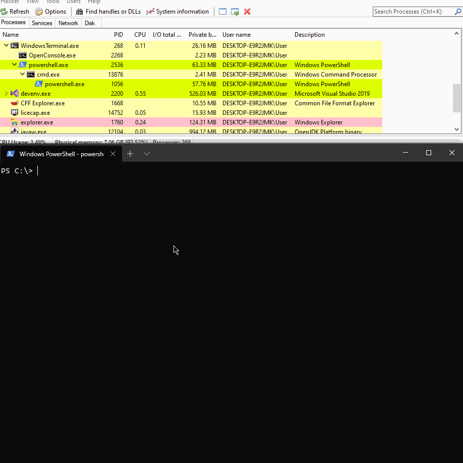

# Injecting .NET Assembly to an Unmanaged Process

This is a quick lab to see what API sequence makes it possible to inject C\# .NET assemblies / PE files \(.exe and .dll\) into an unmanaged process and invoke their methods. 


This is the technique that makes `execute-assembly` command possible in Cobalt Strike.


## Overview

At a high level, it works as follows:

1. `CLRCreateInstance` is used to retrieve an interface [`ICLRMetaHost`](https://docs.microsoft.com/en-us/dotnet/framework/unmanaged-api/hosting/iclrmetahost-interface)
2. `ICLRMetaHost->GetRuntime` is used to retrieve [`ICLRRuntimeInfo`](https://docs.microsoft.com/en-us/dotnet/framework/unmanaged-api/hosting/iclrruntimeinfo-interface) interface for a specified CLR version
3. `ICLRRuntimeInfo->GetInterface` is used to load the CLR into the current process and retrieve an interface [`ICLRRuntimeHost`](https://docs.microsoft.com/en-us/dotnet/framework/unmanaged-api/hosting/iclrruntimehost-interface)
4. `ICLRRuntimeHost->Start` is used to initialize the CLR into the current process
5. `ICLRRuntimeHost->EecuteInDefaultAppDomain` is used to load the C\# .NET assembly and call a particular method with an optionally provided argument

## Code

* `unmanaged.cpp` \(in my lab compiled to `LoadCLR.exe`\) - a C++ program that loads a C\# assembly 

  `CLRHello1.exe` and invokes its method `spotlessMethod`

* `managed.cs` \(in my lab compiled to `CLRHello1.exe`\) - a C\# program that is loaded by the unmanaged process \(`LoadCLR.exe`\). It has a method `spotlessMethod` that is invoked via `ExecuteInDefaultAppDomain.`O

Once invoked, the `spotlessMethod` prints out `Hi from CLR` to the console window.



```cpp
// code mostly stolen from pabloko's comment in https://gist.github.com/xpn/e95a62c6afcf06ede52568fcd8187cc2
#include <iostream>
#include <metahost.h>
#include <corerror.h>
#pragma comment(lib, "mscoree.lib")

int main()
{
    ICLRMetaHost* metaHost = NULL;
    ICLRRuntimeInfo* runtimeInfo = NULL;
    ICLRRuntimeHost* runtimeHost = NULL;
    DWORD pReturnValue;

    CLRCreateInstance(CLSID_CLRMetaHost, IID_ICLRMetaHost, (LPVOID*)&metaHost);
    metaHost->GetRuntime(L"v4.0.30319", IID_ICLRRuntimeInfo, (LPVOID*)&runtimeInfo);
    runtimeInfo->GetInterface(CLSID_CLRRuntimeHost, IID_ICLRRuntimeHost, (LPVOID*)&runtimeHost);
    runtimeHost->Start();
    HRESULT res = runtimeHost->ExecuteInDefaultAppDomain(L"C:\\labs\\CLRHello1\\CLRHello1\\CLRHello1\\bin\\Debug\\CLRHello1.exe", L"CLRHello1.Program", L"spotlessMethod", L"test", &pReturnValue);
    if (res == S_OK)
    {
        std::cout << "CLR executed successfully\n";
    }
    
    runtimeInfo->Release();
    metaHost->Release();
    runtimeHost->Release();
    return 0;
}
```



```csharp
using System;
using System.Collections.Generic;
using System.Linq;
using System.Text;
using System.Threading.Tasks;

namespace CLRHello1
{
    class Program
    {
        static void Main(string[] args)
        {
            return;   
        }
        
        // important: methods called by ExecuteInDefaultAppDomain need to stick to this signature
        static int spotlessMethod(String pwzArgument)
        {
            Console.WriteLine("Hi from CLR");
            return 1;
        }
    }
}
```



## Demo

Below shows how `LoadCLR.exe` loaded our C\# assembly `CLRHello.exe` \(seen in `LoadCLR.exe` loaded modules tab\) and invoked the `spotlessMethod`, that printed `Hi from CLR` to the console:



## References



[https://gist.github.com/xpn/e95a62c6afcf06ede52568fcd8187cc2](https://gist.github.com/xpn/e95a62c6afcf06ede52568fcd8187cc2)

