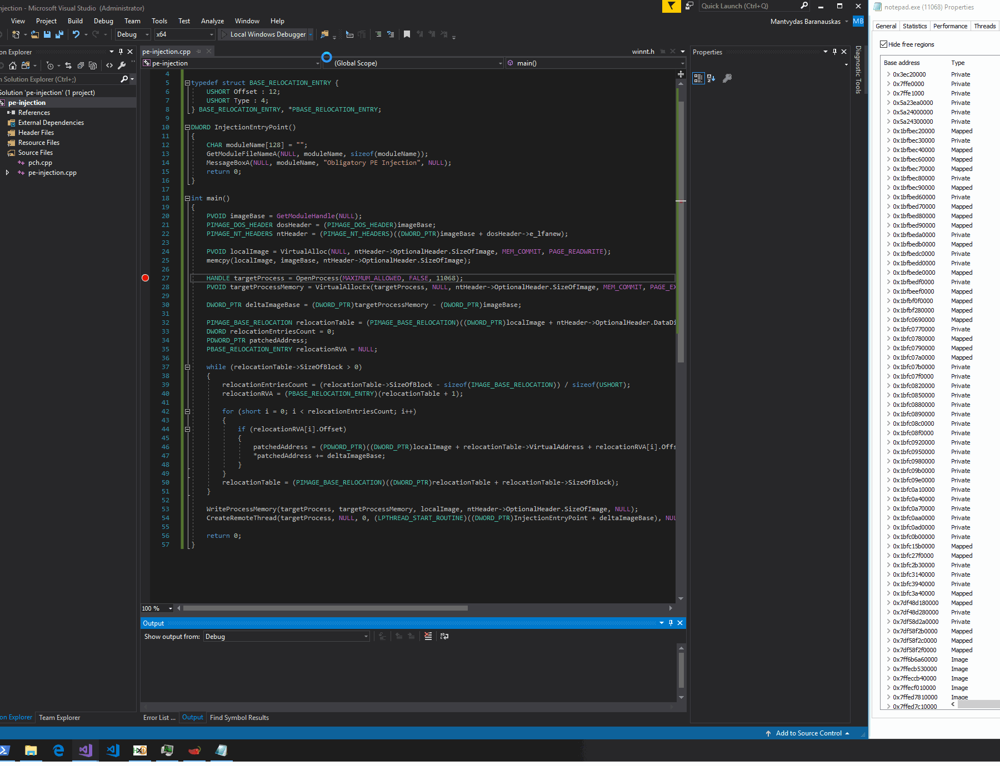

# Injecting PEs to Remote Processes

This is a quick note that shows how to inject an image of a running Portable Executable \(PE\) into another running process.

## Overview

In this lab, I wrote a simple C++ executable that once run, will inject itself into another running process - notepad in my case, and execute a function `InjectionEntryPoint` from my binary. 

To reiterate, my binary consists of two functions:

* `main` - this is the function that is responsible for injecting itself into a remote/target process
* `InjectionEntryPoint` - this is the function that will get executed by the target process \(notepad\) once it gets injected. This function will pop a MessageBox with a name of the module the code is currently running in. If injection is successful, it should show that the code is running from inside a notepad.exe.

High level process of the technique:

1. Parse the currently running image's PE headers and get its `sizeOfImage`
2. Allocate a block of memory \(size of PE image retrieved in step 1\) in the currently running process. Let's call it `localImage`
3. Copy the image of the current process into the newly allocated local memory
4. Allocate new memory block \(size of PE image retrieved in step 1\) in a remote process - the target process we want to inject the currently running PE into. Let's call it `targetImage`
5. Calculate delta between memory addresses `localImage` and `targetImage`
6. Patch the PE you're injecting or, in other words, relocate it/rebase it to `targetImage`. For more information about image relocations, see my other lab [T1093: Process Hollowing and Portable Executable Relocations](process-hollowing-and-pe-image-relocations.md)
7. Write the patched PE into `targetImage` memory location
8. Create remote thread and point it to `InjectionEntryPoint` function inside the PE

## Demo

Below shows how we've injected the PE into the notepad \(PID 11068\) and executed its function `InjectionEntryPoint` which printed out the name of a module the code was running from, proving that the PE injection was succesful:

## Code



## References







