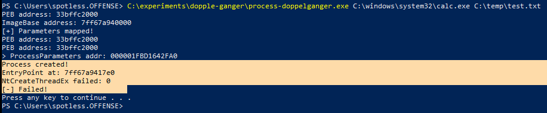
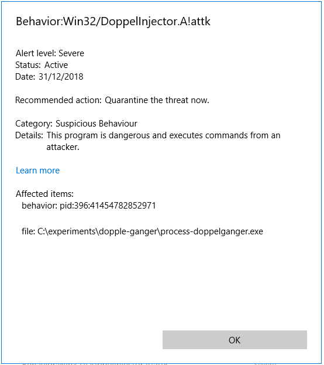

# Process Doppelganging

This lab is simply a run of the tool written by @hasherezade that was inspired by the BlackHat talk by Tal Liberman and Eugene Kogan where they presented their research on Process Doppelganging - see [references](process-doppelganging.md#references) for their slides.

Process doppelganing is a code injection technique that leverages NTFS transacations related Windows API calls which are \(used to be?\) less used with malicious intent and hence "less known" to AV vendors, hence this code injection technique is \(was?\) more likely to go undetected.

Mostly, I wanted to do this lab and see if Windows Defender caught up with this technique or not since the technique has been introduced almost a year ago from the time of this writing.

## Execution

First of, download hasherezade's PoC for doppleganging here [https://github.com/hasherezade/process\_doppelganging](https://github.com/hasherezade/process_doppelganging) and compile it.

Then test the technique like so:


```csharp
.\process-doppelganger.exe C:\tools\mimikatz\x64\mimikatz.exe c:\zone.txt
```


Note in the below screenshot how mimikatz is launched, but the Process Explorer actually represents the mimikatz process as zone.txt - this is because multiple Process Environment Block's \(PEB\) memory structures of the newly created process were modified during the new process creation:


This test was done on Windows 7



Below are two links where we explore the PEB in a bit more depth:





## Windows 10

Going back to my original motivation as to why I wanted to try this technique out, which was to see if Windows 10 would detect this type of code injection - below is the answer:





## References







