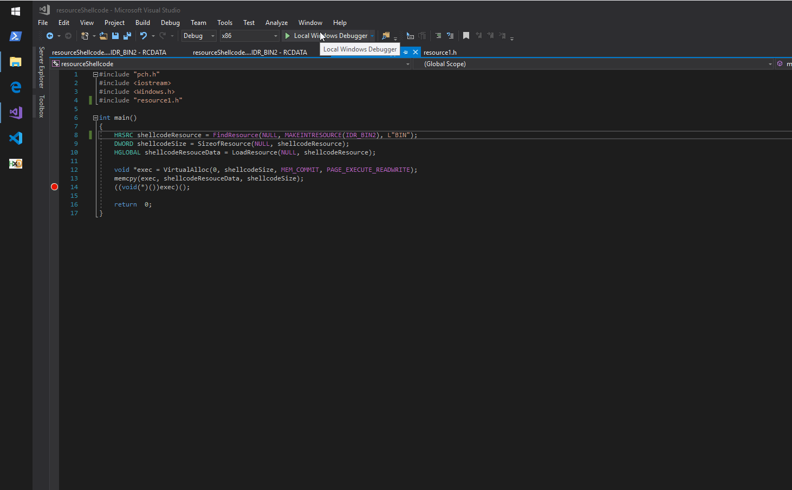

# Shellcode Reflective DLL Injection

Shellcode reflective DLL injection \(sRDI\) is a technique that allows converting a given DLL into a position independent shellcode that can then be injected using your favourite shellcode injection and execution technique. In this lab I wanted to try this technique as I think it is an amazing technique to have in your arsenal.

In this lab, I'm playing with the amazing [https://github.com/monoxgas/sRDI](https://github.com/monoxgas/sRDI) written by monoxgas from Silent Break Security.

## Execution

Let's compile a simple x86 DLL - in my case, an odd DLL that pops 2 notepad processes when executed:


Convert the DLL into shellcode. We will get an array of shellcode bytes represented in decimal values:

```csharp
$sc = ConvertTo-Shellcode \\VBOXSVR\Experiments\messagebox\messagebox\Debug\messagebox.dll
```


Let's convert them to hex:

```csharp
$sc2 = $sc | % { write-output ([System.String]::Format('{0:X2}', $_)) }
```


Join them all and print to a text file:

```text
$sc2 -join "" > shell.txt
```


Create a new binary file with the shellcode we got earlier - just copy the hex string \(as seen in the above screenshot\) and paste it to a new file using HxD hex editor:


In order to load and execute the shellcode, we will place it in the binary as a resource as described in my other lab [Loading and Executing Shellcode From PE Resources](loading-and-executing-shellcode-from-portable-executable-resources.md):


Compile and run the binary. If the shellcode runs successfully, we should see two notepad.exe processes popup:



## References



