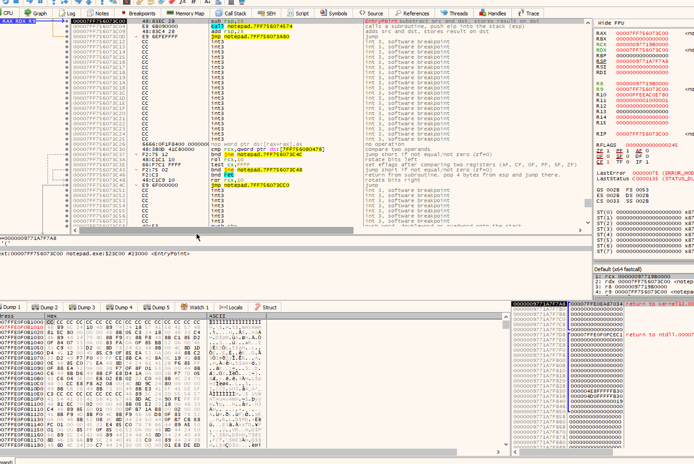
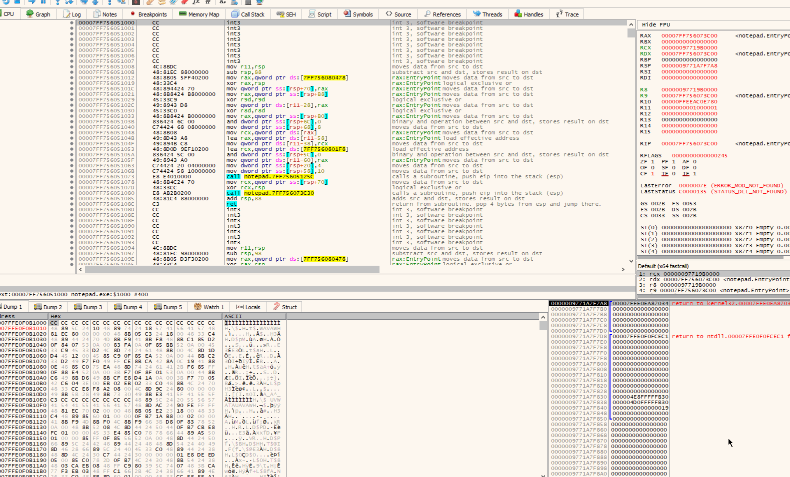
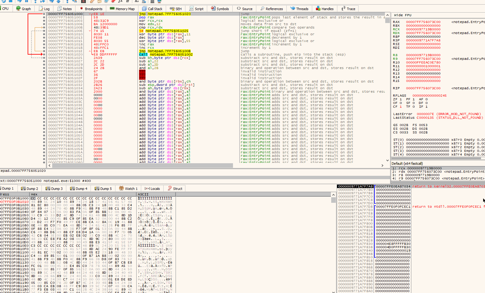
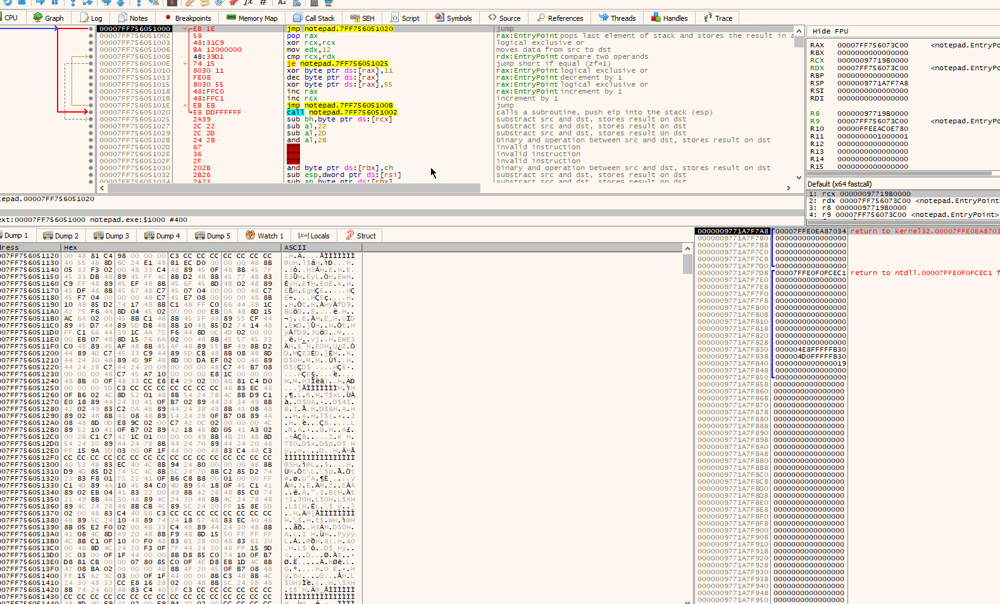
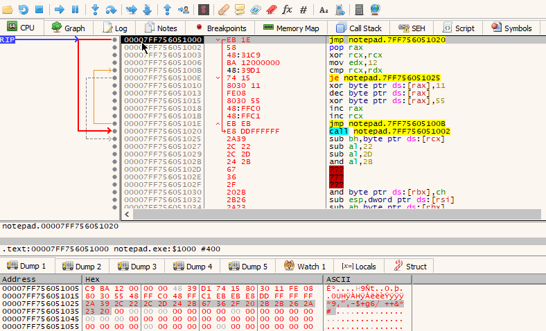

# Writing Custom Shellcode Encoders and Decoders

The purpose of this lab is to get a bit more comfortable with writing primitive custom shellcode encoders and decoders.

Shellcode encoding simply means transforming original shellcode bytes into a set of arbitrary bytes by following some rules \(encoding scheme\), that can be later be reverted back to their original values by following the same rules \(decoding scheme\) in reverse.


Shellcode encoding may be useful in evading static antivirus signatures and eliminating null bytes.


## Encoder

### Raw Shellcode

To make it simple, for this lab, let's imagine that our raw shellcode \(before encoding\) is made of the following bytes:

```csharp
$shellcode = 0x6F,0x72,0x69,0x67,0x69,0x6E,0x61,0x6C,0x20,0x73,0x68,0x65,0x6C,0x6C,0x63,0x6F,0x64,0x65
```

...which is actually just a simple string `original shellcode` as you can see here:


### Encoding Scheme

Now that we have the raw shellcode bytes, we need to decide on the algorithm that defines how each byte of the raw shellcode should be encoded/transformed. There's many ways to do it, but for this lab, let's define our encoding steps like this:

1. xor with 0x55
2. increment by 1
3. xor with  0x11

### The Encoder Itself

Let's write a simple powershell script that will help us cycle through the raw shellcode bytes and encode them by performing operations defined in our encoding scheme:

```csharp
<#
    Encoding steps:
    1. xor with 0x55
    2. increment by 1
    3. xor with 0x11
#>

# Original raw shellcode bytes
$shellcode = 0x6F,0x72,0x69,0x67,0x69,0x6E,0x61,0x6C,0x20,0x73,0x68,0x65,0x6C,0x6C,0x63,0x6F,0x64,0x65
$printFriendly = ($shellcode | ForEach-Object ToString x2) -join ',0x'
write-host "Original shellcode: 0x$printFriendly"

# Iterate through shellcode bytes and encode them
$encodedShellcode = $shellcode | % {
    $_ = $_ -bxor 0x55
    $_ = $_ + 0x1
    $_ = $_ -bxor 0x11
    Write-Output $_
}

# Print encoded shellcode
$printFriendly = ($encodedShellcode | ForEach-Object ToString x2) -join ',0x'
write-host "Encoded shellcode: 0x$printFriendly"

# Print encoded bytes size
write-host "Size: " ('0x{0:x}' -f $shellcode.count)

# Check if encoded shellcode contains null bytes
write-host "Contains NULL-bytes:" $encodedShellcode.contains(0)
```

If we run the encoder on our shellcode bytes `0x6F,0x72,0x69,0x67,0x69,0x6E,0x61,0x6C,0x20,0x73,0x68,0x65,0x6C,0x6C,0x63,0x6F,0x64,0x65`, it will spit out the encoded shellcode bytes \(lime\) and show if null bytes were found \(lime\):


Note that it also shows the shellcode size \(orange\) - we will need it later when writing a decoder, so that we can tell the decoder how many shellcode bytes it should process.

## Decoder

### Decoding Scheme

The decoding scheme is the same as the encoding scheme, only in reverse:


...which means that we will have to iterate through all the encoded bytes of the shellcode and transform them into original bytes like this:

1. xor with 0x11
2. decrement by 0x1 \(because we incremented when encoding, we need to decrement now\)
3. xor with 0x55

A fully commented NASM `decoder.asm` is here:


```cpp
global _start

section .text
    _start:
        jmp short shellcode

    decoder:
        pop rax                 ; store encodedShellcode address in rax - this is the address that we will jump to once all the bytes in the encodedShellcode have been decoded

    setup:
        xor rcx, rcx            ; reset rcx to 0, will use this as a loop counter
        mov rdx, 0x12           ; shellcode size is 18 bytes

    decoderStub:
        cmp rcx, rdx            ; check if we've iterated and decoded all the encoded bytes
        je encodedShellcode     ; jump to the encodedShellcode, which actually now contains the decoded shellcode
        
        ; encodedShellcode bytes are being decoded here per our decoding scheme
        xor byte [rax], 0x11    ; 1. xor byte with 0x11
        dec byte [rax]          ; 2. decremenet byte by 1
        xor byte [rax], 0x55    ; 3. xor byte with 0x55
        
        inc rax                 ; point rax to the next encoded byte in encodedShellcode
        inc rcx                 ; increase loop counter
        jmp short decoderStub   ; repeat decoding procedure
            
    shellcode:
        call decoder            ; jump to decoder label. This pushes the address of encodedShellcode to the stack (to be popped into rax as the first instruction under the decoder label)
        encodedShellcode: db 0x2a,0x39,0x2c,0x22,0x2c,0x2d,0x24,0x2b,0x67,0x36,0x2f,0x20,0x2b,0x2b,0x26,0x2a,0x23,0x20
```



Note that line 12 contains the shellcode size - `0x12` - the value that was printed out by our `encoder.ps1`


### Assembling the Decoder

Let's assemble our `decoder.asm` with nasm:

```text
nasm -f win64 .\decoder.asm -o .\decoder
```

### Extracting Decoder Op-Codes

The decoder file assembled in the previous step, contains our decoder's bytes / op-codes \(and our encoded shellcode\) that can be executed by the CPU once in process's executable memory. We need to extract them if we want to inject and execute those bytes as shellcode.

For the sake of simplicity, let's do this manually by loading the assembled `decoder` file into the CFF Explorer's `Quick Disassembler` and compare it with our assembly instructions in `decoder.asm`.

We can clearly see that the op-codes of our decoder start at `0x3C` into the file assembled file:


Let's switch to the Hex Editor and we can copy \(right click on the selected bytes\) the decoder bytes \(for this lab, we will go with a Hex format\), starting at `0x3c` \(blue\) and ending with the last byte of our encoded shellcode `0x20` \(red\):


## Confirming It Worked

Now that we've extracted our decoder's \(that includes our encoded shellcode\) op-codes, let's check if we can make them execute and see our encoded shellcode get decoded and launched.


**Reminder**   
Our decoded shellcode will not execute as it's simply an ascii string `original shellcode`, but it would if it was actual executable code.


To keep things simple, let's fire up x64dbg and attach it to a new instance of notepad.exe - this is the process that we will be executing our decoder in - and hit F9 so that we break at the entry point:


### Changing Memory Permissions

Once at the entry point, let's change the memory permissions for the `.text` section, so we can demo this decoder:

1. Right click the instruction address and `Follow in Memory Map`
2. Right click the `.text` section and `Set Page Memory Rights`
3. Ensure `Select Full Access` is selected and hit `Set Rights`



### Pasting The Bytes

Once the permissions are set, jump to the `.text` section with right click + `Follow in Disassembler`:


Select enough instructions that could be replaced with our shellcode bytes, hit Ctrl + E \(Binary Edit\) and paste the extracted decoder op-codes there:



### Changing RIP

Set the instruction pointer RIP to the location we've just pasted our shellcode to:



### Following Memory Dump

Let's now follow the same address we've pasted the bytes to in the Memoy Dump too, so we can see how our shellcode is getting decoded as we step through the decoding stub:



### Decoding in Action

We can finally execute our decoder by repeatedly hitting F7 and observe how our shellcode gets decoded and the initial string `original shellcode` is being revealed in the memory dump view:



Note that after the decoding has completed, the code is transferred to our decoded shellcode:


