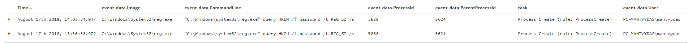

# T1214: Credentials in Registry

## Execution

Scanning registry hives for the value `password`:


```csharp
reg query HKLM /f password /t REG_SZ /s
# or
reg query HKCU /f password /t REG_SZ /s
```


## Observations

As a defender, you may want to monitor commandline argument logs and look for any that include `req query` and `password`strings:



## References



