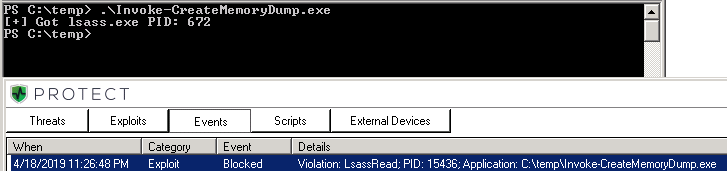
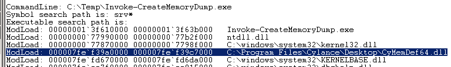
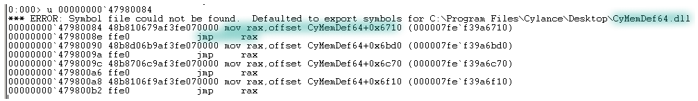

# Bypassing Cylance and other AVs/EDRs by Unhooking Windows APIs

## Context

If you've tried dumping lsass.exe process memory from an endpoint where CylancePROTECT is running, you know you will be having a hard time.

This lab shows how it's still possible to dump the process memory and bypass Cylance \(**or any other Antivirus/Endpoint Detection & Response solution**\) that uses userland API hooking to determine if a program is malicious during its execution.

Hooking is an old technique and I've read about it in the past, but never had a chance to play with it, until I stumbled upon a post by Hoang Bui who wrote about unhooking EDRs [https://medium.com/@fsx30/bypass-edrs-memory-protection-introduction-to-hooking-2efb21acffd6](https://medium.com/@fsx30/bypass-edrs-memory-protection-introduction-to-hooking-2efb21acffd6).


This lab demonstrates API unhooking in the context of `MiniDumpWriteDump` API,  but it could be done against any other hooked API.


## What is hooking?

API hooking could be compared to a web proxy - all API calls \(including their arguments\) that your application makes \(say `CreateFile`,`ReadFile`, `OpenProcess`, etc\), are intercepted and inspected by AVs/EDRs which then decide if the action/intent of the program is malicious or not.

## How is hooking done?

The way EDR vendors hook userland APIs is by hijacking/modifying function definitions \(APIs\) found in  Windows DLLs such as `kernel32/kernelbase` and `ntdll`. 

Function definitions are modified by inserting a `jmp` instruction at their very beginning. Those `jmp` instructions will change program's execution flow - the program will get redirected to the EDRs inspection module which will evaluate if the program exhibits any suspicious behaviour and it will do so by analyzing the arguments that were passed to the function that the EDR is hooking/monitoring. This redirection is sometimes called a `detour/trampoline`.

Hopefully the below diagram helps clarify it further:


It's worth noting that not all the functions get hijacked by AVs/EDRs. Usually only those functions that are known to be abused over and over again in the wiled that get hooked - think `CreareRemoteThread`, `NtQueueApcThread` and similar.

## Execution

### Getting Caught by Cylance

Note that this lab is based on another lab where I wrote a small C++ program that used `MiniDumpWriteDump` Windows API to dump the lsass.exe process memory - [Dumping LSASS without Mimikatz == Reduced Chances of Getting Flagged by AVs](../credential-access-and-credential-dumping/dumping-lsass-passwords-without-mimikatz-minidumpwritedump-av-signature-bypass.md).

Let's try and run the code \(referenced in the above lab\) on a system that is monitored by CylancePROTECT. The program gets killed with `Violation: LsassRead`straight away:



As you could have guessed, it Cylance hooks the `MiniDumpWriteDump` API call. To be more precise, it actually hooks a `NtReadVirtualMemory` from `ntdll.dll` which is called under the hood by the `MiniDumpWriteDump`.

### Confirming the Hook

Executing the program with debugger, it can be observed that very early in the process execution, a Cylance Memory Protection Module `CyMemDef64.dll` gets injected into `Invoke-CreateMemoryDump.exe` \(my program that leverages MiniDumpWriteDump\) process - this is the module that will be inspecting the API calls made by Invoke-CreateMemoryDump.exe:



Since we know that `MiniDumpWriteDump` calls `NtReadVirtualMemory`, we can take a peek at `NtReadVirtualMemory` function definition to see if there's anything suspicious about it:


```text
u NtReadVirtualMemory
```


We immediately see that the first instruction of the function is a `jmp` instruction to some weird memory address which falls outside the `ntdll` module's memory address ranges:


Let's dissassemble that address:


```text
u 0000000047980084
```


We can immediately see that there are further `jmp` instructions to Cylance Memory Protection Module `CyMemDef64.dll` - this confirms that the function `NtReadVirtualMemory` is hooked:



To confirm that our program will eventually call `NtReadVirtualMemory`, we can put a breakpoint on it and continue our program's execution - as shown in the below screengrab, the breakpoint is hit:


If we continue the program execution at this point, it will be redirected \(`jmp` instruction\) to Cylance's Memory Protection Module and the program will be bust with the `Violation: LsassRead` message.

### Unhooking

In order to unhook or, in other words, restore the hooked function to its initial state, we need to know how it looked like before it got modified by Cylance.

This is easy to do by checking the first 5 bytes of the function `NtReadVirtualMemory` that can be found in c:\windows\system32\ntdll.dll before it gets loaded into memory. We can see the function's Relative Virtual Address \(RVA\) in ntdll's DLL exports table - which in my case is `00069C70` \(will probably be different on your system\):


If we convert the RVA to the physical file location \(which is the same as RVA since the file is not yet in memory\), we can see that the first 5 bytes of the function are `4c 8b d1 b8 c3`:


What the above means is that if we replace the first 5 bytes \(`e9 0f 64 f8 cf`\) of the `NtReadVirtualMemory` that were injected by Cylance, to `4c 8b d1 b8 3c`, Cylance should become blind and no longer monitor `MiniDumpWriteDump` API calls.

With this information, we can update the program and instruct it to find the address of function `NtReadVirtualMemory` and unhook it by writing the bytes `4c 8b d1 b8 3c` to the beginning of that function as shown in line 17 below:


Recompiling and running the program again dumps lsass.exe process memory successfully without Cylance interferance:


We can now take the dump file offline and load it into mimikatz...

I only unhooked one function, but the process could be automated to unhook all functions by comparing function definitions in the DLL on the disk with their definitions in memory. If the function definition in memory is different, it meants it is hooked and should be patched with instructions found in the definition on the disk.

## References

Great references below, including Cylance themselves talking about unhooking:







