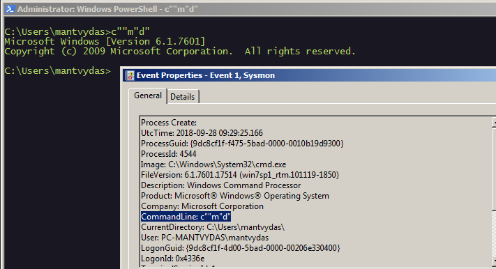
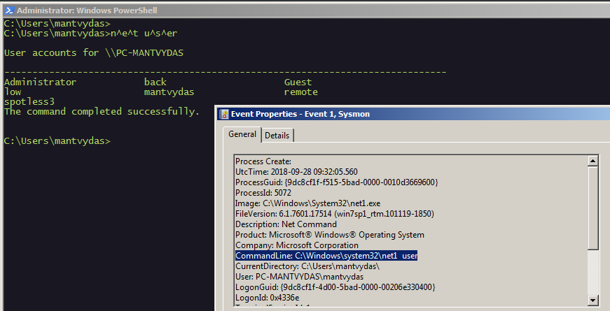
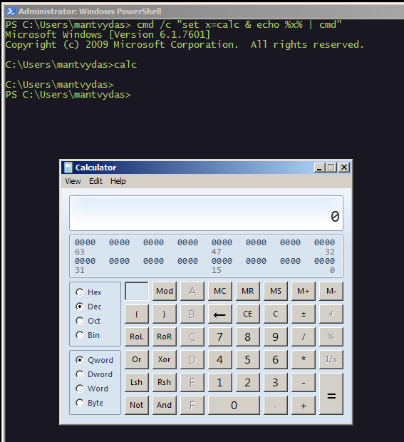
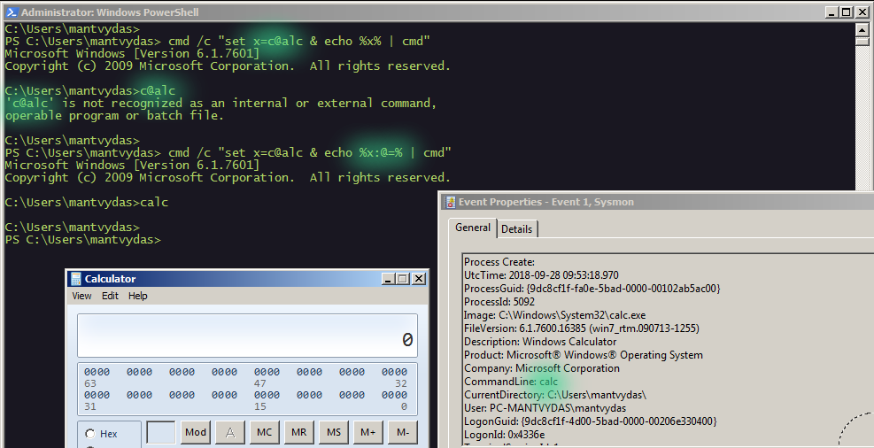
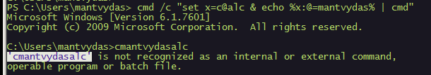
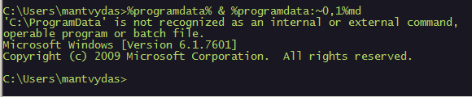
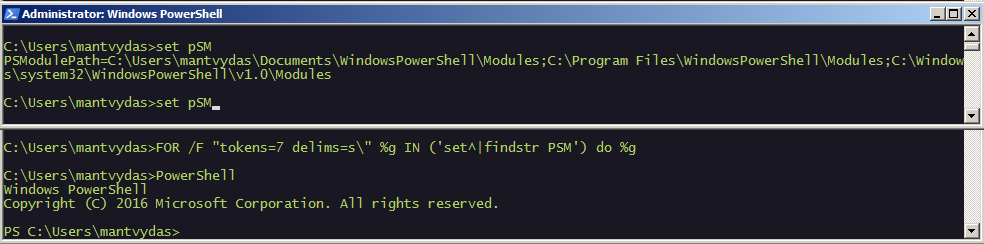
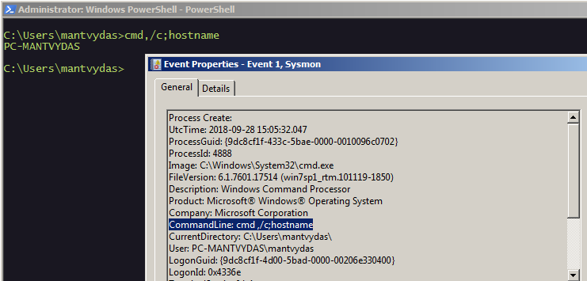
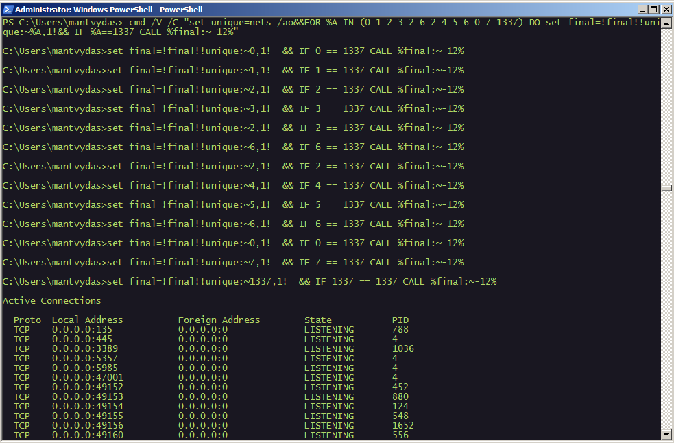

# Commandline Obfusaction

This lab is based on the research done by Daniel Bohannon from FireEye.

## Environment variables

```csharp
C:\Users\mantvydas>set a=/c & set b=calc
C:\Users\mantvydas>cmd %a% %b%
```

Note though that the commandline logging \(dynamic detection\) still works as the commandline needs to be expanded before it can get executed, but static detection could be bypassed:


## Double quotes

```csharp
C:\Users\mantvydas>c""m"d"
```

Note how double quotes can actually make both static and dynamic detection a bit more difficult:



## Carets

```csharp
C:\Users\mantvydas>n^e^t u^s^er
```

Commandline logging, same as with using environment variables, is not affected, however static detection could be affected:



## Garbage delimiters

A very interesting technique. Let's look at this first without garbage delimiters:

```csharp
PS C:\Users\mantvydas> cmd /c "set x=calc & echo %x% | cmd"
```

The above sets en environment variable x to `calc` and then prints it and pipes it to the standard input of the cmd:



Introducing garbage delimiters `@` into the equation:

```csharp
PS C:\Users\mantvydas> cmd /c "set x=c@alc & echo %x:@=% | cmd"
```

The above does the same as the earlier example, except that it introduces more filth into the command \(`c@lc`\). You can see from the below screenshot that Windows does not recognize such a command `c@lc`, but the second attempt when the `%x:@=%` removes the extraneous `@` symbol from the string, gets executed successfully:



If it is confusing, the below should help clear it up:

```text
PS C:\Users\mantvydas> cmd /c "set x=c@alc & echo %x:@=mantvydas% | cmd"
```



In the above, the value `mantvydas` got inserted in the `c@lc` in place of @, suggesting that `%x:@=%` \(`:@=` to be precise\) is just a string replacement capability in the cmd.exe utility.

With this knowledge, the original obfuscated command

```csharp
PS C:\Users\mantvydas> cmd /c "set x=c@alc & echo %x:@=% | cmd"
```

reads: replace the @ symbol with text that goes after the `=` sign, which is empty in this case, which effectively means - remove @ from the value stored in the variable x.

## Substring

Cmd.exe also has a substring capability. See below:

```csharp
# this will take the C character from %programdata% and will launch the cmd prompt
%programdata:~0,1%md
```

Note that this is only good for bypassing static detection:



## Batch FOR, DELIMS + TOKENS

We can use a builtin batch looping to extract the Powershell string from environment variables in order to launch it and bypass static detection that looks for a string "powershell" in program invocations:


```csharp
set pSM 
PSModulePath=C:\Users\mantvydas\Documents\WindowsPowerShell\Modules;....
```


Note how the `WindowsPowerShell` string is present in the `PSModule` environment variable - this mean we can extract it like so:

```csharp
FOR /F "tokens=7 delims=s\" %g IN ('set^|findstr PSM') do %g
```

What the above command does:

1. Executes `set^|findstr PSM` to get the PSModulePath variable value
2. Splits the string using delimiters `s` & `\`
3. Prints out the 7th token, which happens to be the `PowerShell`
4. Which effectively launches PowerShell



## Comma, semicolon

This may be used for both static and dynamic detection bypasses:

```csharp
C:\Users\mantvydas>cmd,/c;hostname
PC-MANTVYDAS
```



## FORCoding

What happens below is essentially there is a loop that goes through the list of indexes \(0 1 2 3 2 6 2 4 5 6 0 7\) which are used to point to characters in the variable `unique` which acts like an alphabet. This allows for the FOR loop to cycle through the index, pick out characters from the alphabet pointed to by the index and concatenate them into a final string that eventually gets called with `CALL %final%` when the loop reaches the index 1337.

```csharp
PS C:\Users\mantvydas> cmd /V /C "set unique=nets /ao&&FOR %A IN (0 1 2 3 2 6 2 4 5 6 0 7 1337) DO set final=!final!!uni
que:~%A,1!&& IF %A==1337 CALL %final:~-12%"
```



In verbose python this could look something like this:


```python
import os

dictionary = "nets -ao"
indexes = [0, 1, 2, 3, 2, 6, 2, 4, 5, 6, 0, 7, 1337]
final = ""

for index in indexes:
    if index == 1337:        
        break
    final += dictionary[index]
os.system(final)
```



## References





