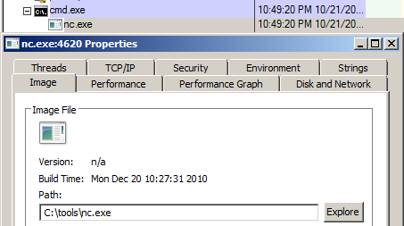
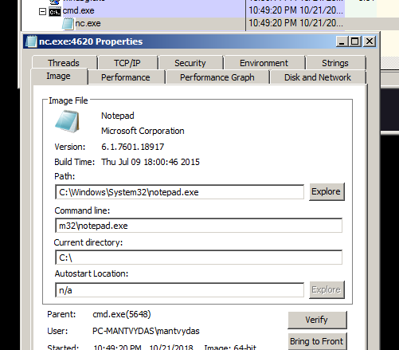
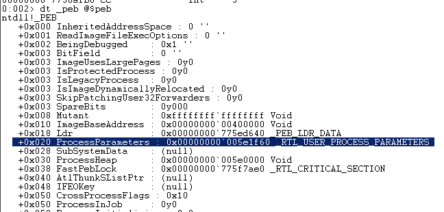
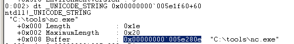
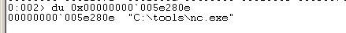
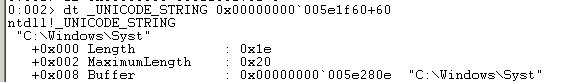
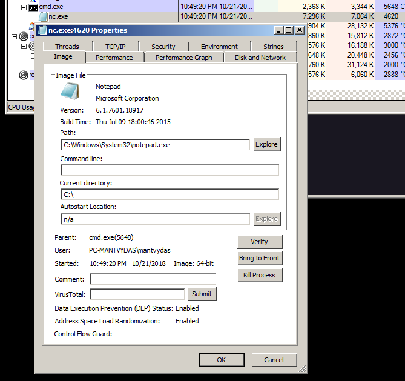
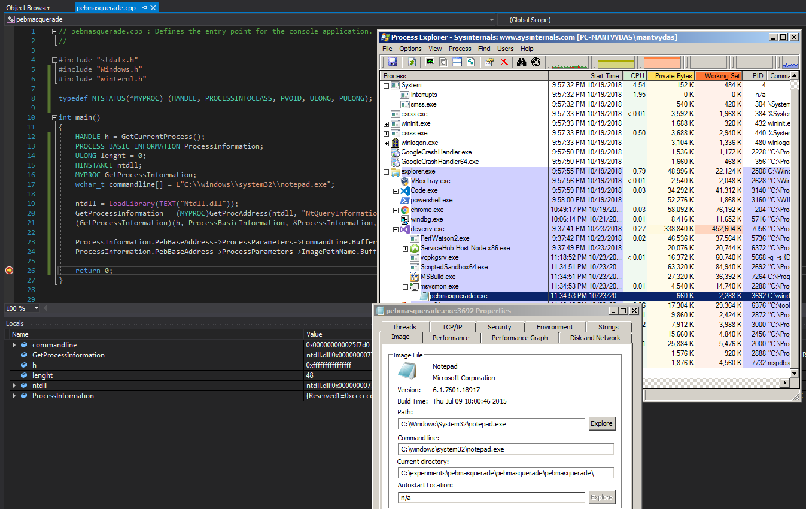
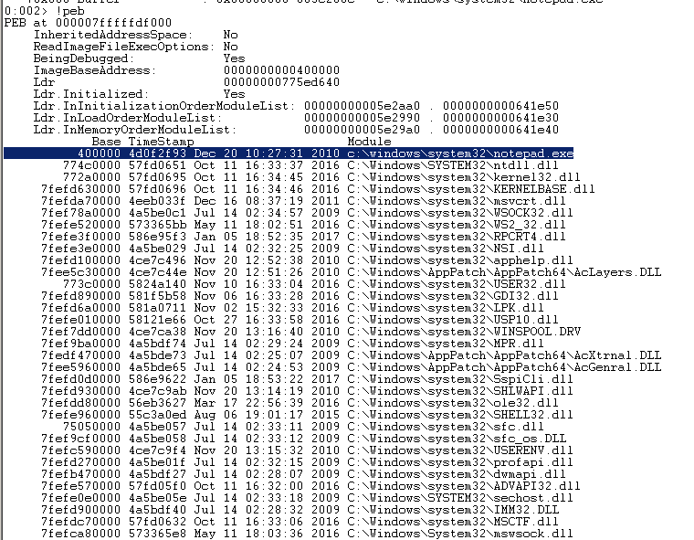
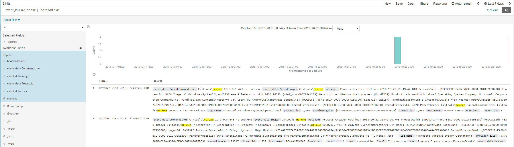

# Masquerading Processes in Userland via \_PEB

## Overview

In this short lab I am going to use a WinDBG to make my malicious program pretend to look like a notepad.exe \(hence masquerading\) when inspecting system's running processes with tools like Sysinternals ProcExplorer and similar. Note that this is not a [code injection](../code-injection-process-injection/) exercise. 

This is possible, because information about the process, i.e commandline arguments, image location, loaded modules, etc is stored in a memory structure called Process Environment Block \(`_PEB`\) that is accessible and writeable from the userland.


Thanks to [@FuzzySec](https://twitter.com/FuzzySec) ****who pointed out the following:  
_you don't need SeDebugPrivilege when overwriting the PEB for your own process or generally for overwriting a process spawned in your user context_

\_\_[_https://twitter.com/FuzzySec/status/1090963518558482436_](https://twitter.com/FuzzySec/status/1090963518558482436)\_\_


This lab builds on the previous lab:



## Context

For this demo, my malicious binary is going to be an `nc.exe` -  a rudimentary netcat reverse shell spawned by cmd.exe and the PID of `4620`:



Using WinDBG, we will make the nc.exe look like notepad.exe. This will be reflected in the `Path` field and the binary icon in the process properties view using ProcExplorer as seen in the below graphic. Note that it is the same nc.exe process \(PID 4620\) as shown above, only this time masquerading as a notepad.exe:



## Execution

So how is this possible? Read on.

Let's first have a look at the \_PEB structure for the `nc.exe` process using WinDBG:

```csharp
dt _peb @$peb
```



Note that at the offset `0x020` of the PEB, there is another structure which is of interest to us -  `_RTL_USER_PROCESS_PARAMETERS`, which contains nc.exe process information. Let's inspect it further:

```csharp
dt _RTL_USER_PROCESS_PARAMETERS 0x00000000`005e1f60
```


The offset `0x060` of `_RTL_USER_PROCESS_PARAMETERS` is also of interest to us - it contains a member `ImagePathName` which points to a structure `_UNICODE_STRING` that, as we will see later, contains a field `Buffer` which effectively signifies the name/full path to our malicious binary nc.exe. Note how at the offset `0x70` we can see the commandline arguments of the malicious process, which we explored [previously](../../miscellaneous-reversing-forensics/windows-kernel-internals/exploring-process-environment-block.md).

Let's inspect the aforementioned `_UNICODE_STRING` structure:

```csharp
dt _UNICODE_STRING 0x00000000`005e1f60+60
```



`_UNICODE_STRING` structure describes the lenght of the string and also points to the actual memory location ``0x00000000`005e280e`` by the `Buffer` field that contains the string which is a full path to our malicious binary.

Let's confirm the string location by dumping the bytes at ``0x00000000`005e280e`` by issuing the following command in WinDBG:

```csharp
0:002> du 0x00000000`005e280e
00000000`005e280e  "C:\tools\nc.exe"
```



Now that I have confirmed that ``0x00000000`005e280e`` indeed contains the path to the binary, let's try to write a new string to that memory address. Say, let's try swapping the nc.exe with a path to the notepad.exe binary found in Windows\System32\notepad.exe:

```csharp
eu 0x00000000`005e280e "C:\\Windows\\System32\\notepad.exe"
```



If you are following along, do not forget to add NULL byte at the end of your new string to terminate it:

```text
eb 0x00000000`005e280e+3d 0x0
```


Let's check the `_UNICODE_STRING` structure again to see if the changes took effect:

```csharp
dt _UNICODE_STRING 0x00000000`005e1f60+60
```



We can see that our string is getting truncated. This is because the `Lenght` value in the `_UNICODE_STRING` structure is set to 0x1e \(30 decimal\) which equals to only 15 unicode characters:


Let's increase that value to 0x3e to accomodate our longer string pointing to notepad.exe binary and check the structure again:

```csharp
eb 0x00000000`005e1f60+60 3e
dt _UNICODE_STRING 0x00000000`005e1f60+60
```

Good, the string pointed to by the field `Buffer` is no longer getting truncated:


For the sake of this demo, I cleared out the commandline arguments the nc.exe was launched with by amending the `_UNICODE_STRING` structure member `Lenght` by setting it to 0:

```csharp
eb 0x00000000`005e1f60+70 0x0
```

Inspecting our malicious nc.exe process again using Process Explorer reveals that it now looks like notepad without commandline arguments:



Note that to further obfuscate the malicious binary, one could also rename the binary itself from nc.exe to notepad.exe.

## A simple PoC

As part of this simple lab, I wanted to write a simple C++ proof of concept that would make the running program masquerade itself as a notepad. Here is the code:


```cpp
#include "stdafx.h"
#include "Windows.h"
#include "winternl.h"

typedef NTSTATUS(*MYPROC) (HANDLE, PROCESSINFOCLASS, PVOID, ULONG, PULONG);

int main()
{
	HANDLE h = GetCurrentProcess();
	PROCESS_BASIC_INFORMATION ProcessInformation;
	ULONG lenght = 0;
	HINSTANCE ntdll;
	MYPROC GetProcessInformation;
	wchar_t commandline[] = L"C:\\windows\\system32\\notepad.exe";
	ntdll = LoadLibrary(TEXT("Ntdll.dll"));

	//resolve address of NtQueryInformationProcess in ntdll.dll
	GetProcessInformation = (MYPROC)GetProcAddress(ntdll, "NtQueryInformationProcess");

	//get _PEB object
	(GetProcessInformation)(h, ProcessBasicInformation, &ProcessInformation, sizeof(ProcessInformation), &lenght);

	//replace commandline and imagepathname
	ProcessInformation.PebBaseAddress->ProcessParameters->CommandLine.Buffer = commandline;
	ProcessInformation.PebBaseAddress->ProcessParameters->ImagePathName.Buffer = commandline;

	return 0;
}
```




..and here is the compiled running program being inspected with ProcExplorer - we can see that the masquerading is achieved successfully:



## Observations

Switching back to the nc.exe masquerading as notepad.exe, if we check the `!peb` data, we can see a notepad.exe is now displayed in the  `Ldr.InMemoryOrderModuleList` memory structure!





Note that even though it shows in the loaded modules that notepad.exe was loaded, it still does not mean that there was an actual notepad.exe process created and sysmon logs prove this, meaning commandline logging can still be helpful in detecting this behaviour.



## Credits

[@b33f](https://twitter.com/FuzzySec) for his [Masquerade-PEB.ps1](https://github.com/FuzzySecurity/PowerShell-Suite/blob/master/Masquerade-PEB.ps1) which is what originally inspired me \(quite some time ago now\) to explore this concept, but I never got to lay my hands on it until now.  
[  
@Mumbai](https://twitter.com/@ilove2pwn_) for talking to me about C++ and NtQueryInformationProcess

## References







