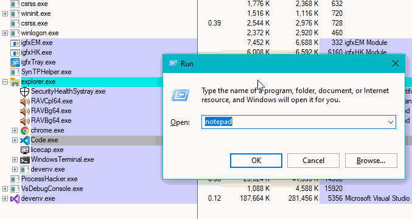
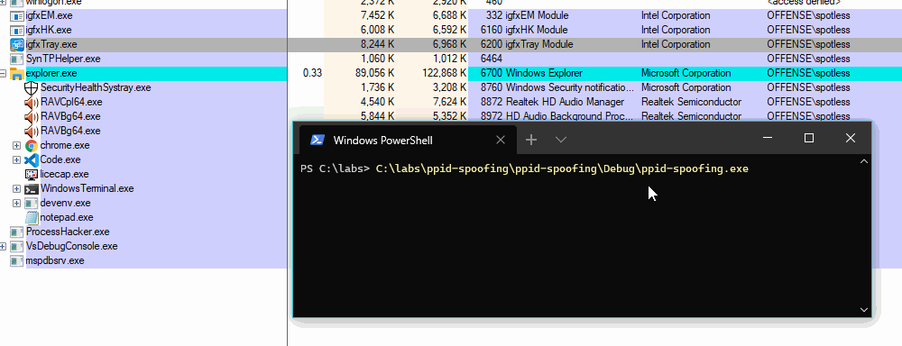
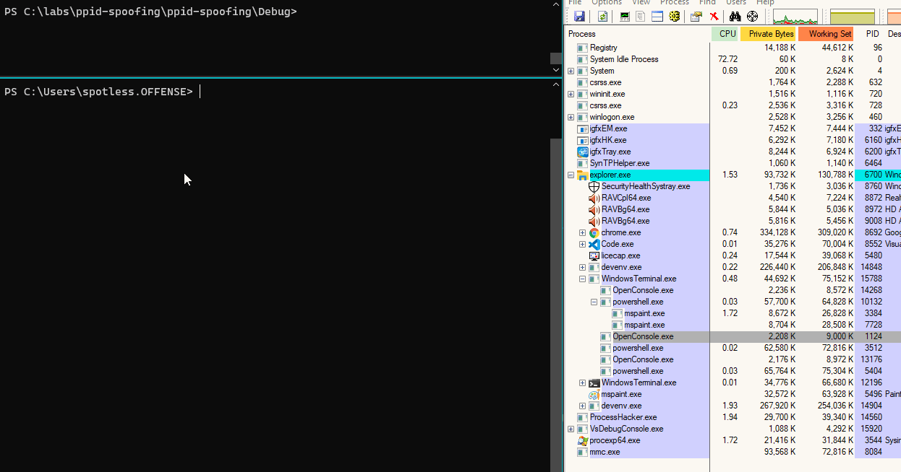

# Parent Process ID \(PPID\) Spoofing

## PPID Spoofing

PPID spoofing is a technique that allows attackers to start programs with arbitrary parent process set. This helps attackers make it look as if their programs were spawned by another process \(instead of the one that would have spawned it if no spoofing was done\) and it may help evade detections, that are based on parent/child process relationships. 

For example, by default, most programs that an interactive user launches, will be spawned by explorer.exe:



However, with the below code, we can make it look as if the notepad.exe was spawned by igfxTray.exe \(PID 6200\):


```cpp
#include <windows.h>
#include <TlHelp32.h>
#include <iostream>

int main() 
{
	STARTUPINFOEXA si;
	PROCESS_INFORMATION pi;
	SIZE_T attributeSize;
	ZeroMemory(&si, sizeof(STARTUPINFOEXA));
	
	HANDLE parentProcessHandle = OpenProcess(MAXIMUM_ALLOWED, false, 6200);

	InitializeProcThreadAttributeList(NULL, 1, 0, &attributeSize);
	si.lpAttributeList = (LPPROC_THREAD_ATTRIBUTE_LIST)HeapAlloc(GetProcessHeap(), 0, attributeSize);
	InitializeProcThreadAttributeList(si.lpAttributeList, 1, 0, &attributeSize);
	UpdateProcThreadAttribute(si.lpAttributeList, 0, PROC_THREAD_ATTRIBUTE_PARENT_PROCESS, &parentProcessHandle, sizeof(HANDLE), NULL, NULL);
	si.StartupInfo.cb = sizeof(STARTUPINFOEXA);

	CreateProcessA(NULL, (LPSTR)"notepad", NULL, NULL, FALSE, EXTENDED_STARTUPINFO_PRESENT, NULL, NULL, &si.StartupInfo, &pi);

	return 0;
}
```


If we compile and run the above code, we will see the notepad pop under the spoofed parent - igfxTray.exe \(PID 6200\):



## PPID Spoofing Detection

For PPID spoofing detection, we can use [Event Tracing for Windows](../../miscellaneous-reversing-forensics/windows-kernel-internals/etw-event-tracing-for-windows-101.md), and more specifically, the `Microsoft-Windows-Kernel-Process` provider.

This provider emits information about started and killed processes on the system, amongst many other things. 

We can quickly check out some logs it generates by creating a trace session and subscribing to process related events \(0x10 keyword\):

```text
logman create trace ppid-spoofing -p Microsoft-Windows-Kernel-Process 0x10 -ets
logman start ppid-spoofing
```

Let's confirm the trace session is running:

```text
logman query ppid-spoofing -ets
```


Now, let's execute our notepad.exe with a spoofed parent again and let's look at where the log files from our ETW tracing session are saved to:


Open the C:\ppid-spoofing.etl in Windows Event Viewer:


We can find an event with ID 1, saying that notepad was started by a process with PID 6200 \(that's our spoofed PPID of the process igfxTray.exe\):


If we look at the same data in an XML view \(the details tab\) and cross check it with our processes tree in Process Explorer, we see:

* in blue - the notepad we started with a spoofed process PID
* in red - notepad's spoofed parent process and its PID
* in black - our malicious program that started notepad with a spoofed  PPID!


From the above, we can conclude that when `ParentProcessId` \(red, PID 6200\) != `Execution Process ID` \(black, PID 11076\), we may be looking at a PPID spoofing.

Now that confirmed we have the required telemetry for detection, we can write a simple C\# consumer to do real time PPID spoofing detection:


```csharp
# based on https://github.com/zodiacon/DotNextSP2019/blob/master/SimpleConsumer/Program.cs
using Microsoft.Diagnostics.Tracing.Parsers;
using Microsoft.Diagnostics.Tracing.Session;
using System;
using System.Collections.Generic;
using System.Diagnostics;
using System.Linq;
using System.Linq.Expressions;
using System.Text;
using System.Text.RegularExpressions;
using System.Threading.Tasks;

namespace PPIDSpoofingDetection
{
    static class Program
    {
        static void Main(string[] args)
        {
            using (var session = new TraceEventSession("spotless-ppid-spoofing"))
            {
                Console.CancelKeyPress += delegate {
                    session.Source.StopProcessing();
                    session.Dispose();
                };

                session.EnableProvider("Microsoft-Windows-Kernel-Process", Microsoft.Diagnostics.Tracing.TraceEventLevel.Always, 0x10);
                var parser = session.Source.Dynamic;
                parser.All += e => {
                    if (e.OpcodeName == "Start" && Regex.IsMatch(e.FormattedMessage.ToLower(), "werfault") == false)
                    {
                        string[] messageBits = e.FormattedMessage.Replace(",", string.Empty).Split(' ');
                        int PID = int.Parse(messageBits[1]);
                        int PPID = int.Parse(messageBits[10]);
                        int realPPID = e.ProcessID;
                        
                        // if ParentProcessId (red, PID 6200) != Execution Process ID (black, PID 11076)
                        if (PPID != realPPID)
                        {
                            // this may fail if the process is already gone.
                            string processName = Process.GetProcessById(PID).ProcessName;
                            Console.WriteLine($"{e.TimeStamp} PPID Spoofing detected: {processName} (PID={PID}) started by PPID={realPPID} rather than PPID={PPID}");
                        }
                    }
                };
                session.Source.Process();
            }
        }
    }
}
```


If we compile and run the code, and then attempt to launch notepad with a spoofed PPID again, it will get flagged:



## References







