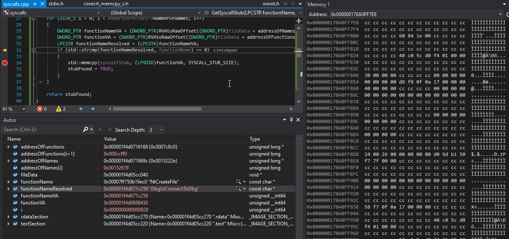
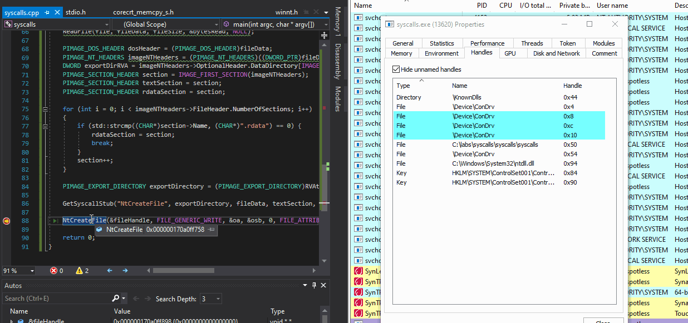

# Retrieving ntdll Syscall Stubs from Disk at Run-time

## Overview

The purpose of this lab was to play with syscalls once more. More specifically, the goal was to be able to retrieve ntdll syscall stubs from the disk during run-time \(before AVs/EDRs get a chance to hook them\), rather than hardcoding them, since they may change between different Windows versions.

This lab was sparked by [am0nsec](https://twitter.com/am0nsec)'s and [RtlMateusz](https://twitter.com/RtlMateusz)'s  
[https://github.com/am0nsec/HellsGate](https://github.com/am0nsec/HellsGate) although is very different in implementation and execution.

See my previous post on syscalls too:



I will write some crude code that will do the following:

1. Read ntdll.dll file bytes from the disk \(before any AV/EDR has a chance to hook its functions\) and write them to some memory location `m1`
2. Parse out `.rdata` and  `.text` sections of the ntdll.dll file
   1. `.rdata` contains ntdll exported function names
   2. `.text` contains code that gets executed by those functions
3. Locate the specified function's code \(syscall\) in the memory location `m1`. In this lab I will find the location where the stub code for `NtCreateFile` resides
4. Extract the stub \(23 bytes\) of the `NtCreateFile` and write it to some memory location `m2`
5. Declare a function prototype for `NtCreateFile`
6. Define a variable `v1` of function type `NtCreateFile` and point it to the memory location `m2`, where the syscall stub for `NtCreateFile` is written, as mentioned in step 4.
7. Invoke the `NtCreateFile` syscall by calling the syscall `v1`, which actually points to `m2`, where `NtCreateFile` syscall stub is stored
8. `NtCreate` syscall gets executed - profit


Note, that the above process is just one way of achieving the same goal.


## Reminder

As a reminder, we can easily see the syscall IDs for NT functions via WinDBG or any other debugger. 

The syscall ID is 2 bytes in length and starts 4 bytes into the function, so for example, the syscall ID for `NtCreateFile` is `0x0055`, `NtQueryEvent` is `0x0056`, etc - see below image. 

Also - in green are the bytes, that I refer to as syscall stub for`NtCreateFile` and these are the bytes that we want to be able to retrieve at run-time for any given NT function, and hence this lab.


## Extracting the Syscall Stub

I wrote a function `GetSyscallStub`, that is responsible for steps 3 and 4  of the processes that I outlined in the `Overview` section.

It allows me to find any given function's code location inside the ntdll.dll and carve out its syscall stub \(the first 23 bytes\):


So, for example, if I wanted to retrieve the syscall stub for `NtCreateFile`, I would call `GetSyscallStub` like so:

```cpp
GetSyscallStub(
    // function name for which the syscall stub is to be retrieved
    "NtCreateFile",
    // ntdll export directory 
    exportDirectory, 
    // ntdll file bytes
    fileData, 
    // ntdll .text section descriptor - contains code of ntdll exported functions. Required for locating NtCreateFile syscall stub
    textSection, 
    // ntdll .rdata section descriptor - contains name of ntdll exported functions.
    rdataSection, 
    // NtCreateFile stub will be written here
    syscallStub
);
```

Once `GetSyscallStub`is called, it will cycle through all the ntdll exported function names \(they are resolved to `functionNameResolved`\) as well as exported function addresses simulatenously, and look for the function we want to extract the syscall stub for, which in our case is the `NtCreateFile` \(passed to GetSycallStub via `functionName`\):


Once the needed function name is resolved, the given function's syscall stub is extracted and stored in the `syscallStub` variable. 

In the below GIF, we can see the instruction `mov eax, 0x55` when viewing the `syscallStub` variable in a disassembly view. Since we know that the `NtCreateFile` syscall ID is `0x0055`, this suggests we have extracted the syscall stub successfully:



## Calling Syscall Stub

In order to be able to invoke the syscall, we need to define a variable `NtCreateFile` of type `myNtCreateFile` \(see code section for the function prototype\), point it to the `syscallStub` and make `syscallStub` executable:


We can now call `NtCreateFile`:

```cpp
NtCreateFile(
	&fileHandle, 
	FILE_GENERIC_WRITE, 
    &oa, 
    &osb, 
    0, 
    FILE_ATTRIBUTE_NORMAL, 
    FILE_SHARE_WRITE, 
    FILE_OVERWRITE_IF, 
    FILE_SYNCHRONOUS_IO_NONALERT, 
    NULL,
    0
);
```

Below shows how `NtCreateFile` gets called on a file c:\temp\pw.log and a handle to that file is opened, which confirms that `NtCreateFile` syscall stub was retrieved and called successfully:



## Code

```cpp
#include <iostream>
#include "Windows.h"
#include "winternl.h"
#pragma comment(lib, "ntdll")

int const SYSCALL_STUB_SIZE = 23;
using myNtCreateFile = NTSTATUS(NTAPI*)(PHANDLE FileHandle, ACCESS_MASK DesiredAccess, POBJECT_ATTRIBUTES ObjectAttributes, PIO_STATUS_BLOCK IoStatusBlock, PLARGE_INTEGER AllocationSize, ULONG FileAttributes, ULONG ShareAccess, ULONG CreateDisposition, ULONG CreateOptions, PVOID EaBuffer, ULONG EaLength);

PVOID RVAtoRawOffset(DWORD_PTR RVA, PIMAGE_SECTION_HEADER section)
{
	return (PVOID)(RVA - section->VirtualAddress + section->PointerToRawData);
}

BOOL GetSyscallStub(LPCSTR functionName, PIMAGE_EXPORT_DIRECTORY exportDirectory, LPVOID fileData, PIMAGE_SECTION_HEADER textSection, PIMAGE_SECTION_HEADER rdataSection, LPVOID syscallStub)
{
	PDWORD addressOfNames = (PDWORD)RVAtoRawOffset((DWORD_PTR)fileData + *(&exportDirectory->AddressOfNames), rdataSection);
	PDWORD addressOfFunctions = (PDWORD)RVAtoRawOffset((DWORD_PTR)fileData + *(&exportDirectory->AddressOfFunctions), rdataSection);
	BOOL stubFound = FALSE; 

	for (size_t i = 0; i < exportDirectory->NumberOfNames; i++)
	{
		DWORD_PTR functionNameVA = (DWORD_PTR)RVAtoRawOffset((DWORD_PTR)fileData + addressOfNames[i], rdataSection);
		DWORD_PTR functionVA = (DWORD_PTR)RVAtoRawOffset((DWORD_PTR)fileData + addressOfFunctions[i + 1], textSection);
		LPCSTR functionNameResolved = (LPCSTR)functionNameVA;
		if (std::strcmp(functionNameResolved, functionName) == 0)
		{
			std::memcpy(syscallStub, (LPVOID)functionVA, SYSCALL_STUB_SIZE);
			stubFound = TRUE;
		}
	}

	return stubFound;
}

int main(int argc, char* argv[]) {
	char syscallStub[SYSCALL_STUB_SIZE] = {};
	SIZE_T bytesWritten = 0;
	DWORD oldProtection = 0;
	HANDLE file = NULL;
	DWORD fileSize = NULL;
	DWORD bytesRead = NULL;
	LPVOID fileData = NULL;
	
	// variables for NtCreateFile
	OBJECT_ATTRIBUTES oa;
	HANDLE fileHandle = NULL;
	NTSTATUS status = NULL;
	UNICODE_STRING fileName;
	RtlInitUnicodeString(&fileName, (PCWSTR)L"\\??\\c:\\temp\\pw.log");
	IO_STATUS_BLOCK osb;
	ZeroMemory(&osb, sizeof(IO_STATUS_BLOCK));
	InitializeObjectAttributes(&oa, &fileName, OBJ_CASE_INSENSITIVE, NULL, NULL);

	// define NtCreateFile
	myNtCreateFile NtCreateFile = (myNtCreateFile)(LPVOID)syscallStub;
	VirtualProtect(syscallStub, SYSCALL_STUB_SIZE, PAGE_EXECUTE_READWRITE, &oldProtection);
	
	file = CreateFileA("c:\\windows\\system32\\ntdll.dll", GENERIC_READ, FILE_SHARE_READ, NULL, OPEN_EXISTING, FILE_ATTRIBUTE_NORMAL, NULL);
	fileSize = GetFileSize(file, NULL);
	fileData = HeapAlloc(GetProcessHeap(), 0, fileSize);
	ReadFile(file, fileData, fileSize, &bytesRead, NULL);

	PIMAGE_DOS_HEADER dosHeader = (PIMAGE_DOS_HEADER)fileData;
	PIMAGE_NT_HEADERS imageNTHeaders = (PIMAGE_NT_HEADERS)((DWORD_PTR)fileData + dosHeader->e_lfanew);
	DWORD exportDirRVA = imageNTHeaders->OptionalHeader.DataDirectory[IMAGE_DIRECTORY_ENTRY_EXPORT].VirtualAddress;
	PIMAGE_SECTION_HEADER section = IMAGE_FIRST_SECTION(imageNTHeaders);
	PIMAGE_SECTION_HEADER textSection = section;
	PIMAGE_SECTION_HEADER rdataSection = section;
	
	for (int i = 0; i < imageNTHeaders->FileHeader.NumberOfSections; i++) 
	{
		if (std::strcmp((CHAR*)section->Name, (CHAR*)".rdata") == 0) { 
			rdataSection = section;
			break;
		}
		section++;
	}

	PIMAGE_EXPORT_DIRECTORY exportDirectory = (PIMAGE_EXPORT_DIRECTORY)RVAtoRawOffset((DWORD_PTR)fileData + exportDirRVA, rdataSection);
	
	GetSyscallStub("NtCreateFile", exportDirectory, fileData, textSection, rdataSection, syscallStub);
	NtCreateFile(&fileHandle, FILE_GENERIC_WRITE, &oa, &osb, 0, FILE_ATTRIBUTE_NORMAL, FILE_SHARE_WRITE, FILE_OVERWRITE_IF, FILE_SYNCHRONOUS_IO_NONALERT, NULL,	0);

	return 0;
}
```

## References





