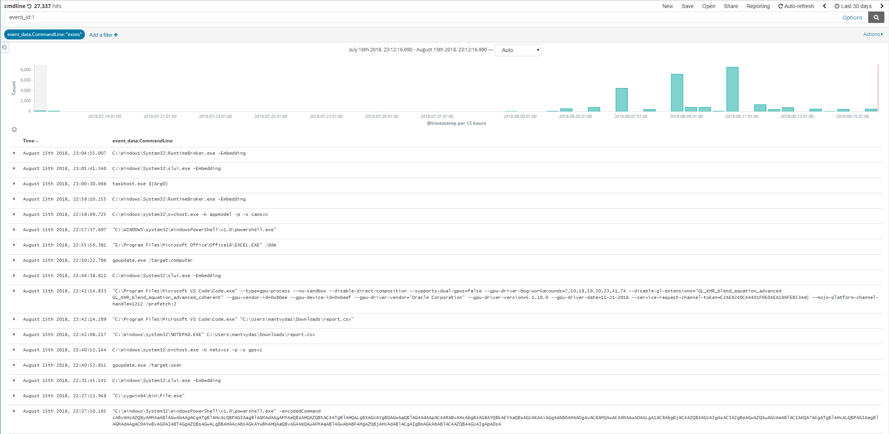
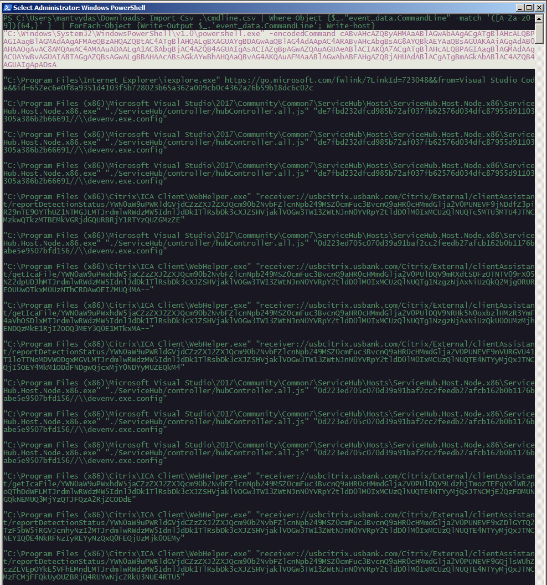
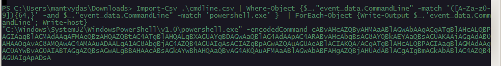

# T1027: Obfuscated Powershell Invocations

This topic is huge, but in this lab, I wanted to see if I could do a simple hunt for encoded powershell command invocations.

## Defining the Hunt

I want to find processes with base64 encoded commandlines that may indicate obfuscated powershell invocations.

Data source: sysmon logs that provide insight into process creation events, that contains commandlines the process was started.

## Execution

I had a sample of 27000 events that had a commandline logged, which I exported to a .csv file:



Since malicious encoded commands are usually lengthy, contiguous sequence of printable ASCII characters \(including characters such as =,/,+\), I decided to loop through the commandlines and only pull those that matched a simple regex `([A-Za-z0-9]){64,}`

Full powershell one liner below:

```csharp
Import-Csv .\cmdline.csv | Where-Object {$_."event_data.CommandLine" -match '([A-Za-z0-9]){64,}' }  | ForEach-Object { Write-Output $_.'event_data.CommandLine'; Write-host }
```

Below are the results - note how out of 27000+ events, only a handful were returned, among which was one base64 encoded powershell commandline:



Since I am looking for malicious powershell invocations, I could adjust the query as follows to remove processes that do not contain `powershell.exe` mentioned in them:

```csharp
Import-Csv .\cmdline.csv | Where-Object {$."event_data.CommandLine" -match '([A-Za-z0- 9]){64,}' -and $."eventdata.CommandLine" -match 'powershell.exe' } | ForEach-Object { Write-Output $.'event_data.Comm andLine'; Write-host }
```

Bingo - only one result returned:



This type of hunting is interesting, so I will be coming back to explore this area further.

## References



