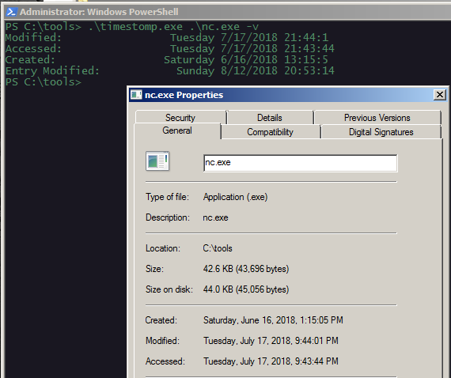
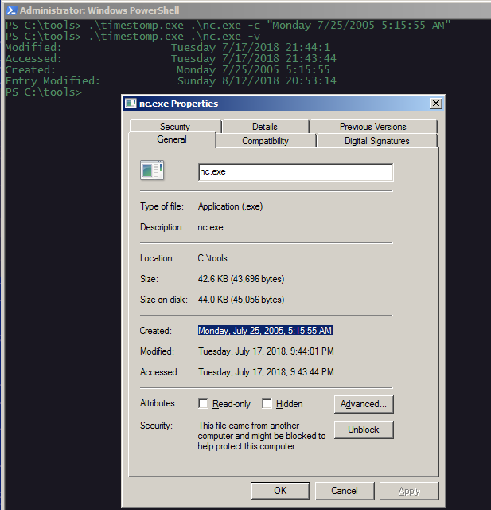
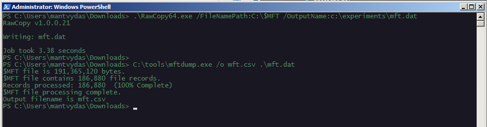
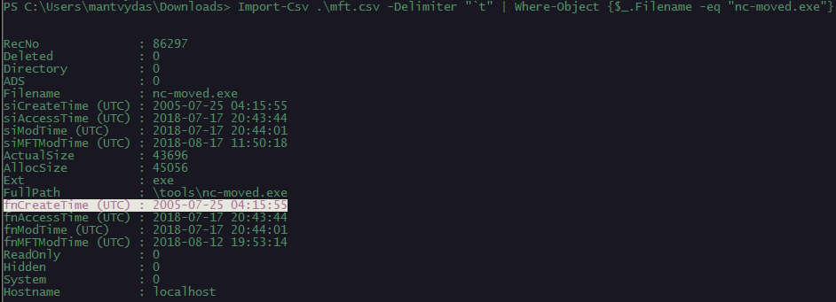

# T1099: Timestomping

## Execution

Checking original timestamps of the `nc.exe`:

```csharp
.\timestomp.exe .\nc.exe -v
```



Forging the file creation date:

```csharp
.\timestomp.exe .\nc.exe -c "Monday 7/25/2005 5:15:55 AM"
```



Checking the `$MFT` for changes - first of, dumping the `$MFT`:

```csharp
.\RawCopy64.exe /FileNamePath:C:\$MFT /OutputName:c:\experiments\mft.dat
```



Let's find the `nc.exe` record and check its timestamps:

```csharp
Import-Csv .\mft.csv -Delimiter "`t" | Where-Object {$_.Filename -eq "nc.exe"}
```

Note how `fnCreateTime` did not get updated:


For this reason, it is always a good idea to check both `$STANDARD_INFO` and `$FILE_NAME` times during the investigation to have a better chance at detecting timestomping.

Note that if we moved the nc.exe file to any other folder on the system and re-parsed the $MFT again, the `fnCreateTime` timestamp would inherit the timestamp from `siCreateTime`:



## References







