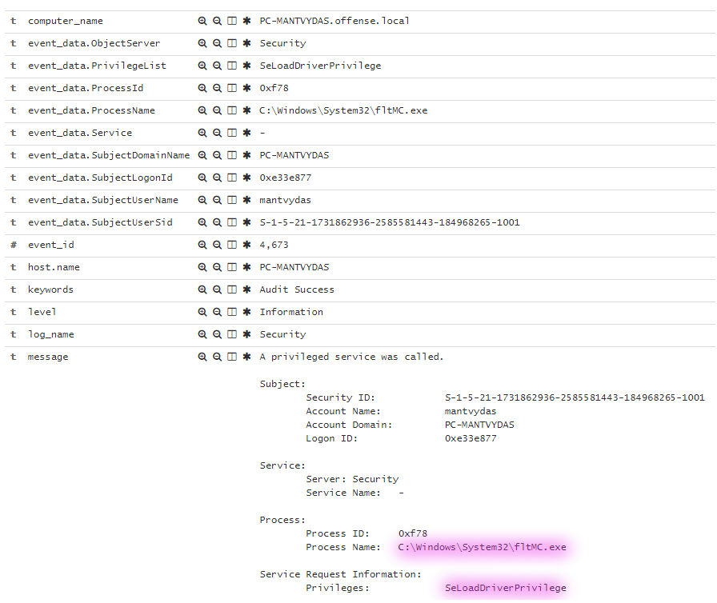
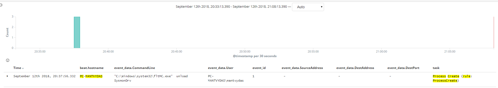
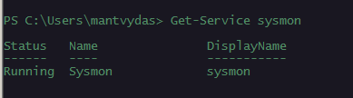

# Unloading Sysmon Driver

## Execution


```text
fltMC.exe unload SysmonDrv
```



## Observations

Windows event logs suggesting `SysmonDrv` was unloaded successfully:


As well as processes requesting special privileges:



Note how in the last 35 minutes since the driver was unloaded, no further process creation events were recorded, although I spawned new processes during that time:



Note how the system thinks that the sysmon is still running, which it is, but not doing anything useful:



## References



